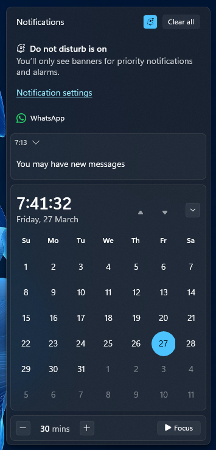

# Unified theme for Windows 11 Notification Center Styler

A theme that is inspired by MacOS Control Center and Windows 10 Action Center

**Author**: [TheGamer1445891](https://github.com/TheGamer1445891)




## Theme selection

The theme is integrated into the mod and can be selected directly from the mod's
settings:

* Open the Windows 11 Notification Center Styler mod in Windhawk.
* Go to the "Settings" tab.
* Select the theme and save the settings.

### Notes

There are some (optional) tweaks you need to add if youre using the "Theme Selection" method

**Control Center like animations for Notification Center** (credit to [Lockframe](https://github.com/Lockframe))**:**

Target:
```
ActionCenter.NotificationCenterPage > Grid > Grid
```
Styles:
```
RenderTransform:=<RotateTransform Angle="-90"/>
RenderTransformOrigin=0.5,1
```

Target:
```
ActionCenter.NotificationCenterPage
```
Styles:
```
RenderTransform:=<RotateTransform Angle="90"/>
RenderTransformOrigin=0.5,1
```

**Move Control Center to the top** (mainly for top taskbars)**:**

Target:
```
ControlCenter.ControlCenterPage
```
Styles:
```
VerticalAlignment=Stretch
```

Target:
```
ControlCenter.ControlCenterPage > Grid#RootGrid
```
Styles:
```
VerticalAlignment=Stretch
```

Target:
```
ControlCenter.ControlCenterPage > Grid#RootGrid > Grid#RootContent
```
Styles:
```
VerticalAlignment=Top
```

**Flip the Control Center animation:**

Target:
```
ControlCenter.ControlCenterPage
```
Styles:
```
RenderTransform:=<RotateTransform Angle="180" />
RenderTransformOrigin=0.5,0.5
```

Target:
```
ControlCenter.ControlCenterPage > Grid#RootGrid
```
Styles:
```
RenderTransform:=<RotateTransform Angle="180" />
RenderTransformOrigin=0.5,0.5
```

## Manual installation

The theme styles can also be imported manually. To do that, follow these steps:

* Open the Windows 11 Notification Center Styler mod in Windhawk.
* Go to the "Settings" tab and switch from "Visual Mode" to "Textual Mode".
* Then copy the content below and replace all (in Textual Mode).

<details>
<summary>Content to import (click to expand)</summary>

```yaml
theme: ''
controlStyles:
  - target: //ActionCenter.NotificationCenterPage > Grid > Grid
    styles:
      - RenderTransform:=<RotateTransform Angle="-90"/>
      - RenderTransformOrigin=0.5,1
      - // action center like animation for the notification center (credit to @Lockframe (github))
  - target: //ActionCenter.NotificationCenterPage
    styles:
      - RenderTransform:=<RotateTransform Angle="90"/>
      - RenderTransformOrigin=0.5,1
      - // action center like animation for the notification center (credit to @Lockframe (github))
  - target: Windows.UI.Xaml.Controls.ItemsWrapGrid
    styles:
      - MaximumRowsOrColumns=2
  - target: ContentControl#TogglesGroup > ContentPresenter > ControlCenter.PaginatedGridView > Grid > GridView#RootGridView
    styles:
      - HorizontalAlignment=0
  - target: ContentControl#TogglesGroup > ContentPresenter > ControlCenter.PaginatedGridView > Grid > GridView#RootGridView
    styles:
      - Height=375
  - target: ContentControl#SlidersGroup
    styles:
      - Grid.Row=0
      - RenderTransform:=<TransformGroup><RotateTransform Angle="-90" /><TranslateTransform X="258" Y="34" /></TransformGroup>
      - RenderTransformOrigin=0.5,0.5
      - Margin=0,0,30,0
  - target: //ControlCenter.ControlCenterPage
    styles:
      - VerticalAlignment=Stretch
      - // move action center top the top
  - target: //ControlCenter.ControlCenterPage > Grid#RootGrid
    styles:
      - VerticalAlignment=Stretch
      - // move action center top the top
  - target: //ControlCenter.ControlCenterPage > Grid#RootGrid > Grid#RootContent
    styles:
      - VerticalAlignment=Top
      - // move action center top the top
  - target: //ControlCenter.ControlCenterPage
    styles:
      - RenderTransform:=<RotateTransform Angle="180" />
      - RenderTransformOrigin=0.5,0.5
      - // flip the action center animation
  - target: //ControlCenter.ControlCenterPage > Grid#RootGrid
    styles:
      - RenderTransform:=<RotateTransform Angle="180" />
      - RenderTransformOrigin=0.5,0.5
      - // flip the action center animation
  - target: Windows.UI.Xaml.Controls.ContentControl#QuickActionContentControl > Windows.UI.Xaml.Controls.ContentPresenter > Windows.UI.Xaml.Controls.Grid > Windows.UI.Xaml.Controls.Primitives.ToggleButton > Windows.UI.Xaml.Controls.ContentPresenter#ContentPresenter > Microsoft.UI.Xaml.Controls.AnimatedIcon
    styles:
      - RenderTransform:=<RotateTransform Angle="90"/>
  - target: Microsoft.UI.Xaml.Controls.AnimatedIcon#BrightnessPlayer
    styles:
      - RenderTransform:=<RotateTransform Angle="90"/>
  - target: Windows.UI.Xaml.Controls.ContentControl#QuickActionContentControl
    styles:
      - RenderTransform:=<TranslateTransform X="0" Y="0" />
      - Margin=-15,0,0,0
  - target: ControlCenter.AsyncSlider
    styles:
      - Margin=35,0,50,0
  - target: ControlCenter.ControlCenterPage > Windows.UI.Xaml.Controls.Grid#RootGrid > Windows.UI.Xaml.Controls.Grid#RootContent > Windows.UI.Xaml.Controls.Grid#ControlCenterRegion > ControlCenter.ControlCenterView#ControlCenterView > Windows.UI.Xaml.Controls.Grid#RootGrid > Windows.UI.Xaml.Controls.Grid#L1Grid > Windows.UI.Xaml.Controls.Grid#FooterGrid > Windows.UI.Xaml.Controls.ItemsControl#LeftFooter > Windows.UI.Xaml.Controls.ItemsPresenter > Windows.UI.Xaml.Controls.StackPanel > Windows.UI.Xaml.Controls.ContentPresenter > Windows.UI.Xaml.Controls.ItemsControl > Windows.UI.Xaml.Controls.ItemsPresenter > Windows.UI.Xaml.Controls.StackPanel > Windows.UI.Xaml.Controls.ContentPresenter > Windows.UI.Xaml.Controls.ContentControl > Windows.UI.Xaml.Controls.ContentPresenter > Windows.UI.Xaml.Controls.Button > Windows.UI.Xaml.Controls.ContentPresenter#ContentPresenter
    styles:
      - RenderTransform:=<TranslateTransform X="216" Y="-343" />
      - Margin=0
      - Width=121
  - target: Microsoft.UI.Xaml.Controls.PipsPager#QuickActionsPager
    styles:
      - Visibility=1
  - target: ControlCenter.ControlCenterPage > Windows.UI.Xaml.Controls.Grid#RootGrid > Windows.UI.Xaml.Controls.Grid#RootContent > Windows.UI.Xaml.Controls.Grid#ControlCenterRegion > ControlCenter.ControlCenterView#ControlCenterView > Windows.UI.Xaml.Controls.Grid#RootGrid > Windows.UI.Xaml.Controls.Grid#L1Grid > Windows.UI.Xaml.Controls.Grid#FooterGrid > Windows.UI.Xaml.Controls.ItemsControl#RightFooter > Windows.UI.Xaml.Controls.ItemsPresenter > Windows.UI.Xaml.Controls.StackPanel > Windows.UI.Xaml.Controls.ContentPresenter > Windows.UI.Xaml.Controls.ItemsControl > Windows.UI.Xaml.Controls.ItemsPresenter > Windows.UI.Xaml.Controls.StackPanel > Windows.UI.Xaml.Controls.ContentPresenter > Windows.UI.Xaml.Controls.ContentControl > Windows.UI.Xaml.Controls.ContentPresenter > Windows.UI.Xaml.Controls.Button#FooterButton > Windows.UI.Xaml.Controls.ContentPresenter#ContentPresenter
    styles:
      - RenderTransform:=<TranslateTransform X="0" Y="-383" />
      - Width=121
  - target: Windows.UI.Xaml.Controls.Grid#FooterGrid
    styles:
      - Margin=0,0,0,-48
  - target: Windows.UI.Xaml.Controls.ContentControl#TogglesGroup > Windows.UI.Xaml.Controls.ContentPresenter > ControlCenter.PaginatedGridView > Grid
    styles:
      - BorderThickness=0
  - target: Windows.UI.Xaml.Controls.Grid#L1Grid > Border
    styles:
      - Visibility=0
      - Height=272
      - CornerRadius=8
      - BorderBrush:=<SolidColorBrush Color="{ThemeResource SurfaceStrokeColorDefault}" Opacity="0.8" />
      - BorderThickness=1
      - Margin=228,0,10,-4
      - RenderTransform:=<TransformGroup><RotateTransform Angle="0" /><TranslateTransform X="0" Y="48" /></TransformGroup>
  - target: Windows.UI.Xaml.Controls.Grid#MediaTransportControlsRoot
    styles:
      - Background:=transparent
  - target: Windows.UI.Xaml.Controls.ListView#MediaButtonsListView
    styles:
      - Background:=#09FFFFFF
      - Margin=0,-6,0,6
  - target: Windows.UI.Xaml.Controls.Grid#AlbumTextAndArtContainer
    styles:
      - Padding=12,10,10,10
      - Background:=#09FFFFFF
      - CornerRadius=6
      - BorderBrush:=<SolidColorBrush Color="{ThemeResource SurfaceStrokeColorDefault}" Opacity="0.8" />
      - BorderThickness=1
      - Margin=-12,-32,-12,32
  - target: Windows.UI.Xaml.Controls.StackPanel#PrimaryAndSecondaryTextContainer
    styles:
      - RenderTransform:=<TranslateTransform X="0" Y="10" />
  - target: Windows.UI.Xaml.Controls.Grid#MediaTransportControlsRoot > Grid > Windows.UI.Xaml.Controls.Image#IconImage
    styles:
      - RenderTransform:=<TranslateTransform X="-2" Y="5" />
  - target: Windows.UI.Xaml.Controls.Grid#MediaTransportControlsRoot > Grid > Windows.UI.Xaml.Controls.TextBlock#AppNameText
    styles:
      - RenderTransform:=<TranslateTransform X="-2" Y="5" />
  - target: Windows.UI.Xaml.Controls.ListView#MediaButtonsListView > Windows.UI.Xaml.Controls.ItemsPresenter
    styles:
      - Margin=0,-14
  - target: Windows.UI.Xaml.Controls.ContentPresenter#PageContent > Grid > Border
    styles:
      - Background:=transparent
  - target: Windows.UI.Xaml.Controls.ContentPresenter#PageHeader
    styles:
      - Background:=transparent
  - target: Windows.UI.Xaml.Controls.Button#PlayPauseButton > Windows.UI.Xaml.Controls.ContentPresenter#ContentPresenter
    styles:
      - Margin=-22,0
      - Background:=#09FFFFFF
      - BorderBrush:=<SolidColorBrush Color="{ThemeResource SurfaceStrokeColorDefault}" Opacity="0.8" />
      - BorderThickness=1
      - CornerRadius=4
  - target: Windows.UI.Xaml.Controls.Primitives.RepeatButton#NextButton > Windows.UI.Xaml.Controls.ContentPresenter#ContentPresenter
    styles:
      - Margin=4,0
      - Background:=#09FFFFFF
      - BorderBrush:=<SolidColorBrush Color="{ThemeResource SurfaceStrokeColorDefault}" Opacity="0.8" />
      - BorderThickness=1
      - CornerRadius=4
  - target: Windows.UI.Xaml.Controls.Primitives.RepeatButton#PreviousButton > Windows.UI.Xaml.Controls.ContentPresenter#ContentPresenter
    styles:
      - Margin=4,0
      - Background:=#09FFFFFF
      - BorderBrush:=<SolidColorBrush Color="{ThemeResource SurfaceStrokeColorDefault}" Opacity="0.8" />
      - BorderThickness=1
      - CornerRadius=4
  - target: Windows.UI.Xaml.Controls.Grid#ThumbnailImage
    styles:
      - CornerRadius=4
      - Height=64
      - Width=64
      - Margin=-4
  - target: Windows.UI.Xaml.Controls.ContentControl#QuickActionContentControl > Windows.UI.Xaml.Controls.ContentPresenter > Windows.UI.Xaml.Controls.Grid > Windows.UI.Xaml.Controls.Primitives.ToggleButton
    styles:
      - RenderTransform:=<TransformGroup><RotateTransform Angle="0" /><TranslateTransform X="25" Y="0" /></TransformGroup>
  - target: Windows.UI.Xaml.Controls.ContentControl#QuickActionContentControl > Windows.UI.Xaml.Controls.ContentPresenter > Windows.UI.Xaml.Controls.Grid > Windows.UI.Xaml.Controls.Button
    styles:
      - RenderTransform:=<TransformGroup><RotateTransform Angle="0" /><TranslateTransform X="25" Y="0" /></TransformGroup>
  - target: Button#VolumeL2Button
    styles:
      - RenderTransform:=<TransformGroup><RotateTransform Angle="90" /><TranslateTransform X="0" Y="0" /></TransformGroup>
  - target: ControlCenter.ControlCenterPage > Windows.UI.Xaml.Controls.Grid#RootGrid > Windows.UI.Xaml.Controls.Grid#RootContent > Windows.UI.Xaml.Controls.Grid#ControlCenterRegion > ControlCenter.ControlCenterView#ControlCenterView > Windows.UI.Xaml.Controls.Grid#RootGrid > Windows.UI.Xaml.Controls.Grid#L1Grid > Windows.UI.Xaml.Controls.ContentControl#TogglesGroup > Windows.UI.Xaml.Controls.ContentPresenter > ControlCenter.PaginatedGridView > Windows.UI.Xaml.Controls.Grid > Windows.UI.Xaml.Controls.GridView#RootGridView > Windows.UI.Xaml.Controls.Border > Windows.UI.Xaml.Controls.ScrollViewer#ScrollViewer > Windows.UI.Xaml.Controls.Border#Root > Windows.UI.Xaml.Controls.Grid > Windows.UI.Xaml.Controls.ScrollContentPresenter#ScrollContentPresenter > Windows.UI.Xaml.Controls.ItemsPresenter > Windows.UI.Xaml.Controls.ItemsWrapGrid > Windows.UI.Xaml.Controls.GridViewItem > Windows.UI.Xaml.Controls.Primitives.ListViewItemPresenter#Root > Windows.UI.Xaml.Controls.ContentControl > Windows.UI.Xaml.Controls.ContentPresenter > Windows.UI.Xaml.Controls.Grid > Windows.UI.Xaml.Controls.Grid > ControlCenter.PaginatedToggleButton#ToggleButton
    styles:
      - Margin=0,0,0,-36
      - Height=80
  - target: ControlCenter.ControlCenterPage > Windows.UI.Xaml.Controls.Grid#RootGrid > Windows.UI.Xaml.Controls.Grid#RootContent > Windows.UI.Xaml.Controls.Grid#ControlCenterRegion > ControlCenter.ControlCenterView#ControlCenterView > Windows.UI.Xaml.Controls.Grid#RootGrid > Windows.UI.Xaml.Controls.Grid#L1Grid > Windows.UI.Xaml.Controls.ContentControl#TogglesGroup > Windows.UI.Xaml.Controls.ContentPresenter > ControlCenter.PaginatedGridView > Windows.UI.Xaml.Controls.Grid > Windows.UI.Xaml.Controls.GridView#RootGridView > Windows.UI.Xaml.Controls.Border > Windows.UI.Xaml.Controls.ScrollViewer#ScrollViewer > Windows.UI.Xaml.Controls.Border#Root > Windows.UI.Xaml.Controls.Grid > Windows.UI.Xaml.Controls.ScrollContentPresenter#ScrollContentPresenter > Windows.UI.Xaml.Controls.ItemsPresenter > Windows.UI.Xaml.Controls.ItemsWrapGrid > Windows.UI.Xaml.Controls.GridViewItem > Windows.UI.Xaml.Controls.Primitives.ListViewItemPresenter#Root > Windows.UI.Xaml.Controls.ContentControl > Windows.UI.Xaml.Controls.ContentPresenter > Windows.UI.Xaml.Controls.Grid > ControlCenter.PaginatedToggleButton#ToggleButton
    styles:
      - Margin=0,0,0,-36
      - Height=80
  - target: ControlCenter.PaginatedToggleButton#SplitL2Button
    styles:
      - Margin=0,0,0,-36
      - Height=80
  - target: ControlCenter.PaginatedToggleButton#SplitL2Button > ContentPresenter
    styles:
      - BorderThickness=0,1,1,1
  - target: ControlCenter.ControlCenterPage > Windows.UI.Xaml.Controls.Grid#RootGrid > Windows.UI.Xaml.Controls.Grid#RootContent > Windows.UI.Xaml.Controls.Grid#ControlCenterRegion > ControlCenter.ControlCenterView#ControlCenterView > Windows.UI.Xaml.Controls.Grid#RootGrid > Windows.UI.Xaml.Controls.Grid#L1Grid > Windows.UI.Xaml.Controls.ContentControl#TogglesGroup > Windows.UI.Xaml.Controls.ContentPresenter > ControlCenter.PaginatedGridView > Windows.UI.Xaml.Controls.Grid > Windows.UI.Xaml.Controls.GridView#RootGridView > Windows.UI.Xaml.Controls.Border > Windows.UI.Xaml.Controls.ScrollViewer#ScrollViewer > Windows.UI.Xaml.Controls.Border#Root > Windows.UI.Xaml.Controls.Grid > Windows.UI.Xaml.Controls.ScrollContentPresenter#ScrollContentPresenter > Windows.UI.Xaml.Controls.ItemsPresenter > Windows.UI.Xaml.Controls.ItemsWrapGrid > Windows.UI.Xaml.Controls.GridViewItem > Windows.UI.Xaml.Controls.Primitives.ListViewItemPresenter#Root > Windows.UI.Xaml.Controls.ContentControl > Windows.UI.Xaml.Controls.ContentPresenter > Windows.UI.Xaml.Controls.Grid > Windows.UI.Xaml.Controls.Grid > ControlCenter.PaginatedToggleButton#ToggleButton > Windows.UI.Xaml.Controls.ContentPresenter#ContentPresenter > Windows.UI.Xaml.Controls.Grid#SplitToggleContent
    styles:
      - Margin=0,0,0,20
  - target: ControlCenter.PaginatedToggleButton#SplitL2Button > ContentPresenter > FontIcon
    styles:
      - Margin=0,0,0,20
  - target: ControlCenter.ControlCenterPage > Windows.UI.Xaml.Controls.Grid#RootGrid > Windows.UI.Xaml.Controls.Grid#RootContent > Windows.UI.Xaml.Controls.Grid#ControlCenterRegion > ControlCenter.ControlCenterView#ControlCenterView > Windows.UI.Xaml.Controls.Grid#RootGrid > Windows.UI.Xaml.Controls.Grid#L1Grid > Windows.UI.Xaml.Controls.ContentControl#TogglesGroup > Windows.UI.Xaml.Controls.ContentPresenter > ControlCenter.PaginatedGridView > Windows.UI.Xaml.Controls.Grid > Windows.UI.Xaml.Controls.GridView#RootGridView > Windows.UI.Xaml.Controls.Border > Windows.UI.Xaml.Controls.ScrollViewer#ScrollViewer > Windows.UI.Xaml.Controls.Border#Root > Windows.UI.Xaml.Controls.Grid > Windows.UI.Xaml.Controls.ScrollContentPresenter#ScrollContentPresenter > Windows.UI.Xaml.Controls.ItemsPresenter > Windows.UI.Xaml.Controls.ItemsWrapGrid > Windows.UI.Xaml.Controls.GridViewItem > Windows.UI.Xaml.Controls.Primitives.ListViewItemPresenter#Root > Windows.UI.Xaml.Controls.ContentControl > Windows.UI.Xaml.Controls.ContentPresenter > Windows.UI.Xaml.Controls.Grid > Windows.UI.Xaml.Controls.Grid > ControlCenter.PaginatedToggleButton#ToggleButton > Windows.UI.Xaml.Controls.ContentPresenter#ContentPresenter > Windows.UI.Xaml.Controls.Grid#ToggleButtonContent > Microsoft.UI.Xaml.Controls.AnimatedIcon
    styles:
      - Margin=0,0,0,20
  - target: ControlCenter.ControlCenterPage > Windows.UI.Xaml.Controls.Grid#RootGrid > Windows.UI.Xaml.Controls.Grid#RootContent > Windows.UI.Xaml.Controls.Grid#ControlCenterRegion > ControlCenter.ControlCenterView#ControlCenterView > Windows.UI.Xaml.Controls.Grid#RootGrid > Windows.UI.Xaml.Controls.Grid#L1Grid > Windows.UI.Xaml.Controls.ContentControl#TogglesGroup > Windows.UI.Xaml.Controls.ContentPresenter > ControlCenter.PaginatedGridView > Windows.UI.Xaml.Controls.Grid > Windows.UI.Xaml.Controls.GridView#RootGridView > Windows.UI.Xaml.Controls.Border > Windows.UI.Xaml.Controls.ScrollViewer#ScrollViewer > Windows.UI.Xaml.Controls.Border#Root > Windows.UI.Xaml.Controls.Grid > Windows.UI.Xaml.Controls.ScrollContentPresenter#ScrollContentPresenter > Windows.UI.Xaml.Controls.ItemsPresenter > Windows.UI.Xaml.Controls.ItemsWrapGrid > Windows.UI.Xaml.Controls.GridViewItem > Windows.UI.Xaml.Controls.Primitives.ListViewItemPresenter#Root > Windows.UI.Xaml.Controls.ContentControl > Windows.UI.Xaml.Controls.ContentPresenter > Windows.UI.Xaml.Controls.Grid > ControlCenter.PaginatedToggleButton#ToggleButton > Windows.UI.Xaml.Controls.ContentPresenter#ContentPresenter > Windows.UI.Xaml.Controls.Grid > Microsoft.UI.Xaml.Controls.AnimatedIcon
    styles:
      - Margin=-2,0,2,20
  - target: ControlCenter.ControlCenterPage > Windows.UI.Xaml.Controls.Grid#RootGrid > Windows.UI.Xaml.Controls.Grid#RootContent > Windows.UI.Xaml.Controls.Grid#ControlCenterRegion > ControlCenter.ControlCenterView#ControlCenterView > Windows.UI.Xaml.Controls.Grid#RootGrid > Windows.UI.Xaml.Controls.Grid#L1Grid > Windows.UI.Xaml.Controls.ContentControl#TogglesGroup > Windows.UI.Xaml.Controls.ContentPresenter > ControlCenter.PaginatedGridView > Windows.UI.Xaml.Controls.Grid > Windows.UI.Xaml.Controls.GridView#RootGridView > Windows.UI.Xaml.Controls.Border > Windows.UI.Xaml.Controls.ScrollViewer#ScrollViewer > Windows.UI.Xaml.Controls.Border#Root > Windows.UI.Xaml.Controls.Grid > Windows.UI.Xaml.Controls.ScrollContentPresenter#ScrollContentPresenter > Windows.UI.Xaml.Controls.ItemsPresenter > Windows.UI.Xaml.Controls.ItemsWrapGrid > Windows.UI.Xaml.Controls.GridViewItem > Windows.UI.Xaml.Controls.Primitives.ListViewItemPresenter#Root > Windows.UI.Xaml.Controls.ContentControl > Windows.UI.Xaml.Controls.ContentPresenter > Windows.UI.Xaml.Controls.Grid > ControlCenter.PaginatedToggleButton#ToggleButton > Windows.UI.Xaml.Controls.ContentPresenter#ContentPresenter > Windows.UI.Xaml.Controls.Grid > Windows.UI.Xaml.Controls.FontIcon
    styles:
      - Margin=2,0,-2,20
  - target: ControlCenter.ControlCenterPage > Windows.UI.Xaml.Controls.Grid#RootGrid > Windows.UI.Xaml.Controls.Grid#RootContent > Windows.UI.Xaml.Controls.Grid#ControlCenterRegion > ControlCenter.ControlCenterView#ControlCenterView > Windows.UI.Xaml.Controls.Grid#RootGrid > Windows.UI.Xaml.Controls.Grid#L1Grid > Windows.UI.Xaml.Controls.ContentControl#TogglesGroup > Windows.UI.Xaml.Controls.ContentPresenter > ControlCenter.PaginatedGridView > Windows.UI.Xaml.Controls.Grid > Windows.UI.Xaml.Controls.GridView#RootGridView > Windows.UI.Xaml.Controls.Border > Windows.UI.Xaml.Controls.ScrollViewer#ScrollViewer > Windows.UI.Xaml.Controls.Border#Root > Windows.UI.Xaml.Controls.Grid > Windows.UI.Xaml.Controls.ScrollContentPresenter#ScrollContentPresenter > Windows.UI.Xaml.Controls.ItemsPresenter > Windows.UI.Xaml.Controls.ItemsWrapGrid > Windows.UI.Xaml.Controls.GridViewItem[1] > Windows.UI.Xaml.Controls.Primitives.ListViewItemPresenter#Root > Windows.UI.Xaml.Controls.ContentControl > Windows.UI.Xaml.Controls.ContentPresenter > Windows.UI.Xaml.Controls.Grid > Windows.UI.Xaml.Controls.Grid > ControlCenter.PaginatedToggleButton#ToggleButton > Windows.UI.Xaml.Controls.ContentPresenter#ContentPresenter
    styles:
      - BorderThickness=1,1,0,1
  - target: ControlCenter.ControlCenterPage > Windows.UI.Xaml.Controls.Grid#RootGrid > Windows.UI.Xaml.Controls.Grid#RootContent > Windows.UI.Xaml.Controls.Grid#ControlCenterRegion > ControlCenter.ControlCenterView#ControlCenterView > Windows.UI.Xaml.Controls.Grid#RootGrid > Windows.UI.Xaml.Controls.Grid#L1Grid > Windows.UI.Xaml.Controls.ContentControl#TogglesGroup > Windows.UI.Xaml.Controls.ContentPresenter > ControlCenter.PaginatedGridView > Windows.UI.Xaml.Controls.Grid > Windows.UI.Xaml.Controls.GridView#RootGridView > Windows.UI.Xaml.Controls.Border > Windows.UI.Xaml.Controls.ScrollViewer#ScrollViewer > Windows.UI.Xaml.Controls.Border#Root > Windows.UI.Xaml.Controls.Grid > Windows.UI.Xaml.Controls.ScrollContentPresenter#ScrollContentPresenter > Windows.UI.Xaml.Controls.ItemsPresenter > Windows.UI.Xaml.Controls.ItemsWrapGrid > Windows.UI.Xaml.Controls.GridViewItem[2] > Windows.UI.Xaml.Controls.Primitives.ListViewItemPresenter#Root > Windows.UI.Xaml.Controls.ContentControl > Windows.UI.Xaml.Controls.ContentPresenter > Windows.UI.Xaml.Controls.Grid > Windows.UI.Xaml.Controls.Grid > ControlCenter.PaginatedToggleButton#ToggleButton > Windows.UI.Xaml.Controls.ContentPresenter#ContentPresenter
    styles:
      - BorderThickness=1,1,0,1
  - target: ControlCenter.ControlCenterPage > Windows.UI.Xaml.Controls.Grid#RootGrid > Windows.UI.Xaml.Controls.Grid#RootContent > Windows.UI.Xaml.Controls.Grid#ControlCenterRegion > ControlCenter.ControlCenterView#ControlCenterView > Windows.UI.Xaml.Controls.Grid#RootGrid > Windows.UI.Xaml.Controls.Grid#L1Grid > Windows.UI.Xaml.Controls.ContentControl#TogglesGroup > Windows.UI.Xaml.Controls.ContentPresenter > ControlCenter.PaginatedGridView > Windows.UI.Xaml.Controls.Grid > Windows.UI.Xaml.Controls.GridView#RootGridView > Windows.UI.Xaml.Controls.Border > Windows.UI.Xaml.Controls.ScrollViewer#ScrollViewer > Windows.UI.Xaml.Controls.Border#Root > Windows.UI.Xaml.Controls.Grid > Windows.UI.Xaml.Controls.ScrollContentPresenter#ScrollContentPresenter > Windows.UI.Xaml.Controls.ItemsPresenter > Windows.UI.Xaml.Controls.ItemsWrapGrid
    styles:
      - Margin=-6,0,6,0
  - target: Windows.UI.Xaml.Internal.RootScrollViewer > Windows.UI.Xaml.Controls.ScrollContentPresenter > Windows.UI.Xaml.Controls.Border > ControlCenter.ControlCenterPage > Windows.UI.Xaml.Controls.Grid#RootGrid > Windows.UI.Xaml.Controls.Grid#RootContent > Windows.UI.Xaml.Controls.Grid#ControlCenterRegion > ControlCenter.ControlCenterView#ControlCenterView > Windows.UI.Xaml.Controls.Grid#RootGrid > Windows.UI.Xaml.Controls.Grid#L1Grid > Windows.UI.Xaml.Controls.Grid#FooterGrid > Windows.UI.Xaml.Controls.ItemsControl#LeftFooter > Windows.UI.Xaml.Controls.ItemsPresenter > Windows.UI.Xaml.Controls.StackPanel > Windows.UI.Xaml.Controls.ContentPresenter > Windows.UI.Xaml.Controls.ItemsControl > Windows.UI.Xaml.Controls.ItemsPresenter > Windows.UI.Xaml.Controls.StackPanel > Windows.UI.Xaml.Controls.ContentPresenter > Windows.UI.Xaml.Controls.ContentControl > Windows.UI.Xaml.Controls.ContentPresenter > Windows.UI.Xaml.Controls.Button > Windows.UI.Xaml.Controls.ContentPresenter#ContentPresenter
    styles:
      - Margin=0,-16,0,-2
  - target: Windows.UI.Xaml.Controls.Grid#FooterGrid > Windows.UI.Xaml.Controls.ItemsControl#LeftFooter > Windows.UI.Xaml.Controls.ItemsPresenter > Windows.UI.Xaml.Controls.StackPanel > Windows.UI.Xaml.Controls.ContentPresenter > Windows.UI.Xaml.Controls.ItemsControl > Windows.UI.Xaml.Controls.ItemsPresenter > Windows.UI.Xaml.Controls.StackPanel > Windows.UI.Xaml.Controls.ContentPresenter > Windows.UI.Xaml.Controls.ContentControl > Windows.UI.Xaml.Controls.ContentPresenter > Windows.UI.Xaml.Controls.Button > Windows.UI.Xaml.Controls.ContentPresenter#ContentPresenter
    styles:
      - Background:=#09FFFFFF
      - BorderBrush:=<SolidColorBrush Color="{ThemeResource SurfaceStrokeColorDefault}" Opacity="0.8" />
      - BorderThickness=1,0,1,1
      - CornerRadius=0,0,4,4
      - Margin=-1,0,-80,0
  - target: Windows.UI.Xaml.Controls.Grid#FooterGrid > Windows.UI.Xaml.Controls.ItemsControl#RightFooter > Windows.UI.Xaml.Controls.ItemsPresenter > Windows.UI.Xaml.Controls.StackPanel > Windows.UI.Xaml.Controls.ContentPresenter > Windows.UI.Xaml.Controls.ItemsControl > Windows.UI.Xaml.Controls.ItemsPresenter > Windows.UI.Xaml.Controls.StackPanel > Windows.UI.Xaml.Controls.ContentPresenter > Windows.UI.Xaml.Controls.ContentControl > Windows.UI.Xaml.Controls.ContentPresenter > Windows.UI.Xaml.Controls.Button#FooterButton > Windows.UI.Xaml.Controls.ContentPresenter#ContentPresenter
    styles:
      - Background:=#09FFFFFF
      - BorderBrush:=<SolidColorBrush Color="{ThemeResource SurfaceStrokeColorDefault}" Opacity="0.8" />
      - BorderThickness=1,1,1,0
      - CornerRadius=4,4,0,0
      - Margin=0
  - target: ControlCenter.ControlCenterPage > Windows.UI.Xaml.Controls.Grid#RootGrid > Windows.UI.Xaml.Controls.Grid#RootContent > Windows.UI.Xaml.Controls.Grid#ControlCenterRegion > ControlCenter.ControlCenterView#ControlCenterView > Windows.UI.Xaml.Controls.Grid#RootGrid > Windows.UI.Xaml.Controls.Grid#L1Grid > Windows.UI.Xaml.Controls.ContentControl#TogglesGroup > Windows.UI.Xaml.Controls.ContentPresenter > ControlCenter.PaginatedGridView > Windows.UI.Xaml.Controls.Grid > Windows.UI.Xaml.Controls.GridView#RootGridView > Windows.UI.Xaml.Controls.Border > Windows.UI.Xaml.Controls.ScrollViewer#ScrollViewer > Windows.UI.Xaml.Controls.Border#Root > Windows.UI.Xaml.Controls.Grid
    styles:
      - Margin=0,-6,0,0
  - target: Windows.UI.Xaml.Controls.Grid#FooterGrid > Windows.UI.Xaml.Controls.ItemsControl#RightFooter > Windows.UI.Xaml.Controls.ItemsPresenter > Windows.UI.Xaml.Controls.StackPanel > Windows.UI.Xaml.Controls.ContentPresenter > Windows.UI.Xaml.Controls.ItemsControl > Windows.UI.Xaml.Controls.ItemsPresenter > Windows.UI.Xaml.Controls.StackPanel > Windows.UI.Xaml.Controls.ContentPresenter > Windows.UI.Xaml.Controls.ContentControl > Windows.UI.Xaml.Controls.ContentPresenter > Windows.UI.Xaml.Controls.Button#FooterButton > Windows.UI.Xaml.Controls.ContentPresenter#ContentPresenter > Microsoft.UI.Xaml.Controls.AnimatedIcon#FooterButtonIcon
    styles:
      - Margin=0,3,0,-3
  - target: Windows.UI.Xaml.Controls.Grid#FooterGrid > Windows.UI.Xaml.Controls.ItemsControl#LeftFooter > Windows.UI.Xaml.Controls.ItemsPresenter > Windows.UI.Xaml.Controls.StackPanel > Windows.UI.Xaml.Controls.ContentPresenter > Windows.UI.Xaml.Controls.ItemsControl > Windows.UI.Xaml.Controls.ItemsPresenter > Windows.UI.Xaml.Controls.StackPanel > Windows.UI.Xaml.Controls.ContentPresenter > Windows.UI.Xaml.Controls.ContentControl > Windows.UI.Xaml.Controls.ContentPresenter > Windows.UI.Xaml.Controls.Button > Windows.UI.Xaml.Controls.ContentPresenter#ContentPresenter > Windows.UI.Xaml.Controls.StackPanel
    styles:
      - Margin=0,-3,0,3
  - target: ControlCenter.ControlCenterPage > Windows.UI.Xaml.Controls.Grid#RootGrid > Windows.UI.Xaml.Controls.Grid#RootContent > Windows.UI.Xaml.Controls.Grid#ControlCenterRegion > ControlCenter.ControlCenterView#ControlCenterView > Windows.UI.Xaml.Controls.Grid#RootGrid > Windows.UI.Xaml.Controls.Grid#L1Grid > Windows.UI.Xaml.Controls.ContentControl#TogglesGroup > Windows.UI.Xaml.Controls.ContentPresenter > ControlCenter.PaginatedGridView > Windows.UI.Xaml.Controls.Grid > Windows.UI.Xaml.Controls.GridView#RootGridView > Windows.UI.Xaml.Controls.Border > Windows.UI.Xaml.Controls.ScrollViewer#ScrollViewer > Windows.UI.Xaml.Controls.Border#Root > Windows.UI.Xaml.Controls.Grid > Windows.UI.Xaml.Controls.ScrollContentPresenter#ScrollContentPresenter > Windows.UI.Xaml.Controls.ItemsPresenter > Windows.UI.Xaml.Controls.ItemsWrapGrid > Windows.UI.Xaml.Controls.GridViewItem > Windows.UI.Xaml.Controls.Primitives.ListViewItemPresenter#Root > Windows.UI.Xaml.Controls.ContentControl > Windows.UI.Xaml.Controls.ContentPresenter > Windows.UI.Xaml.Controls.Grid > Windows.UI.Xaml.Controls.Button > Windows.UI.Xaml.Controls.Grid#RootGrid > Windows.UI.Xaml.Controls.ContentPresenter#Content > Windows.UI.Xaml.Controls.StackPanel > Windows.UI.Xaml.Controls.TextBlock#TitleText
    styles:
      - Transform3D:=<CompositeTransform3D TranslateX="0" TranslateY="0" TranslateZ="-99" />
      - Visibility=0
  - target: ControlCenter.ControlCenterPage > Windows.UI.Xaml.Controls.Grid#RootGrid > Windows.UI.Xaml.Controls.Grid#RootContent > Windows.UI.Xaml.Controls.Grid#ControlCenterRegion > ControlCenter.ControlCenterView#ControlCenterView > Windows.UI.Xaml.Controls.Grid#RootGrid > Windows.UI.Xaml.Controls.Grid#L1Grid > Windows.UI.Xaml.Controls.ContentControl#TogglesGroup > Windows.UI.Xaml.Controls.ContentPresenter > ControlCenter.PaginatedGridView > Windows.UI.Xaml.Controls.Grid > Windows.UI.Xaml.Controls.GridView#RootGridView > Windows.UI.Xaml.Controls.Border > Windows.UI.Xaml.Controls.ScrollViewer#ScrollViewer > Windows.UI.Xaml.Controls.Border#Root > Windows.UI.Xaml.Controls.Grid > Windows.UI.Xaml.Controls.ScrollContentPresenter#ScrollContentPresenter > Windows.UI.Xaml.Controls.ItemsPresenter > Windows.UI.Xaml.Controls.ItemsWrapGrid > Windows.UI.Xaml.Controls.GridViewItem > Windows.UI.Xaml.Controls.Primitives.ListViewItemPresenter#Root > Windows.UI.Xaml.Controls.ContentControl > Windows.UI.Xaml.Controls.ContentPresenter > Windows.UI.Xaml.Controls.Grid > Windows.UI.Xaml.Controls.Button > Windows.UI.Xaml.Controls.Grid#RootGrid > Windows.UI.Xaml.Controls.ContentPresenter#Content > Windows.UI.Xaml.Controls.StackPanel > Windows.UI.Xaml.Controls.TextBlock#StatusText
    styles:
      - Transform3D:=<CompositeTransform3D TranslateX="0" TranslateY="0" TranslateZ="-99" />
      - Visibility=1
  - target: ControlCenter.ControlCenterPage > Windows.UI.Xaml.Controls.Grid#RootGrid > Windows.UI.Xaml.Controls.Grid#RootContent > Windows.UI.Xaml.Controls.Grid#ControlCenterRegion > ControlCenter.ControlCenterView#ControlCenterView > Windows.UI.Xaml.Controls.Grid#RootGrid > Windows.UI.Xaml.Controls.Grid#L1Grid > Windows.UI.Xaml.Controls.ContentControl#TogglesGroup > Windows.UI.Xaml.Controls.ContentPresenter > ControlCenter.PaginatedGridView > Windows.UI.Xaml.Controls.Grid > Windows.UI.Xaml.Controls.GridView#RootGridView > Windows.UI.Xaml.Controls.Border > Windows.UI.Xaml.Controls.ScrollViewer#ScrollViewer > Windows.UI.Xaml.Controls.Border#Root > Windows.UI.Xaml.Controls.Grid > Windows.UI.Xaml.Controls.ScrollContentPresenter#ScrollContentPresenter > Windows.UI.Xaml.Controls.ItemsPresenter > Windows.UI.Xaml.Controls.ItemsWrapGrid > Windows.UI.Xaml.Controls.GridViewItem > Windows.UI.Xaml.Controls.Primitives.ListViewItemPresenter#Root > Windows.UI.Xaml.Controls.ContentControl > Windows.UI.Xaml.Controls.ContentPresenter > Windows.UI.Xaml.Controls.Grid > Windows.UI.Xaml.Controls.Button > Windows.UI.Xaml.Controls.Grid#RootGrid > Windows.UI.Xaml.Controls.ContentPresenter#Content > Windows.UI.Xaml.Controls.StackPanel
    styles:
      - Canvas.ZIndex=-1
      - Height=0
      - Padding=-48,-8
      - IsHitTestVisible=False
      - Width=0
      - Margin=0,16,0,-16
  - target: Grid#CalendarCenterGrid
    styles:
      - Margin=0,0,0,14
      - CornerRadius=0,0,8,8
      - BorderThickness=1,0,1,1
  - target: Grid#NotificationCenterGrid
    styles:
      - VerticalAlignment=2
      - Margin=0
      - CornerRadius=8,8,0,0
      - BorderThickness=1,1,1,0
      - Padding=0,0,0,2
  - target: Grid#MediaTransportControlsRegion
    styles:
      - Height=164
      - Margin=0,0,0,-12
      - //Visibility=0
      - CornerRadius=8,8,0,0
      - BorderThickness=1,1,1,0
      - Padding=0,0,0,24
      - Shadow:=
  - target: ControlCenter.ControlCenterPage > Windows.UI.Xaml.Controls.Grid#RootGrid
    styles:
      - Padding=0,6,0,0
  - target: ControlCenter.ControlCenterPage > Windows.UI.Xaml.Controls.Grid#RootGrid > Windows.UI.Xaml.Controls.Grid#RootContent > ControlCenter.MediaTransportControls#MediaTransportControls > Windows.UI.Xaml.Controls.Grid#MediaTransportControlsRegion > Windows.UI.Xaml.Controls.Grid#MediaTransportControlsRoot > Windows.UI.Xaml.Controls.ListView#MediaButtonsListView > Windows.UI.Xaml.Controls.ItemsPresenter
    styles:
      - Margin=-74,6,74,-6
      - Padding=-40
  - target: ControlCenter.ControlCenterPage > Windows.UI.Xaml.Controls.Grid#RootGrid > Windows.UI.Xaml.Controls.Grid#RootContent > ControlCenter.MediaTransportControls#MediaTransportControls > Windows.UI.Xaml.Controls.Grid#MediaTransportControlsRegion > Windows.UI.Xaml.Controls.Grid#MediaTransportControlsRoot > Windows.UI.Xaml.Controls.Grid > Windows.UI.Xaml.Controls.Button#SessionSwitchButton > Windows.UI.Xaml.Controls.Grid > Windows.UI.Xaml.Controls.ContentPresenter#ContentPresenter
    styles:
      - BorderBrush:=<SolidColorBrush Color="{ThemeResource SurfaceStrokeColorDefault}" Opacity="0.8" />
      - BorderThickness=1
      - Height=40
      - Width=40
  - target: ControlCenter.ControlCenterPage > Windows.UI.Xaml.Controls.Grid#RootGrid > Windows.UI.Xaml.Controls.Grid#RootContent > ControlCenter.MediaTransportControls#MediaTransportControls > Windows.UI.Xaml.Controls.Grid#MediaTransportControlsRegion > Windows.UI.Xaml.Controls.Grid#MediaTransportControlsRoot > Windows.UI.Xaml.Controls.Grid > Windows.UI.Xaml.Controls.Button#SessionSwitchButton
    styles:
      - RenderTransform:=<TranslateTransform X="4" Y="98" />
      - Visibility=0
  - target: Grid#ControlCenterRegion
    styles:
      - Canvas.ZIndex=-99
  - target: ActionCenter.FocusSessionControl
    styles:
      - Visibility=0
      - // set "Visibility=1" to hide the focus timer from the Notification Center
  - target: ActionCenter.NotificationCenterPage > Windows.UI.Xaml.Controls.Grid#RootGrid > Windows.UI.Xaml.Controls.Grid#RootContent > Windows.UI.Xaml.Controls.Grid#CalendarCenterGrid > ActionCenter.ClockCalendarView#ClockCalendarView > Windows.UI.Xaml.Controls.Grid > Windows.UI.Xaml.Controls.Grid#CalendarSection > Windows.UI.Xaml.Controls.ScrollViewer#CalendarControlScrollViewer
    styles:
      - Visibility=0
      - Margin=-10,-73,-10,-6
      - Canvas.ZIndex=-99
      - Padding=0,16,0,2
      - CornerRadius=6
      - BorderBrush:=<SolidColorBrush Color="{ThemeResource SurfaceStrokeColorDefault}" Opacity="0.8" />
      - BorderThickness=1
  - target: ActionCenter.NotificationCenterPage > Windows.UI.Xaml.Controls.Grid#RootGrid > Windows.UI.Xaml.Controls.Grid#RootContent > Windows.UI.Xaml.Controls.Grid#CalendarCenterGrid > ActionCenter.ClockCalendarView#ClockCalendarView > Windows.UI.Xaml.Controls.Grid > Windows.UI.Xaml.Controls.Grid#CalendarSection > Windows.UI.Xaml.Controls.StackPanel#CalendarHeader
    styles:
      - Margin=0,-4,0,4
  - target: ActionCenter.NotificationCenterPage > Windows.UI.Xaml.Controls.Grid#RootGrid > Windows.UI.Xaml.Controls.Grid#RootContent > Windows.UI.Xaml.Controls.Grid#CalendarCenterGrid > ActionCenter.ClockCalendarView#ClockCalendarView > Windows.UI.Xaml.Controls.Grid > Windows.UI.Xaml.Controls.Grid#CalendarSection > Windows.UI.Xaml.Controls.ScrollViewer#CalendarControlScrollViewer > Windows.UI.Xaml.Controls.Border#Root > Windows.UI.Xaml.Controls.Grid > Windows.UI.Xaml.Controls.ScrollContentPresenter#ScrollContentPresenter > Windows.UI.Xaml.Controls.CalendarView#CalendarControl > Windows.UI.Xaml.Controls.Border > Windows.UI.Xaml.Controls.Grid > Windows.UI.Xaml.Controls.Grid > Windows.UI.Xaml.Controls.Button#HeaderButton
    styles:
      - Visibility=1
  - target: ActionCenter.NotificationCenterPage > Windows.UI.Xaml.Controls.Grid#RootGrid > Windows.UI.Xaml.Controls.Grid#RootContent > Windows.UI.Xaml.Controls.Grid#CalendarCenterGrid > ActionCenter.ClockCalendarView#ClockCalendarView > Windows.UI.Xaml.Controls.Grid > Windows.UI.Xaml.Controls.Grid#CalendarSection > Windows.UI.Xaml.Controls.ScrollViewer#CalendarControlScrollViewer > Windows.UI.Xaml.Controls.Border#Root > Windows.UI.Xaml.Controls.Grid > Windows.UI.Xaml.Controls.ScrollContentPresenter#ScrollContentPresenter > Windows.UI.Xaml.Controls.CalendarView#CalendarControl > Windows.UI.Xaml.Controls.Border > Windows.UI.Xaml.Controls.Grid > Windows.UI.Xaml.Controls.Grid > Windows.UI.Xaml.Controls.Button#PreviousButton
    styles:
      - Margin=-40,8,46,5
  - target: ActionCenter.NotificationCenterPage > Windows.UI.Xaml.Controls.Grid#RootGrid > Windows.UI.Xaml.Controls.Grid#RootContent > Windows.UI.Xaml.Controls.Grid#CalendarCenterGrid > ActionCenter.ClockCalendarView#ClockCalendarView > Windows.UI.Xaml.Controls.Grid > Windows.UI.Xaml.Controls.Grid#CalendarSection > Windows.UI.Xaml.Controls.ScrollViewer#CalendarControlScrollViewer > Windows.UI.Xaml.Controls.Border#Root > Windows.UI.Xaml.Controls.Grid > Windows.UI.Xaml.Controls.ScrollContentPresenter#ScrollContentPresenter > Windows.UI.Xaml.Controls.CalendarView#CalendarControl > Windows.UI.Xaml.Controls.Border > Windows.UI.Xaml.Controls.Grid > Windows.UI.Xaml.Controls.Grid > Windows.UI.Xaml.Controls.Button#NextButton
    styles:
      - Margin=-40,8,50,5
  - target: ActionCenter.NotificationCenterPage > Windows.UI.Xaml.Controls.Grid#RootGrid > Windows.UI.Xaml.Controls.Grid#RootContent > Windows.UI.Xaml.Controls.Grid#CalendarCenterGrid > ActionCenter.ClockCalendarView#ClockCalendarView > Windows.UI.Xaml.Controls.Grid > Windows.UI.Xaml.Controls.Grid#CalendarSection > Windows.UI.Xaml.Controls.ScrollViewer#CalendarControlScrollViewer > Windows.UI.Xaml.Controls.Border#Root > Windows.UI.Xaml.Controls.Grid > Windows.UI.Xaml.Controls.ScrollContentPresenter#ScrollContentPresenter > Windows.UI.Xaml.Controls.CalendarView#CalendarControl > Windows.UI.Xaml.Controls.Border > Windows.UI.Xaml.Controls.Grid > Windows.UI.Xaml.Controls.Grid
    styles:
      - Margin=0
  - target: ActionCenter.NotificationCenterPage > Windows.UI.Xaml.Controls.Grid#RootGrid > Windows.UI.Xaml.Controls.Grid#RootContent > Windows.UI.Xaml.Controls.Grid#CalendarCenterGrid > ActionCenter.ClockCalendarView#ClockCalendarView > Windows.UI.Xaml.Controls.Grid > Windows.UI.Xaml.Controls.Grid#CalendarSection > Windows.UI.Xaml.Controls.TextBlock#ClockWithMeridianOld
    styles:
      - Margin=0,0,100,0
  - target: ActionCenter.NotificationCenterPage > Windows.UI.Xaml.Controls.Grid#RootGrid > Windows.UI.Xaml.Controls.Grid#RootContent > Windows.UI.Xaml.Controls.Grid#CalendarCenterGrid > ActionCenter.ClockCalendarView#ClockCalendarView > Windows.UI.Xaml.Controls.Grid > Windows.UI.Xaml.Controls.Grid#CalendarSection > Windows.UI.Xaml.Controls.Border#CalendarHeaderMinimizedOverlay
    styles:
      - CornerRadius=6
      - Margin=-10,-10,-10,-6
      - BorderBrush:=<SolidColorBrush Color="{ThemeResource SurfaceStrokeColorDefault}" Opacity="0.8" />
      - BorderThickness=1
  - target: ActionCenter.NotificationCenterPage > Windows.UI.Xaml.Controls.Grid#RootGrid > Windows.UI.Xaml.Controls.Grid#RootContent > Windows.UI.Xaml.Controls.Grid#CalendarCenterGrid > ActionCenter.ClockCalendarView#ClockCalendarView > Windows.UI.Xaml.Controls.Grid > Windows.UI.Xaml.Controls.Grid#CalendarSection > ActionCenter.FocusSessionControl#FocusSessionControl > Windows.UI.Xaml.Controls.Grid#FocusGrid
    styles:
      - CornerRadius=6
      - Margin=6,2,6,6
      - BorderBrush:=<SolidColorBrush Color="{ThemeResource SurfaceStrokeColorDefault}" Opacity="0.8" />
      - BorderThickness=1
      - Padding=8
  - target: ActionCenter.FlexibleItemView > Windows.UI.Xaml.Controls.Grid#MainGrid > Windows.UI.Xaml.Controls.Grid#ItemGrid > Windows.UI.Xaml.Controls.Grid > Windows.UI.Xaml.Controls.Border#ItemOpaquePlating
    styles:
      - CornerRadius=6
      - BorderBrush:=<SolidColorBrush Color="{ThemeResource SurfaceStrokeColorDefault}" Opacity="0.8" />
      - BorderThickness=1
      - Margin=6,4
  - target: ActionCenter.FlexibleItemView > Windows.UI.Xaml.Controls.Grid#MainGrid > Windows.UI.Xaml.Controls.Grid#ItemGrid > Windows.UI.Xaml.Controls.Grid#StandardHeroContainer > Windows.UI.Xaml.Controls.Image
    styles:
      - Margin=7,0,7,5
  - target: ActionCenter.FlexibleItemView > Windows.UI.Xaml.Controls.Grid#MainGrid > Windows.UI.Xaml.Controls.Grid#ItemGrid > Windows.UI.Xaml.Controls.Grid#StandardHeroContainer
    styles:
      - CornerRadius=0,0,27,27
      - Margin=0
      - Padding=0
styleConstants:
  - ''
themeResourceVariables:
  - ''
```
</details>
