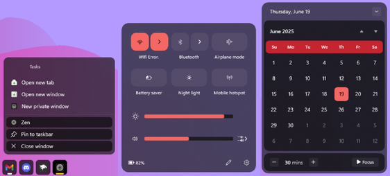
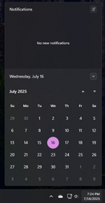
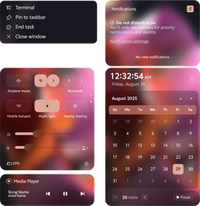
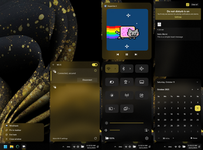

# The Windows 11 notification center styling guide

*This document is a work in progress, contributions are welcome.* \
***See also**: [The Windows 11 taskbar styling
guide](https://github.com/ramensoftware/windows-11-taskbar-styling-guide/blob/main/README.md),
[The Windows 11 start menu styling
guide](https://github.com/ramensoftware/windows-11-start-menu-styling-guide/blob/main/README.md).*

## Table of contents

* [Introduction](#introduction)
* [Themes](#themes)
  * [Themes](#windows-10-action-center-themes)
* [Style examples](#style-examples)
  * [Hide the focus assist section](#hide-the-focus-assist-section)
  * [Hide the notification center](#hide-the-notification-center)
  * [Hide control center PipsPager (navigation dots)](#hide-control-center-pipspager-navigation-dots)
  * [Hide control center footer](#hide-control-center-footer)
  * [Shrink the notification center height](#shrink-the-notification-center-height)
  * [Variable volume mixer height](#variable-volume-mixer-height)
  * [Remove shadows](#remove-shadows)
  * [Square the corners of the notification center](#square-the-corners-of-the-notification-center)
  * [Square the corners of the calendar](#square-the-corners-of-the-calendar)
  * [Square the corners of the calendar buttons](#square-the-corners-of-the-calendar-buttons)
  * [Square the corners of the quick action center](#square-the-corners-of-the-quick-action-center)
  * [Calendar and notification titlebars: titles on the right, buttons on the left](#calendar-and-notification-titlebars-titles-on-the-right-buttons-on-the-left)
  * [Add accelerator key (Alt+X) to clear all notifications](#add-accelerator-key-altx-to-clear-all-notifications)
  * [Add accelerator key (Alt+E) to expand/collapse the calendar](#add-accelerator-key-alte-to-expandcollapse-the-calendar)
* [Transforms](#transforms)
  * [Translate](#translate)
  * [Rotate](#rotate)
  * [Scale](#scale)
  * [Skew](#skew)
  * [Other properties and attributes](#other-properties-and-attributes)
* [Colors](#colors)
  * [Solid color](#solid-color)
  * [Accent colors](#accent-colors)
  * [Clear transparent background](#clear-transparent-background)
  * [Acrylic effect as color](#acrylic-effect-as-color)
  * [WindhawkBlur effect as color](#windhawkblur-effect-as-color)
    * [Hex color](#hex-color)
    * [ThemeResource color](#themeresource-color)
  * [Mica effect as color](#mica-effect-as-color)
  * [Gradient as color](#gradient-as-color)
  * [Image as color](#image-as-color)
  * [Reveal as color](#reveal-as-color)
* [Work in progress](#work-in-progress)

## Introduction

This is a collection of commonly requested notification center styling
customizations for Windows 11. It is intended to be used with the [Windows 11
Notification Center
Styler](https://windhawk.net/mods/windows-11-notification-center-styler)
Windhawk mod.

If you're not familiar with Windhawk, here are the steps for installing the mod:

* Download Windhawk from [windhawk.net](https://windhawk.net/) and install it.
* Go to "Mods" in the upper right menu.
* Find and install the "Windows 11 Notification Center Styler" mod.

After installing the mod, open its Settings tab and adjust the styles according
to your preferences.

Some customizations are best adjusted with other Windhawk mods. Links to those
mods are provided where applicable.

### Missing customizations

If you're looking for a customization that is not listed here, please [open an
issue](https://github.com/ramensoftware/windows-11-notification-center-styling-guide/issues/new).

### Contributing

If you have a notification center styling customization or theme that you would
like to share, please submit a pull request.

## Themes

Themes are collections of styles that can be imported into the Windows 11
Notification Center Styler mod. The following themes are available:

| Link | Screenshot
| ---- | ----------
| [TranslucentShell](Themes/TranslucentShell/README.md) | [](Themes/TranslucentShell/video.gif)
| [Matter](Themes/Matter/README.md) | [](Themes/Matter/screenshot.png)
| [Unified](Themes/Unified/README.md) | [](Themes/Unified/screenshot.png)
| [10JumpLists](Themes/10JumpLists/README.md) | [](Themes/10JumpLists/screenshot.png)
| [WindowGlass](Themes/WindowGlass/README.md) | [](Themes/WindowGlass/screenshot.png)
| [Oversimplified&Accentuated](Themes/Oversimplified&Accentuated/README.md) | [](Themes/Oversimplified&Accentuated/screenshot.png)

### Windows 10 Action Center themes

The themes below are designed for customizing the Windows 10 Action Center.

| Link | Screenshot
| ---- | ----------
| [SunValley](Themes/SunValley/README.md) | [](Themes/SunValley/screenshot.png)

## Style examples

### Hide the focus assist section

Target:
```
ActionCenter.FocusSessionControl
```
Style:
```
Height=0
```

### Hide the notification center

Target:
```
Grid#NotificationCenterGrid
```
Style:
```
Visibility=Collapsed
```

### Hide control center PipsPager (navigation dots)

Target:
```
Microsoft.UI.Xaml.Controls.PipsPager#QuickActionsPager
```
Style:
```
Visibility=Collapsed
```

### Hide control center footer

Target:
```
Grid#FooterGrid
```
Style:
```
Visibility=Collapsed
```

### Shrink the notification center height
Makes the panel non-full-height when there are fewer notifications (fit to size).

Target:
```
Grid#NotificationCenterGrid
```
Style:
```
VerticalAlignment=2
```

### Variable volume mixer height
Makes the volume mixer grow or shrink depending on how many volume sliders are visible.

Target for newer Windows 11 versions:
```
ControlCenter.FrameWithContentChanged#L2Frame
```
Target for older Windows 11 versions:
```
QuickActions.ControlCenter.FrameWithContentChanged#L2Frame
```
Style:
```
Height=Auto
```

### Remove shadows

Targets:
```
Grid#NotificationCenterGrid
```
```
Grid#CalendarCenterGrid
```
```
Grid#MediaTransportControlsRegion
```
Style:
```
Shadow:=
```

### Square the corners of the notification center

Target:
```
Grid#NotificationCenterGrid
```
Style:
```
CornerRadius=0
```

### Square the corners of the calendar

Target:
```
Grid#CalendarCenterGrid
```
Style:
```
CornerRadius=0
```

### Square the corners of the calendar buttons

Targets:
```
CalendarViewDayItem
```
```
Control
```
```
CalendarViewDayItem > Border
```
```
Control > Border
```
Style:
```
CornerRadius=0
```

### Square the corners of the quick action center

Target:
```
Grid#ControlCenterRegion
```
Style:
```
CornerRadius=0
```

### Calendar and notification titlebars: titles on the right, buttons on the left

Target:
```
Grid#RootContent
```
Style:
```
FlowDirection=1
```

### Add accelerator key (Alt+X) to clear all notifications

Target:
```
Button#ClearAll
```
Style:
```
AccessKey=x
```

### Add accelerator key (Alt+E) to expand/collapse the calendar

Target:
```
Button#ExpandCollapseButton
```
Style:
```
AccessKey=e
```

## Transforms

You can use transformation styles to translate, rotate, scale, or skew elements.

> [!TIP]
> **Should I use `RenderTransform` or `Transform3D`?**
>
> For 2D transformations, it is best to stick to `RenderTransform` in most cases. Using `Transform3D` for 2D transformations can cause elements to become blurry. For 3D transformations, you must use `Transform3D`.

> [!TIP]
> You can mix and match transformations when using `Transform3D`! You can also use `RenderTransform` and `Transform3D` together.
>
> For example: `Transform3D:=<CompositeTransform3D ScaleX="1.5" TranslateY="-15" RotationZ="15" />`

### Translate

```
RenderTransform:=<TranslateTransform X="15" Y="-15" />
```

-- or --

```
Transform3D:=<CompositeTransform3D TranslateX="15" TranslateY="-15" TranslateZ="-15" />
```

### Rotate

```
RenderTransform:=<RotateTransform Angle="15" />
```

-- or --

```
Transform3D:=<CompositeTransform3D RotationX="-15" RotationY="15" RotationZ="-15" />
```

- `X`: 3D vertical rotation.
- `Y`: 3D horizontal rotation.
- `Z`: 2D rotation.

### Scale

```
RenderTransform:=<ScaleTransform ScaleX="1.5" ScaleY="-1.5" />
```

-- or --

```
Transform3D:=<CompositeTransform3D ScaleX="-1.5" ScaleY="1.5" ScaleZ="-1.5" />
```

### Skew

```
RenderTransform:=<SkewTransform AngleX="-15" AngleY="15" />
```

### Other properties and attributes
- Applies to Rotate, Scale and Skew:
  - `CenterX`: Offsets the transform's origin on the X axis.
  - `CenterY`: Offsets the transform's origin on the Y axis.
  - `CenterZ`: Offsets the transform's origin on the Z axis. (Only for `Transform3D`)

  Example:
  ```
  RenderTransform:=<RotateTransform Angle="15" CenterX="10" CenterY="20" />
  ```
- `RenderTransformOrigin`
  - Applies to `RenderTransform` only, `Transform3D` does not support this attribute. It is a separate attribute and is not set inside of the `RenderTransform` like `CenterX/Y/Z`.
  - Sets the transform origin relative to its target's width and height. Format is `X,Y` and both numbers range from 0-1.

  Example:

  ```
  RenderTransformOrigin=0.5,0.5
  ```
  This centers the transform's origin.
- `TransformGroup`
  - Applies to `RenderTransform` only, `Transform3D` does not support this attribute. It is a separate attribute and is not set inside of the `RenderTransform` like `CenterX/Y/Z`.
  - Allows you to combine RenderTransforms together into one style, mimicking Transform3D's functionality.

  Example:
  ```
  RenderTransform:=<TransformGroup><RotateTransform Angle="15" /><TranslateTransform X="15" Y="-15" /></TransformGroup>
  ```
## Colors

In the following examples, we will use `Background` as our style, but this
also works for other properties that accept colors, such as `Fill`.

### Solid color

```
Background=<color>
```

Replace `<color>` with the desired color.

A color can be a name (e.g. `Red`) or a hex code (e.g. `#FF0000`).

The color can be semi-transparent (e.g. `#80FF0000`). To have a fully
transparent background, use `Transparent` or `#00000000`.

### Accent colors

A color can also be a `ThemeResource` or `StaticResource`. There are many such
styles built into Windows.

```
Background:=<SolidColorBrush Color="{ThemeResource SystemAccentColor}" Opacity="0.8" />
```

Accent colors come as part of an accent color palette. This means that for any color you pick as your system accent color, 3 additional shades are part of that color's palette. For example: `SystemAccentColorLight2` or `SystemAccentColorDark1`.

The word `Light` or `Dark` is appended at the end with a number ranging from 1
to 3. See [the official Microsoft
docs](https://learn.microsoft.com/en-us/windows/apps/design/style/color#accent-color-palette)
for more information.

```
Background:=<SolidColorBrush Color="{ThemeResource SystemAccentColorDark2}" Opacity="0.5" />
```

### Clear Transparent Background

To have a fully transparent background:

Style:
```
Background=Transparent
```

### Acrylic effect as color

In order to use the acrylic effect (a blurred background) you can use the
`AcrylicBrush`.

```
Background:=<AcrylicBrush TintColor="Black" TintOpacity="0.8" />
```

`TintColor` - Required. Defines what color to use.

`TintOpacity` - Defines the strength of the chosen color.

`TintLuminosityOpacity` - Defines the brightness of the acrylic effect.

`BackgroundSource` - Defines what should be considered the background of the acrylic effect. Set to "Backdrop" to use the desktop wallpaper.

`Opacity` - Defines how transparent the brush effect itself is. If set to less than 1, it blends the AcrylicBrush with clear transparency.

You can also set Acrylic to use an accent color for a more dynamic look that fits the current theme.

```
Background:=<AcrylicBrush TintColor="{ThemeResource SystemAccentColorDark2}" TintOpacity="0.3" />
```

### WindhawkBlur effect as color

An alternative to Acrylic is the mod's own blur implementation called `WindhawkBlur`. It differs from Acrylic because it has a customizable blur radius and has fewer bugs (e.g. https://github.com/ramensoftware/windhawk-mods/issues/742).

> [!NOTE]
> WindhawkBlur does not currently support color names (e.g. `Red`) or the `FallbackColor` property.

- `BlurAmount`: Radius of blur effect (set to 30 to mimic Acrylic).
#### Hex color

```
Fill:=<WindhawkBlur BlurAmount="10" TintColor="#80ff0000" />
```
```
Fill:=<WindhawkBlur BlurAmount="10" TintColor="#ff0000" TintOpacity="0.5" />
```
_These examples set a blur that is tinted with red at 50% opacity. Both versions have the same effect._

- `TintColor`: Hex color in `#AARRGGBB` or `#RRGGBB` format that is applied to the blur.
- `TintOpacity`: Opacity of the color that overrides the alpha of `TintColor`.

> [!TIP]
> There is no need to specify a `TintOpacity` value if your `TintColor` has an alpha value.

#### ThemeResource color

```
<WindhawkBlur BlurAmount="10" TintColor="{ThemeResource SystemAccentColor}" TintOpacity="0.5"/>
```

- `TintColor`: ThemeResource color, such as `SystemAccentColor`.
- `TintOpacity`: Overrides the opacity of the ThemeResource color.

### Mica effect as color

> [!NOTE]
> Unfortunately, it is not possible to set a Mica effect at this time with any of Windhawk's styler mods.

### Gradient as color

The background can also be a gradient. For example, to have a gradient from
yellow to red to blue to lime green, use the following style:

```
Background:=<LinearGradientBrush StartPoint="0,0.5" EndPoint="1,0.5"><GradientStop Color="Yellow" Offset="0.0" /><GradientStop Color="Red" Offset="0.25" /><GradientStop Color="Blue" Offset="0.75" /><GradientStop Color="LimeGreen" Offset="1.0" /></LinearGradientBrush>
```

### Image as color

The background can also be an image:

```
Background:=<ImageBrush Stretch="UniformToFill" ImageSource="<image>" />
```

Replace `<image>` with your own image, a URL or a local file path.
If you only see a fully transparent background when using a local file path, you must set a URL instead.
Images can be jpg, jpg XR, png, bmp, svg, tiff, gif, or ico.

Stretch can be set to the following values:

`None` - Image is rendered at its native resolution and aspect ratio.

`Fill` - Image is stretched or squished to fill the size of the element.

`Uniform` - Image is resized to fit the element dimensions, while it preserves its native aspect ratio.

`UniformToFill` - Image is resized to fill the destination dimensions while it preserves its native aspect ratio. Crops to fit element.

### Reveal as color

> [!NOTE]
> Reveal is a deprecated XAML feature. It may have issues
> or stop working at any time.

Reveal is the cursor-based illumination effect from Windows 10.

```
Background:=<RevealBorderBrush Color="Transparent" TargetTheme="1" Opacity="1" />
```

```
BorderBrush:=<RevealBorderBrush Color="Transparent" TargetTheme="1" Opacity="1" />
```

**Only** `RevealBorderBrush` should be used, `RevealBackgroundBrush` does not work correctly in most scenarios.

`Opacity` can be changed to increase or decrease the intensity of the effect.

## Work in progress

*This document is a work in progress, contributions are welcome.* \
***See also**: [The Windows 11 taskbar styling
guide](https://github.com/ramensoftware/windows-11-taskbar-styling-guide/blob/main/README.md),
[The Windows 11 start menu styling
guide](https://github.com/ramensoftware/windows-11-start-menu-styling-guide/blob/main/README.md).*
