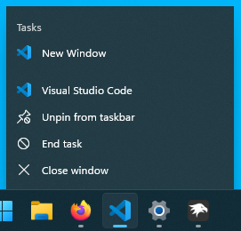

# 10JumpLists theme for Windows 11 Notification Center Styler

**Author**: [SandTechStuff](https://github.com/SandTechStuff)



## Theme selection

The theme is integrated into the mod, and can be simply selected from the mod's
settings:

* Open the Windows 11 Notification Center Styler mod in Windhawk.
* Go to the "Settings" tab.
* Select the theme and save the settings.

## Manual installation

The theme styles can also be imported manually. To do that, follow these steps:

* Open the Windows 11 Notification Center Styler mod in Windhawk.
* Go to the "Advanced" tab.
* Copy the content below to the text box under "Mod settings" and click "Save".

<details>
<summary>Content to import (click to expand)</summary>

```json
{
	"controlStyles[0].target": "Windows.UI.Xaml.Controls.Grid#JumpListGrid",
	"controlStyles[0].styles[0]": "Margin=0,0,0,0",
	"controlStyles[0].styles[1]": "CornerRadius=0",
	"controlStyles[0].styles[2]": "Width=256",
	"controlStyles[1].target": "Windows.UI.Xaml.Controls.Border#JumpListRestyledAcrylic",
	"controlStyles[1].styles[0]": "CornerRadius=0",
	"controlStyles[1].styles[1]": "// Background=Transparent",
	"controlStyles[1].styles[2]": "BorderThickness=0,0,0,0",
	"controlStyles[2].target": "JumpViewUI.SystemItemListView#SystemItemList",
	"controlStyles[2].styles[0]": "Width=256",
	"controlStyles[3].target": "JumpViewUI.TaskbarJumpListFrame",
	"controlStyles[3].styles[0]": "Width=256",
	"controlStyles[3].styles[1]": "// RequestedTheme=2",
	"controlStyles[4].target": "JumpViewUI.JumpListListView#ItemList",
	"controlStyles[4].styles[0]": "Width=256",
	"controlStyles[4].styles[1]": "// Background:=<AcrylicBrush TintColor=\"#202020\" TintOpacity=\"0.75\" FallbackColor=\"#202020\" />",
	"controlStyles[4].styles[2]": "Padding=0,5,0,5",
	"controlStyles[5].target": "JumpViewUI.SystemItemControl > Windows.UI.Xaml.Controls.Grid > Windows.UI.Xaml.Controls.Grid > Windows.UI.Xaml.Controls.TextBlock",
	"controlStyles[5].styles[0]": "FontFamily=Segoe MDL2 Assets",
	"controlStyles[6].target": "Windows.UI.Xaml.Controls.Button#PinButton > Windows.UI.Xaml.Controls.Grid > Windows.UI.Xaml.Controls.ContentPresenter#ContentPresenter > Windows.UI.Xaml.Controls.TextBlock",
	"controlStyles[6].styles[0]": "FontFamily=Segoe MDL2 Assets",
	"controlStyles[7].target": "Windows.UI.Xaml.Controls.Button#PinButton",
	"controlStyles[7].styles[0]": "Width=30",
	"controlStyles[7].styles[1]": "Height=30",
	"controlStyles[8].target": "JumpViewUI.JumpListListViewItem",
	"controlStyles[8].styles[0]": "Margin=0,0,0,0",
	"controlStyles[8].styles[1]": "Height=30",
	"controlStyles[9].target": "JumpViewUI.SystemItemListViewItem",
	"controlStyles[9].styles[0]": "Margin=0,0,0,0",
	"controlStyles[9].styles[1]": "Height=30",
	"controlStyles[10].target": "JumpViewUI.SystemItemListViewItem > Windows.UI.Xaml.Controls.Grid#LayoutRoot@CommonStates > Windows.UI.Xaml.Controls.Border#BackgroundBorder",
	"controlStyles[10].styles[0]": "CornerRadius=0",
	"controlStyles[10].styles[1]": "Background@PointerOver:=<RevealBorderBrush Color=\"Transparent\" TargetTheme=\"1\" Opacity=\"0.5\" FallbackColor=\"#353535\" />",
	"controlStyles[10].styles[2]": "Background@Pressed:=<RevealBorderBrush Color=\"Transparent\" TargetTheme=\"1\" Opacity=\"0.9\" FallbackColor=\"#4c4c4c\" />",
	"controlStyles[10].styles[3]": "BorderBrush@PointerOver:=<RevealBorderBrush Color=\"Transparent\" TargetTheme=\"1\" Opacity=\"1\" />",
	"controlStyles[10].styles[4]": "BorderBrush@Pressed:=<RevealBorderBrush Color=\"Transparent\" TargetTheme=\"1\" Opacity=\"1\" />",
	"controlStyles[10].styles[5]": "BorderThickness=1,1,1,1",
	"controlStyles[11].target": "JumpViewUI.JumpListListViewItem > Windows.UI.Xaml.Controls.Grid#LayoutRoot@CommonStates > Windows.UI.Xaml.Controls.Border#BackgroundBorder",
	"controlStyles[11].styles[0]": "CornerRadius=0",
	"controlStyles[11].styles[1]": "Background@PointerOver:=<RevealBorderBrush Color=\"Transparent\" TargetTheme=\"1\" Opacity=\"0.5\" FallbackColor=\"#353535\"/>",
	"controlStyles[11].styles[2]": "Background@Pressed:=<RevealBorderBrush Color=\"Transparent\" TargetTheme=\"1\" Opacity=\"0.9\" FallbackColor=\"#4c4c4c\" />",
	"controlStyles[11].styles[3]": "BorderBrush@PointerOver:=<RevealBorderBrush Color=\"Transparent\" TargetTheme=\"1\" Opacity=\"1\" />",
	"controlStyles[11].styles[4]": "BorderBrush@Pressed:=<RevealBorderBrush Color=\"Transparent\" TargetTheme=\"1\" Opacity=\"1\" />",
	"controlStyles[11].styles[5]": "BorderThickness=1,1,1,1",
	"controlStyles[12].target": "Windows.UI.Xaml.Controls.Button#PinButton > Windows.UI.Xaml.Controls.Grid > Windows.UI.Xaml.Shapes.Rectangle",
	"controlStyles[12].styles[0]": "Visibility=Collapsed",
	"controlStyles[13].target": "Windows.UI.Xaml.Controls.TextBlock#DisplayNameTextBlock",
	"controlStyles[13].styles[0]": "FontSize=12",
	"controlStyles[13].styles[1]": "FontFamily=Segoe UI",
	"controlStyles[14].target": "JumpViewUI.JumpListCategoryHeaderControl > Windows.UI.Xaml.Controls.Grid > Windows.UI.Xaml.Controls.TextBlock#HeadingTextBlock",
	"controlStyles[14].styles[0]": "Margin=12,10,12,6",
	"controlStyles[14].styles[1]": "FontFamily=Segoe UI",
	"controlStyles[15].target": "Windows.UI.Xaml.Controls.Grid#SystemItemsContainer > Windows.UI.Xaml.Shapes.Rectangle",
	"controlStyles[15].styles[0]": "Visibility=Collapsed",
	"controlStyles[16].target": "Windows.UI.Xaml.Controls.Grid#SystemItemsContainer",
	"controlStyles[16].styles[0]": "Padding=0,5,0,5",
	"controlStyles[17].target": "JumpViewUI.JumpListListViewItem > Windows.UI.Xaml.Controls.Grid#LayoutRoot > Windows.UI.Xaml.Controls.ContentPresenter#ContentPresenter > Windows.UI.Xaml.Controls.Grid#LayoutRoot > Windows.UI.Xaml.Shapes.Rectangle",
	"controlStyles[17].styles[0]": "Margin=12,4,12,4",
	"controlStyles[16].styles[1]": "// Background:=<AcrylicBrush TintColor=\"#101010\" TintOpacity=\"0.75\" FallbackColor=\"#101010\" />",
	"controlStyles[18].target": "JumpViewUI.JumpListControl#JumpList",
	"controlStyles[18].styles[0]": "Margin=0,0,0,0",
	"controlStyles[19].target": "Windows.UI.Xaml.Controls.Button#PinButton > Windows.UI.Xaml.Controls.Grid@CommonStates > Windows.UI.Xaml.Controls.Border#BackgroundBorder",
	"controlStyles[19].styles[0]": "Background@PointerOver:=<AcrylicBrush TintColor=\"#7d8787\" TintOpacity=\"0.3\" FallbackColor=\"#494949\" />",
	"controlStyles[19].styles[1]": "Background@Pressed:=<AcrylicBrush TintColor=\"#788787\" TintOpacity=\"0.3\" FallbackColor=\"#5d5d5d\" />",
	"controlStyles[19].styles[2]": "CornerRadius=0"
}
```
</details>

## Vertical Taskbar

To line the jump lists up properly when using a vertical taskbar, you need to add an additional style manually.

First, select the theme within the mod's settings. Then add the style that corresponds with your taskbar position.

### Left Taskbar

Target: `JumpViewUI.TaskbarJumpListFrame` \
Style: `HorizontalAlignment=0`

### Right Taskbar

Target: `JumpViewUI.TaskbarJumpListFrame` \
Style: `HorizontalAlignment=2`
