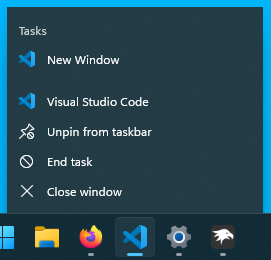

# 10JumpLists theme for Windows 11 Notification Center Styler

**Author**: [SandTechStuff](https://github.com/SandTechStuff)



## Theme selection

The theme is integrated into the mod and can be selected directly from the mod's
settings:

* Open the Windows 11 Notification Center Styler mod in Windhawk.
* Go to the "Settings" tab.
* Select the theme and save the settings.

## Manual installation

The theme styles can also be imported manually. To do that, follow these steps:

* Open the Windows 11 Notification Center Styler mod in Windhawk.
* Go to the "Settings" tab and select "Textual mode".
* Copy the content below to the text box and click "Save settings".

<details>
<summary>Content to import (click to expand)</summary>

```yaml
controlStyles:
  - target: Windows.UI.Xaml.Controls.Grid#JumpListGrid
    styles:
      - Margin=0,0,0,0
      - CornerRadius=0
      - Width=256
  - target: Windows.UI.Xaml.Controls.Border#JumpListRestyledAcrylic
    styles:
      - CornerRadius=0
      - Background=Transparent
      - BorderThickness=0,0,0,0
  - target: JumpViewUI.SystemItemListView#SystemItemList
    styles:
      - Width=256
  - target: JumpViewUI.TaskbarJumpListFrame
    styles:
      - Width=256
  - target: JumpViewUI.JumpListListView#ItemList
    styles:
      - Width=256
      - Padding=0,5,0,5
  - target: JumpViewUI.SystemItemControl > Windows.UI.Xaml.Controls.Grid > Windows.UI.Xaml.Controls.Grid > Windows.UI.Xaml.Controls.TextBlock
    styles:
      - FontFamily=Segoe MDL2 Assets
  - target: Windows.UI.Xaml.Controls.Button#PinButton > Windows.UI.Xaml.Controls.Grid > Windows.UI.Xaml.Controls.ContentPresenter#ContentPresenter > Windows.UI.Xaml.Controls.TextBlock
    styles:
      - FontFamily=Segoe MDL2 Assets
  - target: Windows.UI.Xaml.Controls.Button#PinButton
    styles:
      - Width=30
      - Height=30
  - target: JumpViewUI.JumpListListViewItem
    styles:
      - Margin=0,0,0,0
      - Height=30
  - target: JumpViewUI.SystemItemListViewItem
    styles:
      - Margin=0,0,0,0
      - Height=30
  - target: JumpViewUI.SystemItemListViewItem > Windows.UI.Xaml.Controls.Grid#LayoutRoot@CommonStates > Windows.UI.Xaml.Controls.Border#BackgroundBorder
    styles:
      - CornerRadius=0
      - Background@PointerOver:=<RevealBorderBrush Color="{ThemeResource SystemListLowColor}" TargetTheme="1" Opacity="0.5" FallbackColor="{ThemeResource SystemListLowColor}"/>
      - Background@Pressed:=<RevealBorderBrush Color="{ThemeResource SystemListLowColor}" TargetTheme="1" Opacity="0.9" FallbackColor="{ThemeResource SystemListLowColor}" />
      - BorderBrush@PointerOver:=<RevealBorderBrush Color="Transparent" TargetTheme="1" Opacity="1" />
      - BorderBrush@Pressed:=<RevealBorderBrush Color="Transparent" TargetTheme="1" Opacity="1" />
      - BorderThickness=1,1,1,1
  - target: JumpViewUI.JumpListListViewItem > Windows.UI.Xaml.Controls.Grid#LayoutRoot@CommonStates > Windows.UI.Xaml.Controls.Border#BackgroundBorder
    styles:
      - CornerRadius=0
      - Background@PointerOver:=<RevealBorderBrush Color="{ThemeResource SystemListLowColor}" TargetTheme="1" Opacity="0.5" FallbackColor="{ThemeResource SystemListLowColor}"/>
      - Background@Pressed:=<RevealBorderBrush Color="{ThemeResource SystemListLowColor}" TargetTheme="1" Opacity="0.9" FallbackColor="{ThemeResource SystemListLowColor}" />
      - BorderBrush@PointerOver:=<RevealBorderBrush Color="Transparent" TargetTheme="1" Opacity="1" />
      - BorderBrush@Pressed:=<RevealBorderBrush Color="Transparent" TargetTheme="1" Opacity="1" />
      - BorderThickness=1,1,1,1
  - target: Windows.UI.Xaml.Controls.Button#PinButton > Windows.UI.Xaml.Controls.Grid > Windows.UI.Xaml.Shapes.Rectangle
    styles:
      - Visibility=Collapsed
  - target: Windows.UI.Xaml.Controls.TextBlock#DisplayNameTextBlock
    styles:
      - FontSize=12
      - FontFamily=Segoe UI
  - target: JumpViewUI.JumpListCategoryHeaderControl > Windows.UI.Xaml.Controls.Grid > Windows.UI.Xaml.Controls.TextBlock#HeadingTextBlock
    styles:
      - Margin=12,10,12,6
      - FontFamily=Segoe UI
  - target: Windows.UI.Xaml.Controls.Grid#SystemItemsContainer > Windows.UI.Xaml.Shapes.Rectangle
    styles:
      - Visibility=Collapsed
  - target: Windows.UI.Xaml.Controls.Grid#SystemItemsContainer
    styles:
      - Padding=0,5,0,5
  - target: JumpViewUI.JumpListListViewItem > Windows.UI.Xaml.Controls.Grid#LayoutRoot > Windows.UI.Xaml.Controls.ContentPresenter#ContentPresenter > Windows.UI.Xaml.Controls.Grid#LayoutRoot > Windows.UI.Xaml.Shapes.Rectangle
    styles:
      - Margin=12,4,12,4
  - target: JumpViewUI.JumpListControl#JumpList
    styles:
      - Margin=0,0,0,0
  - target: Windows.UI.Xaml.Controls.Button#PinButton > Windows.UI.Xaml.Controls.Grid@CommonStates > Windows.UI.Xaml.Controls.Border#BackgroundBorder
    styles:
      - Background@PointerOver:=<AcrylicBrush TintColor="{ThemeResource SystemListLowColor}" TintOpacity="1" Opacity="0.5" FallbackColor="{ThemeResource SystemListLowColor}"/>
      - Background@Pressed:=<AcrylicBrush TintColor="{ThemeResource SystemListLowColor}" TintOpacity="1" Opacity="0.9" FallbackColor="{ThemeResource SystemListMediumColor}"/>
      - CornerRadius=0
  - target: Windows.UI.Xaml.Controls.Border#JumpListAcrylic
    styles:
      - Visibility=Visible
  - target: Windows.UI.Xaml.Controls.Grid#SystemItemsContainer > Windows.UI.Xaml.Controls.Border#SystemItemsAcrylic
    styles:
      - Visibility=Visible
      - Margin=0,-5,0,-5
  - target: Windows.UI.Xaml.Controls.MenuFlyoutPresenter > Windows.UI.Xaml.Controls.Border
    styles:
      - CornerRadius=0
      - Background:=<AcrylicBrush TintColor="{ThemeResource SystemAltHighColor}" TintOpacity="0.6" FallbackColor="{ThemeResource SystemChromeMediumColor}" />
  - target: Windows.UI.Xaml.Controls.MenuFlyoutItem
    styles:
      - CornerRadius=0
  - target: Windows.UI.Xaml.Controls.ContentPresenter#IconContent > Windows.UI.Xaml.Controls.FontIcon > Windows.UI.Xaml.Controls.Grid > Windows.UI.Xaml.Controls.TextBlock
    styles:
      - FontFamily=Segoe MDL2 Assets, Segoe UI
  - target: Windows.UI.Xaml.Controls.MenuFlyoutItem > Grid > TextBlock
    styles:
      - FontSize=12
      - FontFamily=Segoe UI
  - target: Windows.UI.Xaml.Controls.MenuFlyoutItem > Grid
    styles:
      - BorderThickness=1,1,1,1
      - Margin=0
```
</details>

## Vertical Taskbar

To line the jump lists up properly when using a vertical taskbar, you need to add an additional style manually.

First, select the theme within the mod's settings. Then add the style that corresponds with your taskbar position.

### Left Taskbar

Target: `JumpViewUI.TaskbarJumpListFrame` \
Style: `HorizontalAlignment=0`

### Right Taskbar

Target: `JumpViewUI.TaskbarJumpListFrame` \
Style: `HorizontalAlignment=2`
