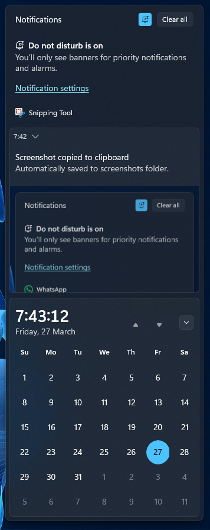
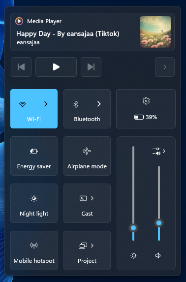
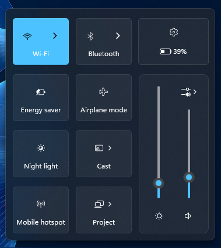

# BetterControl11 theme for Windows 11 Notification Center Styler

A theme that is inspired by MacOS Control Center and Windows 10 Action Center

**Author**: [TheGamer1445891](https://github.com/TheGamer1445891)







## Theme selection

The theme is integrated into the mod and can be selected directly from the mod's
settings:

* Open the Windows 11 Notification Center Styler mod in Windhawk.
* Go to the "Settings" tab.
* Select the theme and save the settings.

### Notes

> [!NOTE]
> This Theme will move some of the Control Center Quick Actions Buttons offscreen so please reposition your Quick Actions Buttons like in the image i've showed.


There are some (optional) tweaks you need to add if youre using the "Theme Selection" method

**Control Center like animations for Notification Center** (credit to [Lockframe](https://github.com/Lockframe))**:**

Target:
```
ActionCenter.NotificationCenterPage > Grid > Grid
```
Styles:
```
RenderTransform:=<RotateTransform Angle="-90"/>
RenderTransformOrigin=0.5,1
```

Target:
```
ActionCenter.NotificationCenterPage
```
Styles:
```
RenderTransform:=<RotateTransform Angle="90"/>
RenderTransformOrigin=0.5,1
```

**Move Control Center to the top** (mainly for top taskbars)**:**

Target:
```
ControlCenter.ControlCenterPage
```
Styles:
```
VerticalAlignment=Stretch
```

Target:
```
ControlCenter.ControlCenterPage > Grid#RootGrid
```
Styles:
```
VerticalAlignment=Stretch
```

Target:
```
ControlCenter.ControlCenterPage > Grid#RootGrid > Grid#RootContent
```
Styles:
```
VerticalAlignment=Top
```

**Flip the Control Center animation** (important for top alignment control center)**:**

Target:
```
ControlCenter.ControlCenterPage
```
Styles:
```
RenderTransform:=<RotateTransform Angle="180" />
RenderTransformOrigin=0.5,0.5
```

Target:
```
ControlCenter.ControlCenterPage > Grid#RootGrid
```
Styles:
```
RenderTransform:=<RotateTransform Angle="180" />
RenderTransformOrigin=0.5,0.5
```

**Hide the Focus Timer from Notification Center**

Target:
```
ActionCenter.FocusSessionControl
```
Styles:
```
Visibility=1
```

## Manual installation

The theme styles can also be imported manually. To do that, follow these steps:

* Open the Windows 11 Taskbar Styler mod in Windhawk.
* Go to the "Advanced" tab.
* Copy the content below to the text box under "Mod settings" and click "Save".

<details>
<summary>Content to import (click to expand)</summary>

```json
{
    "controlStyles[0].styles[0]": "RenderTransform:=<RotateTransform Angle=\"-90\"/>",
    "controlStyles[0].styles[1]": "RenderTransformOrigin=0.5,1",
    "controlStyles[0].styles[2]": "// action center like animation for the notification center (credit to @Lockframe (github))",
    "controlStyles[0].target": "//ActionCenter.NotificationCenterPage > Grid > Grid",
    "controlStyles[1].styles[0]": "RenderTransform:=<RotateTransform Angle=\"90\"/>",
    "controlStyles[1].styles[1]": "RenderTransformOrigin=0.5,1",
    "controlStyles[1].styles[2]": "// action center like animation for the notification center (credit to @Lockframe (github))",
    "controlStyles[1].target": "//ActionCenter.NotificationCenterPage",
    "controlStyles[10].styles[0]": "RenderTransform:=<RotateTransform Angle=\"180\" />",
    "controlStyles[10].styles[1]": "RenderTransformOrigin=0.5,0.5",
    "controlStyles[10].styles[2]": "// flip the action center animation",
    "controlStyles[10].target": "//ControlCenter.ControlCenterPage > Grid#RootGrid",
    "controlStyles[11].styles[0]": "RenderTransform:=<RotateTransform Angle=\"90\"/>",
    "controlStyles[11].target": "Windows.UI.Xaml.Controls.ContentControl#QuickActionContentControl > Windows.UI.Xaml.Controls.ContentPresenter > Windows.UI.Xaml.Controls.Grid > Windows.UI.Xaml.Controls.Primitives.ToggleButton > Windows.UI.Xaml.Controls.ContentPresenter#ContentPresenter > Microsoft.UI.Xaml.Controls.AnimatedIcon",
    "controlStyles[12].styles[0]": "RenderTransform:=<RotateTransform Angle=\"90\"/>",
    "controlStyles[12].target": "Microsoft.UI.Xaml.Controls.AnimatedIcon#BrightnessPlayer",
    "controlStyles[13].styles[0]": "RenderTransform:=<TranslateTransform X=\"0\" Y=\"0\" />",
    "controlStyles[13].styles[1]": "Margin=-15,0,0,0",
    "controlStyles[13].target": "Windows.UI.Xaml.Controls.ContentControl#QuickActionContentControl",
    "controlStyles[14].styles[0]": "Margin=35,0,50,0",
    "controlStyles[14].target": "ControlCenter.AsyncSlider",
    "controlStyles[15].styles[0]": "RenderTransform:=<TranslateTransform X=\"216\" Y=\"-343\" />",
    "controlStyles[15].styles[1]": "Margin=0",
    "controlStyles[15].styles[2]": "Width=121",
    "controlStyles[15].target": "ControlCenter.ControlCenterPage > Windows.UI.Xaml.Controls.Grid#RootGrid > Windows.UI.Xaml.Controls.Grid#RootContent > Windows.UI.Xaml.Controls.Grid#ControlCenterRegion > ControlCenter.ControlCenterView#ControlCenterView > Windows.UI.Xaml.Controls.Grid#RootGrid > Windows.UI.Xaml.Controls.Grid#L1Grid > Windows.UI.Xaml.Controls.Grid#FooterGrid > Windows.UI.Xaml.Controls.ItemsControl#LeftFooter > Windows.UI.Xaml.Controls.ItemsPresenter > Windows.UI.Xaml.Controls.StackPanel > Windows.UI.Xaml.Controls.ContentPresenter > Windows.UI.Xaml.Controls.ItemsControl > Windows.UI.Xaml.Controls.ItemsPresenter > Windows.UI.Xaml.Controls.StackPanel > Windows.UI.Xaml.Controls.ContentPresenter > Windows.UI.Xaml.Controls.ContentControl > Windows.UI.Xaml.Controls.ContentPresenter > Windows.UI.Xaml.Controls.Button > Windows.UI.Xaml.Controls.ContentPresenter#ContentPresenter",
    "controlStyles[16].styles[0]": "Visibility=1",
    "controlStyles[16].target": "Microsoft.UI.Xaml.Controls.PipsPager#QuickActionsPager",
    "controlStyles[17].styles[0]": "RenderTransform:=<TranslateTransform X=\"0\" Y=\"-383\" />",
    "controlStyles[17].styles[1]": "Width=121",
    "controlStyles[17].target": "ControlCenter.ControlCenterPage > Windows.UI.Xaml.Controls.Grid#RootGrid > Windows.UI.Xaml.Controls.Grid#RootContent > Windows.UI.Xaml.Controls.Grid#ControlCenterRegion > ControlCenter.ControlCenterView#ControlCenterView > Windows.UI.Xaml.Controls.Grid#RootGrid > Windows.UI.Xaml.Controls.Grid#L1Grid > Windows.UI.Xaml.Controls.Grid#FooterGrid > Windows.UI.Xaml.Controls.ItemsControl#RightFooter > Windows.UI.Xaml.Controls.ItemsPresenter > Windows.UI.Xaml.Controls.StackPanel > Windows.UI.Xaml.Controls.ContentPresenter > Windows.UI.Xaml.Controls.ItemsControl > Windows.UI.Xaml.Controls.ItemsPresenter > Windows.UI.Xaml.Controls.StackPanel > Windows.UI.Xaml.Controls.ContentPresenter > Windows.UI.Xaml.Controls.ContentControl > Windows.UI.Xaml.Controls.ContentPresenter > Windows.UI.Xaml.Controls.Button#FooterButton > Windows.UI.Xaml.Controls.ContentPresenter#ContentPresenter",
    "controlStyles[18].styles[0]": "Margin=0,0,0,-48",
    "controlStyles[18].target": "Windows.UI.Xaml.Controls.Grid#FooterGrid",
    "controlStyles[19].styles[0]": "BorderThickness=0",
    "controlStyles[19].target": "Windows.UI.Xaml.Controls.ContentControl#TogglesGroup > Windows.UI.Xaml.Controls.ContentPresenter > ControlCenter.PaginatedGridView > Grid",
    "controlStyles[2].styles[0]": "MaximumRowsOrColumns=2",
    "controlStyles[2].target": "Windows.UI.Xaml.Controls.ItemsWrapGrid",
    "controlStyles[20].styles[0]": "Visibility=0",
    "controlStyles[20].styles[1]": "Height=272",
    "controlStyles[20].styles[2]": "CornerRadius=8",
    "controlStyles[20].styles[3]": "BorderBrush:=<SolidColorBrush Color=\"{ThemeResource SurfaceStrokeColorDefault}\" Opacity=\"0.8\" />",
    "controlStyles[20].styles[4]": "BorderThickness=1",
    "controlStyles[20].styles[5]": "Margin=228,0,10,-4",
    "controlStyles[20].styles[6]": "RenderTransform:=<TransformGroup><RotateTransform Angle=\"0\" /><TranslateTransform X=\"0\" Y=\"48\" /></TransformGroup>",
    "controlStyles[20].target": "Windows.UI.Xaml.Controls.Grid#L1Grid > Border",
    "controlStyles[21].styles[0]": "Background:=transparent",
    "controlStyles[21].target": "Windows.UI.Xaml.Controls.Grid#MediaTransportControlsRoot",
    "controlStyles[22].styles[0]": "Background:=#09FFFFFF",
    "controlStyles[22].styles[1]": "Margin=0,-6,0,6",
    "controlStyles[22].target": "Windows.UI.Xaml.Controls.ListView#MediaButtonsListView",
    "controlStyles[23].styles[0]": "Padding=12,10,10,10",
    "controlStyles[23].styles[1]": "Background:=#09FFFFFF",
    "controlStyles[23].styles[2]": "CornerRadius=6",
    "controlStyles[23].styles[3]": "BorderBrush:=<SolidColorBrush Color=\"{ThemeResource SurfaceStrokeColorDefault}\" Opacity=\"0.8\" />",
    "controlStyles[23].styles[4]": "BorderThickness=1",
    "controlStyles[23].styles[5]": "Margin=-12,-32,-12,32",
    "controlStyles[23].target": "Windows.UI.Xaml.Controls.Grid#AlbumTextAndArtContainer",
    "controlStyles[24].styles[0]": "RenderTransform:=<TranslateTransform X=\"0\" Y=\"10\" />",
    "controlStyles[24].target": "Windows.UI.Xaml.Controls.StackPanel#PrimaryAndSecondaryTextContainer",
    "controlStyles[25].styles[0]": "RenderTransform:=<TranslateTransform X=\"-2\" Y=\"5\" />",
    "controlStyles[25].target": "Windows.UI.Xaml.Controls.Grid#MediaTransportControlsRoot > Grid > Windows.UI.Xaml.Controls.Image#IconImage",
    "controlStyles[26].styles[0]": "RenderTransform:=<TranslateTransform X=\"-2\" Y=\"5\" />",
    "controlStyles[26].target": "Windows.UI.Xaml.Controls.Grid#MediaTransportControlsRoot > Grid > Windows.UI.Xaml.Controls.TextBlock#AppNameText",
    "controlStyles[27].styles[0]": "Margin=0,-14",
    "controlStyles[27].target": "Windows.UI.Xaml.Controls.ListView#MediaButtonsListView > Windows.UI.Xaml.Controls.ItemsPresenter",
    "controlStyles[28].styles[0]": "Background:=transparent",
    "controlStyles[28].target": "Windows.UI.Xaml.Controls.ContentPresenter#PageContent > Grid > Border",
    "controlStyles[29].styles[0]": "Background:=transparent",
    "controlStyles[29].target": "Windows.UI.Xaml.Controls.ContentPresenter#PageHeader",
    "controlStyles[3].styles[0]": "HorizontalAlignment=0",
    "controlStyles[3].target": "ContentControl#TogglesGroup > ContentPresenter > ControlCenter.PaginatedGridView > Grid > GridView#RootGridView",
    "controlStyles[30].styles[0]": "Margin=-22,0",
    "controlStyles[30].styles[1]": "Background:=#09FFFFFF",
    "controlStyles[30].styles[2]": "BorderBrush:=<SolidColorBrush Color=\"{ThemeResource SurfaceStrokeColorDefault}\" Opacity=\"0.8\" />",
    "controlStyles[30].styles[3]": "BorderThickness=1",
    "controlStyles[30].styles[4]": "CornerRadius=4",
    "controlStyles[30].target": "Windows.UI.Xaml.Controls.Button#PlayPauseButton > Windows.UI.Xaml.Controls.ContentPresenter#ContentPresenter",
    "controlStyles[31].styles[0]": "Margin=4,0",
    "controlStyles[31].styles[1]": "Background:=#09FFFFFF",
    "controlStyles[31].styles[2]": "BorderBrush:=<SolidColorBrush Color=\"{ThemeResource SurfaceStrokeColorDefault}\" Opacity=\"0.8\" />",
    "controlStyles[31].styles[3]": "BorderThickness=1",
    "controlStyles[31].styles[4]": "CornerRadius=4",
    "controlStyles[31].target": "Windows.UI.Xaml.Controls.Primitives.RepeatButton#NextButton > Windows.UI.Xaml.Controls.ContentPresenter#ContentPresenter",
    "controlStyles[32].styles[0]": "Margin=4,0",
    "controlStyles[32].styles[1]": "Background:=#09FFFFFF",
    "controlStyles[32].styles[2]": "BorderBrush:=<SolidColorBrush Color=\"{ThemeResource SurfaceStrokeColorDefault}\" Opacity=\"0.8\" />",
    "controlStyles[32].styles[3]": "BorderThickness=1",
    "controlStyles[32].styles[4]": "CornerRadius=4",
    "controlStyles[32].target": "Windows.UI.Xaml.Controls.Primitives.RepeatButton#PreviousButton > Windows.UI.Xaml.Controls.ContentPresenter#ContentPresenter",
    "controlStyles[33].styles[0]": "CornerRadius=4",
    "controlStyles[33].styles[1]": "Height=64",
    "controlStyles[33].styles[2]": "Width=64",
    "controlStyles[33].styles[3]": "Margin=-4",
    "controlStyles[33].target": "Windows.UI.Xaml.Controls.Grid#ThumbnailImage",
    "controlStyles[34].styles[0]": "RenderTransform:=<TransformGroup><RotateTransform Angle=\"0\" /><TranslateTransform X=\"25\" Y=\"0\" /></TransformGroup>",
    "controlStyles[34].target": "Windows.UI.Xaml.Controls.ContentControl#QuickActionContentControl > Windows.UI.Xaml.Controls.ContentPresenter > Windows.UI.Xaml.Controls.Grid > Windows.UI.Xaml.Controls.Primitives.ToggleButton",
    "controlStyles[35].styles[0]": "RenderTransform:=<TransformGroup><RotateTransform Angle=\"0\" /><TranslateTransform X=\"25\" Y=\"0\" /></TransformGroup>",
    "controlStyles[35].target": "Windows.UI.Xaml.Controls.ContentControl#QuickActionContentControl > Windows.UI.Xaml.Controls.ContentPresenter > Windows.UI.Xaml.Controls.Grid > Windows.UI.Xaml.Controls.Button",
    "controlStyles[36].styles[0]": "RenderTransform:=<TransformGroup><RotateTransform Angle=\"90\" /><TranslateTransform X=\"0\" Y=\"0\" /></TransformGroup>",
    "controlStyles[36].target": "Button#VolumeL2Button",
    "controlStyles[37].styles[0]": "Margin=0,0,0,-36",
    "controlStyles[37].styles[1]": "Height=80",
    "controlStyles[37].target": "ControlCenter.ControlCenterPage > Windows.UI.Xaml.Controls.Grid#RootGrid > Windows.UI.Xaml.Controls.Grid#RootContent > Windows.UI.Xaml.Controls.Grid#ControlCenterRegion > ControlCenter.ControlCenterView#ControlCenterView > Windows.UI.Xaml.Controls.Grid#RootGrid > Windows.UI.Xaml.Controls.Grid#L1Grid > Windows.UI.Xaml.Controls.ContentControl#TogglesGroup > Windows.UI.Xaml.Controls.ContentPresenter > ControlCenter.PaginatedGridView > Windows.UI.Xaml.Controls.Grid > Windows.UI.Xaml.Controls.GridView#RootGridView > Windows.UI.Xaml.Controls.Border > Windows.UI.Xaml.Controls.ScrollViewer#ScrollViewer > Windows.UI.Xaml.Controls.Border#Root > Windows.UI.Xaml.Controls.Grid > Windows.UI.Xaml.Controls.ScrollContentPresenter#ScrollContentPresenter > Windows.UI.Xaml.Controls.ItemsPresenter > Windows.UI.Xaml.Controls.ItemsWrapGrid > Windows.UI.Xaml.Controls.GridViewItem > Windows.UI.Xaml.Controls.Primitives.ListViewItemPresenter#Root > Windows.UI.Xaml.Controls.ContentControl > Windows.UI.Xaml.Controls.ContentPresenter > Windows.UI.Xaml.Controls.Grid > Windows.UI.Xaml.Controls.Grid > ControlCenter.PaginatedToggleButton#ToggleButton",
    "controlStyles[38].styles[0]": "Margin=0,0,0,-36",
    "controlStyles[38].styles[1]": "Height=80",
    "controlStyles[38].target": "ControlCenter.ControlCenterPage > Windows.UI.Xaml.Controls.Grid#RootGrid > Windows.UI.Xaml.Controls.Grid#RootContent > Windows.UI.Xaml.Controls.Grid#ControlCenterRegion > ControlCenter.ControlCenterView#ControlCenterView > Windows.UI.Xaml.Controls.Grid#RootGrid > Windows.UI.Xaml.Controls.Grid#L1Grid > Windows.UI.Xaml.Controls.ContentControl#TogglesGroup > Windows.UI.Xaml.Controls.ContentPresenter > ControlCenter.PaginatedGridView > Windows.UI.Xaml.Controls.Grid > Windows.UI.Xaml.Controls.GridView#RootGridView > Windows.UI.Xaml.Controls.Border > Windows.UI.Xaml.Controls.ScrollViewer#ScrollViewer > Windows.UI.Xaml.Controls.Border#Root > Windows.UI.Xaml.Controls.Grid > Windows.UI.Xaml.Controls.ScrollContentPresenter#ScrollContentPresenter > Windows.UI.Xaml.Controls.ItemsPresenter > Windows.UI.Xaml.Controls.ItemsWrapGrid > Windows.UI.Xaml.Controls.GridViewItem > Windows.UI.Xaml.Controls.Primitives.ListViewItemPresenter#Root > Windows.UI.Xaml.Controls.ContentControl > Windows.UI.Xaml.Controls.ContentPresenter > Windows.UI.Xaml.Controls.Grid > ControlCenter.PaginatedToggleButton#ToggleButton",
    "controlStyles[39].styles[0]": "Margin=0,0,0,-36",
    "controlStyles[39].styles[1]": "Height=80",
    "controlStyles[39].target": "ControlCenter.PaginatedToggleButton#SplitL2Button",
    "controlStyles[4].styles[0]": "Height=375",
    "controlStyles[4].target": "ContentControl#TogglesGroup > ContentPresenter > ControlCenter.PaginatedGridView > Grid > GridView#RootGridView",
    "controlStyles[40].styles[0]": "BorderThickness=0,1,1,1",
    "controlStyles[40].target": "ControlCenter.PaginatedToggleButton#SplitL2Button > ContentPresenter",
    "controlStyles[41].styles[0]": "Margin=0,0,0,20",
    "controlStyles[41].target": "ControlCenter.ControlCenterPage > Windows.UI.Xaml.Controls.Grid#RootGrid > Windows.UI.Xaml.Controls.Grid#RootContent > Windows.UI.Xaml.Controls.Grid#ControlCenterRegion > ControlCenter.ControlCenterView#ControlCenterView > Windows.UI.Xaml.Controls.Grid#RootGrid > Windows.UI.Xaml.Controls.Grid#L1Grid > Windows.UI.Xaml.Controls.ContentControl#TogglesGroup > Windows.UI.Xaml.Controls.ContentPresenter > ControlCenter.PaginatedGridView > Windows.UI.Xaml.Controls.Grid > Windows.UI.Xaml.Controls.GridView#RootGridView > Windows.UI.Xaml.Controls.Border > Windows.UI.Xaml.Controls.ScrollViewer#ScrollViewer > Windows.UI.Xaml.Controls.Border#Root > Windows.UI.Xaml.Controls.Grid > Windows.UI.Xaml.Controls.ScrollContentPresenter#ScrollContentPresenter > Windows.UI.Xaml.Controls.ItemsPresenter > Windows.UI.Xaml.Controls.ItemsWrapGrid > Windows.UI.Xaml.Controls.GridViewItem > Windows.UI.Xaml.Controls.Primitives.ListViewItemPresenter#Root > Windows.UI.Xaml.Controls.ContentControl > Windows.UI.Xaml.Controls.ContentPresenter > Windows.UI.Xaml.Controls.Grid > Windows.UI.Xaml.Controls.Grid > ControlCenter.PaginatedToggleButton#ToggleButton > Windows.UI.Xaml.Controls.ContentPresenter#ContentPresenter > Windows.UI.Xaml.Controls.Grid#SplitToggleContent",
    "controlStyles[42].styles[0]": "Margin=0,0,0,20",
    "controlStyles[42].target": "ControlCenter.PaginatedToggleButton#SplitL2Button > ContentPresenter > FontIcon",
    "controlStyles[43].styles[0]": "Margin=0,0,0,20",
    "controlStyles[43].target": "ControlCenter.ControlCenterPage > Windows.UI.Xaml.Controls.Grid#RootGrid > Windows.UI.Xaml.Controls.Grid#RootContent > Windows.UI.Xaml.Controls.Grid#ControlCenterRegion > ControlCenter.ControlCenterView#ControlCenterView > Windows.UI.Xaml.Controls.Grid#RootGrid > Windows.UI.Xaml.Controls.Grid#L1Grid > Windows.UI.Xaml.Controls.ContentControl#TogglesGroup > Windows.UI.Xaml.Controls.ContentPresenter > ControlCenter.PaginatedGridView > Windows.UI.Xaml.Controls.Grid > Windows.UI.Xaml.Controls.GridView#RootGridView > Windows.UI.Xaml.Controls.Border > Windows.UI.Xaml.Controls.ScrollViewer#ScrollViewer > Windows.UI.Xaml.Controls.Border#Root > Windows.UI.Xaml.Controls.Grid > Windows.UI.Xaml.Controls.ScrollContentPresenter#ScrollContentPresenter > Windows.UI.Xaml.Controls.ItemsPresenter > Windows.UI.Xaml.Controls.ItemsWrapGrid > Windows.UI.Xaml.Controls.GridViewItem > Windows.UI.Xaml.Controls.Primitives.ListViewItemPresenter#Root > Windows.UI.Xaml.Controls.ContentControl > Windows.UI.Xaml.Controls.ContentPresenter > Windows.UI.Xaml.Controls.Grid > Windows.UI.Xaml.Controls.Grid > ControlCenter.PaginatedToggleButton#ToggleButton > Windows.UI.Xaml.Controls.ContentPresenter#ContentPresenter > Windows.UI.Xaml.Controls.Grid#ToggleButtonContent > Microsoft.UI.Xaml.Controls.AnimatedIcon",
    "controlStyles[44].styles[0]": "Margin=-2,0,2,20",
    "controlStyles[44].target": "ControlCenter.ControlCenterPage > Windows.UI.Xaml.Controls.Grid#RootGrid > Windows.UI.Xaml.Controls.Grid#RootContent > Windows.UI.Xaml.Controls.Grid#ControlCenterRegion > ControlCenter.ControlCenterView#ControlCenterView > Windows.UI.Xaml.Controls.Grid#RootGrid > Windows.UI.Xaml.Controls.Grid#L1Grid > Windows.UI.Xaml.Controls.ContentControl#TogglesGroup > Windows.UI.Xaml.Controls.ContentPresenter > ControlCenter.PaginatedGridView > Windows.UI.Xaml.Controls.Grid > Windows.UI.Xaml.Controls.GridView#RootGridView > Windows.UI.Xaml.Controls.Border > Windows.UI.Xaml.Controls.ScrollViewer#ScrollViewer > Windows.UI.Xaml.Controls.Border#Root > Windows.UI.Xaml.Controls.Grid > Windows.UI.Xaml.Controls.ScrollContentPresenter#ScrollContentPresenter > Windows.UI.Xaml.Controls.ItemsPresenter > Windows.UI.Xaml.Controls.ItemsWrapGrid > Windows.UI.Xaml.Controls.GridViewItem > Windows.UI.Xaml.Controls.Primitives.ListViewItemPresenter#Root > Windows.UI.Xaml.Controls.ContentControl > Windows.UI.Xaml.Controls.ContentPresenter > Windows.UI.Xaml.Controls.Grid > ControlCenter.PaginatedToggleButton#ToggleButton > Windows.UI.Xaml.Controls.ContentPresenter#ContentPresenter > Windows.UI.Xaml.Controls.Grid > Microsoft.UI.Xaml.Controls.AnimatedIcon",
    "controlStyles[45].styles[0]": "Margin=2,0,-2,20",
    "controlStyles[45].target": "ControlCenter.ControlCenterPage > Windows.UI.Xaml.Controls.Grid#RootGrid > Windows.UI.Xaml.Controls.Grid#RootContent > Windows.UI.Xaml.Controls.Grid#ControlCenterRegion > ControlCenter.ControlCenterView#ControlCenterView > Windows.UI.Xaml.Controls.Grid#RootGrid > Windows.UI.Xaml.Controls.Grid#L1Grid > Windows.UI.Xaml.Controls.ContentControl#TogglesGroup > Windows.UI.Xaml.Controls.ContentPresenter > ControlCenter.PaginatedGridView > Windows.UI.Xaml.Controls.Grid > Windows.UI.Xaml.Controls.GridView#RootGridView > Windows.UI.Xaml.Controls.Border > Windows.UI.Xaml.Controls.ScrollViewer#ScrollViewer > Windows.UI.Xaml.Controls.Border#Root > Windows.UI.Xaml.Controls.Grid > Windows.UI.Xaml.Controls.ScrollContentPresenter#ScrollContentPresenter > Windows.UI.Xaml.Controls.ItemsPresenter > Windows.UI.Xaml.Controls.ItemsWrapGrid > Windows.UI.Xaml.Controls.GridViewItem > Windows.UI.Xaml.Controls.Primitives.ListViewItemPresenter#Root > Windows.UI.Xaml.Controls.ContentControl > Windows.UI.Xaml.Controls.ContentPresenter > Windows.UI.Xaml.Controls.Grid > ControlCenter.PaginatedToggleButton#ToggleButton > Windows.UI.Xaml.Controls.ContentPresenter#ContentPresenter > Windows.UI.Xaml.Controls.Grid > Windows.UI.Xaml.Controls.FontIcon",
    "controlStyles[46].styles[0]": "BorderThickness=1,1,0,1",
    "controlStyles[46].target": "ControlCenter.ControlCenterPage > Windows.UI.Xaml.Controls.Grid#RootGrid > Windows.UI.Xaml.Controls.Grid#RootContent > Windows.UI.Xaml.Controls.Grid#ControlCenterRegion > ControlCenter.ControlCenterView#ControlCenterView > Windows.UI.Xaml.Controls.Grid#RootGrid > Windows.UI.Xaml.Controls.Grid#L1Grid > Windows.UI.Xaml.Controls.ContentControl#TogglesGroup > Windows.UI.Xaml.Controls.ContentPresenter > ControlCenter.PaginatedGridView > Windows.UI.Xaml.Controls.Grid > Windows.UI.Xaml.Controls.GridView#RootGridView > Windows.UI.Xaml.Controls.Border > Windows.UI.Xaml.Controls.ScrollViewer#ScrollViewer > Windows.UI.Xaml.Controls.Border#Root > Windows.UI.Xaml.Controls.Grid > Windows.UI.Xaml.Controls.ScrollContentPresenter#ScrollContentPresenter > Windows.UI.Xaml.Controls.ItemsPresenter > Windows.UI.Xaml.Controls.ItemsWrapGrid > Windows.UI.Xaml.Controls.GridViewItem[1] > Windows.UI.Xaml.Controls.Primitives.ListViewItemPresenter#Root > Windows.UI.Xaml.Controls.ContentControl > Windows.UI.Xaml.Controls.ContentPresenter > Windows.UI.Xaml.Controls.Grid > Windows.UI.Xaml.Controls.Grid > ControlCenter.PaginatedToggleButton#ToggleButton > Windows.UI.Xaml.Controls.ContentPresenter#ContentPresenter",
    "controlStyles[47].styles[0]": "BorderThickness=1,1,0,1",
    "controlStyles[47].target": "ControlCenter.ControlCenterPage > Windows.UI.Xaml.Controls.Grid#RootGrid > Windows.UI.Xaml.Controls.Grid#RootContent > Windows.UI.Xaml.Controls.Grid#ControlCenterRegion > ControlCenter.ControlCenterView#ControlCenterView > Windows.UI.Xaml.Controls.Grid#RootGrid > Windows.UI.Xaml.Controls.Grid#L1Grid > Windows.UI.Xaml.Controls.ContentControl#TogglesGroup > Windows.UI.Xaml.Controls.ContentPresenter > ControlCenter.PaginatedGridView > Windows.UI.Xaml.Controls.Grid > Windows.UI.Xaml.Controls.GridView#RootGridView > Windows.UI.Xaml.Controls.Border > Windows.UI.Xaml.Controls.ScrollViewer#ScrollViewer > Windows.UI.Xaml.Controls.Border#Root > Windows.UI.Xaml.Controls.Grid > Windows.UI.Xaml.Controls.ScrollContentPresenter#ScrollContentPresenter > Windows.UI.Xaml.Controls.ItemsPresenter > Windows.UI.Xaml.Controls.ItemsWrapGrid > Windows.UI.Xaml.Controls.GridViewItem[2] > Windows.UI.Xaml.Controls.Primitives.ListViewItemPresenter#Root > Windows.UI.Xaml.Controls.ContentControl > Windows.UI.Xaml.Controls.ContentPresenter > Windows.UI.Xaml.Controls.Grid > Windows.UI.Xaml.Controls.Grid > ControlCenter.PaginatedToggleButton#ToggleButton > Windows.UI.Xaml.Controls.ContentPresenter#ContentPresenter",
    "controlStyles[48].styles[0]": "Margin=-6,0,6,0",
    "controlStyles[48].target": "ControlCenter.ControlCenterPage > Windows.UI.Xaml.Controls.Grid#RootGrid > Windows.UI.Xaml.Controls.Grid#RootContent > Windows.UI.Xaml.Controls.Grid#ControlCenterRegion > ControlCenter.ControlCenterView#ControlCenterView > Windows.UI.Xaml.Controls.Grid#RootGrid > Windows.UI.Xaml.Controls.Grid#L1Grid > Windows.UI.Xaml.Controls.ContentControl#TogglesGroup > Windows.UI.Xaml.Controls.ContentPresenter > ControlCenter.PaginatedGridView > Windows.UI.Xaml.Controls.Grid > Windows.UI.Xaml.Controls.GridView#RootGridView > Windows.UI.Xaml.Controls.Border > Windows.UI.Xaml.Controls.ScrollViewer#ScrollViewer > Windows.UI.Xaml.Controls.Border#Root > Windows.UI.Xaml.Controls.Grid > Windows.UI.Xaml.Controls.ScrollContentPresenter#ScrollContentPresenter > Windows.UI.Xaml.Controls.ItemsPresenter > Windows.UI.Xaml.Controls.ItemsWrapGrid",
    "controlStyles[49].styles[0]": "Margin=0,-16,0,-2",
    "controlStyles[49].target": "Windows.UI.Xaml.Internal.RootScrollViewer > Windows.UI.Xaml.Controls.ScrollContentPresenter > Windows.UI.Xaml.Controls.Border > ControlCenter.ControlCenterPage > Windows.UI.Xaml.Controls.Grid#RootGrid > Windows.UI.Xaml.Controls.Grid#RootContent > Windows.UI.Xaml.Controls.Grid#ControlCenterRegion > ControlCenter.ControlCenterView#ControlCenterView > Windows.UI.Xaml.Controls.Grid#RootGrid > Windows.UI.Xaml.Controls.Grid#L1Grid > Windows.UI.Xaml.Controls.Grid#FooterGrid > Windows.UI.Xaml.Controls.ItemsControl#LeftFooter > Windows.UI.Xaml.Controls.ItemsPresenter > Windows.UI.Xaml.Controls.StackPanel > Windows.UI.Xaml.Controls.ContentPresenter > Windows.UI.Xaml.Controls.ItemsControl > Windows.UI.Xaml.Controls.ItemsPresenter > Windows.UI.Xaml.Controls.StackPanel > Windows.UI.Xaml.Controls.ContentPresenter > Windows.UI.Xaml.Controls.ContentControl > Windows.UI.Xaml.Controls.ContentPresenter > Windows.UI.Xaml.Controls.Button > Windows.UI.Xaml.Controls.ContentPresenter#ContentPresenter",
    "controlStyles[5].styles[0]": "Grid.Row=0",
    "controlStyles[5].styles[1]": "RenderTransform:=<TransformGroup><RotateTransform Angle=\"-90\" /><TranslateTransform X=\"258\" Y=\"34\" /></TransformGroup>",
    "controlStyles[5].styles[2]": "RenderTransformOrigin=0.5,0.5",
    "controlStyles[5].styles[3]": "Margin=0,0,30,0",
    "controlStyles[5].target": "ContentControl#SlidersGroup",
    "controlStyles[50].styles[0]": "Background:=#09FFFFFF",
    "controlStyles[50].styles[1]": "BorderBrush:=<SolidColorBrush Color=\"{ThemeResource SurfaceStrokeColorDefault}\" Opacity=\"0.8\" />",
    "controlStyles[50].styles[2]": "BorderThickness=1,0,1,1",
    "controlStyles[50].styles[3]": "CornerRadius=0,0,4,4",
    "controlStyles[50].styles[4]": "Margin=-1,0,-80,0",
    "controlStyles[50].target": "Windows.UI.Xaml.Controls.Grid#FooterGrid > Windows.UI.Xaml.Controls.ItemsControl#LeftFooter > Windows.UI.Xaml.Controls.ItemsPresenter > Windows.UI.Xaml.Controls.StackPanel > Windows.UI.Xaml.Controls.ContentPresenter > Windows.UI.Xaml.Controls.ItemsControl > Windows.UI.Xaml.Controls.ItemsPresenter > Windows.UI.Xaml.Controls.StackPanel > Windows.UI.Xaml.Controls.ContentPresenter > Windows.UI.Xaml.Controls.ContentControl > Windows.UI.Xaml.Controls.ContentPresenter > Windows.UI.Xaml.Controls.Button > Windows.UI.Xaml.Controls.ContentPresenter#ContentPresenter",
    "controlStyles[51].styles[0]": "Background:=#09FFFFFF",
    "controlStyles[51].styles[1]": "BorderBrush:=<SolidColorBrush Color=\"{ThemeResource SurfaceStrokeColorDefault}\" Opacity=\"0.8\" />",
    "controlStyles[51].styles[2]": "BorderThickness=1,1,1,0",
    "controlStyles[51].styles[3]": "CornerRadius=4,4,0,0",
    "controlStyles[51].styles[4]": "Margin=0",
    "controlStyles[51].target": "Windows.UI.Xaml.Controls.Grid#FooterGrid > Windows.UI.Xaml.Controls.ItemsControl#RightFooter > Windows.UI.Xaml.Controls.ItemsPresenter > Windows.UI.Xaml.Controls.StackPanel > Windows.UI.Xaml.Controls.ContentPresenter > Windows.UI.Xaml.Controls.ItemsControl > Windows.UI.Xaml.Controls.ItemsPresenter > Windows.UI.Xaml.Controls.StackPanel > Windows.UI.Xaml.Controls.ContentPresenter > Windows.UI.Xaml.Controls.ContentControl > Windows.UI.Xaml.Controls.ContentPresenter > Windows.UI.Xaml.Controls.Button#FooterButton > Windows.UI.Xaml.Controls.ContentPresenter#ContentPresenter",
    "controlStyles[52].styles[0]": "Margin=0,-6,0,0",
    "controlStyles[52].target": "ControlCenter.ControlCenterPage > Windows.UI.Xaml.Controls.Grid#RootGrid > Windows.UI.Xaml.Controls.Grid#RootContent > Windows.UI.Xaml.Controls.Grid#ControlCenterRegion > ControlCenter.ControlCenterView#ControlCenterView > Windows.UI.Xaml.Controls.Grid#RootGrid > Windows.UI.Xaml.Controls.Grid#L1Grid > Windows.UI.Xaml.Controls.ContentControl#TogglesGroup > Windows.UI.Xaml.Controls.ContentPresenter > ControlCenter.PaginatedGridView > Windows.UI.Xaml.Controls.Grid > Windows.UI.Xaml.Controls.GridView#RootGridView > Windows.UI.Xaml.Controls.Border > Windows.UI.Xaml.Controls.ScrollViewer#ScrollViewer > Windows.UI.Xaml.Controls.Border#Root > Windows.UI.Xaml.Controls.Grid",
    "controlStyles[53].styles[0]": "Margin=0,3,0,-3",
    "controlStyles[53].target": "Windows.UI.Xaml.Controls.Grid#FooterGrid > Windows.UI.Xaml.Controls.ItemsControl#RightFooter > Windows.UI.Xaml.Controls.ItemsPresenter > Windows.UI.Xaml.Controls.StackPanel > Windows.UI.Xaml.Controls.ContentPresenter > Windows.UI.Xaml.Controls.ItemsControl > Windows.UI.Xaml.Controls.ItemsPresenter > Windows.UI.Xaml.Controls.StackPanel > Windows.UI.Xaml.Controls.ContentPresenter > Windows.UI.Xaml.Controls.ContentControl > Windows.UI.Xaml.Controls.ContentPresenter > Windows.UI.Xaml.Controls.Button#FooterButton > Windows.UI.Xaml.Controls.ContentPresenter#ContentPresenter > Microsoft.UI.Xaml.Controls.AnimatedIcon#FooterButtonIcon",
    "controlStyles[54].styles[0]": "Margin=0,-3,0,3",
    "controlStyles[54].target": "Windows.UI.Xaml.Controls.Grid#FooterGrid > Windows.UI.Xaml.Controls.ItemsControl#LeftFooter > Windows.UI.Xaml.Controls.ItemsPresenter > Windows.UI.Xaml.Controls.StackPanel > Windows.UI.Xaml.Controls.ContentPresenter > Windows.UI.Xaml.Controls.ItemsControl > Windows.UI.Xaml.Controls.ItemsPresenter > Windows.UI.Xaml.Controls.StackPanel > Windows.UI.Xaml.Controls.ContentPresenter > Windows.UI.Xaml.Controls.ContentControl > Windows.UI.Xaml.Controls.ContentPresenter > Windows.UI.Xaml.Controls.Button > Windows.UI.Xaml.Controls.ContentPresenter#ContentPresenter > Windows.UI.Xaml.Controls.StackPanel",
    "controlStyles[55].styles[0]": "Transform3D:=<CompositeTransform3D TranslateX=\"0\" TranslateY=\"0\" TranslateZ=\"-99\" />",
    "controlStyles[55].styles[1]": "Visibility=0",
    "controlStyles[55].target": "ControlCenter.ControlCenterPage > Windows.UI.Xaml.Controls.Grid#RootGrid > Windows.UI.Xaml.Controls.Grid#RootContent > Windows.UI.Xaml.Controls.Grid#ControlCenterRegion > ControlCenter.ControlCenterView#ControlCenterView > Windows.UI.Xaml.Controls.Grid#RootGrid > Windows.UI.Xaml.Controls.Grid#L1Grid > Windows.UI.Xaml.Controls.ContentControl#TogglesGroup > Windows.UI.Xaml.Controls.ContentPresenter > ControlCenter.PaginatedGridView > Windows.UI.Xaml.Controls.Grid > Windows.UI.Xaml.Controls.GridView#RootGridView > Windows.UI.Xaml.Controls.Border > Windows.UI.Xaml.Controls.ScrollViewer#ScrollViewer > Windows.UI.Xaml.Controls.Border#Root > Windows.UI.Xaml.Controls.Grid > Windows.UI.Xaml.Controls.ScrollContentPresenter#ScrollContentPresenter > Windows.UI.Xaml.Controls.ItemsPresenter > Windows.UI.Xaml.Controls.ItemsWrapGrid > Windows.UI.Xaml.Controls.GridViewItem > Windows.UI.Xaml.Controls.Primitives.ListViewItemPresenter#Root > Windows.UI.Xaml.Controls.ContentControl > Windows.UI.Xaml.Controls.ContentPresenter > Windows.UI.Xaml.Controls.Grid > Windows.UI.Xaml.Controls.Button > Windows.UI.Xaml.Controls.Grid#RootGrid > Windows.UI.Xaml.Controls.ContentPresenter#Content > Windows.UI.Xaml.Controls.StackPanel > Windows.UI.Xaml.Controls.TextBlock#TitleText",
    "controlStyles[56].styles[0]": "Transform3D:=<CompositeTransform3D TranslateX=\"0\" TranslateY=\"0\" TranslateZ=\"-99\" />",
    "controlStyles[56].styles[1]": "Visibility=1",
    "controlStyles[56].target": "ControlCenter.ControlCenterPage > Windows.UI.Xaml.Controls.Grid#RootGrid > Windows.UI.Xaml.Controls.Grid#RootContent > Windows.UI.Xaml.Controls.Grid#ControlCenterRegion > ControlCenter.ControlCenterView#ControlCenterView > Windows.UI.Xaml.Controls.Grid#RootGrid > Windows.UI.Xaml.Controls.Grid#L1Grid > Windows.UI.Xaml.Controls.ContentControl#TogglesGroup > Windows.UI.Xaml.Controls.ContentPresenter > ControlCenter.PaginatedGridView > Windows.UI.Xaml.Controls.Grid > Windows.UI.Xaml.Controls.GridView#RootGridView > Windows.UI.Xaml.Controls.Border > Windows.UI.Xaml.Controls.ScrollViewer#ScrollViewer > Windows.UI.Xaml.Controls.Border#Root > Windows.UI.Xaml.Controls.Grid > Windows.UI.Xaml.Controls.ScrollContentPresenter#ScrollContentPresenter > Windows.UI.Xaml.Controls.ItemsPresenter > Windows.UI.Xaml.Controls.ItemsWrapGrid > Windows.UI.Xaml.Controls.GridViewItem > Windows.UI.Xaml.Controls.Primitives.ListViewItemPresenter#Root > Windows.UI.Xaml.Controls.ContentControl > Windows.UI.Xaml.Controls.ContentPresenter > Windows.UI.Xaml.Controls.Grid > Windows.UI.Xaml.Controls.Button > Windows.UI.Xaml.Controls.Grid#RootGrid > Windows.UI.Xaml.Controls.ContentPresenter#Content > Windows.UI.Xaml.Controls.StackPanel > Windows.UI.Xaml.Controls.TextBlock#StatusText",
    "controlStyles[57].styles[0]": "Canvas.ZIndex=-1",
    "controlStyles[57].styles[1]": "Height=0",
    "controlStyles[57].styles[2]": "Padding=-48,-8",
    "controlStyles[57].styles[3]": "IsHitTestVisible=False",
    "controlStyles[57].styles[4]": "Width=0",
    "controlStyles[57].styles[5]": "Margin=0,16,0,-16",
    "controlStyles[57].target": "ControlCenter.ControlCenterPage > Windows.UI.Xaml.Controls.Grid#RootGrid > Windows.UI.Xaml.Controls.Grid#RootContent > Windows.UI.Xaml.Controls.Grid#ControlCenterRegion > ControlCenter.ControlCenterView#ControlCenterView > Windows.UI.Xaml.Controls.Grid#RootGrid > Windows.UI.Xaml.Controls.Grid#L1Grid > Windows.UI.Xaml.Controls.ContentControl#TogglesGroup > Windows.UI.Xaml.Controls.ContentPresenter > ControlCenter.PaginatedGridView > Windows.UI.Xaml.Controls.Grid > Windows.UI.Xaml.Controls.GridView#RootGridView > Windows.UI.Xaml.Controls.Border > Windows.UI.Xaml.Controls.ScrollViewer#ScrollViewer > Windows.UI.Xaml.Controls.Border#Root > Windows.UI.Xaml.Controls.Grid > Windows.UI.Xaml.Controls.ScrollContentPresenter#ScrollContentPresenter > Windows.UI.Xaml.Controls.ItemsPresenter > Windows.UI.Xaml.Controls.ItemsWrapGrid > Windows.UI.Xaml.Controls.GridViewItem > Windows.UI.Xaml.Controls.Primitives.ListViewItemPresenter#Root > Windows.UI.Xaml.Controls.ContentControl > Windows.UI.Xaml.Controls.ContentPresenter > Windows.UI.Xaml.Controls.Grid > Windows.UI.Xaml.Controls.Button > Windows.UI.Xaml.Controls.Grid#RootGrid > Windows.UI.Xaml.Controls.ContentPresenter#Content > Windows.UI.Xaml.Controls.StackPanel",
    "controlStyles[58].styles[0]": "Margin=0,0,0,14",
    "controlStyles[58].styles[1]": "CornerRadius=0,0,8,8",
    "controlStyles[58].styles[2]": "BorderThickness=1,0,1,1",
    "controlStyles[58].target": "Grid#CalendarCenterGrid",
    "controlStyles[59].styles[0]": "VerticalAlignment=2",
    "controlStyles[59].styles[1]": "Margin=0",
    "controlStyles[59].styles[2]": "CornerRadius=8,8,0,0",
    "controlStyles[59].styles[3]": "BorderThickness=1,1,1,0",
    "controlStyles[59].styles[4]": "Padding=0,0,0,2",
    "controlStyles[59].target": "Grid#NotificationCenterGrid",
    "controlStyles[6].styles[0]": "VerticalAlignment=Stretch",
    "controlStyles[6].styles[1]": "// move action center top the top",
    "controlStyles[6].target": "//ControlCenter.ControlCenterPage",
    "controlStyles[60].styles[0]": "Height=164",
    "controlStyles[60].styles[1]": "Margin=0,0,0,-12",
    "controlStyles[60].styles[2]": "//Visibility=0",
    "controlStyles[60].styles[3]": "CornerRadius=8,8,0,0",
    "controlStyles[60].styles[4]": "BorderThickness=1,1,1,0",
    "controlStyles[60].styles[5]": "Padding=0,0,0,24",
    "controlStyles[60].styles[6]": "Shadow:=",
    "controlStyles[60].target": "Grid#MediaTransportControlsRegion",
    "controlStyles[61].styles[0]": "Padding=0,6,0,0",
    "controlStyles[61].target": "ControlCenter.ControlCenterPage > Windows.UI.Xaml.Controls.Grid#RootGrid",
    "controlStyles[62].styles[0]": "Margin=-74,6,74,-6",
    "controlStyles[62].styles[1]": "Padding=-40",
    "controlStyles[62].target": "ControlCenter.ControlCenterPage > Windows.UI.Xaml.Controls.Grid#RootGrid > Windows.UI.Xaml.Controls.Grid#RootContent > ControlCenter.MediaTransportControls#MediaTransportControls > Windows.UI.Xaml.Controls.Grid#MediaTransportControlsRegion > Windows.UI.Xaml.Controls.Grid#MediaTransportControlsRoot > Windows.UI.Xaml.Controls.ListView#MediaButtonsListView > Windows.UI.Xaml.Controls.ItemsPresenter",
    "controlStyles[63].styles[0]": "BorderBrush:=<SolidColorBrush Color=\"{ThemeResource SurfaceStrokeColorDefault}\" Opacity=\"0.8\" />",
    "controlStyles[63].styles[1]": "BorderThickness=1",
    "controlStyles[63].styles[2]": "Height=40",
    "controlStyles[63].styles[3]": "Width=40",
    "controlStyles[63].target": "ControlCenter.ControlCenterPage > Windows.UI.Xaml.Controls.Grid#RootGrid > Windows.UI.Xaml.Controls.Grid#RootContent > ControlCenter.MediaTransportControls#MediaTransportControls > Windows.UI.Xaml.Controls.Grid#MediaTransportControlsRegion > Windows.UI.Xaml.Controls.Grid#MediaTransportControlsRoot > Windows.UI.Xaml.Controls.Grid > Windows.UI.Xaml.Controls.Button#SessionSwitchButton > Windows.UI.Xaml.Controls.Grid > Windows.UI.Xaml.Controls.ContentPresenter#ContentPresenter",
    "controlStyles[64].styles[0]": "RenderTransform:=<TranslateTransform X=\"4\" Y=\"98\" />",
    "controlStyles[64].styles[1]": "Visibility=0",
    "controlStyles[64].target": "ControlCenter.ControlCenterPage > Windows.UI.Xaml.Controls.Grid#RootGrid > Windows.UI.Xaml.Controls.Grid#RootContent > ControlCenter.MediaTransportControls#MediaTransportControls > Windows.UI.Xaml.Controls.Grid#MediaTransportControlsRegion > Windows.UI.Xaml.Controls.Grid#MediaTransportControlsRoot > Windows.UI.Xaml.Controls.Grid > Windows.UI.Xaml.Controls.Button#SessionSwitchButton",
    "controlStyles[65].styles[0]": "Canvas.ZIndex=-99",
    "controlStyles[65].target": "Grid#ControlCenterRegion",
    "controlStyles[66].styles[0]": "Visibility=0",
    "controlStyles[66].styles[1]": "// set \"Visibility=1\" to hide the focus timer from the Notification Center",
    "controlStyles[66].target": "ActionCenter.FocusSessionControl",
    "controlStyles[67].styles[0]": "Visibility=0",
    "controlStyles[67].styles[1]": "Margin=-10,-73,-10,-6",
    "controlStyles[67].styles[2]": "Canvas.ZIndex=-99",
    "controlStyles[67].styles[3]": "Padding=0,16,0,2",
    "controlStyles[67].styles[4]": "CornerRadius=6",
    "controlStyles[67].styles[5]": "BorderBrush:=<SolidColorBrush Color=\"{ThemeResource SurfaceStrokeColorDefault}\" Opacity=\"0.8\" />",
    "controlStyles[67].styles[6]": "BorderThickness=1",
    "controlStyles[67].target": "ActionCenter.NotificationCenterPage > Windows.UI.Xaml.Controls.Grid#RootGrid > Windows.UI.Xaml.Controls.Grid#RootContent > Windows.UI.Xaml.Controls.Grid#CalendarCenterGrid > ActionCenter.ClockCalendarView#ClockCalendarView > Windows.UI.Xaml.Controls.Grid > Windows.UI.Xaml.Controls.Grid#CalendarSection > Windows.UI.Xaml.Controls.ScrollViewer#CalendarControlScrollViewer",
    "controlStyles[68].styles[0]": "Margin=0,-4,0,4",
    "controlStyles[68].target": "ActionCenter.NotificationCenterPage > Windows.UI.Xaml.Controls.Grid#RootGrid > Windows.UI.Xaml.Controls.Grid#RootContent > Windows.UI.Xaml.Controls.Grid#CalendarCenterGrid > ActionCenter.ClockCalendarView#ClockCalendarView > Windows.UI.Xaml.Controls.Grid > Windows.UI.Xaml.Controls.Grid#CalendarSection > Windows.UI.Xaml.Controls.StackPanel#CalendarHeader",
    "controlStyles[69].styles[0]": "Visibility=1",
    "controlStyles[69].target": "ActionCenter.NotificationCenterPage > Windows.UI.Xaml.Controls.Grid#RootGrid > Windows.UI.Xaml.Controls.Grid#RootContent > Windows.UI.Xaml.Controls.Grid#CalendarCenterGrid > ActionCenter.ClockCalendarView#ClockCalendarView > Windows.UI.Xaml.Controls.Grid > Windows.UI.Xaml.Controls.Grid#CalendarSection > Windows.UI.Xaml.Controls.ScrollViewer#CalendarControlScrollViewer > Windows.UI.Xaml.Controls.Border#Root > Windows.UI.Xaml.Controls.Grid > Windows.UI.Xaml.Controls.ScrollContentPresenter#ScrollContentPresenter > Windows.UI.Xaml.Controls.CalendarView#CalendarControl > Windows.UI.Xaml.Controls.Border > Windows.UI.Xaml.Controls.Grid > Windows.UI.Xaml.Controls.Grid > Windows.UI.Xaml.Controls.Button#HeaderButton",
    "controlStyles[7].styles[0]": "VerticalAlignment=Stretch",
    "controlStyles[7].styles[1]": "// move action center top the top",
    "controlStyles[7].target": "//ControlCenter.ControlCenterPage > Grid#RootGrid",
    "controlStyles[70].styles[0]": "Margin=-40,8,46,5",
    "controlStyles[70].target": "ActionCenter.NotificationCenterPage > Windows.UI.Xaml.Controls.Grid#RootGrid > Windows.UI.Xaml.Controls.Grid#RootContent > Windows.UI.Xaml.Controls.Grid#CalendarCenterGrid > ActionCenter.ClockCalendarView#ClockCalendarView > Windows.UI.Xaml.Controls.Grid > Windows.UI.Xaml.Controls.Grid#CalendarSection > Windows.UI.Xaml.Controls.ScrollViewer#CalendarControlScrollViewer > Windows.UI.Xaml.Controls.Border#Root > Windows.UI.Xaml.Controls.Grid > Windows.UI.Xaml.Controls.ScrollContentPresenter#ScrollContentPresenter > Windows.UI.Xaml.Controls.CalendarView#CalendarControl > Windows.UI.Xaml.Controls.Border > Windows.UI.Xaml.Controls.Grid > Windows.UI.Xaml.Controls.Grid > Windows.UI.Xaml.Controls.Button#PreviousButton",
    "controlStyles[71].styles[0]": "Margin=-40,8,50,5",
    "controlStyles[71].target": "ActionCenter.NotificationCenterPage > Windows.UI.Xaml.Controls.Grid#RootGrid > Windows.UI.Xaml.Controls.Grid#RootContent > Windows.UI.Xaml.Controls.Grid#CalendarCenterGrid > ActionCenter.ClockCalendarView#ClockCalendarView > Windows.UI.Xaml.Controls.Grid > Windows.UI.Xaml.Controls.Grid#CalendarSection > Windows.UI.Xaml.Controls.ScrollViewer#CalendarControlScrollViewer > Windows.UI.Xaml.Controls.Border#Root > Windows.UI.Xaml.Controls.Grid > Windows.UI.Xaml.Controls.ScrollContentPresenter#ScrollContentPresenter > Windows.UI.Xaml.Controls.CalendarView#CalendarControl > Windows.UI.Xaml.Controls.Border > Windows.UI.Xaml.Controls.Grid > Windows.UI.Xaml.Controls.Grid > Windows.UI.Xaml.Controls.Button#NextButton",
    "controlStyles[72].styles[0]": "Margin=0",
    "controlStyles[72].target": "ActionCenter.NotificationCenterPage > Windows.UI.Xaml.Controls.Grid#RootGrid > Windows.UI.Xaml.Controls.Grid#RootContent > Windows.UI.Xaml.Controls.Grid#CalendarCenterGrid > ActionCenter.ClockCalendarView#ClockCalendarView > Windows.UI.Xaml.Controls.Grid > Windows.UI.Xaml.Controls.Grid#CalendarSection > Windows.UI.Xaml.Controls.ScrollViewer#CalendarControlScrollViewer > Windows.UI.Xaml.Controls.Border#Root > Windows.UI.Xaml.Controls.Grid > Windows.UI.Xaml.Controls.ScrollContentPresenter#ScrollContentPresenter > Windows.UI.Xaml.Controls.CalendarView#CalendarControl > Windows.UI.Xaml.Controls.Border > Windows.UI.Xaml.Controls.Grid > Windows.UI.Xaml.Controls.Grid",
    "controlStyles[73].styles[0]": "Margin=0,0,100,0",
    "controlStyles[73].target": "ActionCenter.NotificationCenterPage > Windows.UI.Xaml.Controls.Grid#RootGrid > Windows.UI.Xaml.Controls.Grid#RootContent > Windows.UI.Xaml.Controls.Grid#CalendarCenterGrid > ActionCenter.ClockCalendarView#ClockCalendarView > Windows.UI.Xaml.Controls.Grid > Windows.UI.Xaml.Controls.Grid#CalendarSection > Windows.UI.Xaml.Controls.TextBlock#ClockWithMeridianOld",
    "controlStyles[74].styles[0]": "CornerRadius=6",
    "controlStyles[74].styles[1]": "Margin=-10,-10,-10,-6",
    "controlStyles[74].styles[2]": "BorderBrush:=<SolidColorBrush Color=\"{ThemeResource SurfaceStrokeColorDefault}\" Opacity=\"0.8\" />",
    "controlStyles[74].styles[3]": "BorderThickness=1",
    "controlStyles[74].target": "ActionCenter.NotificationCenterPage > Windows.UI.Xaml.Controls.Grid#RootGrid > Windows.UI.Xaml.Controls.Grid#RootContent > Windows.UI.Xaml.Controls.Grid#CalendarCenterGrid > ActionCenter.ClockCalendarView#ClockCalendarView > Windows.UI.Xaml.Controls.Grid > Windows.UI.Xaml.Controls.Grid#CalendarSection > Windows.UI.Xaml.Controls.Border#CalendarHeaderMinimizedOverlay",
    "controlStyles[75].styles[0]": "CornerRadius=6",
    "controlStyles[75].styles[1]": "Margin=6,2,6,6",
    "controlStyles[75].styles[2]": "BorderBrush:=<SolidColorBrush Color=\"{ThemeResource SurfaceStrokeColorDefault}\" Opacity=\"0.8\" />",
    "controlStyles[75].styles[3]": "BorderThickness=1",
    "controlStyles[75].styles[4]": "Padding=8",
    "controlStyles[75].target": "ActionCenter.NotificationCenterPage > Windows.UI.Xaml.Controls.Grid#RootGrid > Windows.UI.Xaml.Controls.Grid#RootContent > Windows.UI.Xaml.Controls.Grid#CalendarCenterGrid > ActionCenter.ClockCalendarView#ClockCalendarView > Windows.UI.Xaml.Controls.Grid > Windows.UI.Xaml.Controls.Grid#CalendarSection > ActionCenter.FocusSessionControl#FocusSessionControl > Windows.UI.Xaml.Controls.Grid#FocusGrid",
    "controlStyles[76].styles[0]": "CornerRadius=6",
    "controlStyles[76].styles[1]": "BorderBrush:=<SolidColorBrush Color=\"{ThemeResource SurfaceStrokeColorDefault}\" Opacity=\"0.8\" />",
    "controlStyles[76].styles[2]": "BorderThickness=1",
    "controlStyles[76].styles[3]": "Margin=6,4",
    "controlStyles[76].target": "ActionCenter.FlexibleItemView > Windows.UI.Xaml.Controls.Grid#MainGrid > Windows.UI.Xaml.Controls.Grid#ItemGrid > Windows.UI.Xaml.Controls.Grid > Windows.UI.Xaml.Controls.Border#ItemOpaquePlating",
    "controlStyles[77].styles[0]": "Margin=7,0,7,5",
    "controlStyles[77].target": "ActionCenter.FlexibleItemView > Windows.UI.Xaml.Controls.Grid#MainGrid > Windows.UI.Xaml.Controls.Grid#ItemGrid > Windows.UI.Xaml.Controls.Grid#StandardHeroContainer > Windows.UI.Xaml.Controls.Image",
    "controlStyles[78].styles[0]": "CornerRadius=0,0,27,27",
    "controlStyles[78].styles[1]": "Margin=0",
    "controlStyles[78].styles[2]": "Padding=0",
    "controlStyles[78].target": "ActionCenter.FlexibleItemView > Windows.UI.Xaml.Controls.Grid#MainGrid > Windows.UI.Xaml.Controls.Grid#ItemGrid > Windows.UI.Xaml.Controls.Grid#StandardHeroContainer",
    "controlStyles[8].styles[0]": "VerticalAlignment=Top",
    "controlStyles[8].styles[1]": "// move action center top the top",
    "controlStyles[8].target": "//ControlCenter.ControlCenterPage > Grid#RootGrid > Grid#RootContent",
    "controlStyles[9].styles[0]": "RenderTransform:=<RotateTransform Angle=\"180\" />",
    "controlStyles[9].styles[1]": "RenderTransformOrigin=0.5,0.5",
    "controlStyles[9].styles[2]": "// flip the action center animation",
    "controlStyles[9].target": "//ControlCenter.ControlCenterPage",
    "styleConstants[0]": "",
    "theme": "",
    "themeResourceVariables[0]": ""
}
```
</details>
