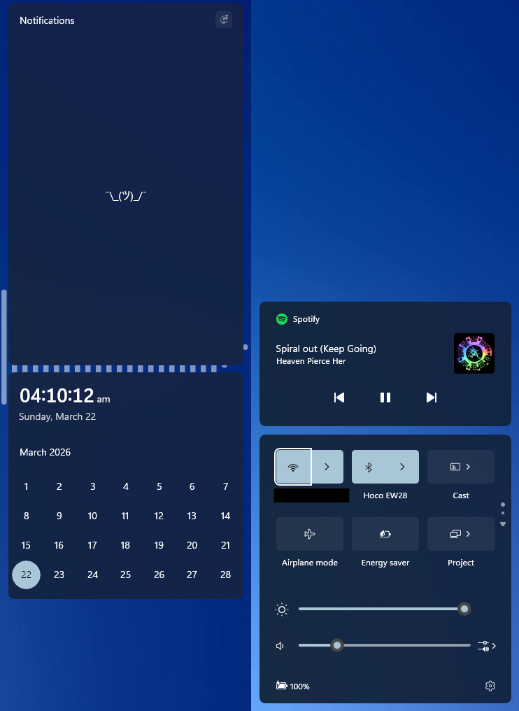

# Borderless theme for Windows 11 Notification Center Styler

Removes all borders and drop shadows from notification center, quick settings and taskbar jump lists as well (thus the name), with the added bonus of a top-aligned notification center, so it fits dock layouts. Also, desktop toasts are resized to 348 for consistency with the notification center toasts.

**Author**: [Ali Cool](https://github.com/AliCool412)


<!--
## Theme selection

The theme is integrated into the mod and can be selected directly from the mod's
settings:

* Open the Windows 11 Notification Center Styler mod in Windhawk.
* Go to the "Settings" tab.
* Select the theme and save the settings.

## Manual installation

The theme styles can also be imported manually. To do that, follow these steps:
-->
## Manual installation

The theme styles can be imported manually. To do that, follow these steps:

* Open the Windows 11 Notification Center Styler mod in Windhawk.
* Go to the "Advanced" tab.
* Copy the content below to the text box under "Mod settings" and click "Save".

<details>
<summary>Content to import (click to expand)</summary>

```json
{
"controlStyles[0].target":"ActionCenter.FocusSessionControl",
  "controlStyles[0].styles[0]":"Visibility=Collapsed",
"controlStyles[1].target":"Windows.UI.Xaml.Controls.Grid",
  "controlStyles[1].styles[0]":"Shadow:=",
  "controlStyles[1].styles[1]":"BorderThickness=0",
"controlStyles[2].target":"Windows.UI.Xaml.Controls.Border",
  "controlStyles[2].styles[0]":"Shadow:=",
  "controlStyles[2].styles[1]":"BorderThickness=0",
"controlStyles[3].target":"Windows.UI.Xaml.Controls.Grid#NotificationCenterGrid",
  "controlStyles[3].styles[0]":"Height=Auto",
  "controlStyles[3].styles[1]":"VerticalAlignment=Stretch",
  "controlStyles[3].styles[2]":"Margin=0",
"controlStyles[4].target":"Windows.UI.Xaml.Controls.TextBlock#NoNotificationsTextBlock",
  "controlStyles[4].styles[0]":"Text=¯\\_(ツ)_/¯",
  "controlStyles[4].styles[1]":"FontSize=16",
"controlStyles[5].target":"Windows.UI.Xaml.Controls.Button#ExpandCollapseButton",
  "controlStyles[5].styles[0]":"BorderThickness=0",
"controlStyles[6].target":"Windows.UI.Xaml.Controls.Grid#DoNotDisturbSubtext > Windows.UI.Xaml.Controls.Button",
  "controlStyles[6].styles[0]":"Visibility=Collapsed",
"controlStyles[7].target":"Windows.UI.Xaml.Controls.Button#ClearAll > Windows.UI.Xaml.Controls.ContentPresenter#ContentPresenter > Windows.UI.Xaml.Controls.TextBlock",
  "controlStyles[7].styles[0]":"Text=",
  "controlStyles[7].styles[1]":"FontFamily=Segoe Fluent Icons",
  "controlStyles[7].styles[2]":"FontSize=8",
"controlStyles[8].target":"Windows.UI.Xaml.Controls.TextBlock",
  "controlStyles[8].styles[0]":"FontWeight=Normal",
"controlStyles[9].target":"Windows.UI.Xaml.Controls.Grid#CalendarSection",
  "controlStyles[9].styles[0]":"Height=300",
"controlStyles[10].target":"Windows.UI.Xaml.Controls.Button#PreviousButton",
  "controlStyles[10].styles[0]":"Visibility=Collapsed",
"controlStyles[11].target":"Windows.UI.Xaml.Controls.Button#NextButton",
  "controlStyles[11].styles[0]":"Visibility=Collapsed",
"controlStyles[12].target":"Windows.UI.Xaml.Controls.Button#HeaderButton",
  "controlStyles[12].styles[0]":"Width=Auto",
  "controlStyles[12].styles[1]":"HorizontalAlignment=Left",
"controlStyles[13].target":"Windows.UI.Xaml.Controls.Grid#WeekDayNames",
  "controlStyles[13].styles[0]":"Visibility=Collapsed",
"controlStyles[14].target":"Windows.UI.Xaml.Controls.ContentPresenter#ContentPresenter",
  "controlStyles[14].styles[0]":"BorderThickness=0",
"controlStyles[15].target":"Windows.UI.Xaml.Controls.Button#ExpandCollapseButton",
  "controlStyles[15].styles[0]":"Visibility=Collapsed",
"controlStyles[16].target":"Grid#CalendarCenterGrid",
  "controlStyles[16].styles[0]":"Margin=0,10,0,160",
"controlStyles[17].target":"Windows.UI.Xaml.Controls.Button#ClearAll",
  "controlStyles[17].styles[0]":"Width=24",
  "controlStyles[17].styles[1]":"Height=24",
"controlStyles[18].target":"Windows.UI.Xaml.Controls.Primitives.ToggleButton#DoNotDisturbButton",
  "controlStyles[18].styles[0]":"Height=24",
  "controlStyles[18].styles[1]":"Width=24",
"controlStyles[19].target":"Microsoft.UI.Xaml.Controls.AnimatedIcon#DoNotDisturbButtonIcon",
  "controlStyles[19].styles[0]":"Height=12",
  "controlStyles[19].styles[1]":"Width=12",
"controlStyles[20].target":"Windows.UI.Xaml.Controls.Border#CalendarHeaderMinimizedOverlay",
  "controlStyles[20].styles[0]":"Visibility=Collapsed",
"controlStyles[21].target":"ActionCenter.NotificationCenterView#NotificationCenterView",
  "controlStyles[21].styles[0]":"Margin=16,0,16,20",
"controlStyles[22].target":"Windows.UI.Xaml.Controls.Grid#L1Grid > Windows.UI.Xaml.Controls.Border",
  "controlStyles[22].styles[0]":"Visibility=Collapsed",
"controlStyles[23].target":"Windows.UI.Xaml.Controls.Grid#MediaTransportControlsRoot",
  "controlStyles[23].styles[0]":"Background:=",
"controlStyles[24].target":"Windows.UI.Xaml.Controls.ScrollViewer#CalendarControlScrollViewer",
  "controlStyles[24].styles[0]":"Background:=",
"controlStyles[25].target":"ContentPresenter#PageContent > Grid > Border",
  "controlStyles[25].styles[0]":"Background:=",
"controlStyles[26].target":"ContentPresenter#PageHeader",
  "controlStyles[26].styles[0]":"Background:=",
"controlStyles[27].target":"Windows.UI.Xaml.Controls.Grid#ToastCenterMainGrid",
  "controlStyles[27].styles[0]":"MaxWidth=348",
"controlStyles[28].target":"ScrollViewer#ListContent",
  "controlStyles[28].styles[0]":"Background:=",
"controlStyles[29].target":"Windows.UI.Xaml.Controls.StackPanel#SharePickerHeader > Windows.UI.Xaml.Shapes.Rectangle",
  "controlStyles[29].styles[0]":"Visibility=Collapsed",
"controlStyles[30].target":"Windows.UI.Xaml.Controls.StackPanel#PreviewComponentPanel",
  "controlStyles[30].styles[0]":"Background:=",
"controlStyles[31].target":"Windows.UI.Xaml.Controls.Border#ItemOpaquePlating",
  "controlStyles[31].styles[0]":"Opacity=0.7",
"controlStyles[32].target":"ActionCenter.ToastCenterView",
  "controlStyles[32].styles[0]":"MaxWidth=348"
}
```
</details>
