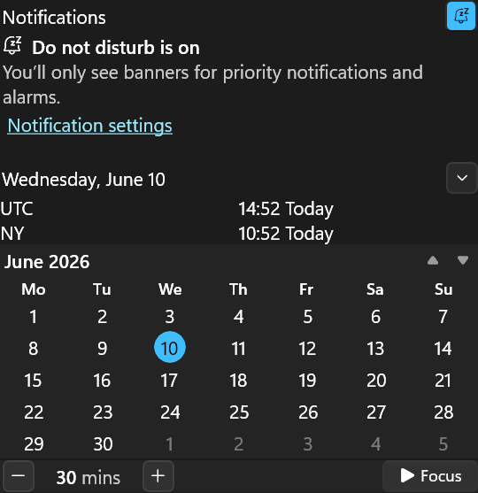
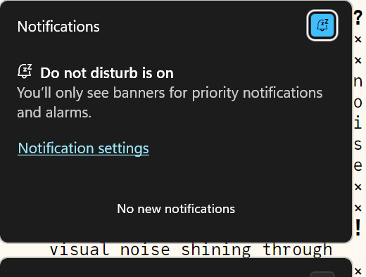
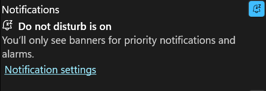
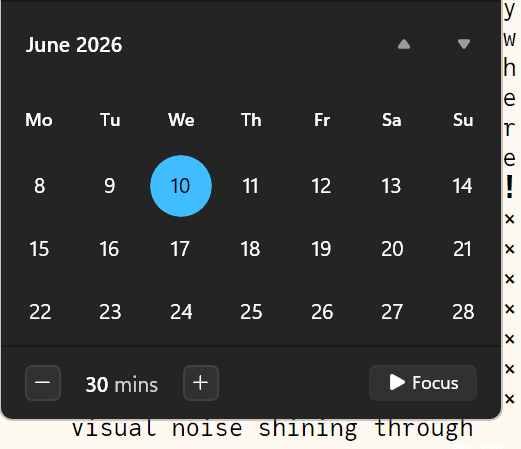
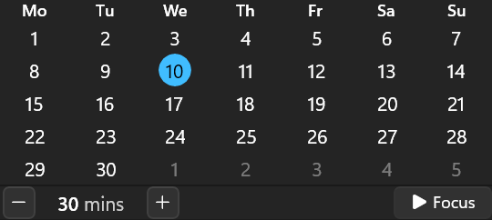

# Dense theme for Windows 11 Notification Center Styler

**Author**: [es](https://github.com/eugenesvk)



## Notes

A dense theme eliminating some of the excessive/useless Notification UI elements:
  - Removed a lot of extra whitespace and gaps: Notifications
    - Before: 
    - After: \
      (also: no "No new notifications", emptiness is a better indicator of nothingness)
  - Removed a lot of extra whitespace and gaps: Calendar
    - Before: 
    - After: 

  - Removes many gaps/borders etc. from notification center
  - Right→most buttons (focus/do not disturb/collapse) follow the "Rule of the ∞ edges": can be clicked by moving the mouse pointer all the way to the rightmost screen border, no need to be horizontally precise

### Suggested additional mods and settings

  - Use [Taskbar Styler](https://windhawk.net/mods/windows-11-taskbar-styler) to achieve a similarly dense effect in your taskbar with [BottomDensy](https://github.com/ramensoftware/windows-11-taskbar-styling-guide/tree/main/Themes/BottomDensy) theme (and its [extras](https://github.com/ramensoftware/windows-11-taskbar-styling-guide/tree/main/Themes/BottomDensy#suggested-additional-mods-and-settings)):

  - Use [Settings Styler](https://windhawk.net/mods/windows-11-settings-styler) to achieve a similarly dense effect in your Settings app  with [Densy](https://github.com/ramensoftware/windows-11-settings-styling-guide/blob/main/Themes/Densy/README.md) theme:


### Known issues

  - "Quick settings" windows isn't restyled

## Theme selection

The theme is integrated into the mod and can be selected directly from the mod's settings:

  - Open the Windows 11 Notification Center Styler mod in Windhawk
  - Go to the "Settings" tab
  - Select the theme and save the settings

## Manual installation

The theme styles can also be imported manually. To do that, follow these steps:

  - Open the Windows 11 Notification Center Styler mod in Windhawk
  - Go to the "Settings" tab and select "Textual mode"
  - Copy the content below to the text box and click "Save settings"

<details>
<summary>Content to import (click to expand)</summary>

```yaml
# declare var: key = value
# use     var: key:=$value
# Margin=←,↑,→,↓
styleConstants:
  - hd_Height=24
  - Section_Margin=0,1,0,1 #2,1,1,2
  - Header_Margin=1,0,1,0
  - thumbnailImageSize=100
controlStyles:
  # Main window
  # Remove gaps
  - target: ScrollViewer > ScrollContentPresenter > Border > Frame > ContentPresenter > ActionCenter.NotificationCenterPage > Grid#RootGrid
    styles:
      - Margin=0,0,0,0
  - target: ScrollViewer > ScrollContentPresenter > Border > Frame > ContentPresenter > ActionCenter.NotificationCenterPage > Grid#RootGrid > Grid#RootContent > Grid#NotificationCenterGrid
    styles:
      - Margin=0,0,0,0
      - BorderThickness=0,0,0,0
      - CornerRadius=0
  - target: ScrollViewer > ScrollContentPresenter > Border > Frame > ContentPresenter > ActionCenter.NotificationCenterPage > Grid#RootGrid > Grid#RootContent > Grid#CalendarCenterGrid
    styles:
      - Margin=0,0,0,0
      - BorderThickness=0,0,0,0
      - CornerRadius=0
  # Notifications
  - target: ScrollViewer > ScrollContentPresenter > Border > Frame > ContentPresenter > ActionCenter.NotificationCenterPage > Grid#RootGrid > Grid#RootContent > Grid#NotificationCenterGrid
    styles: # panel height
      - MinHeight=120 #≝?232
  - target: ScrollViewer > ScrollContentPresenter > Border > Frame > ContentPresenter > ActionCenter.NotificationCenterPage > Grid#RootGrid > Grid#RootContent > Grid#NotificationCenterGrid > Grid#DoNotDisturbSubtext
    styles:
      - MinHeight=80 #≝?240
  - target: ScrollViewer > ScrollContentPresenter > Border > Frame > ContentPresenter > ActionCenter.NotificationCenterPage > Grid#RootGrid > Grid#RootContent > Grid#NotificationCenterGrid > Grid#DoNotDisturbSubtext
    styles: # do not disturb message info
      - Padding=2,0,0,0 #≝16,10,16,10
  - target: ScrollViewer > ScrollContentPresenter > Border > Frame > ContentPresenter > ActionCenter.NotificationCenterPage > Grid#RootGrid > Grid#RootContent > Grid#NotificationCenterGrid > Grid#DoNotDisturbSubtext > Button
    styles: # do not disturb message info link
      - Padding=2,0,0,0 #≝7,2,7,2
      - Margin=0,0,0,0 #≝?-8,12,4,0
      - VerticalAlignment=0 #≝?3 remove huge gap between text and link
  - target: ScrollViewer > ScrollContentPresenter > Border > Frame > ContentPresenter > ActionCenter.NotificationCenterPage > Grid#RootGrid > Grid#RootContent > Grid#NotificationCenterGrid > ActionCenter.NotificationCenterView#NotificationCenterView
    styles:
      - Margin:=$Section_Margin
      - BorderBrush=Gray
  - target: ScrollViewer > ScrollContentPresenter > Border > Frame > ContentPresenter > ActionCenter.NotificationCenterPage > Grid#RootGrid > Grid#RootContent > Grid#NotificationCenterGrid > ActionCenter.NotificationCenterView#NotificationCenterView > Grid#MainGrid > ActionCenter.NotificationListView#MainListView > Border > ScrollViewer#ScrollViewer > Border#Root > Grid > ScrollContentPresenter#ScrollContentPresenter > ItemsPresenter > ItemsStackPanel > ActionCenter.NotificationListViewItem > Windows.UI.Xaml.Controls.Primitives.ListViewItemPresenter > ActionCenter.FlexibleItemView > Grid#MainGrid > Grid#ItemGrid > Grid > Border#ItemOpaquePlating
    styles:
      - Margin=0,0,0,0 #≝4,2,4,2
  - target: ScrollViewer > ScrollContentPresenter > Border > Frame > ContentPresenter > ActionCenter.NotificationCenterPage > Grid#RootGrid > Grid#RootContent > Grid#NotificationCenterGrid > Grid#NotificationCenterTopBanner > ActionCenter.ClearAllButton#ClearAllButtonControl > Button#ClearAll > ContentPresenter#ContentPresenter
    styles:
      - Paddign=0,0,0,0 #≝-16,0,0,-16
  - target: ScrollViewer > ScrollContentPresenter > Border > Frame > ContentPresenter > ActionCenter.NotificationCenterPage > Grid#RootGrid > Grid#RootContent > Grid#NotificationCenterGrid > ActionCenter.NotificationCenterView#NotificationCenterView > Grid#MainGrid > ActionCenter.NotificationListView#MainListView
    styles:
      - Margin=0,0,0,0 #≝-16,0,0,-16
  - target: ScrollViewer > ScrollContentPresenter > Border > Frame > ContentPresenter > ActionCenter.NotificationCenterPage > Grid#RootGrid > Grid#RootContent > Grid#NotificationCenterGrid > Grid#NotificationCenterTopBanner
    styles:
      - Padding=1,0,1,0
      - MinHeight:=$hd_Height
  - target: ScrollViewer > ScrollContentPresenter > Border > Frame > ContentPresenter > ActionCenter.NotificationCenterPage > Grid#RootGrid > Grid#RootContent > Grid#NotificationCenterGrid > ActionCenter.NotificationCenterView#NotificationCenterView > Grid#MainGrid > ActionCenter.NotificationListView#MainListView > Border > ScrollViewer#ScrollViewer > Border#Root > Grid > Grid > Windows.UI.Xaml.Controls.Primitives.ScrollBar#VerticalScrollBar
    styles:
      - Visibility=1 # hide the scrollbar, previously hidden by negative margins
  - target: ScrollViewer > ScrollContentPresenter > Border > Frame > ContentPresenter > ActionCenter.NotificationCenterPage > Grid#RootGrid > Grid#RootContent > Grid#NotificationCenterGrid > ActionCenter.NotificationCenterView#NotificationCenterView > Grid#MainGrid > ActionCenter.NotificationListView#MainListView > ItemsStackPanel > ActionCenter.NotificationListViewItem > Windows.UI.Xaml.Controls.Primitives.ListViewItemPresenter > ActionCenter.FlexibleItemView > Grid#MainGrid > Grid#ItemGrid > Grid > Border#ItemOpaquePlating
    styles:
      - Margin=0,0,0,0 #≝4,2,4,2
      - BorderThickness=0,0,0,1 #≝1,1,1,1
  # Title
  - target: ScrollViewer > ScrollContentPresenter > Border > Frame > ContentPresenter > ActionCenter.NotificationCenterPage > Grid#RootGrid > Grid#RootContent > Grid#NotificationCenterGrid > ActionCenter.NotificationCenterView#NotificationCenterView > Grid#MainGrid > ActionCenter.NotificationListView#MainListView > Border > ScrollViewer#ScrollViewer > Border#Root > Grid > ScrollContentPresenter#ScrollContentPresenter > ItemsPresenter > ItemsStackPanel > ActionCenter.NotificationListViewItem > Windows.UI.Xaml.Controls.Primitives.ListViewItemPresenter > ActionCenter.FlexibleItemView > Grid#MainGrid > Grid#ItemGrid > ActionCenter.NotificationContentView#NotificationContentView > Grid#ContentGrid > Grid#TitleGrid
    styles:
      - Margin=0,0,0,0 #≝?4,0,0,0
      - Height=20 #≝?
  - target: ScrollViewer > ScrollContentPresenter > Border > Frame > ContentPresenter > ActionCenter.NotificationCenterPage > Grid#RootGrid > Grid#RootContent > Grid#NotificationCenterGrid > ActionCenter.NotificationCenterView#NotificationCenterView > Grid#MainGrid > ActionCenter.NotificationListView#MainListView > ItemsStackPanel > ActionCenter.NotificationListViewHeaderItem
    styles:
      - MinHeight=22 #≝30
      - Height=22 #≝Auto
  - target: ScrollViewer > ScrollContentPresenter > Border > Frame > ContentPresenter > ActionCenter.NotificationCenterPage > Grid#RootGrid > Grid#RootContent > Grid#NotificationCenterGrid > ActionCenter.NotificationCenterView#NotificationCenterView > Grid#MainGrid > ActionCenter.NotificationListView#MainListView > Border > ScrollViewer#ScrollViewer > Border#Root > Grid > ScrollContentPresenter#ScrollContentPresenter > ItemsPresenter > ItemsStackPanel > ActionCenter.NotificationListViewItem > Windows.UI.Xaml.Controls.Primitives.ListViewItemPresenter > ActionCenter.FlexibleItemView > Grid#MainGrid > Grid#ItemGrid > ActionCenter.NotificationContentView#NotificationContentView > Grid#ContentGrid > Grid#TitleGrid > ActionCenter.ExpandButtonView#ExpandButtonView > Button#ExpandButton > Grid > Border#Border > ContentPresenter#ContentPresenter > StackPanel > TextBlock#ExpandGlyph
    styles: # title button: expand more
      - Margin=4,4,0,4 #≝8,9,8,7
  - target: ScrollViewer > ScrollContentPresenter > Border > Frame > ContentPresenter > ActionCenter.NotificationCenterPage > Grid#RootGrid > Grid#RootContent > Grid#NotificationCenterGrid > ActionCenter.NotificationCenterView#NotificationCenterView > Grid#MainGrid > ActionCenter.NotificationListView#MainListView > ItemsStackPanel > ActionCenter.NotificationListViewHeaderItem > Grid#RootGrid > ContentPresenter#ContentPresenter > ActionCenter.GroupView > Grid#GroupGrid > ActionCenter.GroupTitleView#GroupTitle
    styles:
      - Margin=1,0,0,0 #≝16,0,0,0
  - target: ScrollViewer > ScrollContentPresenter > Border > Frame > ContentPresenter > ActionCenter.NotificationCenterPage > Grid#RootGrid > Grid#RootContent > Grid#NotificationCenterGrid > ActionCenter.NotificationCenterView#NotificationCenterView > Grid#MainGrid > ActionCenter.NotificationListView#MainListView > ItemsStackPanel > ActionCenter.NotificationListViewItem > Windows.UI.Xaml.Controls.Primitives.ListViewItemPresenter > ActionCenter.FlexibleItemView > Grid#MainGrid > Grid#ItemGrid > ActionCenter.NotificationContentView#NotificationContentView > Grid#ContentGrid > Grid#TitleGrid
    styles:
      - Margin=0,0,0,0 #≝4,0,0,0
  - target: ScrollViewer > ScrollContentPresenter > Border > Frame > ContentPresenter > ActionCenter.NotificationCenterPage > Grid#RootGrid > Grid#RootContent > Grid#NotificationCenterGrid > ActionCenter.NotificationCenterView#NotificationCenterView > Grid#MainGrid > ActionCenter.NotificationListView#MainListView > ItemsStackPanel > ActionCenter.NotificationListViewItem > Windows.UI.Xaml.Controls.Primitives.ListViewItemPresenter > ActionCenter.FlexibleItemView > Grid#MainGrid > Grid#ItemGrid > ActionCenter.NotificationContentView#NotificationContentView > Grid#ContentGrid > Grid#TitleGrid > ActionCenter.ExpandButtonView#ExpandButtonView
    styles:
      - Margin=0,0,0,0 #≝4,0,0,0
  - target: ScrollViewer > ScrollContentPresenter > Border > Frame > ContentPresenter > ActionCenter.NotificationCenterPage > Grid#RootGrid > Grid#RootContent > Grid#NotificationCenterGrid > ActionCenter.NotificationCenterView#NotificationCenterView > Grid#MainGrid > ActionCenter.NotificationListView#MainListView > ItemsStackPanel > ActionCenter.NotificationListViewItem > Windows.UI.Xaml.Controls.Primitives.ListViewItemPresenter > ActionCenter.FlexibleItemView > Grid#MainGrid > Grid#ItemGrid > ActionCenter.NotificationContentView#NotificationContentView > Grid#ContentGrid > Grid#TitleGrid
    styles:
      - Height=24 #≝?
  # Title buttons
  - target: ScrollViewer > ScrollContentPresenter > Border > Frame > ContentPresenter > ActionCenter.NotificationCenterPage > Grid#RootGrid > Grid#RootContent > Grid#NotificationCenterGrid > ActionCenter.NotificationCenterView#NotificationCenterView > Grid#MainGrid > ActionCenter.NotificationListView#MainListView > ItemsStackPanel > ActionCenter.NotificationListViewItem > Windows.UI.Xaml.Controls.Primitives.ListViewItemPresenter > ActionCenter.FlexibleItemView > Grid#MainGrid > Grid#ItemGrid > ActionCenter.NotificationContentView#NotificationContentView > Grid#ContentGrid > Grid#TitleGrid > Button#SettingsButton
    styles:
      - Padding=0,0,0,0 #≝?
      - Margin=0,0,0,0 #≝?0,2,0,2
      - Height=24 #≝?
  - target: ScrollViewer > ScrollContentPresenter > Border > Frame > ContentPresenter > ActionCenter.NotificationCenterPage > Grid#RootGrid > Grid#RootContent > Grid#NotificationCenterGrid > ActionCenter.NotificationCenterView#NotificationCenterView > Grid#MainGrid > ActionCenter.NotificationListView#MainListView > ItemsStackPanel > ActionCenter.NotificationListViewItem > Windows.UI.Xaml.Controls.Primitives.ListViewItemPresenter > ActionCenter.FlexibleItemView > Grid#MainGrid > Grid#ItemGrid > ActionCenter.NotificationContentView#NotificationContentView > Grid#ContentGrid > Grid#TitleGrid > Button#DismissButton
    styles:
      - Padding=0,0,0,0 #≝?
      - Margin=0,0,0,0 #≝?0,2,0,2
      - Height=24 #≝?
  # Button: more…
  - target: ItemsStackPanel > ActionCenter.NotificationListViewItem > Windows.UI.Xaml.Controls.Primitives.ListViewItemPresenter > ActionCenter.FlexibleItemView > Grid#MainGrid > Grid#ItemGrid > ActionCenter.SeeMoreLessView#SeeMoreLessViewInstance > Button#SeeMoreLessButton
    styles: #@UWP: ScrollViewer > ScrollContentPresenter > Border > Frame > ContentPresenter > ActionCenter.NotificationCenterPage > Grid#RootGrid > Grid#RootContent > Grid#NotificationCenterGrid > ActionCenter.NotificationCenterView#NotificationCenterView > Grid#MainGrid > ActionCenter.NotificationListView#MainListView > ItemsStackPanel > ActionCenter.NotificationListViewItem > Windows.UI.Xaml.Controls.Primitives.ListViewItemPresenter > ActionCenter.FlexibleItemView > Grid#MainGrid > Grid#ItemGrid > ActionCenter.SeeMoreLessView#SeeMoreLessViewInstance > Button#SeeMoreLessButton
      - Margin=1,0,0,0 #≝?0,2,0,2
  # Text
  - target: ItemsPresenter > ItemsStackPanel > ActionCenter.NotificationListViewItem > Windows.UI.Xaml.Controls.Primitives.ListViewItemPresenter > ActionCenter.FlexibleItemView > Grid#MainGrid > Grid#ItemGrid > ActionCenter.NotificationContentView#NotificationContentView > Grid#ContentGrid > StackPanel#TextContentPanel
    styles: #@UWP: ScrollViewer > ScrollContentPresenter > Border > Frame > ContentPresenter > ActionCenter.NotificationCenterPage > Grid#RootGrid > Grid#RootContent > Grid#NotificationCenterGrid > ActionCenter.NotificationCenterView#NotificationCenterView > Grid#MainGrid > ActionCenter.NotificationListView#MainListView > Border > ScrollViewer#ScrollViewer > Border#Root > Grid > ScrollContentPresenter#ScrollContentPresenter > ItemsPresenter > ItemsStackPanel > ActionCenter.NotificationListViewItem > Windows.UI.Xaml.Controls.Primitives.ListViewItemPresenter > ActionCenter.FlexibleItemView > Grid#MainGrid > Grid#ItemGrid > ActionCenter.NotificationContentView#NotificationContentView > Grid#ContentGrid > StackPanel#TextContentPanel
      - Margin=2,0,0,1 #≝16,8,16,21
  - target: ItemsStackPanel > ActionCenter.NotificationListViewItem > Windows.UI.Xaml.Controls.Primitives.ListViewItemPresenter > ActionCenter.FlexibleItemView > Grid#MainGrid > Grid#ItemGrid > ActionCenter.SeeMoreLessView#SeeMoreLessViewInstance > Button#SeeMoreLessButton > ContentPresenter#ContentPresenter
    styles: #@UWP: ScrollViewer > ScrollContentPresenter > Border > Frame > ContentPresenter > ActionCenter.NotificationCenterPage > Grid#RootGrid > Grid#RootContent > Grid#NotificationCenterGrid > ActionCenter.NotificationCenterView#NotificationCenterView > Grid#MainGrid > ActionCenter.NotificationListView#MainListView > ItemsStackPanel > ActionCenter.NotificationListViewItem > Windows.UI.Xaml.Controls.Primitives.ListViewItemPresenter > ActionCenter.FlexibleItemView > Grid#MainGrid > Grid#ItemGrid > ActionCenter.SeeMoreLessView#SeeMoreLessViewInstance > Button#SeeMoreLessButton > ContentPresenter#ContentPresenter
      - Padding=1,1,1,1 #≝?
  # Text expanded
  - target: ScrollViewer > ScrollContentPresenter > Border > Frame > ContentPresenter > ActionCenter.NotificationCenterPage > Grid#RootGrid > Grid#RootContent > Grid#NotificationCenterGrid > ActionCenter.NotificationCenterView#NotificationCenterView > Grid#MainGrid > ActionCenter.NotificationListView#MainListView > Border > ScrollViewer#ScrollViewer > Border#Root > Grid > ScrollContentPresenter#ScrollContentPresenter > ItemsPresenter > ItemsStackPanel > ActionCenter.NotificationListViewItem > Windows.UI.Xaml.Controls.Primitives.ListViewItemPresenter > ActionCenter.FlexibleItemView > Grid#MainGrid > Grid#ItemGrid > Grid#InteractiveGrid > ActionCenter.InteractiveView > Grid#InteractiveRootGrid > ActionCenter.RowView > Grid > StackPanel#VerbPanel > ActionCenter.VerbRowView > Grid#VerbRowGrid
    styles:
      - Margin=0,0,0,1 #≝0,0,0,16
  - target: ScrollViewer > ScrollContentPresenter > Border > Frame > ContentPresenter > ActionCenter.NotificationCenterPage > Grid#RootGrid > Grid#RootContent > Grid#NotificationCenterGrid > ActionCenter.NotificationCenterView#NotificationCenterView > Grid#MainGrid > ActionCenter.NotificationListView#MainListView > Border > ScrollViewer#ScrollViewer > Border#Root > Grid > ScrollContentPresenter#ScrollContentPresenter > ItemsPresenter > ItemsStackPanel > ActionCenter.NotificationListViewItem > Windows.UI.Xaml.Controls.Primitives.ListViewItemPresenter > ActionCenter.FlexibleItemView > Grid#MainGrid > Grid#ItemGrid > Grid#InteractiveGrid
    styles:
      - Margin=0,0,0,0 #≝16,0,16,0
  # Text expanded: Verb allow/deny buttons
  - target: ScrollViewer > ScrollContentPresenter > Border > Frame > ContentPresenter > ActionCenter.NotificationCenterPage > Grid#RootGrid > Grid#RootContent > Grid#NotificationCenterGrid > ActionCenter.NotificationCenterView#NotificationCenterView > Grid#MainGrid > ActionCenter.NotificationListView#MainListView > Border > ScrollViewer#ScrollViewer > Border#Root > Grid > ScrollContentPresenter#ScrollContentPresenter > ItemsPresenter > ItemsStackPanel > ActionCenter.NotificationListViewItem > Windows.UI.Xaml.Controls.Primitives.ListViewItemPresenter > ActionCenter.FlexibleItemView > Grid#MainGrid > Grid#ItemGrid > Grid#InteractiveGrid > ActionCenter.InteractiveView > Grid#InteractiveRootGrid > ActionCenter.RowView > Grid > StackPanel#VerbPanel > ActionCenter.VerbRowView > Grid#VerbRowGrid > ActionCenter.VerbView > Grid > Button#VerbButton > ContentPresenter#ContentPresenter
    styles:
      - Height=26 #≝Auto?
      - Margin=0,0,0,0 #≝?
  # Text "no new notifications" hide
  - target: ScrollViewer > ScrollContentPresenter > Border > Frame > ContentPresenter > ActionCenter.NotificationCenterPage > Grid#RootGrid > Grid#RootContent > Grid#NotificationCenterGrid > ActionCenter.NotificationCenterView#NotificationCenterView > Grid#MainGrid > TextBlock#NoNotificationsTextBlock
    styles:
      - Visibility=1 #≝0
  # Icon
  - target: ItemsStackPanel > ActionCenter.NotificationListViewHeaderItem > Grid#RootGrid > ContentPresenter#ContentPresenter > ActionCenter.GroupView > Grid#GroupGrid > ActionCenter.GroupTitleView#GroupTitle
    #@UWP: ScrollViewer > ScrollContentPresenter > Border > Frame > ContentPresenter > ActionCenter.NotificationCenterPage > Grid#RootGrid > Grid#RootContent > Grid#NotificationCenterGrid > ActionCenter.NotificationCenterView#NotificationCenterView > Grid#MainGrid > ActionCenter.NotificationListView#MainListView > ItemsStackPanel > ActionCenter.NotificationListViewHeaderItem > Grid#RootGrid > ContentPresenter#ContentPresenter > ActionCenter.GroupView > Grid#GroupGrid > ActionCenter.GroupTitleView#GroupTitle
    styles: # Icon
      - Margin=2,2,2,2 #≝16,8,0,16
  - target: ItemsStackPanel > ActionCenter.NotificationListViewItem > Windows.UI.Xaml.Controls.Primitives.ListViewItemPresenter > ActionCenter.FlexibleItemView > Grid#MainGrid > Grid#ItemGrid > ActionCenter.NotificationContentView#NotificationContentView > Grid#ContentGrid > StackPanel#TextContentPanel
    #@UWP: ScrollViewer > ScrollContentPresenter > Border > Frame > ContentPresenter > ActionCenter.NotificationCenterPage > Grid#RootGrid > Grid#RootContent > Grid#NotificationCenterGrid > ActionCenter.NotificationCenterView#NotificationCenterView > Grid#MainGrid > ActionCenter.NotificationListView#MainListView > ItemsStackPanel > ActionCenter.NotificationListViewItem > Windows.UI.Xaml.Controls.Primitives.ListViewItemPresenter > ActionCenter.FlexibleItemView > Grid#MainGrid > Grid#ItemGrid > ActionCenter.NotificationContentView#NotificationContentView > Grid#ContentGrid > StackPanel#TextContentPanel
    styles: # Icon text
      - Margin=0,0,0,0 #≝16,8,16,21

  # Calender
  - target: ScrollViewer > ScrollContentPresenter > Border > Frame > ContentPresenter > ActionCenter.NotificationCenterPage > Grid#RootGrid > Grid#RootContent > Grid#CalendarCenterGrid > ActionCenter.ClockCalendarView#ClockCalendarView > Grid > Grid#CalendarSection
    styles:
      - Margin:=$Section_Margin #≝16,12,16,12
      - CornerRadius=0
      - BorderThickness=0,0,0,0
  - target: ScrollViewer > ScrollContentPresenter > Border > Frame > ContentPresenter > ActionCenter.NotificationCenterPage > Grid#RootGrid > Grid#RootContent > Grid#CalendarCenterGrid > ActionCenter.ClockCalendarView#ClockCalendarView > Grid > Grid#CalendarSection > Border#CalendarHeaderMinimizedOverlay
    styles:
      - Margin=0,0,0,0 #≝?-16,-12,-12,-16
  - target: ScrollViewer > ScrollContentPresenter > Border > Frame > ContentPresenter > ActionCenter.NotificationCenterPage > Grid#RootGrid > Grid#RootContent > Grid#CalendarCenterGrid > ActionCenter.ClockCalendarView#ClockCalendarView > Grid > Grid#CalendarSection > StackPanel#CalendarHeader
    styles:
      - Margin:=$Header_Margin
  - target: ScrollViewer > ScrollContentPresenter > Border > Frame > ContentPresenter > ActionCenter.NotificationCenterPage > Grid#RootGrid > Grid#RootContent > Grid#CalendarCenterGrid > ActionCenter.ClockCalendarView#ClockCalendarView > Grid > Grid#CalendarSection > Button#ExpandCollapseButton
    styles:
      - Margin=0,0,0,0 # button should activate on ∞dimensions to the right
  - target: ScrollViewer > ScrollContentPresenter > Border > Frame > ContentPresenter > ActionCenter.NotificationCenterPage > Grid#RootGrid > Grid#RootContent > Grid#CalendarCenterGrid > ActionCenter.ClockCalendarView#ClockCalendarView > Grid > Grid#CalendarSection > Grid#ClocksSection
    styles:
      - Margin=0,0,0,0 #≝0,20,0,0
  - target: ScrollViewer > ScrollContentPresenter > Border > Frame > ContentPresenter > ActionCenter.NotificationCenterPage > Grid#RootGrid > Grid#RootContent > Grid#CalendarCenterGrid > ActionCenter.ClockCalendarView#ClockCalendarView > Grid > Grid#CalendarSection > ScrollViewer#CalendarControlScrollViewer
    styles:
      - Margin=0,0,0,0 #≝-16,12,-16,-12
      - BorderThickness=0,0,0,0
  - target: ScrollViewer > ScrollContentPresenter > Border > Frame > ContentPresenter > ActionCenter.NotificationCenterPage > Grid#RootGrid > Grid#RootContent > Grid#CalendarCenterGrid > ActionCenter.ClockCalendarView#ClockCalendarView > Grid > Grid#CalendarSection > ScrollViewer#CalendarControlScrollViewer > Border#Root > Grid > ScrollContentPresenter#ScrollContentPresenter > CalendarView#CalendarControl
    styles:
      - Margin=0,0,0,0 #≝0,4,0,0
  # Calendar Header
  - target: ScrollViewer > ScrollContentPresenter > Border > Frame > ContentPresenter > ActionCenter.NotificationCenterPage > Grid#RootGrid > Grid#RootContent > Grid#CalendarCenterGrid > ActionCenter.ClockCalendarView#ClockCalendarView > Grid > Grid#CalendarSection > ScrollViewer#CalendarControlScrollViewer > Border#Root > Grid > ScrollContentPresenter#ScrollContentPresenter > CalendarView#CalendarControl > Border > Grid > Grid > Button#HeaderButton
    styles:
      - Margin=0,0,0,0 #≝?
      - Height=24
  - target: ScrollViewer > ScrollContentPresenter > Border > Frame > ContentPresenter > ActionCenter.NotificationCenterPage > Grid#RootGrid > Grid#RootContent > Grid#CalendarCenterGrid > ActionCenter.ClockCalendarView#ClockCalendarView > Grid > Grid#CalendarSection > ScrollViewer#CalendarControlScrollViewer > Border#Root > Grid > ScrollContentPresenter#ScrollContentPresenter > CalendarView#CalendarControl > Border > Grid > Grid > Button#HeaderButton > ContentPresenter#Text
    styles:
      - Height=24
      - Padding=2,0,0,0 #≝?
  - target: ScrollViewer > ScrollContentPresenter > Border > Frame > ContentPresenter > ActionCenter.NotificationCenterPage > Grid#RootGrid > Grid#RootContent > Grid#CalendarCenterGrid > ActionCenter.ClockCalendarView#ClockCalendarView > Grid > Grid#CalendarSection > ScrollViewer#CalendarControlScrollViewer > Border#Root > Grid > ScrollContentPresenter#ScrollContentPresenter > CalendarView#CalendarControl > Border > Grid > Grid > Button#PreviousButton
    styles:
      - Height=24
      - Margin=0,0,0,0 #≝3,6,3,7
      - Padding=6,6,6,6 #≝?
  - target: ScrollViewer > ScrollContentPresenter > Border > Frame > ContentPresenter > ActionCenter.NotificationCenterPage > Grid#RootGrid > Grid#RootContent > Grid#CalendarCenterGrid > ActionCenter.ClockCalendarView#ClockCalendarView > Grid > Grid#CalendarSection > ScrollViewer#CalendarControlScrollViewer > Border#Root > Grid > ScrollContentPresenter#ScrollContentPresenter > CalendarView#CalendarControl > Border > Grid > Grid > Button#NextButton
    styles:
      - Height=24
      - Margin=0,0,0,0 #≝3,6,7,7
      - Padding=6,6,6,6 #≝?
  - target: ScrollViewer > ScrollContentPresenter > Border > Frame > ContentPresenter > ActionCenter.NotificationCenterPage > Grid#RootGrid > Grid#RootContent > Grid#CalendarCenterGrid > ActionCenter.ClockCalendarView#ClockCalendarView > Grid > Grid#CalendarSection > ScrollViewer#CalendarControlScrollViewer > Border#Root > Grid > ScrollContentPresenter#ScrollContentPresenter > CalendarView#CalendarControl > Border > Grid > Border
    styles:
      - BorderThickness=0,0,0,0 #≝1,1,1,1
  # Calendar Header? Dates
  - target: ScrollViewer > ScrollContentPresenter > Border > Frame > ContentPresenter > ActionCenter.NotificationCenterPage > Grid#RootGrid > Grid#RootContent > Grid#CalendarCenterGrid > ActionCenter.ClockCalendarView#ClockCalendarView > Grid > Grid#CalendarSection > ScrollViewer#CalendarControlScrollViewer > Border#Root > Grid > ScrollContentPresenter#ScrollContentPresenter > CalendarView#CalendarControl > Border > Grid > Grid#Views > Grid#MonthView > Grid#WeekDayNames
    styles:
      - Margin=0,0,0,0 #≝2,2,2,0
      - Height=16
  - target: ScrollViewer > ScrollContentPresenter > Border > Frame > ContentPresenter > ActionCenter.NotificationCenterPage > Grid#RootGrid > Grid#RootContent > Grid#CalendarCenterGrid > ActionCenter.ClockCalendarView#ClockCalendarView > Grid > Grid#CalendarSection > ScrollViewer#CalendarControlScrollViewer > Border#Root > Grid > ScrollContentPresenter#ScrollContentPresenter > CalendarView#CalendarControl > Border > Grid > Grid#Views > Grid#MonthView > Grid#WeekDayNames > TextBlock
    styles:
      - Margin=0,0,0,0 #≝?
  # Calendar Date numbers
  - target: ScrollViewer > ScrollContentPresenter > Border > Frame > ContentPresenter > ActionCenter.NotificationCenterPage > Grid#RootGrid > Grid#RootContent > Grid#CalendarCenterGrid > ActionCenter.ClockCalendarView#ClockCalendarView > Grid > Grid#CalendarSection > ScrollViewer#CalendarControlScrollViewer > Border#Root > Grid > ScrollContentPresenter#ScrollContentPresenter > CalendarView#CalendarControl > Border > Grid > Grid#Views > Grid#MonthView > ScrollViewer#MonthViewScrollViewer
    styles:
      - ViewportHeight=120 #≝140  remove an extra row after the dates became smaller to fit in the old area
  - target: ScrollViewer > ScrollContentPresenter > Border > Frame > ContentPresenter > ActionCenter.NotificationCenterPage > Grid#RootGrid > Grid#RootContent > Grid#CalendarCenterGrid > ActionCenter.ClockCalendarView#ClockCalendarView > Grid > Grid#CalendarSection > ScrollViewer#CalendarControlScrollViewer > Border#Root > Grid > ScrollContentPresenter#ScrollContentPresenter > CalendarView#CalendarControl > Border > Grid > Grid#Views > Grid#MonthView > ScrollViewer#MonthViewScrollViewer > Grid
    styles:
      - Height=120 #≝140
  # Calendar Date numbers
  - target: ScrollViewer > ScrollContentPresenter > Border > Frame > ContentPresenter > ActionCenter.NotificationCenterPage > Grid#RootGrid > Grid#RootContent > Grid#CalendarCenterGrid > ActionCenter.ClockCalendarView#ClockCalendarView > Grid > Grid#CalendarSection > ScrollViewer#CalendarControlScrollViewer > Border#Root > Grid > ScrollContentPresenter#ScrollContentPresenter > CalendarView#CalendarControl > Border > Grid > Grid#Views > Grid#MonthView > ScrollViewer#MonthViewScrollViewer
    styles:
      - Margin=0,0,0,0 #≝?2,2,2,2
  - target: ScrollViewer > ScrollContentPresenter > Border > Frame > ContentPresenter > ActionCenter.NotificationCenterPage > Grid#RootGrid > Grid#RootContent > Grid#CalendarCenterGrid > ActionCenter.ClockCalendarView#ClockCalendarView > Grid > Grid#CalendarSection > ScrollViewer#CalendarControlScrollViewer > Border#Root > Grid > ScrollContentPresenter#ScrollContentPresenter > CalendarView#CalendarControl > Border > Grid > Grid#Views > Grid#MonthView > ScrollViewer#MonthViewScrollViewer > Grid > ScrollContentPresenter#ScrollContentPresenter > Windows.UI.Xaml.Controls.Primitives.CalendarPanel#MonthViewPanel > CalendarViewDayItem > TextBlock
    styles:
      - Padding=0,0,0,0 #≝?
      - Margin=0,0,0,0 #≝?
  - target: ScrollViewer > ScrollContentPresenter > Border > Frame > ContentPresenter > ActionCenter.NotificationCenterPage > Grid#RootGrid > Grid#RootContent > Grid#CalendarCenterGrid > ActionCenter.ClockCalendarView#ClockCalendarView > Grid > Grid#CalendarSection > ScrollViewer#CalendarControlScrollViewer > Border#Root > Grid > ScrollContentPresenter#ScrollContentPresenter > CalendarView#CalendarControl > Border > Grid > Grid#Views > Grid#MonthView > ScrollViewer#MonthViewScrollViewer > Grid > ScrollContentPresenter#ScrollContentPresenter > Windows.UI.Xaml.Controls.Primitives.CalendarPanel#MonthViewPanel > CalendarViewDayItem
    styles: # regular date
      - Padding=0,0,0,0 #≝?
      - Margin=0,0,0,0 #≝?
      - Width=24 #≝?
      - Height=24 #≝?
      - MinWidth=24 #≝?40
      - MinHeight=24 #≝?40
  - target: ScrollViewer > ScrollContentPresenter > Border > Frame > ContentPresenter > ActionCenter.NotificationCenterPage > Grid#RootGrid > Grid#RootContent > Grid#CalendarCenterGrid > ActionCenter.ClockCalendarView#ClockCalendarView > Grid > Grid#CalendarSection > ScrollViewer#CalendarControlScrollViewer > Border#Root > Grid > ScrollContentPresenter#ScrollContentPresenter > CalendarView#CalendarControl > Border > Grid > Grid#Views > Grid#MonthView > ScrollViewer#MonthViewScrollViewer > Grid > ScrollContentPresenter#ScrollContentPresenter > Windows.UI.Xaml.Controls.Primitives.CalendarPanel#MonthViewPanel > CalendarViewDayItem > Border
    styles: # active item with colored circle?
      - Width=24 #≝Auto
      - Height=24 #≝Auto
      - MinWidth=24 #≝?40
      - MinHeight=24 #≝?40
  # - target: ScrollViewer > ScrollContentPresenter > Border > Frame > ContentPresenter > ActionCenter.NotificationCenterPage > Grid#RootGrid > Grid#RootContent > Grid#CalendarCenterGrid > ActionCenter.ClockCalendarView#ClockCalendarView > Grid > Grid#CalendarSection > ScrollViewer#CalendarControlScrollViewer > Border#Root > Grid > ScrollContentPresenter#ScrollContentPresenter > CalendarView#CalendarControl > Border > Grid > Grid#Views > Grid#MonthView > ScrollViewer#MonthViewScrollViewer > Grid > ScrollContentPresenter#ScrollContentPresenter > Windows.UI.Xaml.Controls.Primitives.CalendarPanel#MonthViewPanel > CalendarViewDayItem > TextBlock
  #   styles:
  #     - FontSize=16 #≝14

  # bottom focus
  - target: ScrollViewer > ScrollContentPresenter > Border > Frame > ContentPresenter > ActionCenter.NotificationCenterPage > Grid#RootGrid > Grid#RootContent > Grid#CalendarCenterGrid > ActionCenter.ClockCalendarView#ClockCalendarView > Grid > Grid#CalendarSection > ActionCenter.FocusSessionControl#FocusSessionControl
    styles:
      - Margin=0,0,0,0 #≝-16,12,-16,-12
  - target: ScrollViewer > ScrollContentPresenter > Border > Frame > ContentPresenter > ActionCenter.NotificationCenterPage > Grid#RootGrid > Grid#RootContent > Grid#CalendarCenterGrid > ActionCenter.ClockCalendarView#ClockCalendarView > Grid > Grid#CalendarSection > ActionCenter.FocusSessionControl#FocusSessionControl > Grid#FocusGrid
    styles:
      - Padding=2,0,0,0 #≝

  - target: ScrollViewer > ScrollContentPresenter > Border > Frame > ContentPresenter > ActionCenter.NotificationCenterPage > Grid#RootGrid > Grid#RootContent > Grid#NotificationCenterGrid > ActionCenter.NotificationCenterView#NotificationCenterView > Grid#MainGrid > ActionCenter.NotificationListView#MainListView > Border > ScrollViewer#ScrollViewer > Border#Root > Grid > ScrollContentPresenter#ScrollContentPresenter > ItemsPresenter > ItemsStackPanel > ActionCenter.NotificationListViewItem > Windows.UI.Xaml.Controls.Primitives.ListViewItemPresenter > ActionCenter.FlexibleItemView > Grid#MainGrid > Grid#ItemGrid > ActionCenter.NotificationContentView#NotificationContentView > Grid#ContentGrid > Grid#ImageGrid > Windows.UI.Xaml.Shapes.Ellipse#PersonableImage
    styles:
      - Margin=2,0,0,2

  - target: //ScrollViewer > ScrollContentPresenter > Border > Frame > ContentPresenter > ActionCenter.NotificationCenterPage > Grid#RootGrid
    styles:
      - Margin=0,0,0,0
      - Padding=0,0,0,-10

  - target: ScrollViewer > ScrollContentPresenter > Border > Frame > ContentPresenter > ActionCenter.NotificationCenterPage > Grid#RootGrid > Grid#RootContent > Grid#NotificationCenterGrid > Grid#NotificationCenterTopBanner > ActionCenter.ClearAllButton#ClearAllButtonControl > Button#ClearAll > ContentPresenter#ContentPresenter
    styles:
      - BorderThickness=0,0,0,0
      - Padding=0,0,0,0
  - target: ScrollViewer > ScrollContentPresenter > Border > Frame > ContentPresenter > ActionCenter.NotificationCenterPage > Grid#RootGrid > Grid#RootContent > Grid#NotificationCenterGrid > Grid#NotificationCenterTopBanner > ActionCenter.ClearAllButton#ClearAllButtonControl
    styles:
      - Margin=0,0,-1,0 # for some reason the button doesn't touch the screen

  # Notification popup/toast
  # Type: scenario=incoming call (FlexiblePriorityToastView)
  - target: ScrollViewer > ScrollContentPresenter > Border > Frame > ContentPresenter > ActionCenter.ToastCenterPage > Grid#ToastCenterMainGrid > ActionCenter.ToastCenterView#ToastCenterView > ScrollViewer#ToastCenterScrollViewer > Border#Root > Grid > ScrollContentPresenter#ScrollContentPresenter > Grid#ToastCenterGrid
    styles:
      - Margin=0,0,0,0 #≝?
      - Padding=0,0,0,0 #≝16,0,16,0
  - target: ScrollViewer > ScrollContentPresenter > Border > Frame > ContentPresenter > ActionCenter.ToastCenterPage > Grid#ToastCenterMainGrid > ActionCenter.ToastCenterView#ToastCenterView > ScrollViewer#ToastCenterScrollViewer > Border#Root > Grid > ScrollContentPresenter#ScrollContentPresenter > Grid#ToastCenterGrid > ActionCenter.FlexibleToastView#FlexiblePriorityToastView > Grid#MainGrid > Grid#RevealGrid2 > Grid#ToastContentExpandedGrid > Grid#ToastGrid2
    styles:
      - Padding=2,2,0,1 #≝16,16,16,16
  - target: ScrollViewer > ScrollContentPresenter > Border > Frame > ContentPresenter > ActionCenter.ToastCenterPage > Grid#ToastCenterMainGrid > ActionCenter.ToastCenterView#ToastCenterView
    styles:
      - Padding=0,0,0,0 #≝?16,0,16,0
  - target: ScrollViewer > ScrollContentPresenter > Border > Frame > ContentPresenter > ActionCenter.ToastCenterPage > Grid#ToastCenterMainGrid > ActionCenter.ToastCenterView#ToastCenterView > ScrollViewer#ToastCenterScrollViewer > Border#Root > Grid > ScrollContentPresenter#ScrollContentPresenter > Grid#ToastCenterGrid > ActionCenter.FlexibleToastView#FlexiblePriorityToastView > Grid#MainGrid > Grid#RevealGrid2 > Border#ToastBackgroundBorder2
    styles:
      - CornerRadius=0 #≝?
      - BorderThickness=0 #≝1,1,1,1
  - target: ScrollViewer > ScrollContentPresenter > Border > Frame > ContentPresenter > ActionCenter.ToastCenterPage > Grid#ToastCenterMainGrid
    styles:
      - VerticalAlignment=2 #≝?
  - target: ScrollViewer > ScrollContentPresenter > Border > Frame > ContentPresenter > ActionCenter.ToastCenterPage > Grid#ToastCenterMainGrid > ActionCenter.ToastCenterView#ToastCenterView > ScrollViewer#ToastCenterScrollViewer > Border#Root > Grid > ScrollContentPresenter#ScrollContentPresenter
    styles: # TODO: how to remove the gap at the bottom without negative margins?
      - Margin=0,0,0,-12 #≝?
  - target: ScrollViewer > ScrollContentPresenter > Border > Frame > ContentPresenter > ActionCenter.ToastCenterPage > Grid#ToastCenterMainGrid > ActionCenter.ToastCenterView#ToastCenterView > ScrollViewer#ToastCenterScrollViewer > Border#Root > Grid > ScrollContentPresenter#ScrollContentPresenter > Grid#ToastCenterGrid > ActionCenter.FlexibleToastView#FlexiblePriorityToastView > Grid#MainGrid > Grid#RevealGrid2 > Grid#ToastContentExpandedGrid > Grid#ToastGrid2 > ActionCenter.ToastContentView#ToastContentView2 > Grid#ToastContentGrid > Grid#ToastTitleBar > TextBlock#SenderName
    styles:
      - Margin=0,0,0,0 #≝8,0,0,4
  - target: ScrollViewer > ScrollContentPresenter > Border > Frame > ContentPresenter > ActionCenter.ToastCenterPage > Grid#ToastCenterMainGrid > ActionCenter.ToastCenterView#ToastCenterView > ScrollViewer#ToastCenterScrollViewer > Border#Root > Grid > ScrollContentPresenter#ScrollContentPresenter > Grid#ToastCenterGrid > ActionCenter.FlexibleToastView#FlexiblePriorityToastView > Grid#MainGrid > Grid#RevealGrid2 > Grid#ToastContentExpandedGrid > Grid#ToastGrid2 > ActionCenter.ToastContentView#ToastContentView2 > Grid#ToastContentGrid > Grid#ToastTitleBar
    styles:
      - Margin=0,0,0,1 #≝0,-4,-1,12
      - Padding=0,0,0,0 #≝?

  # Type: scenario=reminder FlexibleNormalToastView
  - target: ScrollViewer > ScrollContentPresenter > Border > Frame > ContentPresenter > ActionCenter.ToastCenterPage > Grid#ToastCenterMainGrid > ActionCenter.ToastCenterView#ToastCenterView > ScrollViewer#ToastCenterScrollViewer > Border#Root > Grid > ScrollContentPresenter#ScrollContentPresenter > Grid#ToastCenterGrid > ActionCenter.FlexibleToastView#FlexibleNormalToastView > Grid#MainGrid > Grid#RevealGrid2 > Grid#ToastContentExpandedGrid > Grid#ToastGrid2 > ActionCenter.ToastContentView#ToastContentView2 > Grid#ToastContentGrid > Grid#ToastTitleBar > TextBlock#SenderName
    styles:
      - Margin=0,0,0,1 #≝?
      - Padding=0,0,0,0 #≝?
  - target: ScrollViewer > ScrollContentPresenter > Border > Frame > ContentPresenter > ActionCenter.ToastCenterPage > Grid#ToastCenterMainGrid > ActionCenter.ToastCenterView#ToastCenterView > ScrollViewer#ToastCenterScrollViewer > Border#Root > Grid > ScrollContentPresenter#ScrollContentPresenter > Grid#ToastCenterGrid > ActionCenter.FlexibleToastView#FlexibleNormalToastView > Grid#MainGrid > Grid#RevealGrid2 > Grid#ToastContentExpandedGrid > Grid#ToastGrid2
    styles:
      - Padding=2,2,0,1 #≝?
  # copy of PriorityToastView → NormalToastView
  - target: ScrollViewer > ScrollContentPresenter > Border > Frame > ContentPresenter > ActionCenter.ToastCenterPage > Grid#ToastCenterMainGrid > ActionCenter.ToastCenterView#ToastCenterView > ScrollViewer#ToastCenterScrollViewer > Border#Root > Grid > ScrollContentPresenter#ScrollContentPresenter > Grid#ToastCenterGrid
    styles:
      - Margin=0,0,0,0 #≝?
      - Padding=0,0,0,0 #≝16,0,16,0
  - target: ScrollViewer > ScrollContentPresenter > Border > Frame > ContentPresenter > ActionCenter.ToastCenterPage > Grid#ToastCenterMainGrid > ActionCenter.ToastCenterView#ToastCenterView > ScrollViewer#ToastCenterScrollViewer > Border#Root > Grid > ScrollContentPresenter#ScrollContentPresenter > Grid#ToastCenterGrid > ActionCenter.FlexibleToastView#FlexibleNormalToastView > Grid#MainGrid > Grid#RevealGrid2 > Grid#ToastContentExpandedGrid > Grid#ToastGrid2
    styles:
      - Padding=2,2,0,1 #≝16,16,16,16
  - target: ScrollViewer > ScrollContentPresenter > Border > Frame > ContentPresenter > ActionCenter.ToastCenterPage > Grid#ToastCenterMainGrid > ActionCenter.ToastCenterView#ToastCenterView
    styles:
      - Padding=0,0,0,0 #≝?16,0,16,0
  - target: ScrollViewer > ScrollContentPresenter > Border > Frame > ContentPresenter > ActionCenter.ToastCenterPage > Grid#ToastCenterMainGrid > ActionCenter.ToastCenterView#ToastCenterView > ScrollViewer#ToastCenterScrollViewer > Border#Root > Grid > ScrollContentPresenter#ScrollContentPresenter > Grid#ToastCenterGrid > ActionCenter.FlexibleToastView#FlexibleNormalToastView > Grid#MainGrid > Grid#RevealGrid2 > Border#ToastBackgroundBorder2
    styles:
      - CornerRadius=0 #≝?
      - BorderThickness=0 #≝1,1,1,1
  - target: ScrollViewer > ScrollContentPresenter > Border > Frame > ContentPresenter > ActionCenter.ToastCenterPage > Grid#ToastCenterMainGrid
    styles:
      - VerticalAlignment=2 #≝?
  - target: ScrollViewer > ScrollContentPresenter > Border > Frame > ContentPresenter > ActionCenter.ToastCenterPage > Grid#ToastCenterMainGrid > ActionCenter.ToastCenterView#ToastCenterView > ScrollViewer#ToastCenterScrollViewer > Border#Root > Grid > ScrollContentPresenter#ScrollContentPresenter
    styles: # TODO: how to remove the gap at the bottom without negative margins?
      - Margin=0,0,0,-12 #≝?
  - target: ScrollViewer > ScrollContentPresenter > Border > Frame > ContentPresenter > ActionCenter.ToastCenterPage > Grid#ToastCenterMainGrid > ActionCenter.ToastCenterView#ToastCenterView > ScrollViewer#ToastCenterScrollViewer > Border#Root > Grid > ScrollContentPresenter#ScrollContentPresenter > Grid#ToastCenterGrid > ActionCenter.FlexibleToastView#FlexibleNormalToastView > Grid#MainGrid > Grid#RevealGrid2 > Grid#ToastContentExpandedGrid > Grid#ToastGrid2 > ActionCenter.ToastContentView#ToastContentView2 > Grid#ToastContentGrid > Grid#ToastTitleBar > TextBlock#SenderName
    styles:
      - Margin=0,0,0,0 #≝8,0,0,4
  - target: ScrollViewer > ScrollContentPresenter > Border > Frame > ContentPresenter > ActionCenter.ToastCenterPage > Grid#ToastCenterMainGrid > ActionCenter.ToastCenterView#ToastCenterView > ScrollViewer#ToastCenterScrollViewer > Border#Root > Grid > ScrollContentPresenter#ScrollContentPresenter > Grid#ToastCenterGrid > ActionCenter.FlexibleToastView#FlexibleNormalToastView > Grid#MainGrid > Grid#RevealGrid2 > Grid#ToastContentExpandedGrid > Grid#ToastGrid2 > ActionCenter.ToastContentView#ToastContentView2 > Grid#ToastContentGrid > Grid#ToastTitleBar
    styles:
      - Margin=0,0,0,1 #≝0,-4,-1,12
      - Padding=0,0,0,0 #≝?
```
</details>
