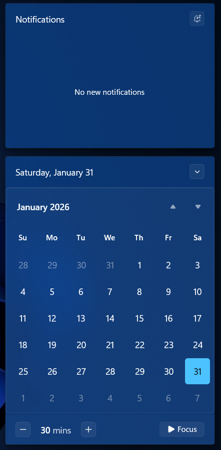
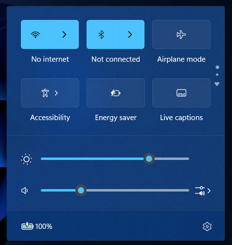

# Fluid theme for Windows 11 Notification Center Styler

**Author**: [The Back Room](https://github.com/the-back-room)

 

<!--
## Theme selection

The theme is integrated into the mod and can simply be selected from the mod's
settings:

* Open the Windows 11 Notification Center Styler mod in Windhawk.
* Go to the "Settings" tab.
* Select the theme and save the settings.
-->

## Manual installation

<!-- The theme styles can also be imported manually. To do that, follow these steps: -->

* Open the Windows 11 Notification Center Styler mod in Windhawk.
* Go to the "Advanced" tab.
* Copy the content below to the text box under "Mod settings" and click "Save".

<details>
<summary>Content to import (click to expand)</summary>

```json
{
  "theme": "",
  "controlStyles[0].target": "MenuFlyoutPresenter",
  "controlStyles[0].styles[0]": "BorderBrush:=$BorderBrush",
  "controlStyles[0].styles[1]": "BorderThickness=1",
  "controlStyles[0].styles[2]": "CornerRadius=$CornerRadius",
  "controlStyles[1].target": "ToolTip > ContentPresenter#LayoutRoot",
  "controlStyles[1].styles[0]": "BorderBrush:=$BorderBrush",
  "controlStyles[1].styles[1]": "BorderThickness=1",
  "controlStyles[1].styles[2]": "CornerRadius=$CornerRadius",
  "controlStyles[2].target": "Grid#NotificationCenterGrid",
  "controlStyles[2].styles[0]": "BorderBrush:=$BorderBrush",
  "controlStyles[2].styles[1]": "BorderThickness=1",
  "controlStyles[2].styles[2]": "CornerRadius=$CornerRadius",
  "controlStyles[2].styles[3]": "VerticalAlignment=2",
  "controlStyles[3].target": "Grid#ControlCenterRegion",
  "controlStyles[3].styles[0]": "BorderBrush:=$BorderBrush",
  "controlStyles[3].styles[1]": "BorderThickness=1",
  "controlStyles[3].styles[2]": "CornerRadius=$CornerRadius",
  "controlStyles[4].target": "Button#ClearAll",
  "controlStyles[4].styles[0]": "AccessKey=x",
  "controlStyles[5].target": "Windows.UI.Xaml.Controls.Primitives.ToggleButton#DoNotDisturbButton",
  "controlStyles[5].styles[0]": "AccessKey=d",
  "controlStyles[6].target": "Button#ExpandCollapseButton",
  "controlStyles[6].styles[0]": "AccessKey=e",
  "controlStyles[7].target": "Border#ItemOpaquePlating",
  "controlStyles[7].styles[0]": "BorderBrush:=$BorderBrush",
  "controlStyles[7].styles[1]": "BorderThickness=$BorderThickness",
  "controlStyles[7].styles[2]": "CornerRadius=$CornerRadius",
  "controlStyles[8].target": "Border#PopupBorder",
  "controlStyles[8].styles[0]": "CornerRadius=$CornerRadius",
  "controlStyles[9].target": "Border#ToastBackgroundBorder2",
  "controlStyles[9].styles[0]": "BorderBrush:=$BorderBrush",
  "controlStyles[9].styles[1]": "BorderThickness=1",
  "controlStyles[9].styles[2]": "CornerRadius=$CornerRadius",
  "controlStyles[10].target": "Grid#CalendarCenterGrid",
  "controlStyles[10].styles[0]": "BorderBrush:=$BorderBrush",
  "controlStyles[10].styles[1]": "BorderThickness=1",
  "controlStyles[10].styles[2]": "CornerRadius=$CornerRadius",
  "controlStyles[11].target": "Border#CalendarHeaderMinimizedOverlay",
  "controlStyles[11].styles[0]": "BorderBrush:=$BorderBrush",
  "controlStyles[11].styles[1]": "BorderThickness=1",
  "controlStyles[11].styles[2]": "CornerRadius=$CornerRadius",
  "controlStyles[12].target": "ScrollViewer#CalendarControlScrollViewer",
  "controlStyles[12].styles[0]": "BorderBrush:=$BorderBrush",
  "controlStyles[12].styles[1]": "BorderThickness=$BorderThickness",
  "controlStyles[12].styles[2]": "CornerRadius=$CornerRadius",
  "controlStyles[13].target": "CalendarViewDayItem",
  "controlStyles[13].styles[0]": "CornerRadius=$CornerRadius",
  "controlStyles[14].target": "CalendarViewDayItem > Border",
  "controlStyles[14].styles[0]": "CornerRadius=$CornerRadius",
  "controlStyles[15].target": "Windows.UI.Xaml.Controls.Primitives.CalendarPanel#YearViewPanel > Control",
  "controlStyles[15].styles[0]": "CornerRadius=$CornerRadius",
  "controlStyles[16].target": "Windows.UI.Xaml.Controls.Primitives.CalendarPanel#YearViewPanel > Control > Border",
  "controlStyles[16].styles[0]": "CornerRadius=$CornerRadius",
  "controlStyles[17].target": "Windows.UI.Xaml.Controls.Primitives.CalendarPanel#DecadeViewPanel > Control",
  "controlStyles[17].styles[0]": "CornerRadius=$CornerRadius",
  "controlStyles[18].target": "Windows.UI.Xaml.Controls.Primitives.CalendarPanel#DecadeViewPanel > Control > Border",
  "controlStyles[18].styles[0]": "CornerRadius=$CornerRadius",
  "controlStyles[19].target": "Grid > Microsoft.UI.Xaml.Controls.AnimatedIcon",
  "controlStyles[19].styles[0]": "BorderBrush:=$BorderBrush",
  "controlStyles[19].styles[1]": "BorderThickness=$BorderThickness",
  "controlStyles[19].styles[2]": "CornerRadius=$CornerRadius",
  "controlStyles[20].target": "ContentPresenter > Grid#FullScreenPageRoot",
  "controlStyles[20].styles[0]": "BorderBrush:=$BorderBrush",
  "controlStyles[20].styles[1]": "BorderThickness=1",
  "controlStyles[20].styles[2]": "CornerRadius=$CornerRadius",
  "controlStyles[21].target": "ContentPresenter#PageContent > Grid > Border",
  "controlStyles[21].styles[0]": "BorderBrush:=$BorderBrush",
  "controlStyles[21].styles[1]": "BorderThickness=1",
  "controlStyles[21].styles[2]": "CornerRadius=$CornerRadius",
  "controlStyles[22].target": "Grid > ScrollViewer#ListContent",
  "controlStyles[22].styles[0]": "BorderBrush:=$BorderBrush",
  "controlStyles[22].styles[1]": "BorderThickness=1",
  "controlStyles[22].styles[2]": "CornerRadius=$CornerRadius",
  "controlStyles[23].target": "Grid#MediaTransportControlsRoot",
  "controlStyles[23].styles[0]": "BorderBrush:=$BorderBrush",
  "controlStyles[23].styles[1]": "BorderThickness=1",
  "controlStyles[23].styles[2]": "CornerRadius=$CornerRadius",
  "controlStyles[24].target": "Grid#MediaTransportControlsRegion",
  "controlStyles[24].styles[0]": "BorderBrush:=$BorderBrush",
  "controlStyles[24].styles[1]": "BorderThickness=1",
  "controlStyles[24].styles[2]": "CornerRadius=$CornerRadius",
  "controlStyles[25].target": "Border#JumpListRestyledAcrylic",
  "controlStyles[25].styles[0]": "BorderBrush:=$BorderBrush",
  "controlStyles[25].styles[1]": "BorderThickness=1",
  "controlStyles[25].styles[2]": "CornerRadius=$CornerRadius",
  "styleConstants[0]": "BorderBrush=<LinearGradientBrush x:Key=\"ShellTaskbarItemGradientStrokeColorSecondaryBrush\" MappingMode=\"Absolute\" StartPoint=\"0,0\" EndPoint=\"0,3\"><LinearGradientBrush.GradientStops><GradientStop Offset=\"0.33\" Color=\"#1AFFFFFF\" /><GradientStop Offset=\"1\" Color=\"#0FFFFFFF\" /></LinearGradientBrush.GradientStops></LinearGradientBrush>",
  "styleConstants[1]": "BorderThickness=2",
  "styleConstants[2]": "CornerRadius=4",
  "resourceVariables[0].variableKey": "",
  "resourceVariables[0].value": ""
}
```
</details>
