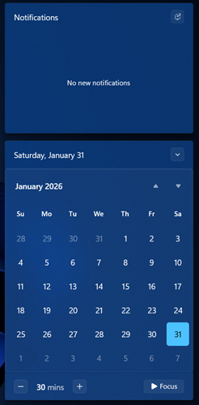
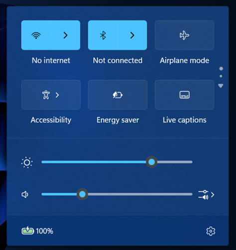

# Fluid theme for Windows 11 Notification Center Styler

A notification center theme designed to match [the Fluid Start Menu theme](https://github.com/ramensoftware/windows-11-start-menu-styling-guide/blob/main/Themes/Fluid/README.md) by [SandTechStuff](https://github.com/SandTechStuff).

**Author**: [PhantomNimbi](https://github.com/PhantomNimbi)

 

## Theme selection

The theme is integrated into the mod and can be selected directly from the mod's
settings:

* Open the Windows 11 Notification Center Styler mod in Windhawk.
* Go to the "Settings" tab.
* Select the theme and save the settings.

## Manual installation

The theme styles can also be imported manually. To do that, follow these steps:

* Open the Windows 11 Notification Center Styler mod in Windhawk.
* Go to the "Advanced" tab.
* Copy the content below to the text box under "Mod settings" and click "Save".

<details>
<summary>Content to import (click to expand)</summary>

```yaml
styleConstants:
  - BorderBrush=<LinearGradientBrush x:Key="ShellTaskbarItemGradientStrokeColorSecondaryBrush" MappingMode="Absolute" StartPoint="0,0" EndPoint="0,3"><LinearGradientBrush.GradientStops><GradientStop Offset="0.33" Color="{ThemeResource ControlFillColorSecondary}" /><GradientStop Offset="1" Color="{ThemeResource ControlFillColorTertiary}" /></LinearGradientBrush.GradientStops></LinearGradientBrush>
  - BorderThickness=1
  - CornerRadius=4
controlStyles:
  - target: MenuFlyoutPresenter
    styles:
      - BorderBrush:=$BorderBrush
      - BorderThickness=1
      - CornerRadius=$CornerRadius
  - target: ToolTip > ContentPresenter#LayoutRoot
    styles:
      - BorderBrush:=$BorderBrush
      - BorderThickness=1
      - CornerRadius=$CornerRadius
  - target: Grid#NotificationCenterGrid
    styles:
      - BorderBrush:=$BorderBrush
      - BorderThickness=1
      - CornerRadius=$CornerRadius
      - VerticalAlignment=2
  - target: Grid#ControlCenterRegion
    styles:
      - BorderBrush:=$BorderBrush
      - BorderThickness=1
      - CornerRadius=$CornerRadius
  - target: Button#ClearAll
    styles:
      - AccessKey=x
  - target: Windows.UI.Xaml.Controls.Primitives.ToggleButton#DoNotDisturbButton
    styles:
      - AccessKey=d
  - target: Button#ExpandCollapseButton
    styles:
      - AccessKey=e
  - target: Border#ItemOpaquePlating
    styles:
      - BorderBrush:=$BorderBrush
      - BorderThickness=$BorderThickness
      - CornerRadius=$CornerRadius
  - target: Border#PopupBorder
    styles:
      - CornerRadius=$CornerRadius
  - target: Border#ToastBackgroundBorder2
    styles:
      - BorderBrush:=$BorderBrush
      - BorderThickness=1
      - CornerRadius=$CornerRadius
  - target: Grid#CalendarCenterGrid
    styles:
      - BorderBrush:=$BorderBrush
      - BorderThickness=1
      - CornerRadius=$CornerRadius
  - target: Border#CalendarHeaderMinimizedOverlay
    styles:
      - BorderBrush:=$BorderBrush
      - BorderThickness=1
      - CornerRadius=$CornerRadius
  - target: ScrollViewer#CalendarControlScrollViewer
    styles:
      - BorderBrush:=$BorderBrush
      - BorderThickness=$BorderThickness
      - CornerRadius=$CornerRadius
  - target: CalendarViewDayItem
    styles:
      - CornerRadius=$CornerRadius
  - target: CalendarViewDayItem > Border
    styles:
      - CornerRadius=$CornerRadius
  - target: Windows.UI.Xaml.Controls.Primitives.CalendarPanel#YearViewPanel > Control
    styles:
      - CornerRadius=$CornerRadius
  - target: Windows.UI.Xaml.Controls.Primitives.CalendarPanel#YearViewPanel > Control > Border
    styles:
      - CornerRadius=$CornerRadius
  - target: Windows.UI.Xaml.Controls.Primitives.CalendarPanel#DecadeViewPanel > Control
    styles:
      - CornerRadius=$CornerRadius
  - target: Windows.UI.Xaml.Controls.Primitives.CalendarPanel#DecadeViewPanel > Control > Border
    styles:
      - CornerRadius=$CornerRadius
  - target: Grid > Microsoft.UI.Xaml.Controls.AnimatedIcon
    styles:
      - BorderBrush:=$BorderBrush
      - BorderThickness=$BorderThickness
      - CornerRadius=$CornerRadius
  - target: ContentPresenter > Grid#FullScreenPageRoot
    styles:
      - BorderBrush:=$BorderBrush
      - BorderThickness=1
      - CornerRadius=$CornerRadius
  - target: ContentPresenter#PageContent > Grid > Border
    styles:
      - BorderBrush:=$BorderBrush
      - BorderThickness=1
      - CornerRadius=$CornerRadius
  - target: Grid > ScrollViewer#ListContent
    styles:
      - BorderBrush:=$BorderBrush
      - BorderThickness=1
      - CornerRadius=$CornerRadius
  - target: Grid#MediaTransportControlsRoot
    styles:
      - BorderBrush:=$BorderBrush
      - BorderThickness=1
      - CornerRadius=$CornerRadius
  - target: Grid#MediaTransportControlsRegion
    styles:
      - BorderBrush:=$BorderBrush
      - BorderThickness=1
      - CornerRadius=$CornerRadius
  - target: Border#JumpListRestyledAcrylic
    styles:
      - BorderBrush:=$BorderBrush
      - BorderThickness=1
      - CornerRadius=$CornerRadius
```
</details>
