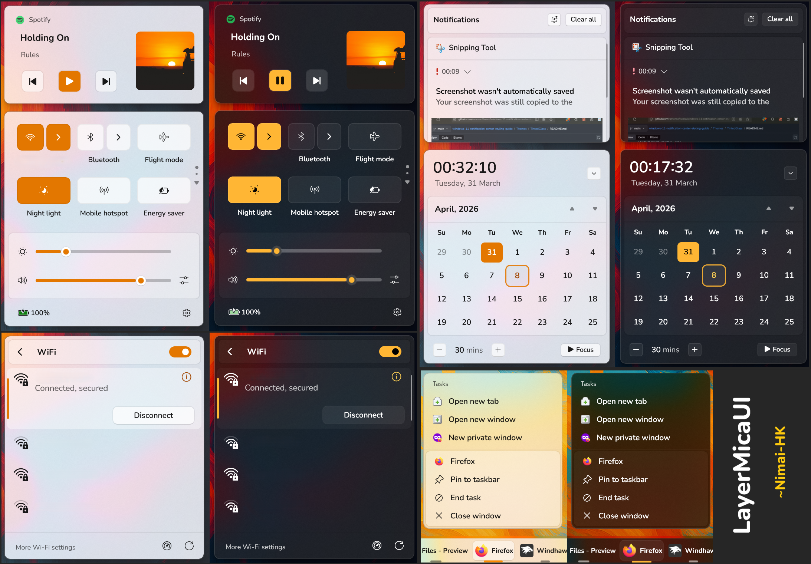
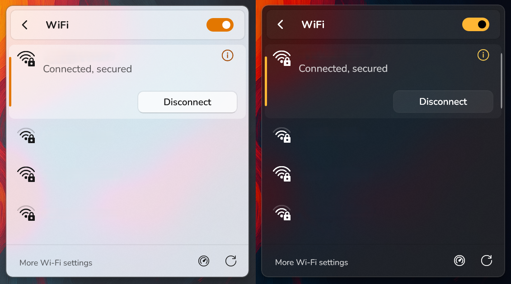
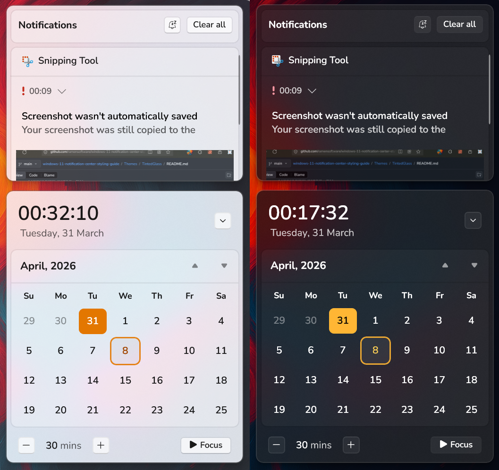
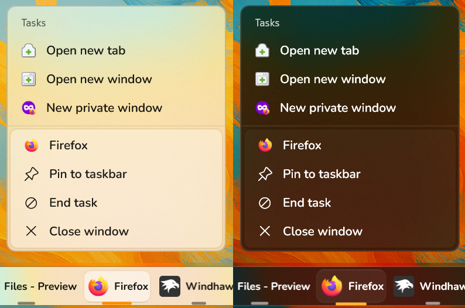
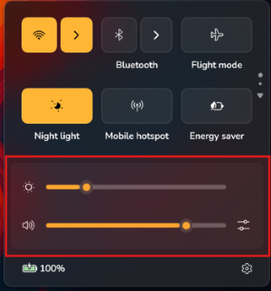

# LayerMicaUI theme for Windows 11 Notification Center Styler

**Author**: [Nimai-HK](https://github.com/Nimai-HK)



<table style="width:100%;">
  <tr>
    <td style="height:100%; text-align:center;"></td>
    <td style="height:20%; text-align:center;"></td>
    <td style="height:100%; text-align:center;"></td>
    <td style="height:100%; text-align:center;"></td>
    <td style="height:100%; text-align:center;"></td>
  </tr>
</table>

## Notes
- Optimized for Windows 11 **25H2**.
- Fully compatible with both light and dark modes.
- Recommended to enable "Show time in notification center" setting.

---

## Additional customization
<details>
  <summary>Font Customization (Click to expand)</summary>

- Font to be installed: [Nunito](https://fonts.google.com/specimen/Nunito)
- Add these items to the "Style constants" section of the settings page of the Windows 11 Notification Center Styler mod.

  ```
  ThFntWt=Semibold
  ThHdnWt=Bold
  ```
</details>

<details>
  <summary>Control Center Island Layer Size (Click to expand)</summary>

- This is the layer that is present in the control center, volume and brightness sliders region. \
  
- Some users have a different number of sliders here. To make the theme fit your current setup, choose the appropriate option.
- Add these items to the "Style constants" section of the settings page of the Windows 11 Notification Center Styler mod.
- To be added:
  ```
  ControlCenterLayer=$<Option>
  ```

- Options:
  ```
  OneSlider
  TwoSlider
  ThreeSlider
  ```

- Usage: An example is provided below:
  ```
  ControlCenterLayer=$TwoSlider
  ```

- If you want to have a custom size for the same element, example:
  ```
  ControlCenterLayer=120
  ```
</details>

## Other LayerMicaUI Themes
- [LayerMicaUI Taskbar Theme](https://github.com/ramensoftware/windows-11-taskbar-styling-guide/tree/main/Themes/LayerMicaUI)

- [LayerMicaUI Start Menu Theme](https://github.com/ramensoftware/windows-11-start-menu-styling-guide/tree/main/Themes/LayerMicaUI)

## Credits
- Thanks [Lockframe](https://github.com/Lockframe) and [OsamaHJT](https://github.com/OsamaHJT) for helping me find the targets.

## Theme selection

The theme is integrated into the mod and can be selected directly from the mod's
settings:

* Open the Windows 11 Notification Center Styler mod in Windhawk.
* Go to the "Settings" tab.
* Select the theme and save the settings.

## Manual installation

The theme styles can also be imported manually. To do that, follow these steps:

* Open the Windows 11 Notification Center Styler mod in Windhawk.
* Go to the "Settings" tab and select "Textual mode".
* Copy the content below to the text box and click "Save settings".

<details>
<summary>Content to import (click to expand)</summary>

```yaml
styleConstants:
  - ThemeLayer=<AcrylicBrush BackgroundSource="Backdrop" TintColor="{ThemeResource SystemChromeMediumColor}" TintOpacity="0.1" TintLuminosityOpacity="0.8" FallbackColor="{ThemeResource SystemChromeMediumColor}" />
  - OuterRadius=10
  - InnerRadius=8
  - ThemeBorder=<SolidColorBrush Color="{ThemeResource Border}" />
  - ThemeControlBorder=<SolidColorBrush Color="{ThemeResource ControlBorder}" />
  - ThemeOverlay=<SolidColorBrush Color="{ThemeResource Overlay}" />
  - ThFnt=Nunito
  - ThFntWt=Normal
  - ThHdnWt=Semibold
  - ThemeOutBorder=<SolidColorBrush Color="#66757575"/>
  - ThemeBtn=<SolidColorBrush Color="{ThemeResource Btn}" />
  - ControlCenterLayer=120
  - ThemeHover=<SolidColorBrush Color="{ThemeResource Hover}" />
  - OneSlider=67
  - TwoSlider=120
  - ThreeSlider=177
controlStyles:
  - target: Microsoft.UI.Xaml.Controls.AnimatedIcon#BrightnessPlayer
    styles:
      - Height=22
      - Width=22
      - //Control Center > Brightness Animated Icon
  - target: Grid > Microsoft.UI.Xaml.Controls.AnimatedIcon
    styles:
      - Width=18
      - Height=18
      - //Control Center > Other Animated Icons in the Quick Actions
  - target: CalendarViewDayItem > Border
    styles:
      - CornerRadius=$InnerRadius
      - BorderThickness=2
      - //Calendar > Day Selector Border
  - target: Control > Border
    styles:
      - CornerRadius=$InnerRadius
      - //not sure
  - target: Grid#JumpListGrid > Border
    styles:
      - Background:=$ThemeLayer
      - BorderBrush:=$ThemeOutBorder
      - BorderThickness=1
      - //Jump List > List Background and Border
  - target: ContentPresenter#PageContent > Grid > Border
    styles:
      - CornerRadius=$InnerRadius
      - //Page Content Border, not sure which one
  - target: Border#ToastBackgroundBorder2
    styles:
      - BorderThickness=1
      - BorderBrush:=$ThemeOutBorder
      - //Notification Toast > Border
  - target: Border#CalendarHeaderMinimizedOverlay
    styles:
      - Margin=-11,-7,-11,-10
      - CornerRadius=$InnerRadius
      - BorderThickness=1
      - BorderBrush:=$ThemeBorder
      - //Calendar > Minimized Overlay
  - target: Grid#L1Grid > Border
    styles:
      - Margin=6,0,6,0
      - CornerRadius=$InnerRadius
      - BorderBrush:=$ThemeBorder
      - BorderThickness=1
      - Height=$ControlCenterLayer
      - VerticalAlignment=Bottom
      - Background:=$ThemeOverlay
      - //Control Center > Content region Background
  - target: ContentPresenter#PageContent > Grid > Border
    styles:
      - BorderBrush=Transparent
      - Background=Transparent
      - //Page Content Border
  - target: StackPanel > ContentPresenter > Border
    styles:
      - BorderBrush=Transparent
      - //Control Center Splitting Border
  - target: Border#WADFeatureFooter
    styles:
      - BorderBrush=Transparent
      - //Footer Border in Control Center or Calendar Grid
  - target: Border#JumpListRestyledAcrylic
    styles:
      - Background:=$ThemeLayer
      - BorderThickness=1
      - BorderBrush:=$ThemeOutBorder
      - //Jump List > Background and Border
  - target: JumpViewUI.TaskbarJumpListFrame > Grid#JumpListGrid > Grid#SystemItemsContainer > Border
    styles:
      - Background:=$ThemeOverlay
      - CornerRadius=$InnerRadius
      - Margin=2
      - BorderBrush:=$ThemeBorder
      - BorderThickness=1
      - //Jump List > System (App Actions) Items Container Background
  - target: JumpViewUI.SystemItemListViewItem > Grid#LayoutRoot@CommonStates > Border#BackgroundBorder
    styles:
      - Width=220
      - Margin=-30,0,27,0
      - CornerRadius=$InnerRadius
      - //Jump List > System (App Actions) Items Background
  - target: ListView#MediaButtonsListView > ItemsPresenter > StackPanel > ListViewItem > Windows.UI.Xaml.Controls.Primitives.ListViewItemPresenter#Root > Border
    styles:
      - Background:=$ThemeBtn
      - CornerRadius=$InnerRadius
      - BorderBrush:=$ThemeControlBorder
      - BorderThickness=1
      - Margin=0
      - //Media Buttons Background (Previous and Next Buttons)
  - target: ListView#MediaButtonsListView > ItemsPresenter > StackPanel > ListViewItem[2] > Windows.UI.Xaml.Controls.Primitives.ListViewItemPresenter#Root > Border
    styles:
      - Background:=<SolidColorBrush Color="{ThemeResource Accent1}" />
      - CornerRadius=$InnerRadius
      - BorderBrush:=$ThemeControlBorder
      - BorderThickness=1
      - Margin=25,0,25,0
      - //Media Buttons Background (Play/Pause Button)
  - target: ScrollViewer#CalendarControlScrollViewer > Border#Root
    styles:
      - BorderBrush:=$ThemeBorder
      - BorderThickness=1
      - CornerRadius=$InnerRadius
      - Background=Transparent
      - //Calendar Grid > Calendar Background Layer Border
  - target: ActionCenter.FlexibleItemView > Grid#MainGrid > Grid#ItemGrid > Grid > Border#ItemOpaquePlating
    styles:
      - Margin=6,-3,6,6
      - CornerRadius=3,3,$InnerRadius,$InnerRadius
      - BorderThickness=1
      - BorderBrush:=$ThemeBorder
      - Background:=$ThemeOverlay
      - //Notification (Main item) Background
  - target: CalendarView#CalendarControl > Border > Grid > Border
    styles:
      - BorderBrush:=$ThemeBorder
      - Height=2
      - //Calendar > Border Between Month Labels - Day scroll
  - target: Windows.UI.Xaml.Controls.Primitives.ListViewItemPresenter#Root > Border[1]
    styles:
      - CornerRadius=$InnerRadius
      - //List view presenters background (not sure which one)
  - target: Button#SettingsButton
    styles:
      - CornerRadius=$InnerRadius
      - //Settings Button in Control Center
  - target: Button#DismissButton
    styles:
      - CornerRadius=$InnerRadius
      - //Dismiss button on notifications
  - target: Button#BackButton
    styles:
      - CornerRadius=$InnerRadius
      - Margin=1,0,10,0
      - //Back button in control Center subpages
  - target: Grid#DoNotDisturbSubtext > Button
    styles:
      - Visibility=1
      - //Do Not Disturb > Link to notification Settings Button
  - target: Button#FooterButton[AutomationProperties.Name = Edit quick settings]
    styles:
      - CornerRadius=$InnerRadius
      - //Edit quick settings button in Control Center footer (older version of windows 11)
  - target: Button#FooterButton[AutomationProperties.Name = All settings]
    styles:
      - CornerRadius=$InnerRadius
      - //Settings Button in Control Center footer (older version of windows 11)
  - target: Button[AutomationProperties.AutomationId = Microsoft.QuickAction.Battery]
    styles:
      - CornerRadius=$InnerRadius
      - //Battery Button in Control Center footer
  - target: Button[CornerRadius=6]
    styles:
      - CornerRadius=$InnerRadius
      - //Changing buttons whose corner radius is 6 to my own radius
  - target: CalendarView#CalendarControl > Border > Grid > Grid > Button
    styles:
      - CornerRadius=$InnerRadius
      - //Calendar Grid > Month Scroll Buttons
  - target: Button#VerbButton
    styles:
      - CornerRadius=$InnerRadius
      - //Notification Bottom long Button
  - target: CalendarViewDayItem
    styles:
      - CornerRadius=$InnerRadius
      - Margin=1
      - //Calendar > Day selector item
  - target: Windows.UI.Xaml.Controls.Primitives.CalendarViewItem
    styles:
      - CornerRadius=$InnerRadius
      - //Calendar > Items Background Radius
  - target: ContentControl#PageHeaderContentControl
    styles:
      - Width=64
      - //Control Center SubPage Header Width Limiter ( to fix an issue with switches being displaced )
  - target: ContentPresenter#PageHeader
    styles:
      - Margin=5
      - CornerRadius=$InnerRadius
      - BorderThickness=1
      - BorderBrush:=$ThemeBorder
      - Background:=$ThemeOverlay
      - Padding=0,-2,0,2
      - Height=45
      - //Control Center SubPage Header Layer
  - target: ControlCenter.PaginatedToggleButton#ToggleButton > ContentPresenter#ContentPresenter
    styles:
      - CornerRadius=$InnerRadius
      - BorderThickness=1
      - BorderBrush:=$ThemeControlBorder
      - //Control Center Quick Actions Toggle Button
  - target: ControlCenter.PaginatedToggleButton#SplitL2Button > ContentPresenter#ContentPresenter
    styles:
      - CornerRadius=$InnerRadius
      - BorderThickness=1
      - BorderBrush:=$ThemeControlBorder
      - Margin=5,0,0,0
      - //Control Center Quick Actions Arrow Button (Navigate to subpage)
  - target: Grid#MediaTransportControlsRoot > ControlCenter.MediaTransportControlsButton#MediaTransportControlsButton > ContentPresenter
    styles:
      - Background=Transparent
      - //Media Transport Controls Buttons background content presenter
  - target: Button#DateTextButtonWithClock > Grid > Border#Border > ContentPresenter#ContentPresenter
    styles:
      - FontFamily=$ThFnt
      - FontSize=14
      - //Calendar grid date text
  - target: Button#BackButton > ContentPresenter#ContentPresenter
    styles:
      - Content:=<FontIcon FontSize="20" FontFamily="Segoe Fluent Icons" Glyph="&#xE973;" />
      - Padding=-2,0,0,0
      - //Control Center > SubPage Back button icon
  - target: ListView#MediaButtonsListView > ItemsPresenter > StackPanel > ListViewItem > Windows.UI.Xaml.Controls.Primitives.ListViewItemPresenter#Root > Button > ContentPresenter#ContentPresenter
    styles:
      - CornerRadius=$InnerRadius
      - //Media Control Buttons (Play/Pause) Background Radius
  - target: ListView#MediaButtonsListView > ItemsPresenter > StackPanel > ListViewItem > Windows.UI.Xaml.Controls.Primitives.ListViewItemPresenter#Root > Windows.UI.Xaml.Controls.Primitives.RepeatButton > ContentPresenter#ContentPresenter
    styles:
      - CornerRadius=$InnerRadius
      - //Media Control Buttons (Previous, Repeat, Next) Background Radius
  - target: Control
    styles:
      - CornerRadius=$InnerRadius
      - //not sure
  - target: Windows.UI.Xaml.Controls.Primitives.CalendarPanel#YearViewPanel > Control
    styles:
      - CornerRadius=$InnerRadius
      - //Calendar Year View Panel controls background
  - target: ActionCenter.FlexibleItemView
    styles:
      - CornerRadius=$InnerRadius
      - //not sure
  - target: Grid#NotificationCenterGrid
    styles:
      - CornerRadius=$OuterRadius
      - //Notification Center Main Grid
  - target: Grid#CalendarCenterGrid
    styles:
      - CornerRadius=$OuterRadius
      - //Calendar Center Grid
  - target: Grid#MediaTransportControlsRegion
    styles:
      - CornerRadius=$OuterRadius
      - //Media Controls Region Grid
  - target: Grid#ControlCenterRegion
    styles:
      - CornerRadius=$OuterRadius
      - //Control Center Region Grid
  - target: Grid#JumpListGrid
    styles:
      - CornerRadius=$OuterRadius
      - BorderThickness=1
      - BorderBrush:=$ThemeOutBorder
      - Width=250
      - //Jump List Grid
  - target: Grid#WeekDayNames
    styles:
      - Margin=2,-5,2,-8
      - //Calendar Grid > Week Day Names Grid
  - target: Grid#FocusGrid
    styles:
      - Background=Transparent
      - BorderBrush=Transparent
      - //Calendar Grid > Footer > Focus settings grid
  - target: Grid#DoNotDisturbSubtext
    styles:
      - Margin=0,-53,0,0
      - Canvas.ZIndex=-1
      - BorderThickness=0,0,0,1
      - BorderBrush:=$ThemeControlBorder
      - Background:=$ThemeOverlay
      - Padding=0,63,0,6
      - CornerRadius=$OuterRadius,$OuterRadius,12,12
      - //Notifications > Do Not Disturb Subtext Background
  - target: ControlCenter.PaginatedGridView > Grid
    styles:
      - BorderBrush=Transparent
      - //Separator borders in control center subpages
  - target: Grid#L1Grid > Grid
    styles:
      - BorderBrush=Transparent
      - //Control Center Main Grid > Other Separator Borders
  - target: Grid#MediaTransportControlsRoot
    styles:
      - CornerRadius=$OuterRadius
      - BorderThickness=0
      - Background=Transparent
      - //Media Controls Root Grid > Inner Light layer
  - target: Grid#ThumbnailImage
    styles:
      - Height=105
      - Width=105
      - Margin=0,0,-8,0
      - CornerRadius=$InnerRadius
      - BorderThickness=0
      - Grid.Column=2
      - //Media Controls > Playing Item Thumbnail Image
  - target: Grid#NotificationCenterTopBanner
    styles:
      - Margin=5,5,5,0
      - CornerRadius=$InnerRadius
      - BorderThickness=1
      - BorderBrush:=$ThemeBorder
      - Background:=$ThemeOverlay
      - Padding=10,-2,8,2
      - Height=38
      - //Notifications > Top Grid > Layer Banner Background
  - target: ScrollViewer#CalendarControlScrollViewer > Border#Root > Grid
    styles:
      - CornerRadius=$InnerRadius
      - //Calendar Grid > Calendar Background Layer > Inner Grid
  - target: ActionCenter.FlexibleItemView > Grid#MainGrid > Grid#ItemGrid > Grid#StandardHeroContainer
    styles:
      - Margin=5,-3,5,0
      - Padding=8,0,8,0
      - MaxHeight=160
      - //Notification in Notification grid > screenshot or attached image container
  - target: ActionCenter.GroupView > Grid#GroupGrid
    styles:
      - Margin=6,5,6,-1
      - Background:=$ThemeOverlay
      - Padding=0,2,0,0
      - BorderThickness=1,1,1,2
      - BorderBrush:=$ThemeBorder
      - CornerRadius=$InnerRadius,$InnerRadius,3,3
      - //Notification in Notification grid > App Name Main Header
  - target: CalendarView#CalendarControl > Border > Grid > Grid[1]
    styles:
      - Height=46
      - Margin=-4,-5,-4,0
      - Padding=0,-2,0,-2
      - //Calendar Grid > Calendar Month Name Contrainer Grid
  - target: Grid#MediaTransportControlsRoot > Grid > Image#IconImage
    styles:
      - Opacity=0.8
      - Margin=-4,0,0,0
      - //Media Controls > Player or player source icon image
  - target: ListView#MediaButtonsListView
    styles:
      - Margin=-62,-60,62,-20
      - //Media Controls > Media Buttons List View Grid
  - target: ListViewItem
    styles:
      - CornerRadius=$InnerRadius
      - //An Attempt to make all List view items obey radius
  - target: NetworkUX.View.SettingsListViewItem > Windows.UI.Xaml.Controls.Primitives.ListViewItemPresenter#Root
    styles:
      - CornerRadius=$InnerRadius
      - //Control Center > Wifi Subpage > List view Items > Attempt to make them obey radius
  - target: Windows.UI.Xaml.Controls.Primitives.ListViewItemPresenter#Root
    styles:
      - PointerOverBackground:=$ThemeHover
      - PressedBackground:=$ThemeBtn
      - SelectedBackground:=$ThemeHover
      - SelectedDisabledBackground:=$ThemeHover
      - SelectedPointerOverBackground:=$ThemeHover
      - SelectedPressedBackground:=$ThemeBtn
      - PlaceholderBackground:=$ThemeHover
      - //An Attempt to make subpage list view items to use theme colors for background in different states
  - target: MenuFlyoutPresenter
    styles:
      - Background:=$ThemeLayer
      - CornerRadius=$OuterRadius
      - BorderThickness=1
      - BorderBrush:=$ThemeOutBorder
      - //Menu Flyouts > Background
  - target: ActionCenter.NotificationContentView#NotificationContentView
    styles:
      - Margin=5,3,5,1
      - //Notification Center > Notification > Main container for notification content, excluding header and buttons
  - target: ControlCenter.PaginatedToggleButton#ToggleButton
    styles:
      - BorderBrush:=$ThemeControlBorder
      - BorderThickness=1
      - CornerRadius=$InnerRadius
      - FocusVisualPrimaryThickness=0
      - FocusVisualSecondaryThickness=0
      - //An attempt to remove Focus white box and apply border and radius to Control Center Quick Actions Toggle Button
  - target: ControlCenter.PaginatedToggleButton#SplitL2Button
    styles:
      - BorderBrush:=$ThemeControlBorder
      - BorderThickness=1
      - //An attempt to remove Focus white box and apply border and radius to Control Center Quick Actions Arrow (Navigate) Button
  - target: Rectangle#HorizontalTrackRect
    styles:
      - Height=6
      - RadiusX=3
      - RadiusY=3
      - Opacity=0.5
      - //Control Center > Volume and Brightness Sliders > Grey Track Rectangle
  - target: Rectangle#HorizontalDecreaseRect
    styles:
      - Height=6
      - RadiusX=3
      - RadiusY=3
      - //Control Center > Volume and Brightness Sliders > Adjusting Rectangle
  - target: ScrollViewer#CalendarControlScrollViewer
    styles:
      - Margin=-11,10,-11,-12
      - CornerRadius=$InnerRadius
      - //Calendar Grid > Calendar ScrollViewer Layer
  - target: ScrollViewer#ListContent
    styles:
      - CornerRadius=$InnerRadius
      - //Another Attempt to make scroll viewer grid to obey radius
  - target: Grid > ScrollViewer#ListContent
    styles:
      - Background=Transparent
      - //Attempt to make scroll viewer grid whitish overlay (for those having grid > scrollviewer structure)
  - target: StackPanel#CalendarHeader
    styles:
      - Margin=6,-5,0,0
      - //Calendar Grid > Current Time and date displacement
  - target: StackPanel#PrimaryAndSecondaryTextContainer
    styles:
      - VerticalAlignment=Top
      - Grid.Column=0
      - Margin=5,0,0,0
      - //Media Controls > Playing Item Text Container
  - target: Grid#DoNotDisturbSubtext > TextBlock[3]
    styles:
      - Visibility=1
      - //Do Not Disturb Subtext > 2nd row TextBlock
  - target: Grid#DoNotDisturbSubtext > TextBlock[2]
    styles:
      - Foreground:=<SolidColorBrush Color="{ThemeResource TextFillColorSecondary}" />
      - FontSize=15
      - HorizontalAlignment=Center
      - FontFamily=$ThFnt
      - FontWeight=$ThFntWt
      - //Do Not Disturb Subtext > Main 'Do not Disturb is on' TextBlock
  - target: Grid#DoNotDisturbSubtext > TextBlock[1]
    styles:
      - Visibility=1
      - //Do Not Disturb Subtext > Do not disturb Icon glyph TextBlock
  - target: MenuFlyoutItem > Grid > TextBlock
    styles:
      - FontFamily=$ThFnt
      - FontWeight=$ThFntWt
      - //Menu Flyouts > Items > TextBlock (Labels)
  - target: StackPanel#PrimaryAndSecondaryTextContainer > TextBlock#Title
    styles:
      - FontFamily=$ThFnt
      - FontWeight=$ThFntWt
      - //Media Controls > Playing Item Title TextBlock (some windows 11 versions have different name for this TextBlock)
  - target: StackPanel#PrimaryAndSecondaryTextContainer > TextBlock#Subtitle
    styles:
      - FontFamily=$ThFnt
      - //Media Controls > Playing Item Subtitle TextBlock (some windows 11 versions have different name for this TextBlock)
  - target: TextBlock#StatusText
    styles:
      - FontFamily=$ThFnt
      - FontWeight=$ThFntWt
      - FontSize=12.5
      - //Control Center > Wifi Subpage > COnnected/Disconnected Status TextBlock
  - target: TextBlock#TitleText
    styles:
      - FontFamily=$ThFnt
      - FontWeight=$ThFntWt
      - FontSize=12.5
      - //might be some title TextBlock, not sure
  - target: ToolTip > ContentPresenter#LayoutRoot > TextBlock
    styles:
      - FontWeight=$ThFntWt
      - FontFamily=$ThFnt
      - FontSize=13
      - //Tooltips (Hover Flyout Bubbles) > TextBlock (Labels)
  - target: Grid#WeekDayNames > TextBlock
    styles:
      - FontFamily=$ThFnt
      - FontWeight=$ThHdnWt
      - FontSize=12
      - //Calendar Grid > Week Day Names TextBlocks
  - target: CalendarViewDayItem > TextBlock
    styles:
      - FontFamily=$ThFnt
      - FontWeight=$ThFntWt
      - //Calendar > Day > TextBlock
  - target: Button#HeaderButton > ContentPresenter#Text > TextBlock
    styles:
      - FontFamily=$ThFnt
      - FontWeight=$ThHdnWt
      - FontSize=15
      - //not sure which header button this is
  - target: TextBlock#ClockWithMeridian
    styles:
      - FontFamily=$ThFnt
      - FontWeight=$ThHdnWt
      - //Calendar grid > Another attempt to change clock TextBlock font (newer windows 11 versions)
  - target: TextBlock#DurationTextBlock
    styles:
      - FontFamily=$ThFnt
      - //Calendar grid > Footer > Focus duration TextBlock
  - target: TextBlock#NotificationsTextBlock
    styles:
      - FontWeight=$ThHdnWt
      - FontFamily=$ThFnt
      - //Notification Center > Main Title 'Notifications' TextBlock
  - target: TextBlock#StartButtonText
    styles:
      - FontFamily=$ThFnt
      - FontWeight=$ThFntWt
      - //Calendar Grid > Footer > start Focus session TextBlock
  - target: TextBlock#NoNotificationsTextBlock
    styles:
      - FontFamily=$ThFnt
      - FontWeight=$ThFntWt
      - FontSize=13
      - //Notification Center > No new Notifications text
  - target: TextBlock[AutomationProperties.AutomationId=TextTopologyTileDescription]
    styles:
      - FontFamily=$ThFnt
      - FontWeight=$ThFntWt
      - //Control Center > Quick Actions > ControlLabels and status TextBlock
  - target: TextBlock#PageTitleText
    styles:
      - FontFamily=$ThFnt
      - FontWeight=$ThHdnWt
      - FontSize=15
      - //Control Center > SubPage Main Title TextBlock
  - target: TextBlock#PageTitle
    styles:
      - FontFamily=$ThFnt
      - FontWeight=$ThHdnWt
      - FontSize=15
      - //Control Center > SubPage Main Title TextBlock (some have different name)
  - target: Button[AutomationProperties.AutomationId=Microsoft.QuickAction.Battery] > ContentPresenter#ContentPresenter > StackPanel > TextBlock
    styles:
      - FontFamily=$ThFnt
      - FontWeight=$ThFntWt
      - FontSize=12.5
      - //Control Center > Footer > Battery Button > Percentage TextBlock (Newer Windows 11 versions)
  - target: Grid#GroupTitleGrid > TextBlock#Title
    styles:
      - FontFamily=$ThFnt
      - FontWeight=$ThFntWt
      - FontSize=13.5
      - //Control Center > SubPage > groups titles
  - target: StackPanel#TextContentPanel > TextBlock
    styles:
      - FontFamily=$ThFnt
      - //Notifications > Content TextBlocks
  - target: TextBlock#TimeStamp
    styles:
      - FontFamily=$ThFnt
      - FontWeight=$ThFntWt
      - //Notification Center > Notification > Timestamp TextBlock
  - target: TextBlock[AutomationProperties.AutomationId=TextBluetoothDisabled]
    styles:
      - FontFamily=$ThFnt
      - //Control Center > Bluetooth Disabled TextBlock in Bluetooth SubPage
  - target: TextBlock[AutomationProperties.AutomationId=HeaderBluetoothDisabled]
    styles:
      - FontFamily=$ThFnt
      - //Control Center > Bluetooth Disabled Header TextBlock in Bluetooth SubPage
  - target: TextBlock[AutomationProperties.AutomationId=YourDevices]
    styles:
      - FontFamily=$ThFnt
      - //Control Center > Bluetooth SubPage > 'Your devices' TextBlock
  - target: NetworkUX.View.EntityListItemControl#EntityListItemControl > Grid > TextBlock
    styles:
      - FontFamily=$ThFnt
      - //Control Center > Wifi SubPage > List Item TextBlocks
  - target: ActionCenter.ClearAllButton#ClearAllButtonControl > Button#ClearAll > ContentPresenter#ContentPresenter@CommonStates > TextBlock
    styles:
      - Foreground@PointerOver:=<SolidColorBrush Color="Red" Opacity="0.7"/>
      - Foreground@Pressed:=<SolidColorBrush Color="Red" Opacity="0.7"/>
      - FontFamily=$ThFnt
      - FontWeight=$ThFntWt
      - //Notification Center > Clear All Button > TextBlock
  - target: StackPanel#OffUxPanel > TextBlock
    styles:
      - FontFamily=$ThFnt
      - FontWeight=$ThFntWt
      - //not sure
  - target: ContentControl#QuickActionContentControl > ContentPresenter > Grid > StackPanel > TextBlock
    styles:
      - FontFamily=$ThFnt
      - FontWeight=$ThFntWt
      - //Control Center > Quick Actions > TextBlock in Quick Action Button (some of them have different structure so this is for those)
  - target: NetworkUX.View.EntityListItemControl#EntityListItemControl > Grid > StackPanel > TextBlock
    styles:
      - FontFamily=$ThFnt
      - FontWeight=$ThFntWt
      - //Control Center > Wifi SubPage > List Item TextBlocks (some TextBlocks have different structure so this is for those)
  - target: Windows.UI.Xaml.Controls.Primitives.RepeatButton > ContentPresenter#ContentPresenter > TextBlock
    styles:
      - FontFamily=Segoe Fluent Icons
      - FontSize=15
      - //Media Control Grid > Media Control Buttons > Repeat, Next and Previous buttons icons
  - target: Button#PlayPauseButton > ContentPresenter#ContentPresenter > TextBlock
    styles:
      - FontFamily=Segoe Fluent Icons
      - FontSize=16
      - Foreground:=<SolidColorBrush Color="{ThemeResource TextFillColorInverse}"/>
      - //Media Control Grid > Media Control Buttons > Play/Pause button icon
  - target: StackPanel#PrimaryAndSecondaryTextContainer > TextBlock#TitleText
    styles:
      - FontFamily=$ThFnt
      - FontSize=16.5
      - FontWeight=$ThHdnWt
      - Margin=0,0,8,0
      - Padding=0,0,0,10
      - //Media Control Grid > Playing Item Title TextBlock
  - target: StackPanel#PrimaryAndSecondaryTextContainer > TextBlock#SubtitleText
    styles:
      - FontFamily=$ThFnt
      - FontSize=13
      - Foreground:=<SolidColorBrush Color="{ThemeResource TextFillColorSecondary}" />
      - Margin=0,0,0,-5
      - //Media Control Grid > Playing Item Subtitle TextBlock
  - target: TextBlock#AppNameText
    styles:
      - FontSize=12
      - FontWeight=$ThFntWt
      - FontFamily=$ThFnt
      - Foreground:=<SolidColorBrush Color="{ThemeResource TextFillColorSecondary}" />
      - //Media Control Grid > Playing source App Name TextBlock
  - target: JumpViewUI.SystemItemControl > Grid > TextBlock
    styles:
      - FontFamily=$ThFnt
      - FontWeight=$ThFntWt
      - //JumpList Items > TextBlock
  - target: JumpViewUI.JumpListItemControl > Grid > Grid > TextBlock
    styles:
      - FontWeight=$ThFntWt
      - FontFamily=$ThFnt
      - //JumpList Items > TextBlock (for those TextBlocks having different structure)
  - target: TextBlock[AutomationProperties.AutomationId=TextDeviceListEmpty]
    styles:
      - FontFamily=$ThFnt
      - FontWeight=$ThFntWt
      - //Control Center > Bluetooth/Cast SubPage > 'No devices found' TextBlock
  - target: TextBlock[AutomationProperties.AutomationId=AvailableDisplaysTextBlock]
    styles:
      - FontFamily=$ThFnt
      - FontWeight=$ThFntWt
      - //Control Center > Cast SubPage > Available Displays TextBlock
  - target: Grid#RootGrid > ContentPresenter#Content > TextBlock
    styles:
      - FontFamily=$ThFnt
      - //Attempt to apply font to more TextBlocks with this structure
  - target: TextBlock#MixerGroupTitle
    styles:
      - FontFamily=$ThFnt
      - FontWeight=$ThFntWt
      - FontSize=15
      - //Control Center > Volume Mixer Subpage > App Volume Mixer Group Title TextBlock
  - target: TextBlock#SpatialGroupTitle
    styles:
      - FontFamily=$ThFnt
      - FontWeight=$ThFntWt
      - FontSize=15
      - //Control Center > Volume Mixer Subpage > Spatial Audio Group Title TextBlock
  - target: TextBlock#OutputGroupTitle
    styles:
      - FontFamily=$ThFnt
      - FontWeight=$ThFntWt
      - FontSize=15
      - //Control Center > Volume Mixer Subpage > Output Devices Group Title TextBlock
  - target: Windows.UI.Xaml.Controls.Primitives.ListViewItemPresenter#Root > Grid > TextBlock#TitleText
    styles:
      - FontSize=13.5
      - Margin=0,1,0,-1
      - //Another attempt to apply fontsize to a Title TextBlock
  - target: ContentPresenter#PageContent > Grid > ScrollViewer#ListContent > Border#Root > Grid > ScrollContentPresenter#ScrollContentPresenter > ItemsControl > ItemsPresenter > StackPanel > ContentPresenter > StackPanel > TextBlock
    styles:
      - FontFamily=$ThFnt
      - FontWeight=$ThFntWt
      - FontSize=15
      - //Some TextBlock that needed a larger target string for styles to apply
  - target: Button#DisconnectButton > ContentPresenter#ContentPresenter > TextBlock
    styles:
      - FontFamily=$ThFnt
      - FontWeight=$ThFntWt
      - //Control Center > Bluetooth/Wifi SubPage > Disconnect Button > TextBlock
  - target: StackPanel > StackPanel > CheckBox > Grid#RootGrid > ContentPresenter#ContentPresenter > TextBlock
    styles:
      - FontFamily=$ThFnt
      - FontWeight=$ThFntWt
      - //not sure
  - target: StackPanel > StackPanel > Button > ContentPresenter#ContentPresenter > TextBlock
    styles:
      - FontFamily=$ThFnt
      - FontWeight=$ThFntWt
      - //An attempt to apply Text styles to more buttons of similar structure
  - target: TextBlock#ProjectInterfaceDeviceTileTextDeviceStatus
    styles:
      - FontFamily=$ThFnt
      - //Control Center > Casting SubPage > Device Tile > Device name
  - target: TextBlock#ProjectInterfaceDeviceTileTextDeviceName
    styles:
      - FontFamily=$ThFnt
      - FontWeight=$ThFntWt
      - //Control Center > Casting SubPage > Device Tile > Device status
  - target: ControlCenter.PaginatedToggleButton#SplitL2Button > ContentPresenter#ContentPresenter > FontIcon > Grid > TextBlock
    styles:
      - FontWeight=Normal
      - FontSize=17
      - //Control Center > Quick Actions > Arrow (Navigate) Button > Icon TextBlock
  - target: ControlCenter.PaginatedToggleButton#ToggleButton > ContentPresenter#ContentPresenter > Grid > FontIcon > Grid > TextBlock
    styles:
      - FontSize=16
      - Padding=6,0,0,0
      - Margin=0,0,-6,0
      - //Control Center > Quick Actions > Toggle Button > Icon TextBlock
  - target: Button#DateTextButtonWithClockOld > Grid > Border#Border > ContentPresenter#ContentPresenter > TextBlock
    styles:
      - FontFamily=$ThFnt
      - Margin=-3,0,0,0
      - //Calendar Grid > Header > Date TextBlock (older windows 11 versions)
  - target: TextBlock#ClockWithMeridianOld
    styles:
      - FontFamily=$ThFnt
      - //Calendar Grid > Header > Clock TextBlock (older windows 11 versions)
  - target: Button#VolumeL2Button > ContentPresenter#ContentPresenter > StackPanel > FontIcon[2] > Grid > TextBlock
    styles:
      - Visibility=1
      - //Control Center > Volume Slider > Button beside slider > Arrow Icon (Navigate to Volume Mixer Subpage)
  - target: Button#VolumeL2Button > ContentPresenter#ContentPresenter > StackPanel > FontIcon[1] > Grid > TextBlock
    styles:
      - Text=
      - //Control Center > Volume Slider > Button beside slider > Main Icon (Navigate to Volume Mixer Subpage)
  - target: TextBlock#StopButtonText
    styles:
      - FontFamily=$ThFnt
      - FontWeight=$ThFntWt
      - //Calendar Grid > Footer > Focus Timer Stop Button Text
  - target: StackPanel#MainContent > TextBlock#Title2
    styles:
      - FontFamily=$ThFnt
      - FontWeight=$ThHdnWt
      - //Notification > Title Topic TextBlock
  - target: StackPanel#MainContent > TextBlock#MessageText
    styles:
      - FontFamily=$ThFnt
      - FontWeight=$ThFntWt
      - //Notification > Content TextBlock
  - target: TextBlock#Attribution
    styles:
      - FontFamily=$ThFnt
      - FontWeight=$ThFntWt
      - //Notification > Source/User/Attribute TextBlock
  - target: TextBlock#SubgroupTitleText
    styles:
      - FontFamily=$ThFnt
      - FontWeight=$ThFntWt
      - //Notification > sub group Title TextBlock
  - target: TextBlock#SenderName
    styles:
      - FontFamily=$ThFnt
      - FontWeight=$ThFntWt
      - //Notification > Sender Name TextBlock
  - target: TextBlock#VerbText
    styles:
      - FontFamily=$ThFnt
      - FontWeight=$ThFntWt
      - //Notification > Long Button (Actions) TextBlock
  - target: StackPanel#MainContent > TextBlock#MessageText2
    styles:
      - FontFamily=$ThFnt
      - FontWeight=$ThFntWt
      - //Notification > Additional Content TextBlock
  - target: StackPanel#TextContentPanel > TextBlock
    styles:
      - FontFamily=$ThFnt
      - FontWeight=$ThFntWt
      - //Notification > Text Content Panel TextBlock
  - target: Button#DismissButton > Grid@CommonStates > Border#Border > ContentPresenter#ContentPresenter > TextBlock
    styles:
      - Foreground@PointerOver:=<SolidColorBrush Color="Red" Opacity="0.7"/>
      - FontWeight=$ThHdnWt
      - Foreground@Pressed:=<SolidColorBrush Color="Red" Opacity="0.7"/>
      - //Notification Center > Notification > Dismiss Notification Button > TextBlock
  - target: Button#SettingsButton > Grid@CommonStates > Border#Border > ContentPresenter#ContentPresenter > TextBlock
    styles:
      - Foreground@PointerOver:=<SolidColorBrush Color="{ThemeResource Accent1}" />
      - FontWeight=$ThHdnWt
      - Foreground@Pressed:=<SolidColorBrush Color="{ThemeResource Accent1}" />
      - //Notification Center > Notification > Settings Button > TextBlock
  - target: Grid#FocusControlGrid > Button#StopButton > ContentPresenter#ContentPresenter@CommonStates > StackPanel > FontIcon > Grid > TextBlock
    styles:
      - Foreground@PointerOver:=<SolidColorBrush Color="Red" Opacity="0.7"/>
      - Foreground@Pressed:=<SolidColorBrush Color="Red" Opacity="0.7"/>
      - //Calendar Grid > Footer > Focus Timer Stop Button > Icon TextBlock
  - target: Grid#FocusControlGrid > Button#StartButton > ContentPresenter#ContentPresenter@CommonStates > StackPanel > FontIcon > Grid > TextBlock
    styles:
      - Foreground@PointerOver:=<SolidColorBrush Color="{ThemeResource Accent1}" />
      - Foreground@Pressed:=<SolidColorBrush Color="{ThemeResource Accent1}" />
      - //Calendar Grid > Footer > Focus Timer Start Button > Icon TextBlock
  - target: Grid#FocusStateGrid > Grid#FocusTimeSelector > Button#IncreaseTimeButton > ContentPresenter#ContentPresenter@CommonStates > FontIcon > Grid > TextBlock
    styles:
      - Foreground@PointerOver:=<SolidColorBrush Color="Green" Opacity="0.7"/>
      - Foreground@Pressed:=<SolidColorBrush Color="Green" Opacity="0.7"/>
      - //Calendar Grid > Footer > Focus Timer Increase (Plus) Button > Icon TextBlock
  - target: Grid#FocusStateGrid > Grid#FocusTimeSelector > Button#DecreaseTimeButton > ContentPresenter#ContentPresenter@CommonStates > FontIcon > Grid > TextBlock
    styles:
      - Foreground@PointerOver:=<SolidColorBrush Color="Red" Opacity="0.7"/>
      - Foreground@Pressed:=<SolidColorBrush Color="Red" Opacity="0.7"/>
      - //Calendar Grid > Footer > Focus Timer Decrease (Minus) Button > Icon TextBlock
  - target: TextBlock#FocusingText
    styles:
      - FontFamily=$ThFnt
      - FontWeight=$ThFntWt
      - //Calendar Grid > Footer > Focus Mode Active TextBlock
  - target: Windows.UI.Xaml.Controls.Primitives.CalendarPanel#YearViewPanel > Windows.UI.Xaml.Controls.Primitives.CalendarViewItem > TextBlock
    styles:
      - FontFamily=$ThFnt
      - FontWeight=$ThFntWt
      - //Calendar > Click On month > Year Panel > Year TextBlock
  - target: NetworkUX.View.CFEWiFiPassKey > StackPanel > TextBlock#WiFiPassKeyLabel
    styles:
      - FontFamily=$ThFnt
      - FontWeight=$ThFntWt
      - //Wifi Subpage > Connect to Network > Password request label
  - target: NetworkUX.View.CFEConnectionCompletion > StackPanel > TextBlock#ErrorMessageLabel
    styles:
      - FontFamily=$ThFnt
      - FontWeight=$ThFntWt
      - //Wifi Subpage > Connect to Network > Error Connecting label
  - target: NetworkUX.View.CFEConnectionCompletion > StackPanel > Button > ContentPresenter#ContentPresenter > TextBlock
    styles:
      - FontFamily=$ThFnt
      - FontWeight=$ThFntWt
      - //Wifi Subpage > Network List Item > Connection/Disconnection/Error Buttons > TextBlock
  - target: ToolTip
    styles:
      - CornerRadius=$OuterRadius
      - //Hover Tooltip Flyout bubbles > Background Corner Radius
  - target: NetworkUX.View.CFEWiFiPassKey > StackPanel > PasswordBox#PassKeyPasswordBox
    styles:
      - CornerRadius=$InnerRadius
      - //Wifi SubPage > Connect to Network > PasswordBox CornerRadius
  - target: StackPanel > Button
    styles:
      - CornerRadius=$InnerRadius
      - //An attempt to apply corner radius to more buttons with similar structure
  - target: TextBlock[AutomationProperties.AutomationId=NewDevices]
    styles:
      - FontFamily=$ThFnt
      - FontWeight=$ThFntWt
      - //New Devices TextBlock in Bluetooth SubPage
themeResourceVariables:
  - Overlay@Light=#55FFFFFF
  - Overlay@Dark=#09FFFFFF
  - Border@Light=#0F000000
  - Border@Dark=#19000000
  - ControlBorder@Light=#0F000000
  - ControlBorder@Dark=#15FFFFFF
  - Btn@Light=#90FFFFFF
  - Btn@Dark=#20FFFFFF
  - Accent1@Dark={ThemeResource SystemAccentColorLight2}
  - Accent1@Light={ThemeResource SystemAccentColorDark1}
  - Hover@Light=#65FFFFFF
  - Hover@Dark=#09FFFFFF
```
</details>
