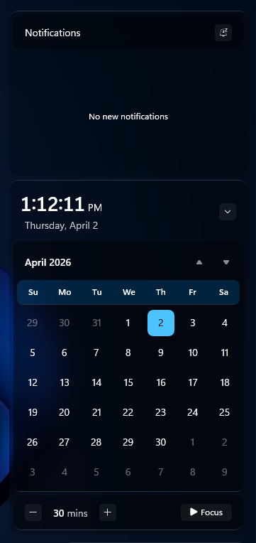

# LiquidGlass theme for Windows 11 Notification Center Styler

**Author**: [PhantomNimbi](https://github.com/PhantomNimbi)

---

### Requirements

* [Windows 11 Notification Center Styler](https://windhawk.net/mods/windows-11-notification-center-styler)
* [Shell Flyout Positions](https://windhawk.net/mods/shell-flyout-positions)

---

### Notification Center



---

### Shell Flyout Positions

* Open the "Shell Flyout Positions" mod in Windhawk
* Go to the "Advanced" tab and copy the code below into the "Mod settings" box and click "Save".

<details>
<summary>Content to import (click to expand)</summary>

```json
{
"notificationCenter.horizontalAlignment": "tray",
"notificationCenter.horizontalShift": 0,
"actionCenter.horizontalAlignment": "same",
"actionCenter.horizontalShift": 0
}
```

</details>

## Theme selection

The theme is integrated into the mod and can be selected directly from the mod's
settings:

* Open the Windows 11 Notification Center Styler mod in Windhawk.
* Go to the "Settings" tab.
* Select the theme and save the settings.

## Manual installation

The theme styles can also be imported manually. To do that, follow these steps:

* Open the Windows 11 Notification Center Styler mod in Windhawk.
* Go to the "Advanced" tab.
* Copy the content below to the text box under "Mod settings" and click "Save".

<details>
<summary>Content to import (click to expand)</summary>

```json
{
  "controlStyles[0].target": "Grid#NotificationCenterGrid",
  "controlStyles[0].styles[0]": "Background:=$Background",
  "controlStyles[0].styles[1]": "CornerRadius = $CornerRadius",
  "controlStyles[0].styles[2]": "Shadow :=",
  "controlStyles[1].target": "Grid#CalendarCenterGrid",
  "controlStyles[1].styles[0]": "Background:=$Background",
  "controlStyles[1].styles[1]": "CornerRadius=$CornerRadius",
  "controlStyles[1].styles[2]": "Shadow :=",
  "controlStyles[1].styles[3]": "Margin = 0,6,0,6",
  "controlStyles[1].styles[4]": "MinHeight = 40",
  "controlStyles[2].target": "ScrollViewer#CalendarControlScrollViewer",
  "controlStyles[2].styles[0]": "Background := $ElementBackground",
  "controlStyles[2].styles[1]": "CornerRadius = $ElementCornerRadius",
  "controlStyles[2].styles[2]": "Margin = -10,11,-10,-14",
  "controlStyles[2].styles[3]": "Shadow :=",
  "controlStyles[3].target": "Border#CalendarHeaderMinimizedOverlay",
  "controlStyles[3].styles[0]": "Background := $ElementBackground",
  "controlStyles[3].styles[1]": "CornerRadius = $CornerRadius",
  "controlStyles[3].styles[2]": "Shadow :=",
  "controlStyles[3].styles[3]": "Margin =-10,-6,-10,-8",
  "controlStyles[3].styles[4]": "Height = 45",
  "controlStyles[4].target": "ActionCenter.FocusSessionControl#FocusSessionControl > Grid#FocusGrid",
  "controlStyles[4].styles[0]": "Background := $ElementBackground",
  "controlStyles[4].styles[1]": "CornerRadius=$CornerRadius",
  "controlStyles[4].styles[2]": "Margin = 6,7,6,6",
  "controlStyles[4].styles[3]": "Shadow :=",
  "controlStyles[5].target": "MenuFlyoutPresenter",
  "controlStyles[5].styles[0]": "Background := $Background",
  "controlStyles[5].styles[1]": "BorderThickness = 0,0,0,0",
  "controlStyles[5].styles[2]": "CornerRadius = $CornerRadius",
  "controlStyles[5].styles[3]": "Padding = 1,2,1,2",
  "controlStyles[5].styles[4]": "Shadow :=",
  "controlStyles[6].target": "Border#JumpListRestyledAcrylic",
  "controlStyles[6].styles[0]": "Background := $Background",
  "controlStyles[6].styles[1]": "BorderThickness = 0,0,0,0",
  "controlStyles[6].styles[2]": "CornerRadius = $CornerRadius",
  "controlStyles[6].styles[3]": "Margin = -2,-2,-2,-2",
  "controlStyles[6].styles[4]": "Shadow :=",
  "controlStyles[7].target": "Grid#ControlCenterRegion",
  "controlStyles[7].styles[0]": "Background := $Background",
  "controlStyles[7].styles[1]": "CornerRadius = $CornerRadius",
  "controlStyles[7].styles[2]": "BorderThickness = 0,0,0,0",
  "controlStyles[7].styles[3]": "Shadow :=",
  "controlStyles[7].styles[4]": "Margin = 0,0,0,-6",
  "controlStyles[8].target": "ContentPresenter#PageContent",
  "controlStyles[8].styles[0]": "Background := Transparent",
  "controlStyles[8].styles[1]": "Shadow :=",
  "controlStyles[9].target": "ContentPresenter#PageContent > Grid > Border",
  "controlStyles[9].styles[0]": "Background := $ElementBackground",
  "controlStyles[9].styles[1]": "CornerRadius=$ElementCornerRadius",
  "controlStyles[9].styles[2]": "Margin = 8,0,8,2",
  "controlStyles[9].styles[3]": "Shadow :=",
  "controlStyles[10].target": "QuickActions.ControlCenter.AccessibleWindow#PageWindow > ContentPresenter > Grid#FullScreenPageRoot",
  "controlStyles[10].styles[0]": "Background := Transparent",
  "controlStyles[10].styles[1]": "Shadow :=",
  "controlStyles[11].target": "QuickActions.ControlCenter.AccessibleWindow#PageWindow > ContentPresenter > Grid#FullScreenPageRoot > ContentPresenter#PageHeader",
  "controlStyles[11].styles[0]": "Background := $ElementBackground",
  "controlStyles[11].styles[1]": "CornerRadius = $ElementCornerRadius",
  "controlStyles[11].styles[2]": "Margin = 7,7,7,7",
  "controlStyles[11].styles[3]": "Shadow :=",
  "controlStyles[12].target": "ScrollViewer#ListContent",
  "controlStyles[12].styles[0]": "Background := $ElementBackground",
  "controlStyles[12].styles[1]": "CornerRadius = $ElementCornerRadius",
  "controlStyles[12].styles[2]": "Margin = 8,0,8,0",
  "controlStyles[12].styles[3]": "Shadow :=",
  "controlStyles[13].target": "ActionCenter.FlexibleToastView#FlexibleNormalToastView",
  "controlStyles[13].styles[0]": "Background := Transparent",
  "controlStyles[13].styles[1]": "Shadow :=",
  "controlStyles[14].target": "Border#ToastBackgroundBorder2",
  "controlStyles[14].styles[0]": "Background :=$Background",
  "controlStyles[14].styles[1]": "BorderThickness = 0,0,0,0",
  "controlStyles[14].styles[2]": "CornerRadius = $CornerRadius",
  "controlStyles[14].styles[3]": "Shadow :=",
  "controlStyles[15].target": "JumpViewUI.SystemItemListViewItem > Grid#LayoutRoot > Border#BackgroundBorder",
  "controlStyles[15].styles[0]": "Background := $ElementBackground",
  "controlStyles[15].styles[1]": "CornerRadius = $ElementCornerRadius",
  "controlStyles[16].target": "JumpViewUI.JumpListListViewItem > Grid#LayoutRoot > Border#BackgroundBorder",
  "controlStyles[16].styles[0]": "CornerRadius = $ElementCornerRadius",
  "controlStyles[17].target": "ActionCenter.FlexibleItemView",
  "controlStyles[17].styles[0]": "CornerRadius = $CornerRadius",
  "controlStyles[17].styles[1]": "Shadow :=",
  "controlStyles[18].target": "QuickActions.AccessibleToggleButton#ToggleButton",
  "controlStyles[18].styles[0]": "CornerRadius = $ElementCornerRadius",
  "controlStyles[18].styles[1]": "BorderThickness = 0",
  "controlStyles[19].target": "QuickActions.AccessibleToggleButton#SplitL2Button",
  "controlStyles[19].styles[0]": "CornerRadius = $ElementCornerRadius",
  "controlStyles[19].styles[1]": "Margin = 4,0,-4,0",
  "controlStyles[19].styles[2]": "BorderThickness = 0",
  "controlStyles[20].target": "Grid#NotificationCenterTopBanner",
  "controlStyles[20].styles[0]": "Background := $ElementBackground",
  "controlStyles[20].styles[1]": "CornerRadius = $ElementCornerRadius",
  "controlStyles[20].styles[2]": "Margin = 6",
  "controlStyles[21].target": "Windows.UI.Xaml.Controls.Grid#L1Grid > Border",
  "controlStyles[21].styles[0]": "Background := Transparent",
  "controlStyles[22].target": "Windows.UI.Xaml.Controls.ContentPresenter",
  "controlStyles[22].styles[0]": "BorderThickness = 0",
  "controlStyles[23].target": "Windows.UI.Xaml.Controls.Button#FooterButton[AutomationProperties.Name = Edit quick settings]",
  "controlStyles[23].styles[0]": "Margin = 0,0,8,0",
  "controlStyles[23].styles[1]": "CornerRadius = $ElementCornerRadius",
  "controlStyles[24].target": "Windows.UI.Xaml.Controls.Button[AutomationProperties.AutomationId = Microsoft.QuickAction.Battery]",
  "controlStyles[24].styles[0]": "Margin = 2,0,0,0",
  "controlStyles[24].styles[1]": "CornerRadius = $ElementCornerRadius",
  "controlStyles[25].target": "Windows.UI.Xaml.Controls.Button#FooterButton[AutomationProperties.Name = All settings]",
  "controlStyles[25].styles[0]": "Margin = 0,0,-1,0",
  "controlStyles[25].styles[1]": "CornerRadius = $ElementCornerRadius",
  "controlStyles[26].target": "Windows.UI.Xaml.Controls.Button[AutomationProperties.AutomationId = Microsoft.QuickAction.Volume]",
  "controlStyles[26].styles[0]": "CornerRadius = $ElementCornerRadius",
  "controlStyles[27].target": "Windows.UI.Xaml.Controls.Button#VolumeL2Button[AutomationProperties.Name = Select a sound output]",
  "controlStyles[27].styles[0]": "CornerRadius = $ElementCornerRadius",
  "controlStyles[28].target": "Windows.UI.Xaml.Shapes.Rectangle#HorizontalTrackRect",
  "controlStyles[28].styles[0]": "Height = 10",
  "controlStyles[28].styles[1]": "Fill := $ElementBackground",
  "controlStyles[28].styles[2]": "RadiusY = 3",
  "controlStyles[28].styles[3]": "RadiusX = 3",
  "controlStyles[29].target": "Windows.UI.Xaml.Shapes.Rectangle#HorizontalDecreaseRect",
  "controlStyles[29].styles[0]": "Height =10",
  "controlStyles[29].styles[1]": "RadiusY = 3",
  "controlStyles[29].styles[2]": "RadiusX = 3",
  "controlStyles[29].styles[3]": "Margin = 0",
  "controlStyles[30].target": "Windows.UI.Xaml.Controls.Primitives.Thumb#HorizontalThumb",
  "controlStyles[30].styles[0]": "Visibility = 1",
  "controlStyles[31].target": "Windows.UI.Xaml.Controls.Grid#MediaTransportControlsRegion",
  "controlStyles[31].styles[0]": "Height = Auto",
  "controlStyles[31].styles[1]": "CornerRadius = $CornerRadius",
  "controlStyles[31].styles[2]": "BorderThickness = 0",
  "controlStyles[31].styles[3]": "Background := $Background",
  "controlStyles[31].styles[4]": "Shadow :=",
  "controlStyles[31].styles[5]": "Padding = 0,0,0,12",
  "controlStyles[31].styles[6]": "Margin = 0,0,0,12",
  "controlStyles[32].target": "Windows.UI.Xaml.Controls.Grid#ThumbnailImage",
  "controlStyles[32].styles[0]": "Grid.Column = 2",
  "controlStyles[32].styles[1]": "CornerRadius = $ElementCornerRadius",
  "controlStyles[33].target": "Windows.UI.Xaml.Controls.StackPanel#PrimaryAndSecondaryTextContainer",
  "controlStyles[34].target": "Windows.UI.Xaml.Controls.StackPanel#PrimaryAndSecondaryTextContainer > Windows.UI.Xaml.Controls.TextBlock#Title",
  "controlStyles[34].styles[0]": "TextAlignment = Center",
  "controlStyles[34].styles[1]": "FontFamily = Tektur",
  "controlStyles[34].styles[2]": "FontSize = 18",
  "controlStyles[35].target": "Windows.UI.Xaml.Controls.StackPanel#PrimaryAndSecondaryTextContainer > Windows.UI.Xaml.Controls.TextBlock#Subtitle",
  "controlStyles[35].styles[0]": "TextAlignment = Center",
  "controlStyles[35].styles[1]": "FontFamily = Montserrat",
  "controlStyles[35].styles[2]": "Margin = 0,3,0,0",
  "controlStyles[35].styles[3]": "FontWeight= 600",
  "controlStyles[36].target": "Windows.UI.Xaml.Controls.ListView#MediaButtonsListView",
  "controlStyles[36].styles[0]": "VerticalAlignment = Top",
  "controlStyles[36].styles[1]": "Height = 48",
  "controlStyles[36].styles[2]": "Margin = 0,12,0,-12",
  "controlStyles[37].target": "Windows.UI.Xaml.Controls.Primitives.RepeatButton#PreviousButton > Windows.UI.Xaml.Controls.ContentPresenter#ContentPresenter@CommonStates",
  "controlStyles[37].styles[0]": "Background@Normal := $ElementBackground",
  "controlStyles[37].styles[1]": "Background@PointerOver := $AccentBackground",
  "controlStyles[37].styles[2]": "Background@Pressed := $ElementBackground2",
  "controlStyles[37].styles[3]": "Width = 40",
  "controlStyles[37].styles[4]": "Height = 30",
  "controlStyles[37].styles[5]": "CornerRadius = $ElementCornerRadius",
  "controlStyles[37].styles[6]": "Margin = 15,0,0,0",
  "controlStyles[38].target": "Windows.UI.Xaml.Controls.Button#PlayPauseButton > Windows.UI.Xaml.Controls.ContentPresenter#ContentPresenter@CommonStates",
  "controlStyles[38].styles[0]": "Background@Normal := $ElementBackground",
  "controlStyles[38].styles[1]": "Background@PointerOver := $AccentBackground",
  "controlStyles[38].styles[2]": "Background@Pressed := $ElementBackground2",
  "controlStyles[38].styles[3]": "Width = 40",
  "controlStyles[38].styles[4]": "Height = 40",
  "controlStyles[38].styles[5]": "CornerRadius = $ElementCornerRadius",
  "controlStyles[38].styles[6]": "Margin = -10,0,0,0",
  "controlStyles[39].target": "Windows.UI.Xaml.Controls.Primitives.RepeatButton#NextButton > Windows.UI.Xaml.Controls.ContentPresenter#ContentPresenter@CommonStates",
  "controlStyles[39].styles[0]": "Background@Normal := $ElementBackground",
  "controlStyles[39].styles[1]": "Background@PointerOver := $AccentBackground",
  "controlStyles[39].styles[2]": "Background@Pressed := $ElementBackground2",
  "controlStyles[39].styles[3]": "Width = 40",
  "controlStyles[39].styles[4]": "Height = 30",
  "controlStyles[39].styles[5]": "CornerRadius = $ElementCornerRadius",
  "controlStyles[39].styles[6]": "Margin = -20,0,0,0",
  "controlStyles[40].target": "Windows.UI.Xaml.Controls.TextBlock#AppNameText",
  "controlStyles[40].styles[0]": "FontFamily = Tektur",
  "controlStyles[40].styles[1]": "FontSize = 16",
  "controlStyles[41].target": "Windows.UI.Xaml.Controls.Image#IconImage",
  "controlStyles[41].styles[0]": "Height = 20",
  "controlStyles[41].styles[1]": "Width = 20",
  "controlStyles[42].target": "Grid#MediaTransportControlsRoot",
  "controlStyles[42].styles[0]": "Background := Transparent",
  "controlStyles[43].target": "Grid#ToastPeekRegion",
  "controlStyles[43].styles[0]": "Background =",
  "controlStyles[43].styles[1]": "RenderTransform := <TranslateTransform Y=\"-495\" X=\"395\" />",
  "controlStyles[43].styles[2]": "Grid.Column = 0",
  "controlStyles[43].styles[3]": "Grid.Row = 2",
  "controlStyles[44].target": "Windows.UI.Xaml.Controls.CalendarViewDayItem > Windows.UI.Xaml.Controls.Border",
  "controlStyles[44].styles[0]": "CornerRadius = $ElementCornerRadius",
  "controlStyles[44].styles[1]": "Margin = 1,2,1,2",
  "controlStyles[45].target": "Windows.UI.Xaml.Controls.CalendarViewDayItem",
  "controlStyles[45].styles[0]": "CornerRadius = $ElementCornerRadius",
  "controlStyles[46].target": "Windows.UI.Xaml.Controls.Control > Windows.UI.Xaml.Controls.Border",
  "controlStyles[46].styles[0]": "CornerRadius = $ElementCornerRadius",
  "controlStyles[47].target": "Windows.UI.Xaml.Controls.Primitives.CalendarViewItem",
  "controlStyles[47].styles[0]": "CornerRadius = $ElementCornerRadius",
  "controlStyles[48].target": "Windows.UI.Xaml.Controls.ListViewHeaderItem",
  "controlStyles[48].styles[0]": "Margin = 50,6,50,2",
  "controlStyles[48].styles[1]": "CornerRadius = $ElementCornerRadius",
  "controlStyles[48].styles[2]": "Height = 35",
  "controlStyles[49].target": "Windows.UI.Xaml.Controls.Button#SettingsButton",
  "controlStyles[49].styles[0]": "CornerRadius = $ElementCornerRadius",
  "controlStyles[50].target": "Windows.UI.Xaml.Controls.Button#DismissButton",
  "controlStyles[50].styles[0]": "CornerRadius = $ElementCornerRadius",
  "controlStyles[51].target": "Windows.UI.Xaml.Controls.StackPanel#CalendarHeader",
  "controlStyles[51].styles[0]": "Margin = 6,0,0,0",
  "controlStyles[52].target": "Windows.UI.Xaml.Controls.ScrollContentPresenter#ScrollContentPresenter",
  "controlStyles[52].styles[0]": "Margin = 1,2,1,2",
  "controlStyles[53].target": "Windows.UI.Xaml.Controls.Grid#WeekDayNames",
  "controlStyles[53].styles[0]": "Background := $AccentBackground",
  "controlStyles[53].styles[1]": "CornerRadius = $ElementCornerRadius",
  "controlStyles[53].styles[2]": "Margin = 4,0,4,0",
  "controlStyles[53].styles[3]": "Padding = 0,-5,0,-3",
  "controlStyles[54].target": "Windows.UI.Xaml.Controls.ListViewItem",
  "controlStyles[54].styles[0]": "CornerRadius = $ElementCornerRadius",
  "controlStyles[55].target": "Windows.UI.Xaml.Controls.Grid#RootGrid > Windows.UI.Xaml.Controls.ContentPresenter#ContentPresenter",
  "controlStyles[55].styles[0]": "Background := $AccentBackground",
  "controlStyles[55].styles[1]": "CornerRadius = $ElementCornerRadius",
  "controlStyles[56].target": "Windows.UI.Xaml.Controls.Grid > Windows.UI.Xaml.Controls.Border#ItemOpaquePlating",
  "controlStyles[56].styles[0]": "Background := $ElementBackground2",
  "controlStyles[56].styles[1]": "CornerRadius = $ElementCornerRadius",
  "controlStyles[57].target": "Windows.UI.Xaml.Controls.Grid#StandardHeroContainer",
  "controlStyles[57].styles[0]": "Margin = 12,0,12,0",
  "controlStyles[57].styles[1]": "CornerRadius = 0",
  "controlStyles[57].styles[2]": "Height = 150",
  "controlStyles[58].target": "Windows.UI.Xaml.Controls.Grid#SliderContainer",
  "controlStyles[58].styles[0]": "Margin = 0-2,0,0",
  "controlStyles[59].target": "Windows.UI.Xaml.Controls.Button#BackButton",
  "controlStyles[59].styles[0]": "CornerRadius = $ElementCornerRadius",
  "controlStyles[60].target": "Windows.UI.Xaml.Shapes.Rectangle#OuterBorder",
  "controlStyles[60].styles[0]": "RadiusX = 6",
  "controlStyles[60].styles[1]": "RadiusY = 6",
  "controlStyles[60].styles[2]": "Height = 18",
  "controlStyles[61].target": "Windows.UI.Xaml.Shapes.Rectangle#SwitchKnobOff",
  "controlStyles[61].styles[0]": "RadiusY = 3",
  "controlStyles[61].styles[1]": "RadiusX = 3",
  "controlStyles[62].target": "Windows.UI.Xaml.Controls.Border#SwitchKnobOn",
  "controlStyles[62].styles[0]": "CornerRadius = 3",
  "controlStyles[63].target": "Windows.UI.Xaml.Shapes.Rectangle#SwitchKnobBounds",
  "controlStyles[63].styles[0]": "RadiusX = 6",
  "controlStyles[63].styles[1]": "RadiusY = 6",
  "controlStyles[63].styles[2]": "Height = 18",
  "controlStyles[64].target": "ActionCenter.NotificationListViewItem",
  "controlStyles[64].styles[0]": "Margin = 5,2,5,3",
  "controlStyles[65].target": "Windows.UI.Xaml.Controls.Grid[AutomationProperties.LocalizedLandmarkType = Footer]",
  "controlStyles[65].styles[0]": "BorderThickness = $ElementBorderThickness",
  "controlStyles[66].target": "NetworkUX.View.SettingsListViewItem > Windows.UI.Xaml.Controls.Primitives.ListViewItemPresenter#Root",
  "controlStyles[66].styles[0]": "CornerRadius = $CornerRadius",
  "controlStyles[67].target": "Windows.UI.Xaml.Controls.ContentPresenter > Windows.UI.Xaml.Controls.Border",
  "controlStyles[67].styles[0]": "BorderThickness = $ElementBorderThickness",
  "controlStyles[68].target": "Button#ClearAll",
  "controlStyles[68].styles[0]": "AccessKey=x",
  "controlStyles[69].target": "Button#ExpandCollapseButton",
  "controlStyles[69].styles[0]": "AccessKey=e",
  "styleConstants[0]": "transparent = Transparent",
  "styleConstants[1]": "Background = <WindhawkBlur BlurAmount=\"15\" TintColor=\"{ThemeResource SystemAltLowColor}\" TintOpacity=\"0.4\"  />",
  "styleConstants[2]": "ElementBackground = <WindhawkBlur BlurAmount=\"20\" TintColor=\"{ThemeResource SystemAltLowColor}\" TintOpacity=\"0.4\"  />",
  "styleConstants[3]": "AccentBackground =<WindhawkBlur BlurAmount=\"20\" TintColor=\"{ThemeResource SystemAccentColorLight1}\" TintOpacity=\"0.2\"  />",
  "styleConstants[4]": "ElementBackground2 = <WindhawkBlur BlurAmount=\"15\" TintColor=\"{ThemeResource SystemAltLowColor}\" TintOpacity=\"0.2\"  />",
  "controlStyles[33].styles[0]": "Grid.Column = 1",
  "controlStyles[25].styles[2]": "Background := $Background",
  "styleConstants[5]": "BorderBrush=<LinearGradientBrush StartPoint=\"0,0\" EndPoint=\"0,1\"><GradientStop Color=\"#50808080\" Offset=\"0.0\" /><GradientStop Color=\"#50404040\" Offset=\"0.25\" /><GradientStop Color=\"#50808080\" Offset=\"1\" /></LinearGradientBrush>",
  "styleConstants[6]": "ElementBorderBrush=<LinearGradientBrush StartPoint=\"0,0\" EndPoint=\"0,1\"><GradientStop Color=\"#50808080\" Offset=\"1\" /><GradientStop Color=\"#50606060\" Offset=\"0.15\" /></LinearGradientBrush>",
  "controlStyles[67].styles[1]": "BorderBrush := $ElementBorderBrush",
  "controlStyles[66].styles[1]": "BorderThickness = $ElementBorderThickness",
  "controlStyles[66].styles[2]": "BorderBrush := $ElementBorderBrush",
  "controlStyles[65].styles[1]": "BorderBrush := $ElementBorderBrush",
  "controlStyles[64].styles[1]": "BorderThickness = $ElementBorderThickness",
  "controlStyles[64].styles[2]": "BorderBrush := $ElementBorderBrush",
  "controlStyles[59].styles[1]": "BorderBrush := $ElementBorderBrush",
  "controlStyles[59].styles[2]": "BorderThickness = $ElementBorderThickness",
  "controlStyles[56].styles[2]": "BorderThickness = $ElementBorderThickness",
  "controlStyles[56].styles[3]": "BorderBrush := $ElementBorderBrush",
  "controlStyles[55].styles[2]": "BorderThickness = $ElementBorderThickness",
  "controlStyles[55].styles[3]": "BorderBrush := $ElementBorderBrush",
  "controlStyles[53].styles[4]": "BorderThickness = $ElementBorderThickness",
  "controlStyles[53].styles[5]": "BorderBrush := $ElementBorderBrush",
  "controlStyles[39].styles[7]": "BorderBrush := $ElementBorderBrush",
  "controlStyles[39].styles[8]": "BorderThickness = $ElementBorderThickness",
  "controlStyles[38].styles[7]": "BorderBrush := $ElementBorderBrush",
  "controlStyles[38].styles[8]": "BorderThickness = $ElementBorderThickness",
  "controlStyles[0].styles[3]": "BorderThickness = $BorderThickness",
  "controlStyles[0].styles[4]": "BorderBrush := $BorderBrush",
  "controlStyles[1].styles[5]": "BorderThickness = $BorderThickness",
  "controlStyles[1].styles[6]": "BorderBrush := $BorderBrush",
  "controlStyles[2].styles[4]": "BorderThickness = $ElementBorderThickness",
  "controlStyles[2].styles[5]": "BorderBrush := $ElementBorderBrush",
  "controlStyles[3].styles[5]": "BorderThickness = $ElementBorderThickness",
  "controlStyles[3].styles[6]": "BorderBrush := $ElementBorderBrush",
  "controlStyles[4].styles[4]": "BorderThickness = $ElementBorderThickness",
  "controlStyles[4].styles[5]": "BorderBrush := $ElementBorderBrush",
  "controlStyles[5].styles[5]": "BorderThickness = $BorderThickness",
  "controlStyles[5].styles[6]": "BorderBrush := $BorderBrush",
  "controlStyles[6].styles[5]": "BorderThickness = $BorderThickness",
  "controlStyles[6].styles[6]": "BorderBrush := $BorderBrush",
  "styleConstants[7]": "BorderThickness=0.3,1,0.3,0.3",
  "styleConstants[8]": "ElementBorderThickness=0.3,0.3,0.3,1",
  "styleConstants[9]": "CornerRadius = 12",
  "styleConstants[10]": "ElementCornerRadius = 8"
}
```
</details>