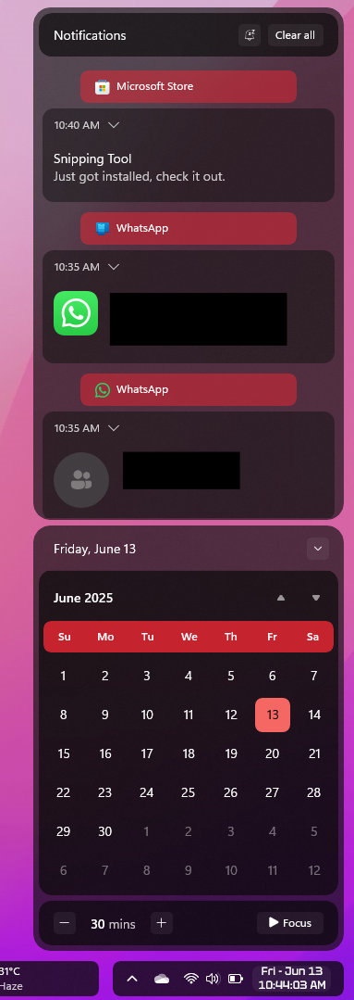
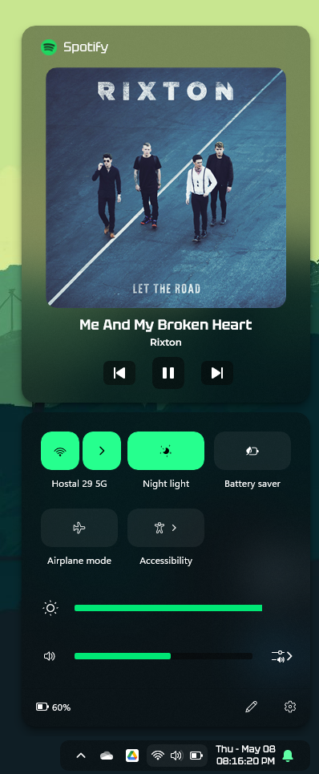
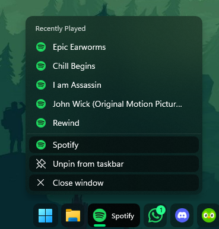
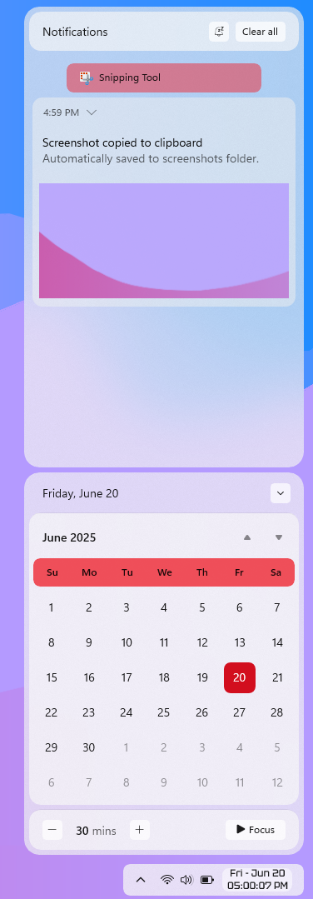
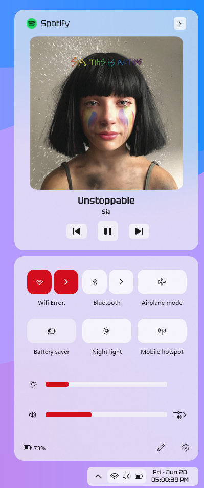
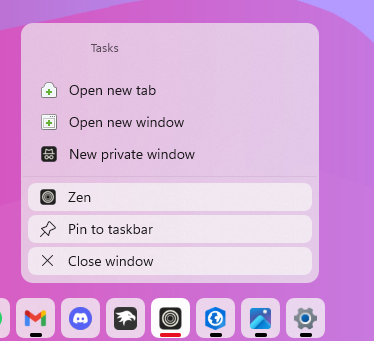

# Matter theme for Windows 11 Notification Center Styler

**Author**: [ZoraizLajwer](https://github.com/ZoraizLajwer)

## Dark Mode
      

## Light Mode
      

## Good to know

- Compatible with both light and dark modes
- If you want the same results you have to install 2 fonts, [Tektur](https://fonts.google.com/specimen/Tektur) and [Montserrat](https://fonts.google.com/specimen/Montserrat).
- The Quick Action Center button menu is still not compatible with versions newer than 23H2, such as 24H2.
- **Alt+x** to _Clear all messages_, **Alt+e** to _Minimize/Maximize Calendar View_

## Thumbnail image size

The default media control thumbnail size is 300x300, which might be too large for small screens. You can change it by setting the value `thumbnailImageSize=200`, where `200` is the desired size, in the "Style constants" section of the mod's settings.

## Theme selection

The theme is integrated into the mod and can be selected directly from the mod's
settings:

* Open the Windows 11 Notification Center Styler mod in Windhawk.
* Go to the "Settings" tab.
* Select the theme and save the settings.

## Manual installation

The theme styles can also be imported manually. To do that, follow these steps:

* Open the Windows 11 Notification Center Styler mod in Windhawk.
* Go to the "Advanced" tab.
* Copy the content below to the text box under "Mod settings" and click "Save".

<details>
<summary>Content to import (click to expand)</summary>

```yaml
styleConstants:
  - transparent = <SolidColorBrush Color="Transparent"/>
  - base = <AcrylicBrush TintColor="{ThemeResource SystemAltLowColor}" TintOpacity="1" TintLuminosityOpacity="0.6" Opacity = "1" FallbackColor="{ThemeResource SystemChromeLowColor}" />
  - overlay = <AcrylicBrush TintColor="{ThemeResource SystemAltLowColor}" TintOpacity="1" TintLuminosityOpacity="0.6" FallbackColor="{ThemeResource LayerFillColorDefault}" />
  - accentColor =<SolidColorBrush Color="{ThemeResource SystemAccentColorLight1}" Opacity = "1" />
  - overlay2 = <AcrylicBrush TintColor="{ThemeResource SystemAltLowColor}" TintOpacity="1" TintLuminosityOpacity="0.4" FallbackColor="{ThemeResource CardStrokeColorDefaultSolid}" />
  - r1 = 18
  - r2 = 14
  - r3 = 12
  - thumbnailImageSize = 300
controlStyles:
  - target: Grid#NotificationCenterGrid
    styles:
      - Background:=$base
      - BorderThickness=0,0,0,0
      - CornerRadius=$r1
      - Shadow :=
  - target: Grid#CalendarCenterGrid
    styles:
      - Background:=$base
      - BorderThickness=0,0,0,0
      - CornerRadius=$r1
      - Shadow :=
      - Margin = 0,6,0,6
      - MinHeight = 40
  - target: ScrollViewer#CalendarControlScrollViewer
    styles:
      - Background:=$overlay
      - CornerRadius=$r2
      - Margin=-10,11,-10,-14
      - Shadow :=
  - target: Border#CalendarHeaderMinimizedOverlay
    styles:
      - Background:=$overlay
      - CornerRadius=$r2
      - Shadow :=
      - Margin =-10,-6,-10,-8
      - Height = 45
  - target: ActionCenter.FocusSessionControl#FocusSessionControl > Grid#FocusGrid
    styles:
      - Background:=$overlay
      - CornerRadius=$r2
      - Margin=6,7,6,6
      - Shadow :=
  - target: MenuFlyoutPresenter
    styles:
      - Background:=$base
      - BorderThickness=0,0,0,0
      - CornerRadius=$r3
      - Padding=1,2,1,2
      - Shadow :=
  - target: Border#JumpListRestyledAcrylic
    styles:
      - Background:=$base
      - BorderThickness=0,0,0,0
      - CornerRadius=$r3
      - Margin=-2,-2,-2,-2
      - Shadow :=
  - target: Grid#ControlCenterRegion
    styles:
      - Background:=$base
      - CornerRadius=$r1
      - BorderThickness=0,0,0,0
      - Shadow :=
      - Margin = 0,0,0,-6
  - target: ContentPresenter#PageContent
    styles:
      - Background:= $transparent
      - Shadow :=
  - target: ContentPresenter#PageContent > Grid > Border
    styles:
      - Background:=$overlay
      - CornerRadius=$r2
      - Margin=8,0,8,2
      - Shadow :=
  - target: QuickActions.ControlCenter.AccessibleWindow#PageWindow > ContentPresenter > Grid#FullScreenPageRoot
    styles:
      - Background:= $transparent
      - Shadow :=
  - target: QuickActions.ControlCenter.AccessibleWindow#PageWindow > ContentPresenter > Grid#FullScreenPageRoot > ContentPresenter#PageHeader
    styles:
      - Background:=$overlay
      - CornerRadius=$r2
      - Margin=7,7,7,7
      - Shadow :=
  - target: ScrollViewer#ListContent
    styles:
      - Background:=$overlay
      - CornerRadius=$r2
      - Margin=8,0,8,0
      - Shadow :=
  - target: ActionCenter.FlexibleToastView#FlexibleNormalToastView
    styles:
      - Background:= $transparent
      - Shadow :=
  - target: Border#ToastBackgroundBorder2
    styles:
      - Background:=$base
      - BorderThickness=0,0,0,0
      - CornerRadius=16
      - Shadow :=
  - target: JumpViewUI.SystemItemListViewItem > Grid#LayoutRoot > Border#BackgroundBorder
    styles:
      - Background:=$overlay
      - CornerRadius=8
  - target: JumpViewUI.JumpListListViewItem > Grid#LayoutRoot > Border#BackgroundBorder
    styles:
      - CornerRadius=6
  - target: ActionCenter.FlexibleItemView
    styles:
      - CornerRadius=16
      - Shadow :=
  - target: QuickActions.AccessibleToggleButton#ToggleButton
    styles:
      - CornerRadius=13
      - BorderThickness = 0
  - target: QuickActions.AccessibleToggleButton#SplitL2Button
    styles:
      - CornerRadius =13
      - Margin=4,0,-4,0
      - BorderThickness = 0
  - target: Grid#NotificationCenterTopBanner
    styles:
      - Background:=$overlay
      - CornerRadius=$r2
      - Margin=6
  - target: Windows.UI.Xaml.Controls.Grid#L1Grid > Border
    styles:
      - Background:= $transparent
  - target: Windows.UI.Xaml.Controls.ContentPresenter
    styles:
      - BorderThickness=0
  - target: Windows.UI.Xaml.Controls.Button#FooterButton[AutomationProperties.Name = Edit quick settings]
    styles:
      - Margin = 0,0,8,0
      - CornerRadius=$r3
  - target: Windows.UI.Xaml.Controls.Button[AutomationProperties.AutomationId = Microsoft.QuickAction.Battery]
    styles:
      - Margin = 2,0,0,0
      - CornerRadius=$r3
  - target: Windows.UI.Xaml.Controls.Button#FooterButton[AutomationProperties.Name = All settings]
    styles:
      - Margin = 0,0,-1,0
      - CornerRadius = 13
  - target: Windows.UI.Xaml.Controls.Button[AutomationProperties.AutomationId = Microsoft.QuickAction.Volume]
    styles:
      - CornerRadius = 10
  - target: Windows.UI.Xaml.Controls.Button#VolumeL2Button[AutomationProperties.Name = Select a sound output]
    styles:
      - CornerRadius = 10
  - target: Windows.UI.Xaml.Shapes.Rectangle#HorizontalTrackRect
    styles:
      - Height = 10
      - Fill := $overlay
      - RadiusY = 3
      - RadiusX = 3
  - target: Windows.UI.Xaml.Shapes.Rectangle#HorizontalDecreaseRect
    styles:
      - Height =10
      - RadiusY = 3
      - RadiusX = 3
      - Margin = 0
  - target: Windows.UI.Xaml.Controls.Primitives.Thumb#HorizontalThumb
    styles:
      - Visibility = 1
  - target: Windows.UI.Xaml.Controls.Grid#MediaTransportControlsRegion
    styles:
      - Height=Auto
      - CornerRadius=$r1
      - BorderThickness = 0
      - Background:=$base
      - Shadow :=
      - Padding = 0,0,0,12
      - Margin = 0,0,0,12
  - target: Windows.UI.Xaml.Controls.Grid#ThumbnailImage
    styles:
      - Width=$thumbnailImageSize
      - Height=$thumbnailImageSize
      - HorizontalAlignment=Center
      - VerticalAlignment=Top
      - Grid.Column=1
      - Margin=0,2,0,45
      - CornerRadius=$r2
  - target: Windows.UI.Xaml.Controls.StackPanel#PrimaryAndSecondaryTextContainer
    styles:
      - VerticalAlignment=Bottom
      - Margin = 0,5,0,-5
  - target: Windows.UI.Xaml.Controls.StackPanel#PrimaryAndSecondaryTextContainer > Windows.UI.Xaml.Controls.TextBlock#Title
    styles:
      - TextAlignment=Center
      - FontFamily = Tektur
      - FontSize = 18
  - target: Windows.UI.Xaml.Controls.StackPanel#PrimaryAndSecondaryTextContainer > Windows.UI.Xaml.Controls.TextBlock#Subtitle
    styles:
      - TextAlignment=Center
      - FontFamily = Montserrat
      - Margin = 0,3,0,0
      - FontWeight= 600
  - target: Windows.UI.Xaml.Controls.ListView#MediaButtonsListView
    styles:
      - VerticalAlignment=Top
      - Height=48
      - Margin = 0,12,0,-12
  - target: Windows.UI.Xaml.Controls.Primitives.RepeatButton#PreviousButton > Windows.UI.Xaml.Controls.ContentPresenter#ContentPresenter@CommonStates
    styles:
      - Background@Normal:=$overlay
      - Background@PointerOver:=$accentColor
      - Background@Pressed:=$overlay2
      - Width=40
      - Height= 30
      - CornerRadius = 6
      - Margin = 15,0,0,0
  - target: Windows.UI.Xaml.Controls.Button#PlayPauseButton > Windows.UI.Xaml.Controls.ContentPresenter#ContentPresenter@CommonStates
    styles:
      - Background@Normal:=$overlay
      - Background@PointerOver:=$accentColor
      - Background@Pressed:=$overlay2
      - Width=40
      - Height = 40
      - CornerRadius = 8
      - Margin = -10,0,0,0
  - target: Windows.UI.Xaml.Controls.Primitives.RepeatButton#NextButton > Windows.UI.Xaml.Controls.ContentPresenter#ContentPresenter@CommonStates
    styles:
      - Background@Normal:=$overlay
      - Background@PointerOver:=$accentColor
      - Background@Pressed:=$overlay2
      - Width=40
      - Height = 30
      - CornerRadius = 6
      - Margin = -20,0,0,0
  - target: Windows.UI.Xaml.Controls.TextBlock#AppNameText
    styles:
      - FontFamily = Tektur
      - FontSize = 16
  - target: Windows.UI.Xaml.Controls.Image#IconImage
    styles:
      - Height = 20
      - Width = 20
  - target: Grid#MediaTransportControlsRoot
    styles:
      - Background:= $transparent
  - target: Grid#ToastPeekRegion
    styles:
      - Background =
      - RenderTransform:=<TranslateTransform Y="-495" X="395" />
      - Grid.Column = 0
      - Grid.Row = 2
  - target: Windows.UI.Xaml.Controls.CalendarViewDayItem > Windows.UI.Xaml.Controls.Border
    styles:
      - CornerRadius = 8
      - Margin = 1,2,1,2
  - target: Windows.UI.Xaml.Controls.CalendarViewDayItem
    styles:
      - CornerRadius = 8
  - target: Windows.UI.Xaml.Controls.Control > Windows.UI.Xaml.Controls.Border
    styles:
      - CornerRadius = 8
  - target: Windows.UI.Xaml.Controls.Primitives.CalendarViewItem
    styles:
      - CornerRadius = 8
  - target: Windows.UI.Xaml.Controls.ListViewHeaderItem
    styles:
      - Margin = 50,6,50,2
      - CornerRadius = 8
      - Height = 35
  - target: Windows.UI.Xaml.Controls.Button#SettingsButton
    styles:
      - CornerRadius = 4
  - target: Windows.UI.Xaml.Controls.Button#DismissButton
    styles:
      - CornerRadius = 4
  - target: Windows.UI.Xaml.Controls.StackPanel#CalendarHeader
    styles:
      - Margin = 6,0,0,0
  - target: Windows.UI.Xaml.Controls.ScrollContentPresenter#ScrollContentPresenter
    styles:
      - Margin = 1,2,1,2
  - target: Windows.UI.Xaml.Controls.Grid#WeekDayNames
    styles:
      - Background := <SolidColorBrush Color="{ThemeResource SystemAccentColorLight1}" Opacity = "0.8" />
      - CornerRadius = 8
      - Margin = 4,0,4,0
      - Padding = 0,-5,0,-3
  - target: Windows.UI.Xaml.Controls.ListViewItem
    styles:
      - CornerRadius=$r3
  - target: Windows.UI.Xaml.Controls.Grid#RootGrid > Windows.UI.Xaml.Controls.ContentPresenter#ContentPresenter
    styles:
      - Background := <SolidColorBrush Color="{ThemeResource SystemAccentColorLight1}" Opacity = "0.5" />
      - BorderThickness = 0
      - CornerRadius = 8
  - target: Windows.UI.Xaml.Controls.Grid > Windows.UI.Xaml.Controls.Border#ItemOpaquePlating
    styles:
      - Background := $overlay2
      - BorderThickness = 0
      - CornerRadius=$r3
  - target: Windows.UI.Xaml.Controls.Grid#StandardHeroContainer
    styles:
      - Margin = 12,0,12,0
      - CornerRadius = 0
      - Height = 150
  - target: Windows.UI.Xaml.Controls.Primitives.ScrollBar#VerticalScrollBar
    styles:
      - Visibility = 1
  - target: Windows.UI.Xaml.Controls.Grid#SliderContainer
    styles:
      - Margin = 0-2,0,0
  - target: Windows.UI.Xaml.Controls.Button#BackButton
    styles:
      - CornerRadius=$r3
  - target: Windows.UI.Xaml.Shapes.Rectangle#OuterBorder
    styles:
      - RadiusX = 6
      - RadiusY = 6
      - Height = 18
  - target: Windows.UI.Xaml.Shapes.Rectangle#SwitchKnobOff
    styles:
      - RadiusY = 3
      - RadiusX = 3
  - target: Windows.UI.Xaml.Controls.Border#SwitchKnobOn
    styles:
      - CornerRadius = 3
  - target: Windows.UI.Xaml.Shapes.Rectangle#SwitchKnobBounds
    styles:
      - RadiusX = 6
      - RadiusY = 6
      - Height = 18
  - target: ActionCenter.NotificationListViewItem
    styles:
      - Margin = 5,2,5,3
  - target: Windows.UI.Xaml.Controls.Grid[AutomationProperties.LocalizedLandmarkType = Footer]
    styles:
      - BorderThickness = 0
  - target: NetworkUX.View.SettingsListViewItem > Windows.UI.Xaml.Controls.Primitives.ListViewItemPresenter#Root
    styles:
      - CornerRadius = 12
  - target: Windows.UI.Xaml.Controls.ContentPresenter > Windows.UI.Xaml.Controls.Border
    styles:
      - BorderThickness = 0
  - target: Button#ClearAll
    styles:
      - AccessKey=x
  - target: Button#ExpandCollapseButton
    styles:
      - AccessKey=e
```
</details>
