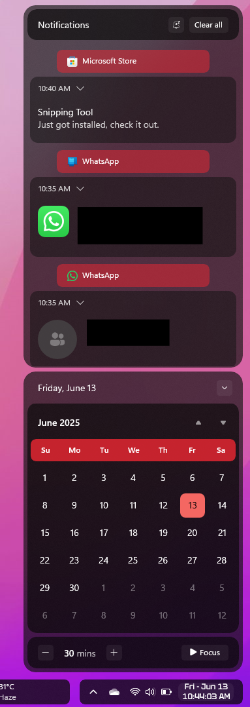
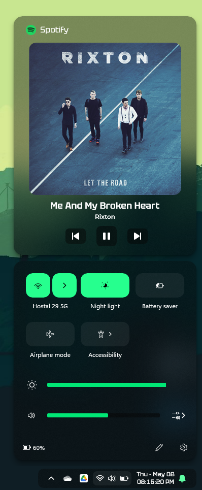
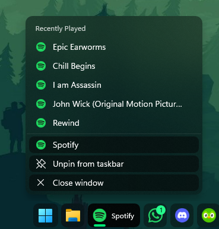

# Matter theme for Windows 11 Notification Center Styler


**Author**: [ZoraizLajwer](https://github.com/ZoraizLajwer)

 





## Windows Settings

- Dark Mode
## Theme selection

The theme is integrated into the mod, and can be simply selected from the mod's
settings:

* Open the Windows 11 Notification Center Styler mod in Windhawk.
* Go to the "Settings" tab.
* Select the theme and save the settings.

## Manual installation

The theme styles can also be imported manually. To do that, follow these steps:

* Open the Windows 11 Notification Center Styler mod in Windhawk.
* Go to the "Advanced" tab.
* Copy the content below to the text box under "Mod settings" and click "Save".

<details>
<summary>Content to import (click to expand)</summary>

```json
{
  "controlStyles[0].target": "Grid#NotificationCenterGrid",
  "controlStyles[0].styles[0]": "Background:=<AcrylicBrush TintOpacity=\"0\" TintColor=\"Black\" TintLuminosityOpacity=\"0.4\" Opacity=\"1\" FallbackColor=\"#262626\"/>",
  "controlStyles[0].styles[1]": "BorderThickness=0,0,0,0",
  "controlStyles[0].styles[2]": "CornerRadius=17",
  "controlStyles[1].target": "Grid#CalendarCenterGrid",
  "controlStyles[1].styles[0]": "Background:=<AcrylicBrush TintOpacity=\"0\" TintColor=\"Black\" TintLuminosityOpacity=\"0.4\" Opacity=\"1\" FallbackColor=\"#262626\"/>",
  "controlStyles[1].styles[1]": "BorderThickness=0,0,0,0",
  "controlStyles[1].styles[2]": "CornerRadius=17",
  "controlStyles[2].target": "ScrollViewer#CalendarControlScrollViewer",
  "controlStyles[2].styles[0]": "Background:=<AcrylicBrush TintOpacity=\"0\" TintColor=\"Black\" TintLuminosityOpacity=\"0.5\" Opacity=\"1\" FallbackColor=\"#0d0d0d\"/>",
  "controlStyles[2].styles[1]": "CornerRadius=14",
  "controlStyles[2].styles[2]": "Margin=-10,11,-10,-14",
  "controlStyles[3].target": "Border#CalendarHeaderMinimizedOverlay",
  "controlStyles[3].styles[0]": "Background:=<AcrylicBrush TintOpacity=\"0\" TintColor=\"Black\" TintLuminosityOpacity=\"0.5\" Opacity=\"1\" FallbackColor=\"#0d0d0d\"/>",
  "controlStyles[3].styles[1]": "CornerRadius=18",
  "controlStyles[4].target": "ActionCenter.FocusSessionControl#FocusSessionControl > Grid#FocusGrid",
  "controlStyles[4].styles[0]": "Background:=<AcrylicBrush TintOpacity=\"0\" TintColor=\"Black\" TintLuminosityOpacity=\"0.5\" Opacity=\"1\" FallbackColor=\"#0d0d0d\"/>",
  "controlStyles[4].styles[1]": "CornerRadius=14",
  "controlStyles[4].styles[2]": "Margin=6,7,6,6",
  "controlStyles[5].target": "MenuFlyoutPresenter",
  "controlStyles[5].styles[0]": "Background:=<AcrylicBrush TintOpacity=\"0\" TintColor=\"Black\" TintLuminosityOpacity=\"0.5\" Opacity=\"1\" FallbackColor=\"#0d0d0d\"/>",
  "controlStyles[5].styles[1]": "BorderThickness=0,0,0,0",
  "controlStyles[5].styles[2]": "CornerRadius=12",
  "controlStyles[5].styles[3]": "Padding=1,2,1,2",
  "controlStyles[6].target": "Border#JumpListRestyledAcrylic",
  "controlStyles[6].styles[0]": "Background:=<AcrylicBrush TintOpacity=\"0\" TintColor=\"Black\" TintLuminosityOpacity=\"0.4\" Opacity=\"1\" FallbackColor=\"#262626\"/>",
  "controlStyles[6].styles[1]": "BorderThickness=0,0,0,0",
  "controlStyles[6].styles[2]": "CornerRadius=12",
  "controlStyles[6].styles[3]": "Margin=-2,-2,-2,-2",
  "controlStyles[7].target": "Grid#ControlCenterRegion",
  "controlStyles[7].styles[0]": "Background:=<AcrylicBrush TintOpacity=\"0\" TintColor=\"Black\" TintLuminosityOpacity=\"0.4\" Opacity=\"1\" FallbackColor=\"#262626\"/>",
  "controlStyles[7].styles[1]": "CornerRadius=17",
  "controlStyles[7].styles[2]": "BorderThickness=0,0,0,0",
  "controlStyles[8].target": "ContentPresenter#PageContent",
  "controlStyles[8].styles[0]": "Background:= <SolidColorBrush Color=\"Transparent\"/>",
  "controlStyles[9].target": "ContentPresenter#PageContent > Grid > Border",
  "controlStyles[9].styles[0]": "Background:=<AcrylicBrush TintOpacity=\"0\" TintColor=\"Black\" TintLuminosityOpacity=\"0.5\" Opacity=\"1\" FallbackColor=\"#0d0d0d\"/>",
  "controlStyles[9].styles[1]": "CornerRadius=14",
  "controlStyles[9].styles[2]": "Margin=8,0,8,2",
  "controlStyles[10].target": "QuickActions.ControlCenter.AccessibleWindow#PageWindow > ContentPresenter > Grid#FullScreenPageRoot",
  "controlStyles[10].styles[0]": "Background:= <SolidColorBrush Color=\"Transparent\"/>",
  "controlStyles[11].target": "QuickActions.ControlCenter.AccessibleWindow#PageWindow > ContentPresenter > Grid#FullScreenPageRoot > ContentPresenter#PageHeader",
  "controlStyles[11].styles[0]": "Background:=<AcrylicBrush TintOpacity=\"0\" TintColor=\"Black\" TintLuminosityOpacity=\"0.5\" Opacity=\"1\" FallbackColor=\"#0d0d0d\"/>",
  "controlStyles[11].styles[1]": "CornerRadius=14",
  "controlStyles[11].styles[2]": "Margin=7,7,7,7",
  "controlStyles[12].target": "ScrollViewer#ListContent",
  "controlStyles[12].styles[0]": "Background:=<AcrylicBrush TintOpacity=\"0\" TintColor=\"Black\" TintLuminosityOpacity=\"0.5\" Opacity=\"1\" FallbackColor=\"#0d0d0d\"/>",
  "controlStyles[12].styles[1]": "CornerRadius=14",
  "controlStyles[12].styles[2]": "Margin=8,0,8,0",
  "controlStyles[13].target": "ActionCenter.FlexibleToastView#FlexibleNormalToastView",
  "controlStyles[13].styles[0]": "Background:= <SolidColorBrush Color=\"Transparent\"/>",
  "controlStyles[14].target": "Border#ToastBackgroundBorder2",
  "controlStyles[14].styles[0]": "Background:=<AcrylicBrush TintOpacity=\"0\" TintColor=\"Black\" TintLuminosityOpacity=\"0.4\" Opacity=\"1\" FallbackColor=\"#262626\"/>",
  "controlStyles[14].styles[1]": "BorderThickness=0,0,0,0",
  "controlStyles[14].styles[2]": "CornerRadius=16",
  "controlStyles[15].target": "JumpViewUI.SystemItemListViewItem > Grid#LayoutRoot > Border#BackgroundBorder",
  "controlStyles[15].styles[0]": "Background:=<AcrylicBrush TintOpacity=\"0\" TintColor=\"Black\" TintLuminosityOpacity=\"0.5\" Opacity=\"1\" FallbackColor=\"#0d0d0d\"/>",
  "controlStyles[15].styles[1]": "CornerRadius=8",
  "controlStyles[16].target": "JumpViewUI.JumpListListViewItem > Grid#LayoutRoot > Border#BackgroundBorder",
  "controlStyles[16].styles[0]": "CornerRadius=6",
  "controlStyles[17].target": "ActionCenter.FlexibleItemView",
  "controlStyles[17].styles[0]": "CornerRadius=16",
  "controlStyles[18].target": "QuickActions.AccessibleToggleButton#ToggleButton",
  "controlStyles[18].styles[0]": "CornerRadius=13",
  "controlStyles[18].styles[1]": "BorderThickness = 0",
  "controlStyles[19].target": "QuickActions.AccessibleToggleButton#SplitL2Button",
  "controlStyles[19].styles[0]": "CornerRadius =13",
  "controlStyles[19].styles[1]": "Margin=4,0,-4,0",
  "controlStyles[19].styles[2]": "BorderThickness = 0",
  "controlStyles[20].target": "Grid#NotificationCenterTopBanner",
  "controlStyles[20].styles[0]": "Background:=<AcrylicBrush TintOpacity=\"0\" TintColor=\"Black\" TintLuminosityOpacity=\"0.5\" Opacity=\"1\" FallbackColor=\"#0d0d0d\"/>",
  "controlStyles[20].styles[1]": "CornerRadius=14",
  "controlStyles[20].styles[2]": "Margin=7,7,7,7",
  "controlStyles[21].target": "Windows.UI.Xaml.Controls.Grid#L1Grid > Border",
  "controlStyles[21].styles[0]": "Background:= <SolidColorBrush Color=\"Transparent\"/>",
  "controlStyles[22].target": "Windows.UI.Xaml.Controls.ContentPresenter",
  "controlStyles[22].styles[0]": "BorderThickness=0",
  "controlStyles[23].target": "Windows.UI.Xaml.Controls.Button#FooterButton[AutomationProperties.Name = Edit quick settings] ",
  "controlStyles[23].styles[0]": "Margin = 0,0,8,0",
  "controlStyles[23].styles[1]": "CornerRadius = 12",
  "controlStyles[24].target": "Windows.UI.Xaml.Controls.Button[AutomationProperties.AutomationId = Microsoft.QuickAction.Battery] ",
  "controlStyles[24].styles[0]": "Margin = 2,0,0,0",
  "controlStyles[24].styles[1]": "CornerRadius = 12",
  "controlStyles[25].target": "Windows.UI.Xaml.Controls.Button#FooterButton[AutomationProperties.Name = All settings] ",
  "controlStyles[25].styles[0]": "Margin = 0,0,-1,0",
  "controlStyles[25].styles[1]": "CornerRadius = 13",
  "controlStyles[26].target": "Windows.UI.Xaml.Controls.Button[AutomationProperties.AutomationId = Microsoft.QuickAction.Volume] ",
  "controlStyles[26].styles[0]": "CornerRadius = 10",
  "controlStyles[27].target": "Windows.UI.Xaml.Controls.Button#VolumeL2Button[AutomationProperties.Name = Select a sound output] ",
  "controlStyles[27].styles[0]": "CornerRadius = 10",
  "controlStyles[28].target": "Windows.UI.Xaml.Shapes.Rectangle#HorizontalTrackRect",
  "controlStyles[28].styles[0]": "Height  = 8",
  "controlStyles[28].styles[1]": "Margin = 6,-1,12,0",
  "controlStyles[28].styles[2]": "Fill := <AcrylicBrush TintOpacity=\"0\" TintColor=\"Black\" TintLuminosityOpacity=\"0.5\" Opacity=\"1\" FallbackColor=\"#0d0d0d\"/>",
  "controlStyles[29].target": "Windows.UI.Xaml.Shapes.Rectangle#HorizontalDecreaseRect",
  "controlStyles[29].styles[0]": "Height  =8",
  "controlStyles[29].styles[1]": "Margin = 6,-1,-10,0",
  "controlStyles[30].target": "Windows.UI.Xaml.Shapes.Ellipse#SliderInnerThumb",
  "controlStyles[30].styles[0]": "Height = 12",
  "controlStyles[30].styles[1]": "Width = 12",
  "controlStyles[30].styles[2]": "Margin = -1,0,0,0",
  "controlStyles[31].target": "Windows.UI.Xaml.Controls.Primitives.Thumb#HorizontalThumb",
  "controlStyles[31].styles[0]": "Height = 18",
  "controlStyles[31].styles[1]": "Width = 18",
  "controlStyles[32].target": "Windows.UI.Xaml.Controls.Grid#MediaTransportControlsRegion",
  "controlStyles[32].styles[0]": "Height=470",
  "controlStyles[33].target": "Windows.UI.Xaml.Controls.Grid#AlbumTextAndArtContainer",
  "controlStyles[33].styles[0]": "Height=347",
  "controlStyles[34].target": "Windows.UI.Xaml.Controls.Grid#ThumbnailImage",
  "controlStyles[34].styles[0]": "Width=300",
  "controlStyles[34].styles[1]": "Height=300",
  "controlStyles[34].styles[2]": "HorizontalAlignment=Center",
  "controlStyles[34].styles[3]": "VerticalAlignment=Top",
  "controlStyles[34].styles[4]": "Grid.Column=1",
  "controlStyles[34].styles[5]": "Margin=0,2,0,0",
  "controlStyles[35].target": "Windows.UI.Xaml.Controls.StackPanel#PrimaryAndSecondaryTextContainer",
  "controlStyles[35].styles[0]": "VerticalAlignment=Bottom",
  "controlStyles[36].target": "Windows.UI.Xaml.Controls.StackPanel#PrimaryAndSecondaryTextContainer > Windows.UI.Xaml.Controls.TextBlock#Title",
  "controlStyles[36].styles[0]": "TextAlignment=Center",
  "controlStyles[37].target": "Windows.UI.Xaml.Controls.StackPanel#PrimaryAndSecondaryTextContainer > Windows.UI.Xaml.Controls.TextBlock#Subtitle",
  "controlStyles[37].styles[0]": "TextAlignment=Center",
  "controlStyles[38].target": "Windows.UI.Xaml.Controls.ListView#MediaButtonsListView",
  "controlStyles[38].styles[0]": "VerticalAlignment=Top",
  "controlStyles[38].styles[1]": "Height=48",
  "controlStyles[39].target": "Windows.UI.Xaml.Controls.Primitives.RepeatButton#PreviousButton > Windows.UI.Xaml.Controls.ContentPresenter#ContentPresenter@CommonStates",
  "controlStyles[39].styles[0]": "Background@Normal:=<AcrylicBrush TintOpacity=\"0\" TintColor=\"Black\" TintLuminosityOpacity=\"0.5\" Opacity=\"1\" FallbackColor=\"#0d0d0d\"/>",
  "controlStyles[39].styles[1]": "Background@PointerOver:=<AcrylicBrush TintOpacity=\"0\" TintColor=\"Black\" TintLuminosityOpacity=\"0.3\" Opacity=\"1\" FallbackColor=\"#333333\"/>",
  "controlStyles[39].styles[2]": "Background@Pressed:=<AcrylicBrush TintOpacity=\"0\" TintColor=\"Black\" TintLuminosityOpacity=\"0.5\" Opacity=\"1\" FallbackColor=\"#0d0d0d\"/>",
  "controlStyles[39].styles[3]": "Width=40",
  "controlStyles[39].styles[4]": "Height= 30",
  "controlStyles[40].target": "Windows.UI.Xaml.Controls.Button#PlayPauseButton > Windows.UI.Xaml.Controls.ContentPresenter#ContentPresenter@CommonStates",
  "controlStyles[40].styles[0]": "Background@Normal:=<AcrylicBrush TintOpacity=\"0\" TintColor=\"Black\" TintLuminosityOpacity=\"0.5\" Opacity=\"1\" FallbackColor=\"#0d0d0d\"/>",
  "controlStyles[40].styles[1]": "Background@PointerOver:=<AcrylicBrush TintOpacity=\"0\" TintColor=\"Black\" TintLuminosityOpacity=\"0.3\" Opacity=\"1\" FallbackColor=\"#333333\"/>",
  "controlStyles[40].styles[2]": "Background@Pressed:=<AcrylicBrush TintOpacity=\"0\" TintColor=\"Black\" TintLuminosityOpacity=\"0.5\" Opacity=\"1\" FallbackColor=\"#0d0d0d\"/>",
  "controlStyles[40].styles[3]": "Width=40",
  "controlStyles[40].styles[4]": "Height = 40",
  "controlStyles[41].target": "Windows.UI.Xaml.Controls.Primitives.RepeatButton#NextButton > Windows.UI.Xaml.Controls.ContentPresenter#ContentPresenter@CommonStates",
  "controlStyles[41].styles[0]": "Background@Normal:=<AcrylicBrush TintOpacity=\"0\" TintColor=\"Black\" TintLuminosityOpacity=\"0.5\" Opacity=\"1\" FallbackColor=\"#0d0d0d\"/>",
  "controlStyles[41].styles[1]": "Background@PointerOver:=<AcrylicBrush TintOpacity=\"0\" TintColor=\"Black\" TintLuminosityOpacity=\"0.3\" Opacity=\"1\" FallbackColor=\"#333333\"/>",
  "controlStyles[41].styles[2]": "Background@Pressed:=<AcrylicBrush TintOpacity=\"0\" TintColor=\"Black\" TintLuminosityOpacity=\"0.5\" Opacity=\"1\" FallbackColor=\"#0d0d0d\"/>",
  "controlStyles[41].styles[3]": "Width=40",
  "controlStyles[41].styles[4]": "Height = 30",
  "controlStyles[41].styles[5]": "CornerRadius = 6",
  "controlStyles[40].styles[5]": "CornerRadius = 8",
  "controlStyles[39].styles[5]": "CornerRadius = 6",
  "controlStyles[39].styles[6]": "Margin = 15,0,0,0",
  "controlStyles[40].styles[6]": "Margin = -10,0,0,0",
  "controlStyles[41].styles[6]": "Margin = -20,0,0,0",
  "controlStyles[34].styles[6]": "CornerRadius = 14",
  "controlStyles[32].styles[1]": "CornerRadius = 17",
  "controlStyles[32].styles[2]": "BorderThickness  = 0 ",
  "controlStyles[32].styles[3]": "Background:=<AcrylicBrush TintOpacity=\"0\" TintColor=\"Black\" TintLuminosityOpacity=\"0.4\" Opacity=\"1\" FallbackColor=\"#262626\"/>",
  "controlStyles[36].styles[1]": "FontFamily = Tektur",
  "controlStyles[37].styles[1]": "FontFamily = Montserrat",
  "controlStyles[37].styles[2]": "Margin = 0,3,0,0",
  "controlStyles[35].styles[1]": "Margin = 0,5,0,-5",
  "controlStyles[37].styles[3]": "FontWeight= 600",
  "controlStyles[42].target": "Windows.UI.Xaml.Controls.TextBlock#AppNameText",
  "controlStyles[42].styles[0]": "FontFamily = Tektur",
  "controlStyles[42].styles[1]": "FontSize = 16",
  "controlStyles[36].styles[2]": "FontSize = 18",
  "controlStyles[43].target": "Windows.UI.Xaml.Controls.Image#IconImage",
  "controlStyles[43].styles[0]": "Height = 20",
  "controlStyles[43].styles[1]": "Width = 20",
  "controlStyles[38].styles[2]": "Margin = 0,12,0,-12",
  "controlStyles[44].target": "Grid#MediaTransportControlsRoot",
  "controlStyles[44].styles[0]": "Background:= <SolidColorBrush Color=\"Transparent\"/>",
  "controlStyles[31].styles[2]": "Margin = 0,-1,0,0",
  "controlStyles[31].styles[3]": "Visibility  = 1",
  "controlStyles[29].styles[2]": "Fill:=<SolidColorBrush Color=\"{ThemeResource SystemAccentColorLight1}\" />"
}
```
</details>
