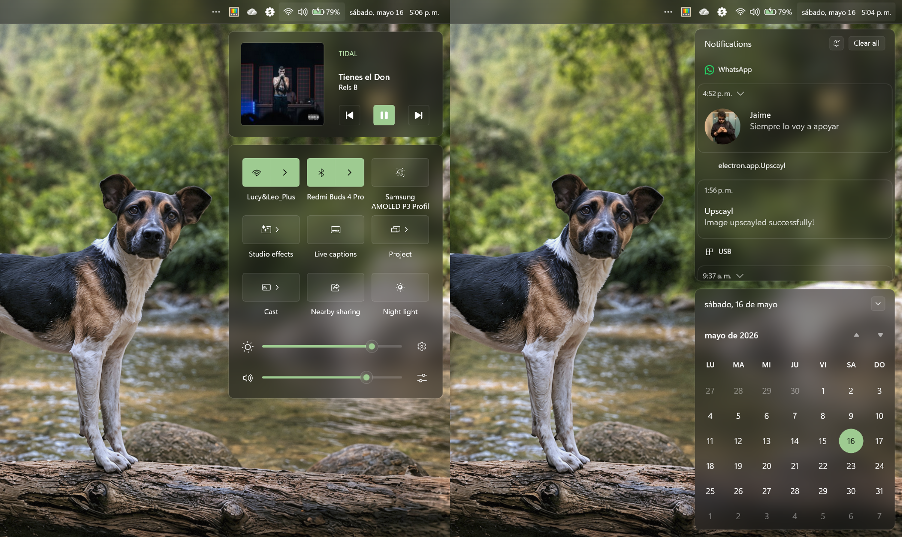

# SolidMist

A sleek theme custom-built for laptop displays running Windows 11 (25H2) in Dark Mode. While it works flawlessly on desktop setups, it was specifically designed to maximize the compact screen real estate of portable PCs. This tailored optimization is most evident in the SolisMist Taskbar and SolisMist Start Menu configurations.

[Solid-Mist](https://github.com/Acercandr0/Solid-Mist) collection.



## Theme selection

The theme is integrated into the mod and can be selected directly from the mod's
settings:

* Open the Windows 11 Notification Center Styler mod in Windhawk.
* Go to the "Settings" tab.
* Select the theme and save the settings.

## Manual installation

The theme styles can also be imported manually. To do that, follow these steps:

* Open the Windows 11 Notification Center Styler mod in Windhawk.
* Go to the "Settings" tab and select "Textual mode".
* Copy the content below to the text box and click "Save settings".

<details>
<summary>Content to import (click to expand)</summary>

```yaml
theme: ''
styleConstants:
  - bg=<WindhawkBlur BlurAmount="15" TintColor="{ThemeResource SystemChromeLowColor}" TintOpacity="0.5" />
  - bg2=<WindhawkBlur BlurAmount="10" TintColor="{ThemeResource SystemChromeLowColor}" TintOpacity="0.3" />
  - bgx=<WindhawkBlur BlurAmount="7" TintColor="{ThemeResource SystemChromeLowColor}" TintOpacity="0.3" />
  - border=<LinearGradientBrush StartPoint="0,0" EndPoint="0,1" Opacity="0.15"><GradientStop Color="{ThemeResource TextFillColorSecondary}" Offset="0.0"/><GradientStop Color="{ThemeResource TextFillColorTertiary}" Offset="0.5"/><GradientStop Color="{ThemeResource TextFillColorSecondary}" Offset="1.0"/></LinearGradientBrush>
  - r=10
  - r2=7
controlStyles:
  - target: Grid#NotificationCenterGrid
    styles:
      - Background:=$bg
      - BorderThickness=1
      - Shadow:=
      - BorderBrush:=$border
      - VerticalAlignment=Stretch
      - CornerRadius=$r
  - target: Grid#CalendarCenterGrid
    styles:
      - Background:=$bg
      - BorderThickness=1
      - Shadow:=
      - BorderBrush:=$border
      - CornerRadius=$r
  - target: Grid#ControlCenterRegion
    styles:
      - Background:=$bg
      - BorderThickness=1
      - Shadow:=
      - BorderBrush:=$border
      - CornerRadius=$r
  - target: Grid#MediaTransportControlsRegion
    styles:
      - Background:=$bg
      - BorderThickness=1
      - Shadow:=
      - BorderBrush:=$border
      - CornerRadius=$r
  - target: Border#ToastBackgroundBorder2
    styles:
      - CornerRadius=$r
      - Background:=$bg
      - BorderThickness=1
      - Shadow:=
      - BorderBrush=$border
  - target: MenuFlyoutPresenter
    styles:
      - CornerRadius=$r
      - Background:=$bg
      - BorderThickness=1
      - Shadow:=
      - BorderBrush:=$border
  - target: Border#JumpListRestyledAcrylic
    styles:
      - CornerRadius=$r
      - Background:=$bg
      - BorderThickness=1
      - Shadow:=
      - BorderBrush:=$border
  - target: ActionCenter.FlexibleToastView#FlexibleNormalToastView
    styles:
      - Background:=Transparent
      - Shadow:=
  - target: ActionCenter.FlexibleItemView
    styles:
      - Shadow:=
  - target: ScrollViewer#CalendarControlScrollViewer
    styles:
      - Background:=Transparent
      - BorderThickness=0
  - target: ScrollViewer#ListContent
    styles:
      - CornerRadius=$r
      - Background:=Transparent
      - Shadow:=
  - target: ContentPresenter#PageContent
    styles:
      - Background:=Transparent
      - Shadow:=
  - target: ContentPresenter#PageContent > Grid > Border
    styles:
      - Background:=Transparent
      - Shadow:=
  - target: QuickActions.ControlCenter.AccessibleWindow#PageWindow > ContentPresenter > Grid#FullScreenPageRoot
    styles:
      - Background:=Transparent
      - Shadow:=
  - target: QuickActions.ControlCenter.AccessibleWindow#PageWindow > ContentPresenter > Grid#FullScreenPageRoot > ContentPresenter#PageHeader
    styles:
      - Background:=Transparent
      - Shadow:=
  - target: Grid#NotificationCenterTopBanner
    styles:
      - Background:=Transparent
  - target: Grid#L1Grid > Border
    styles:
      - CornerRadius=$r
      - Background:=Transparent
  - target: Windows.UI.Xaml.Controls.Image#IconImage
    styles:
      - Visibility=1
  - target: TextBlock#AppNameText
    styles:
      - Margin=160,0,0,-40
      - Foreground:=<SolidColorBrush Color="{ThemeResource SystemAccentColorLight3}" Opacity="1" />
  - target: Windows.UI.Xaml.Controls.Button#SessionSwitchButton
    styles:
      - BorderBrush:=$border
  - target: StackPanel#PrimaryAndSecondaryTextContainer
    styles:
      - Margin=160,0,0,20
  - target: Grid#ThumbnailImage
    styles:
      - Grid.Column=0
      - Margin=-4,-10,0,0
      - Height=140
      - Width=140
      - BorderThickness=1
      - BorderBrush:=$border
      - CornerRadius=5
  - target: ListView#MediaButtonsListView
    styles:
      - RenderTransform:=<ScaleTransform ScaleX="0.85" ScaleY="0.85" />
      - RenderTransformOrigin=0.5,0.5
      - Margin=0,-38,-15,0
      - HorizontalAlignment=2
  - target: Windows.UI.Xaml.Controls.Primitives.ListViewItemPresenter#Root > Button > ContentPresenter#ContentPresenter
    styles:
      - BorderBrush:=$border
      - BorderThickness=1
      - Background:=<SolidColorBrush Color="{ThemeResource SystemAccentColorLight2}" Opacity="1" />
  - target: Windows.UI.Xaml.Controls.Primitives.RepeatButton > ContentPresenter#ContentPresenter
    styles:
      - BorderBrush:=$border
      - BorderThickness=1
  - target: Grid#MediaTransportControlsRoot
    styles:
      - Background:=Transparent
  - target: ContentPresenter > Border
    styles:
      - BorderBrush:=$border
  - target: ActionCenter.FocusSessionControl
    styles:
      - Height=0
  - target: Windows.UI.Xaml.Controls.Button#SessionSwitchButton
    styles:
      - Margin=0,0,-10,-40
  - target: ControlCenter.PaginatedToggleButton#ToggleButton > ContentPresenter#ContentPresenter
    styles:
      - BorderThickness=1
      - BorderBrush:=$border
  - target: Windows.UI.Xaml.Controls.Primitives.ToggleButton#DoNotDisturbButton
    styles:
      - BorderThickness=1
      - BorderBrush:=$border
  - target: Windows.UI.Xaml.Controls.Button#ClearAll
    styles:
      - BorderThickness=1
      - BorderBrush:=$border
  - target: ControlCenter.PaginatedToggleButton#SplitL2Button > ContentPresenter#ContentPresenter
    styles:
      - BorderThickness=0,1,1,1
      - BorderBrush:=$border
  - target: Button#VolumeL2Button > ContentPresenter#ContentPresenter > StackPanel > FontIcon[2] > Grid > TextBlock
    styles:
      - Visibility=1
  - target: Button#VolumeL2Button > ContentPresenter#ContentPresenter > StackPanel > FontIcon > Grid > TextBlock
    styles:
      - Text=
  - target: Windows.UI.Xaml.Controls.ContentControl#TogglesGroup > Windows.UI.Xaml.Controls.ContentPresenter > ControlCenter.PaginatedGridView > Windows.UI.Xaml.Controls.Grid
    styles:
      - BorderThickness=0
  - target: Microsoft.UI.Xaml.Controls.ItemsRepeater > Windows.UI.Xaml.Controls.Button
    styles:
      - Visibility=1
  - target: Button#NextPageButton
    styles:
      - Visibility=Collapsed
  - target: Button#PreviousPageButton
    styles:
      - Visibility=Collapsed
  - target: ControlCenter.ControlCenterPage
    styles:
      - RenderTransform:=<RotateTransform Angle="180" />
      - RenderTransformOrigin=0.5,0.5
      - VerticalAlignment=Stretch
  - target: ControlCenter.ControlCenterPage > Grid#RootGrid
    styles:
      - RenderTransform:=<RotateTransform Angle="180" />
      - RenderTransformOrigin=0.5,0.5
      - VerticalAlignment=Stretch
  - target: ControlCenter.PaginatedToggleButton#ToggleButton
    styles:
      - FocusVisualPrimaryThickness=0
      - FocusVisualSecondaryThickness=0
  - target: Grid#L1Grid > Border
    styles:
      - Margin=0
      - BorderBrush:=$border
      - BorderThickness=0
      - Height=120
      - VerticalAlignment=Bottom
      - CornerRadius=0
  - target: Grid#FooterGrid
    styles:
      - Grid.Row=1
      - BorderThickness=0
  - target: ControlCenter.ControlCenterView#ControlCenterView > Grid#RootGrid > Grid#L1Grid > Grid#FooterGrid > ItemsControl#RightFooter
    styles:
      - Margin=0,-24,5,0
  - target: Windows.UI.Xaml.Controls.Border#WADFeatureFooter
    styles:
      - BorderThickness=0,1,0,0
      - BorderBrush:=$border
  - target: ControlCenter.FullScreenPage#FullScreenPageControl > ContentControl#PageWindow > ContentPresenter > Grid#FullScreenPageRoot > ContentPresenter#PageContent > Grid > Grid
    styles:
      - BorderThickness=0,1,0,0
      - BorderBrush:=$border
  - target: ContentControl#PageWindow > ContentPresenter > Grid#FullScreenPageRoot > ContentPresenter#PageHeader
    styles:
      - Background:=Transparent
  - target: ItemsControl#LeftFooter
    styles:
      - Visibility=1
  - target: Button#FooterButton > ContentPresenter#ContentPresenter
    styles:
      - Margin=0
  - target: Windows.UI.Xaml.Shapes.Rectangle#HorizontalTrackRect
    styles:
      - Margin=0,-10,10,-10
      - Opacity=0.3
  - target: Windows.UI.Xaml.Shapes.Rectangle#HorizontalDecreaseRect
    styles:
      - Margin=0,-10,-10,-10
      - Height=4
  - target: Windows.UI.Xaml.Controls.Primitives.Thumb#HorizontalThumb
    styles:
      - Visibility=0
      - Height=20
      - Width=20
      - Margin=0
  - target: Windows.UI.Xaml.Controls.Primitives.Thumb#HorizontalThumb > Windows.UI.Xaml.Controls.Border
    styles:
      - Background:=<WindhawkBlur BlurAmount="5" TintColor="#00FFFFFF"/>
      - BorderBrush:=<SolidColorBrush Color="White" Opacity="0.2"/>
      - BorderThickness=1
      - CornerRadius=15
  - target: Windows.UI.Xaml.Controls.Primitives.Thumb#HorizontalThumb > Border > Shapes.Ellipse#SliderInnerThumb
    styles:
      - Visibility=0
  - target: Windows.UI.Xaml.Controls.Primitives.ScrollBar#VerticalScrollBar
    styles:
      - Visibility=1
  - target: Grid#SuggestionUIGrid
    styles:
      - Background:=$bg
      - CornerRadius=$r
  - target: Border#ItemOpaquePlating
    styles:
      - BorderThickness=1
      - BorderBrush:=$border
      - Background:=Transparent
      - CornerRadius=$r
  - target: ToolTip > ContentPresenter#LayoutRoot
    styles:
      - Background:=$bg2
      - BorderBrush:=$border
      - BorderThickness=1
      - Shadow:=
  - target: ToolTip > ContentPresenter
    styles:
      - BorderThickness=1
      - BorderBrush:=$border
      - CornerRadius=$r2
      - Shadow:=
  - target: ControlCenter.ControlCenterPage > Grid#RootGrid > Grid#RootContent
    styles:
      - VerticalAlignment=Top
      - Margin=0,12,0,0
  - target: ControlCenter.PaginatedGridView > Grid > GridView#RootGridView
    styles:
      - Height=280
themeResourceVariables:
  - ''
```

</details>