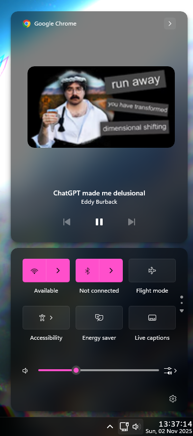

# TintedGlass theme for Windows 11 Notification Center Styler

**Author**: [TheRealCisWhiteMale](https://github.com/TheRealCisWhiteMale)



## Thumbnail image size

The default media control thumbnail size is 300x300, which might be too large
for small screens. You can change it by setting the value
`thumbnailImageSize=200`, where `200` is the desired size, in the "Style
constants" section of the mod's settings.

## Notes
* This taskbar theme is designed to be used in dark mode.

## Suggested Windhawk mods for full theme continuity
To achieve the full look, install and configure the following Windhawk mods in addition to Windows 11 Notification Center Styler:

- Windows 11 Taskbar Styler

[TintedGlass theme for Windows 11 Taskbar Styler](https://github.com/ramensoftware/windows-11-taskbar-styling-guide/blob/main/Themes/TintedGlass/README.md).

---

- Taskbar Clock Customization – for styling the clock. You will need to add your weather location if you have the desire to use that function and may need to change date formatting if you wish.

<details>
<summary>Click to expand mod settings</summary>

```yaml
ShowSeconds: 1
TimeFormat: HH':'mm':'ss
DateFormat: ddd',' dd MMM yyyy
WeekdayFormat: custom
WeekdayFormatCustom: Mon, Tue, Wed, Thu, Fri, Sat, Sun
TopLine: '%time%'
BottomLine: '%date%'
MiddleLine: '%weekday%'
TooltipLine: '%weather%'
TooltipLineMode: append
Width: 180
Height: 60
MaxWidth: 0
TextSpacing: -4
DataCollection:
  NetworkMetricsFormat: mbs
  NetworkMetricsFixedDecimals: -1
  PercentageFormat: spacePaddingAndSymbol
  UpdateInterval: 1
  NetworkAdapterName: ''
  GpuAdapterName: ''
MediaPlayer:
  IgnoredPlayers:
    - ''
  MaxLength: 28
  NoMediaText: No media
  RemoveBrackets: 0
WebContentWeatherLocation: ''
WebContentWeatherFormat: '%c 🌡️%t 🌬️%w'
WebContentWeatherUnits: autoDetect
WebContentsItems:
  - Url: https://rss.nytimes.com/services/xml/rss/nyt/World.xml
    BlockStart: <item>
    Start: <title>
    End: </title>
    ContentMode: xmlHtml
    SearchReplace:
      - Search: ''
        Replace: ''
    MaxLength: 28
WebContentsUpdateInterval: 10
TimeZones:
  - GMT Standard Time
TimeStyle:
  Hidden: 0
  TextColor: ''
  TextAlignment: Right
  FontSize: 16
  FontFamily: ''
  FontWeight: Medium
  FontStyle: ''
  FontStretch: ''
  CharacterSpacing: 70
DateStyle:
  Hidden: 0
  TextColor: ''
  TextAlignment: Right
  FontSize: 12
  FontFamily: ''
  FontWeight: ''
  FontStyle: ''
  FontStretch: ''
  CharacterSpacing: 0
oldTaskbarOnWin11: 0
DataCollectionUpdateInterval: 1
```
</details>

---

- Taskbar Height and Icon Size

<details>
<summary>Click to expand mod settings</summary>

```yaml
TaskbarHeight: 40
IconSize: 32
TaskbarButtonWidth: 40
IconSizeSmall: 16
TaskbarButtonWidthSmall: 32
```
</details>

---

- Taskbar Labels for Windows 11

<details>
<summary>Click to expand mod settings</summary>

```yaml
mode: labelsWithoutCombining
taskbarItemWidth: 0
runningIndicatorStyle: centerFixed
progressIndicatorStyle: sameAsRunningIndicatorStyle
excludedPrograms:
  - excluded1.exe
minimumTaskbarItemWidth: 43
maximumTaskbarItemWidth: 300
fontSize: 13
fontFamily: ''
textTrimming: clip
leftAndRightPaddingSize: 6
spaceBetweenIconAndLabel: 6
runningIndicatorHeight: 0
runningIndicatorVerticalOffset: 0
alwaysShowThumbnailLabels: 0
labelForSingleItem: '%name%'
labelForMultipleItems: '[%amount%] %name%'
```
</details>

---

- Windows 11 Start Menu Styler

[TintedGlass theme for Windows 11 Start Menu Styler](https://github.com/ramensoftware/windows-11-start-menu-styling-guide/blob/main/Themes/TintedGlass/README.md).

---

- Windows 11 File Explorer Styler

[TintedGlass theme for Windows 11 File Explorer Styler](https://github.com/ramensoftware/windows-11-file-explorer-styling-guide/blob/main/Themes/TintedGlass/README.md).

---

- Translucent Windows

<details>
<summary>Click to expand mod settings</summary>

```yaml
RenderingMod:
  ThemeBackground: 1
  SysColors: 1
  AccentColorControls: 1
  TextAlphaBlend: 1
type: acrylicblur
AccentBlurBehind: '80000000'
FlyoutsEffects: 1
ImmersiveDarkTitle: 1
ExtendFrame: 1
CornerOption: smallround
RainbowSpeed: 1
TitlebarColor:
  ColorTitlebar: 0
  RainbowTitlebar: 0
  titlerbarstyles_active: '0'
  titlerbarstyles_inactive: '0'
TitlebarTextColor:
  ColorTitlebarText: 0
  RainbowTextColor: 0
  titlerbarcolorstyles_active: FFFFFF
  titlerbarcolorstyles_inactive: FFFFFF
BorderColor:
  ColorBorder: 1
  RainbowBorder: 0
  borderstyles_active: '0'
  borderstyles_inactive: '0'
  MenuBorderColor: 1
RuledPrograms:
  - target: notepad.exe
    RenderingMod:
      ThemeBackground: 0
      AccentColorControls: 0
    type: acrylicsystem
    AccentBlurBehind: '80000000'
    ImmersiveDarkTitle: 1
    ExtendFrame: 0
    CornerOption: smallround
    RainbowSpeed: 1
    TitlebarColor:
      ColorTitlebar: 0
      RainbowTitlebar: 0
      titlerbarstyles_active: FF0000
      titlerbarstyles_inactive: 00FFFF
    TitlebarTextColor:
      ColorTitlebarText: 0
      RainbowTextColor: 0
      titlerbarcolorstyles_active: FFFFFF
      titlerbarcolorstyles_inactive: FFFFFF
    BorderColor:
      ColorBorder: 1
      RainbowBorder: 0
      borderstyles_active: '0'
      borderstyles_inactive: '0'
  - target: notepad++.exe
    RenderingMod:
      ThemeBackground: 0
      AccentColorControls: 0
    type: acrylicsystem
    AccentBlurBehind: '80000000'
    ImmersiveDarkTitle: 1
    ExtendFrame: 0
    CornerOption: smallround
    RainbowSpeed: 1
    TitlebarColor:
      ColorTitlebar: 0
      RainbowTitlebar: 0
      titlerbarstyles_active: FF0000
      titlerbarstyles_inactive: 00FFFF
    TitlebarTextColor:
      ColorTitlebarText: 0
      RainbowTextColor: 0
      titlerbarcolorstyles_active: FFFFFF
      titlerbarcolorstyles_inactive: FFFFFF
    BorderColor:
      ColorBorder: 1
      RainbowBorder: 0
      borderstyles_active: '0'
      borderstyles_inactive: '0'
```
</details>

---

- Taskbar Background Helper

<details>
<summary>Click to expand mod settings</summary>

```yaml
backgroundStyle: blur
color:
  red: 255
  green: 127
  blue: 39
  accentColor: 0
  transparency: 128
onlyWhenMaximized: 1
excludedPrograms:
  - ''
styleForDarkMode:
  use: 0
  backgroundStyle: blur
  color:
    red: 255
    green: 127
    blue: 39
    accentColor: 0
    transparency: 128
```
</details>

---

## Theme selection

The theme is integrated into the mod and can be selected directly from the mod's
settings:

* Open the Windows 11 Notification Center Styler mod in Windhawk.
* Go to the "Settings" tab.
* Select the theme and save the settings.

## Manual installation

The theme styles can also be imported manually. To do that, follow these steps:

* Open the Windows 11 Notification Center Styler mod in Windhawk.
* Go to the "Settings" tab and select "Textual mode".
* Copy the content below to the text box and click "Save settings".

<details>
<summary>Content to import (click to expand)</summary>

```yaml
styleConstants:
  - Base=<WindhawkBlur BlurAmount="18" TintColor="#80000000"/>
  - Radius=14
  - Transparent=<SolidColorBrush Color="Transparent"/>
  - Accent=<SolidColorBrush Color="{ThemeResource SystemAccentColorLight1}" Opacity = "1" />
  - Overlay=<WindhawkBlur BlurAmount="18" TintColor="#1AFFFFFF"/>
  - thumbnailImageSize=300
controlStyles:
  - target: Grid#NotificationCenterGrid
    styles:
      - Background:=$Base
      - BorderThickness=0,0,0,0
      - CornerRadius=$Radius
  - target: Grid#CalendarCenterGrid
    styles:
      - Background:=$Base
      - BorderThickness=0,0,0,0
      - CornerRadius=$Radius
  - target: ScrollViewer#CalendarControlScrollViewer
    styles:
      - BorderThickness=0,0,0,0
      - Background:=$Transparent
  - target: Border#CalendarHeaderMinimizedOverlay
    styles:
      - Background:=$Transparent
      - BorderThickness=0,0,0,0
  - target: ActionCenter.FocusSessionControl#FocusSessionControl > Grid#FocusGrid
    styles:
      - Background:=$Transparent
      - BorderThickness=0,0,0,0
  - target: MenuFlyoutPresenter > Border
    styles:
      - Background:=$Overlay
      - BorderThickness=0,0,0,0
      - CornerRadius=$Radius
      - Padding=2,4,2,4
  - target: Border#JumpListRestyledAcrylic
    styles:
      - Background:=$Base
      - BorderThickness=0,0,0,0
      - CornerRadius=$Radius
      - Margin=-2,-2,-2,-2
  - target: Grid#ControlCenterRegion
    styles:
      - Background:=$Base
      - BorderThickness=0,0,0,0
      - CornerRadius=$Radius
  - target: Grid#L1Grid > Border
    styles:
      - Background:=$Transparent
      - BorderThickness=0,0,0,0
  - target: Grid#MediaTransportControlsRegion
    styles:
      - Background:=$Base
      - BorderThickness=0,0,0,0
      - CornerRadius=$Radius
  - target: Grid#MediaTransportControlsRoot
    styles:
      - Background:=$Transparent
  - target: ContentPresenter#PageContent
    styles:
      - Background:=$Transparent
  - target: ContentPresenter#PageContent > Grid > Border
    styles:
      - Background:=$Transparent
  - target: QuickActions.ControlCenter.AccessibleWindow#PageWindow > ContentPresenter > Grid#FullScreenPageRoot
    styles:
      - Background:=$Transparent
  - target: QuickActions.ControlCenter.AccessibleWindow#PageWindow > ContentPresenter > Grid#FullScreenPageRoot > ContentPresenter#PageHeader
    styles:
      - Background:=$Transparent
  - target: ScrollViewer#ListContent
    styles:
      - Background:=$Transparent
  - target: ActionCenter.FlexibleToastView#FlexibleNormalToastView
    styles:
      - Background:=$Transparent
  - target: Border#ToastBackgroundBorder2
    styles:
      - Background:=$Base
      - BorderThickness=0,0,0,0
      - CornerRadius=$Radius
  - target: JumpViewUI.SystemItemListViewItem > Grid#LayoutRoot > Border#BackgroundBorder
    styles:
      - Background:=$Transparent
      - CornerRadius=$Radius
  - target: JumpViewUI.JumpListListViewItem > Grid#LayoutRoot > Border#BackgroundBorder
    styles:
      - CornerRadius=$Radius
  - target: ActionCenter.FlexibleItemView
    styles:
      - CornerRadius=$Radius
  - target: Grid#MediaTransportControlsRegion
    styles:
      - Height=Auto
  - target: Grid#ThumbnailImage
    styles:
      - Width=$thumbnailImageSize
      - Height=$thumbnailImageSize
      - HorizontalAlignment=Center
      - VerticalAlignment=Top
      - Grid.Column=1
      - Margin=0,2,0,45
  - target: Grid#ThumbnailImage > Border
    styles:
      - CornerRadius=$Radius
  - target: StackPanel#PrimaryAndSecondaryTextContainer
    styles:
      - VerticalAlignment=Bottom
      - Grid.Column=0
  - target: StackPanel#PrimaryAndSecondaryTextContainer > TextBlock#TitleText
    styles:
      - TextAlignment=Center
  - target: StackPanel#PrimaryAndSecondaryTextContainer > TextBlock#SubtitleText
    styles:
      - TextAlignment=Center
  - target: ContentControl#TogglesGroup > ContentPresenter > ControlCenter.PaginatedGridView > Grid
    styles:
      - BorderThickness=0,0,0,0
  - target: Grid#FooterGrid
    styles:
      - BorderThickness=0,0,0,0
```
</details>
