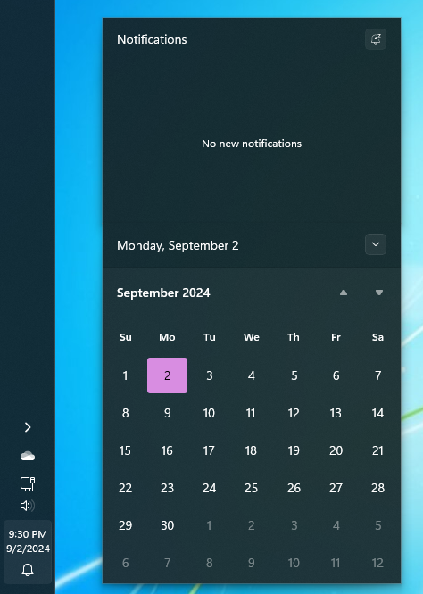
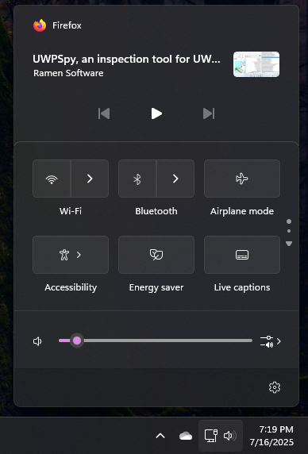

# Unified theme for Windows 11 Notification Center Styler

**Author**: [SandTechStuff](https://github.com/SandTechStuff)

 \


## Theme selection

The theme is not integrated directly in the mod, so you need to manually install it.

## Manual installation

* Open the Windows 11 Notification Center Styler mod in Windhawk.
* Go to the "Advanced" tab.
* Copy the content below to the text box under "Mod settings" and click "Save".

<details>
<summary>Content to import (click to expand)</summary>

```json
{
"controlStyles[0].target":"ActionCenter.FocusSessionControl",
"controlStyles[0].styles[0]":"Height=0",
"controlStyles[1].target":"Windows.UI.Xaml.Controls.Grid#ControlCenterRegion",
"controlStyles[1].styles[0]":"CornerRadius=0",
"controlStyles[2].target":"Windows.UI.Xaml.Controls.Grid#CalendarCenterGrid",
"controlStyles[2].styles[0]":"CornerRadius=0",
"controlStyles[3].target":"Windows.UI.Xaml.Controls.Grid#NotificationCenterGrid",
"controlStyles[3].styles[0]":"CornerRadius=0",
"controlStyles[2].styles[1]":"Margin=0,0,0,12",
"controlStyles[2].styles[2]":"BorderThickness=1,0,1,1",
"controlStyles[4].target":"Windows.UI.Xaml.Controls.CalendarViewDayItem",
"controlStyles[4].styles[0]":"CornerRadius=0",
"controlStyles[5].target":"Windows.UI.Xaml.Controls.CalendarViewDayItem > Windows.UI.Xaml.Controls.Border",
"controlStyles[5].styles[0]":"CornerRadius=3",
"controlStyles[4].styles[1]":"Margin=1,1,1,1",
"controlStyles[6].target":"Windows.UI.Xaml.Controls.Grid#MediaTransportControlsRegion",
"controlStyles[6].styles[0]":"CornerRadius=0",
"controlStyles[6].styles[1]":"BorderThickness=1,1,1,0",
"controlStyles[6].styles[2]":"Margin=0,0,0,0",
"controlStyles[7].target":"QuickActions.ControlCenter.FrameWithContentChanged#L2Frame",
"controlStyles[7].styles[0]":"CornerRadius=0",
"controlStyles[3].styles[1]":"BorderThickness=1,1,1,0"
}
```
</details>
