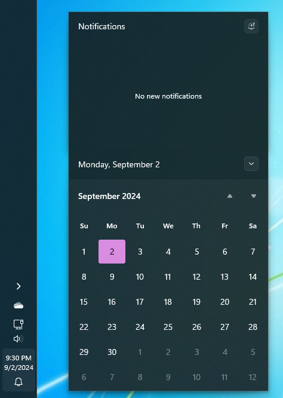
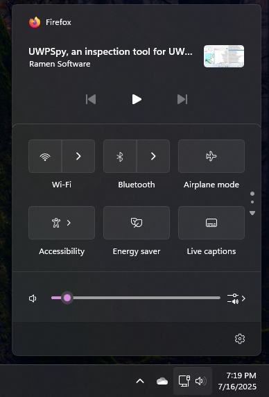

# Unified theme for Windows 11 Notification Center Styler

**Author**: [SandTechStuff](https://github.com/SandTechStuff)

 \


## Theme selection

The theme is integrated into the mod and can be selected directly from the mod's
settings:

* Open the Windows 11 Notification Center Styler mod in Windhawk.
* Go to the "Settings" tab.
* Select the theme and save the settings.

## Manual installation

The theme styles can also be imported manually. To do that, follow these steps:

* Open the Windows 11 Notification Center Styler mod in Windhawk.
* Go to the "Advanced" tab.
* Copy the content below to the text box under "Mod settings" and click "Save".

<details>
<summary>Content to import (click to expand)</summary>

```yaml
controlStyles:
  - target: ActionCenter.FocusSessionControl
    styles:
      - Height=0
  - target: Windows.UI.Xaml.Controls.Grid#CalendarCenterGrid
    styles:
      - CornerRadius=0,0,6,6
      - Margin=0,0,0,12
      - BorderThickness=1,0,1,1
  - target: Windows.UI.Xaml.Controls.Grid#NotificationCenterGrid
    styles:
      - CornerRadius=6,6,0,0
  - target: Windows.UI.Xaml.Controls.Grid#MediaTransportControlsRegion
    styles:
      - CornerRadius=6,6,0,0
      - BorderThickness=1,1,1,0
      - Margin=0,0,0,-6
  - target: Windows.UI.Xaml.Controls.Border#CalendarHeaderMinimizedOverlay
    styles:
      - Visibility=Visible
  - target: Windows.UI.Xaml.Controls.ScrollViewer#CalendarControlScrollViewer
    styles:
      - BorderThickness=0
  - target: Windows.UI.Xaml.Controls.ContentPresenter
    styles:
      - BackgroundTransition:=<BrushTransition Duration="0:0:0.083"/>
  - target: Windows.UI.Xaml.Controls.Primitives.ListViewItemPresenter#Root > Windows.UI.Xaml.Controls.Border
    styles:
      - BackgroundTransition:=<BrushTransition Duration="0:0:0.083"/>
  - target: Windows.UI.Xaml.Controls.ComboBox > Windows.UI.Xaml.Controls.Grid > Windows.UI.Xaml.Controls.Border
    styles:
      - BackgroundTransition:=<BrushTransition Duration="0:0:0.083"/>
  - target: Windows.UI.Xaml.Controls.CalendarViewDayItem > Windows.UI.Xaml.Controls.Border
    styles:
      - BackgroundTransition:=<BrushTransition Duration="0:0:0.083"/>
  - target: Windows.UI.Xaml.Controls.Control > Windows.UI.Xaml.Controls.Border
    styles:
      - BackgroundTransition:=<BrushTransition Duration="0:0:0.083"/>
```
</details>
