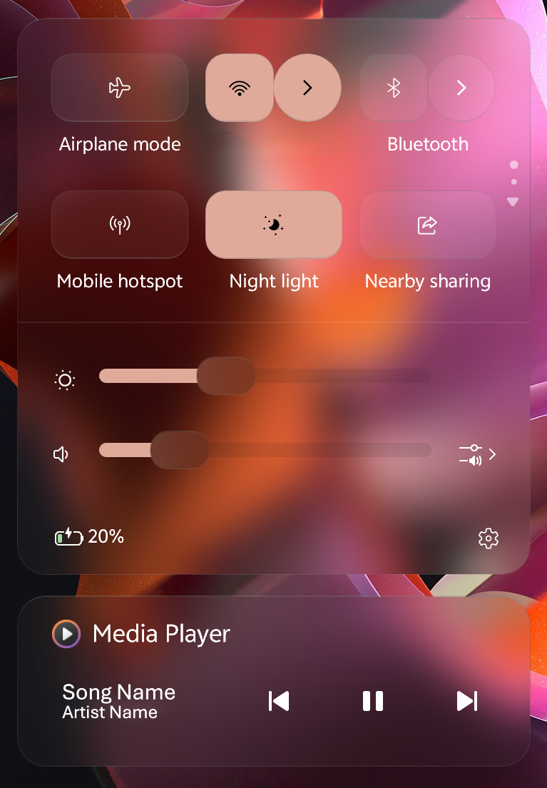
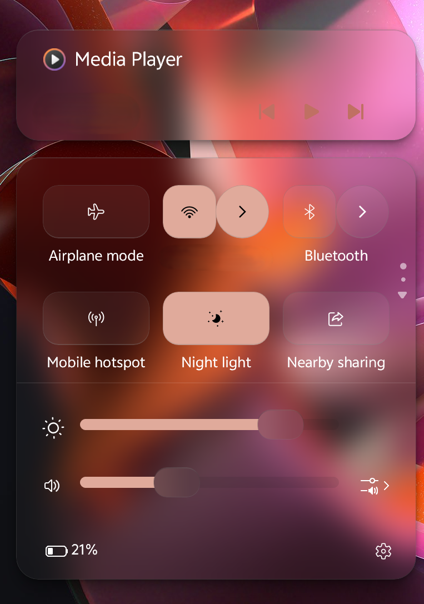

# WindowGlass theme for Windows 11 Notification Center Styler

A theme that adds a modern, glassy aesthetic with a semi-compact layout to Windows 11's Notification and Action Center.

**Author**: [Nathaniel4JC](https://github.com/Nathaniel4JC)

## Action Center


## Notification Center


## Notes
- Works best on devices running windows 11 24H2 and above.
- Works best on devices with a screen resolution of 1930x1200 and above.
- This theme consists of the following backgrounds:
  - Translucent
  - Glass
  - Frosted
  - Acrylic

  In order to switch between these backgrounds, set the value `Background=$Translucent`, `Background=$Glass`, `Background=$Frosted` or `Background=$Acrylic` in the "Style constants" section of the mod's settings.

## For a complete WindowGlass-themed UI, download the following mods and use the 'WindowGlass' theme:
- Windows 11 TaskBar Styler - for styling the taskbar.
- Windows 11 Start Menu Styler - for styling the Windows Start menu.
- Windows 11 File Explorer Styler - for styling Windows Explorer windows.

---

## Theme selection

The theme is integrated into the mod and can simply be selected from the mod's
settings:

* Open the Windows 11 Notification Center Styler mod in Windhawk.
* Go to the "Settings" tab.
* Select the theme and save the settings.

## Manual installation

The theme styles can also be imported manually. To do that, follow these steps:

* Open the Windows 11 Notification Center Styler mod in Windhawk.
* Go to the "Advanced" tab.
* Copy the content below to the text box under "Mod settings" and click "Save".

<details>
<summary>Content to import (click to expand)</summary>

```json
{
  "controlStyles[0].target": "Grid#NotificationCenterGrid",
  "controlStyles[0].styles[0]": "Background:=$Background",
  "controlStyles[0].styles[1]": "BorderThickness=$BorderThickness",
  "controlStyles[0].styles[2]": "CornerRadius=$CornerRadius",
  "controlStyles[0].styles[3]": "BorderBrush:=$BorderBrush",
  "controlStyles[1].target": "Grid#CalendarCenterGrid",
  "controlStyles[1].styles[0]": "Background:=$Background",
  "controlStyles[1].styles[1]": "BorderThickness=$BorderThickness",
  "controlStyles[1].styles[2]": "CornerRadius=$CornerRadius",
  "controlStyles[1].styles[3]": "Margin=0,6,0,6",
  "controlStyles[1].styles[4]": "MinHeight=40",
  "controlStyles[1].styles[5]": "BorderBrush:=$BorderBrush",
  "controlStyles[2].target": "ScrollViewer#CalendarControlScrollViewer",
  "controlStyles[2].styles[0]": "Background:=$ElementBG",
  "controlStyles[2].styles[1]": "CornerRadius=$CR2",
  "controlStyles[2].styles[2]": "Margin=-10,11,-10,-14",
  "controlStyles[2].styles[3]": "BorderBrush:=$ElementBorderBrush",
  "controlStyles[2].styles[4]": "BorderThickness=$ElementBorderThickness",
  "controlStyles[3].target": "Border#CalendarHeaderMinimizedOverlay",
  "controlStyles[3].styles[0]": "Background:=$ElementBG",
  "controlStyles[3].styles[1]": "CornerRadius=$CR2",
  "controlStyles[3].styles[2]": "Margin=-10,-6,-10,-8",
  "controlStyles[3].styles[3]": "Height=45",
  "controlStyles[3].styles[4]": "BorderBrush:=$ElementBorderBrush",
  "controlStyles[3].styles[5]": "BorderThickness=$ElementBorderThickness",
  "controlStyles[4].target": "ActionCenter.FocusSessionControl#FocusSessionControl > Grid#FocusGrid",
  "controlStyles[4].styles[0]": "Background:=$Background",
  "controlStyles[4].styles[1]": "CornerRadius=$CR2",
  "controlStyles[4].styles[2]": "Margin=6,7,6,6",
  "controlStyles[4].styles[3]": "BorderThickness=$BorderThickness",
  "controlStyles[4].styles[4]": "BorderBrush:=$BorderBrush",
  "controlStyles[5].target": "MenuFlyoutPresenter > Border",
  "controlStyles[5].styles[0]": "Background:=$Background",
  "controlStyles[5].styles[1]": "BorderThickness=$BorderThickness",
  "controlStyles[5].styles[2]": "CornerRadius=$CR3",
  "controlStyles[5].styles[3]": "Padding=1,2,1,2",
  "controlStyles[5].styles[4]": "BorderBrush:=$BorderBrush",
  "controlStyles[6].target": "MenuFlyoutItem > Grid#LayoutRoot",
  "controlStyles[6].styles[0]": "CornerRadius=6",
  "controlStyles[7].target": "Border#JumpListRestyledAcrylic",
  "controlStyles[7].styles[0]": "Background:=$Background",
  "controlStyles[7].styles[1]": "BorderThickness=$BorderThickness",
  "controlStyles[7].styles[2]": "CornerRadius=$CR3",
  "controlStyles[7].styles[3]": "Margin=-2,-2,-2,-2",
  "controlStyles[7].styles[4]": "BorderBrush:=$BorderBrush",
  "controlStyles[8].target": "Windows.UI.Xaml.Controls.Grid#ControlCenterRegion",
  "controlStyles[8].styles[0]": "Background:=$Background",
  "controlStyles[8].styles[1]": "CornerRadius=$CornerRadius",
  "controlStyles[8].styles[2]": "BorderThickness=$BorderThickness",
  "controlStyles[8].styles[3]": "BorderBrush:=$BorderBrush",
  "controlStyles[9].target": "ContentPresenter#PageContent",
  "controlStyles[9].styles[0]": "Background=Transparent",
  "controlStyles[10].target": "ContentPresenter#PageContent > Grid > Border",
  "controlStyles[10].styles[0]": "Background:=$overlay",
  "controlStyles[10].styles[1]": "CornerRadius=$CR2",
  "controlStyles[10].styles[2]": "Margin=8,0,8,2",
  "controlStyles[11].target": "QuickActions.ControlCenter.AccessibleWindow#PageWindow > ContentPresenter > Grid#FullScreenPageRoot",
  "controlStyles[11].styles[0]": "Background=Transparent",
  "controlStyles[12].target": "QuickActions.ControlCenter.AccessibleWindow#PageWindow > ContentPresenter > Grid#FullScreenPageRoot > ContentPresenter#PageHeader",
  "controlStyles[12].styles[0]": "Background:=$overlay",
  "controlStyles[12].styles[1]": "CornerRadius=$CR2",
  "controlStyles[12].styles[2]": "Margin=7,7,7,7",
  "controlStyles[13].target": "ScrollViewer#ListContent",
  "controlStyles[13].styles[0]": "Background:=$overlay",
  "controlStyles[13].styles[1]": "CornerRadius=$CR2",
  "controlStyles[13].styles[2]": "Margin=8,0,8,0",
  "controlStyles[14].target": "ActionCenter.FlexibleToastView#FlexibleNormalToastView",
  "controlStyles[14].styles[0]": "Background=Transparent",
  "controlStyles[15].target": "Border#ToastBackgroundBorder2",
  "controlStyles[15].styles[0]": "Background:=$Background",
  "controlStyles[15].styles[1]": "BorderThickness=$BorderThickness",
  "controlStyles[15].styles[2]": "CornerRadius=16",
  "controlStyles[15].styles[3]": "BorderBrush:=$BorderBrush",
  "controlStyles[16].target": "JumpViewUI.SystemItemListViewItem > Grid#LayoutRoot > Border#BackgroundBorder",
  "controlStyles[16].styles[0]": "Background:=Trabsparent",
  "controlStyles[16].styles[1]": "CornerRadius=8",
  "controlStyles[17].target": "JumpViewUI.JumpListListViewItem > Grid#LayoutRoot > Border#BackgroundBorder",
  "controlStyles[17].styles[0]": "CornerRadius=6",
  "controlStyles[18].target": "ActionCenter.FlexibleItemView",
  "controlStyles[18].styles[0]": "CornerRadius=16",
  "controlStyles[19].target": "Grid#NotificationCenterTopBanner",
  "controlStyles[19].styles[0]": "Background=Transparent",
  "controlStyles[19].styles[1]": "CornerRadius=$CR2",
  "controlStyles[19].styles[2]": "Margin=6",
  "controlStyles[20].target": "Windows.UI.Xaml.Controls.Grid#L1Grid > Border",
  "controlStyles[20].styles[0]": "Background=Transparent",
  "controlStyles[21].target": "Windows.UI.Xaml.Controls.ContentPresenter",
  "controlStyles[21].styles[0]": "BorderThickness=0",
  "controlStyles[22].target": "Windows.UI.Xaml.Controls.Button#FooterButton[AutomationProperties.Name=Edit quick settings]",
  "controlStyles[22].styles[0]": "Margin=0,0,8,0",
  "controlStyles[22].styles[1]": "CornerRadius=$CR3",
  "controlStyles[23].target": "Windows.UI.Xaml.Controls.Button[AutomationProperties.AutomationId=Microsoft.QuickAction.Battery]",
  "controlStyles[23].styles[0]": "Margin=2,0,0,0",
  "controlStyles[23].styles[1]": "CornerRadius=$CR3",
  "controlStyles[24].target": "Windows.UI.Xaml.Controls.Button#FooterButton[AutomationProperties.Name=All settings]",
  "controlStyles[24].styles[0]": "Margin=0,0,-1,0",
  "controlStyles[24].styles[1]": "CornerRadius=13",
  "controlStyles[24].styles[2]": "BorderThickness=$BorderThickness",
  "controlStyles[25].target": "Windows.UI.Xaml.Controls.Button[AutomationProperties.AutomationId=Microsoft.QuickAction.Volume]",
  "controlStyles[25].styles[0]": "CornerRadius=10",
  "controlStyles[26].target": "Windows.UI.Xaml.Controls.Button#VolumeL2Button[AutomationProperties.Name=Select a sound output]",
  "controlStyles[26].styles[0]": "CornerRadius=10",
  "controlStyles[27].target": "Windows.UI.Xaml.Shapes.Rectangle#HorizontalTrackRect",
  "controlStyles[27].styles[0]": "Height=10",
  "controlStyles[27].styles[1]": "Fill:=$overlay",
  "controlStyles[27].styles[2]": "RadiusY=5",
  "controlStyles[27].styles[3]": "RadiusX=5",
  "controlStyles[27].styles[4]": "Margin=0,-10,10,-10",
  "controlStyles[28].target": "Windows.UI.Xaml.Shapes.Rectangle#HorizontalDecreaseRect",
  "controlStyles[28].styles[0]": "Height=10",
  "controlStyles[28].styles[1]": "RadiusY=5",
  "controlStyles[28].styles[2]": "RadiusX=5",
  "controlStyles[28].styles[3]": "Margin=0,-10,-10,-10",
  "controlStyles[29].target": "Windows.UI.Xaml.Controls.Primitives.Thumb#HorizontalThumb",
  "controlStyles[29].styles[0]": "Visibility=Visible",
  "controlStyles[29].styles[1]": "Height=25",
  "controlStyles[29].styles[2]": "Width=40",
  "controlStyles[29].styles[3]": "Margin=0",
  "controlStyles[30].target": "Windows.UI.Xaml.Controls.Grid#MediaTransportControlsRegion",
  "controlStyles[30].styles[0]": "Height=100",
  "controlStyles[30].styles[1]": "CornerRadius=$CornerRadius",
  "controlStyles[30].styles[2]": "BorderThickness=$BorderThickness",
  "controlStyles[30].styles[3]": "Background:=$Background",
  "controlStyles[30].styles[4]": "Margin=0,10,0,0",
  "controlStyles[30].styles[5]": "BorderBrush:=$BorderBrush",
  "controlStyles[30].styles[6]": "Grid.Row=1",
  "controlStyles[31].target": "Windows.UI.Xaml.Controls.Grid#AlbumTextAndArtContainer",
  "controlStyles[31].styles[0]": "Height=55",
  "controlStyles[31].styles[1]": "MaxWidth=150",
  "controlStyles[31].styles[2]": "HorizontalAlignment=Left",
  "controlStyles[32].target": "Windows.UI.Xaml.Controls.Grid#ThumbnailImage",
  "controlStyles[32].styles[0]": "Visibility=1",
  "controlStyles[33].target": "Windows.UI.Xaml.Controls.StackPanel#PrimaryAndSecondaryTextContainer",
  "controlStyles[33].styles[0]": "VerticalAlignment=Center",
  "controlStyles[33].styles[1]": "HorizontalAlignment=Left",
  "controlStyles[33].styles[2]": "Margin=0,0,10,0",
  "controlStyles[34].target": "Windows.UI.Xaml.Controls.StackPanel#PrimaryAndSecondaryTextContainer > Windows.UI.Xaml.Controls.TextBlock#Title",
  "controlStyles[34].styles[0]": "TextAlignment=Center",
  "controlStyles[34].styles[1]": "FontSize=18",
  "controlStyles[35].target": "Windows.UI.Xaml.Controls.StackPanel#PrimaryAndSecondaryTextContainer > Windows.UI.Xaml.Controls.TextBlock#Subtitle",
  "controlStyles[35].styles[0]": "TextAlignment=Center",
  "controlStyles[35].styles[1]": "FontFamily=vivo Sans EN VF",
  "controlStyles[35].styles[2]": "Margin=0,3,0,0",
  "controlStyles[35].styles[3]": "FontWeight=600",
  "controlStyles[36].target": "Windows.UI.Xaml.Controls.ListView#MediaButtonsListView",
  "controlStyles[36].styles[0]": "VerticalAlignment=Center",
  "controlStyles[36].styles[1]": "Height=20",
  "controlStyles[36].styles[2]": "Margin=130,-60,0,0",
  "controlStyles[36].styles[3]": "Width=Auto",
  "controlStyles[36].styles[4]": "HorizontalAlignment=Right",
  "controlStyles[36].styles[5]": "Visibility=2",
  "controlStyles[37].target": "Windows.UI.Xaml.Controls.Primitives.RepeatButton#PreviousButton",
  "controlStyles[37].styles[0]": "Width=40",
  "controlStyles[37].styles[1]": "Height=40",
  "controlStyles[37].styles[2]": "Margin=10,0,0,0",
  "controlStyles[38].target": "Windows.UI.Xaml.Controls.Button#PlayPauseButton",
  "controlStyles[38].styles[0]": "Width=40",
  "controlStyles[38].styles[1]": "Height=40",
  "controlStyles[38].styles[2]": "Margin=0",
  "controlStyles[39].target": "Windows.UI.Xaml.Controls.Primitives.RepeatButton#NextButton",
  "controlStyles[39].styles[0]": "Width=40",
  "controlStyles[39].styles[1]": "Height=30",
  "controlStyles[39].styles[2]": "Margin=0,0,10,0",
  "controlStyles[40].target": "Windows.UI.Xaml.Controls.TextBlock#AppNameText",
  "controlStyles[40].styles[0]": "FontFamily=vivo Sans EN VF",
  "controlStyles[40].styles[1]": "FontSize=16",
  "controlStyles[41].target": "Windows.UI.Xaml.Controls.Image#IconImage",
  "controlStyles[41].styles[0]": "Height=20",
  "controlStyles[41].styles[1]": "Width=20",
  "controlStyles[42].target": "Grid#MediaTransportControlsRoot",
  "controlStyles[42].styles[0]": "Background=Transparent",
  "controlStyles[43].target": "Grid#ToastPeekRegion",
  "controlStyles[43].styles[0]": "Background=",
  "controlStyles[43].styles[1]": "RenderTransform:=<TranslateTransform Y=\"-495\" X=\"395\" />",
  "controlStyles[43].styles[2]": "Grid.Column=0",
  "controlStyles[43].styles[3]": "Grid.Row=2",
  "controlStyles[44].target": "Windows.UI.Xaml.Controls.CalendarViewDayItem > Windows.UI.Xaml.Controls.Border",
  "controlStyles[44].styles[0]": "CornerRadius=8",
  "controlStyles[44].styles[1]": "Margin=1,2,1,2",
  "controlStyles[45].target": "Windows.UI.Xaml.Controls.CalendarViewDayItem",
  "controlStyles[45].styles[0]": "CornerRadius=8",
  "controlStyles[46].target": "Windows.UI.Xaml.Controls.Control > Windows.UI.Xaml.Controls.Border",
  "controlStyles[46].styles[0]": "CornerRadius=8",
  "controlStyles[47].target": "Windows.UI.Xaml.Controls.Primitives.CalendarViewItem",
  "controlStyles[47].styles[0]": "CornerRadius=8",
  "controlStyles[48].target": "Windows.UI.Xaml.Controls.ListViewHeaderItem",
  "controlStyles[48].styles[0]": "Margin=50,6,50,2",
  "controlStyles[48].styles[1]": "CornerRadius=8",
  "controlStyles[48].styles[2]": "Height=35",
  "controlStyles[49].target": "Windows.UI.Xaml.Controls.Button#SettingsButton",
  "controlStyles[49].styles[0]": "CornerRadius=4",
  "controlStyles[50].target": "Windows.UI.Xaml.Controls.Button#DismissButton",
  "controlStyles[50].styles[0]": "CornerRadius=4",
  "controlStyles[51].target": "Windows.UI.Xaml.Controls.StackPanel#CalendarHeader",
  "controlStyles[51].styles[0]": "Margin=6,0,0,0",
  "controlStyles[52].target": "Windows.UI.Xaml.Controls.ScrollContentPresenter#ScrollContentPresenter",
  "controlStyles[52].styles[0]": "Margin=1,2,1,2",
  "controlStyles[53].target": "Windows.UI.Xaml.Controls.Grid#WeekDayNames",
  "controlStyles[53].styles[0]": "Background:=$ElementSysColor",
  "controlStyles[53].styles[1]": "CornerRadius=8",
  "controlStyles[53].styles[2]": "Margin=4,0,4,0",
  "controlStyles[53].styles[3]": "Padding=0,-5,0,-3",
  "controlStyles[54].target": "Windows.UI.Xaml.Controls.ListViewItem",
  "controlStyles[54].styles[0]": "CornerRadius=$CR3",
  "controlStyles[55].target": "Windows.UI.Xaml.Controls.Grid#RootGrid > Windows.UI.Xaml.Controls.ContentPresenter#ContentPresenter",
  "controlStyles[55].styles[0]": "Background:=<SolidColorBrush Color=\"{ThemeResource SystemAccentColorLight1}\" Opacity=\"0.5\"/>",
  "controlStyles[55].styles[1]": "BorderThickness=0",
  "controlStyles[55].styles[2]": "CornerRadius=8",
  "controlStyles[56].target": "Windows.UI.Xaml.Controls.Grid > Windows.UI.Xaml.Controls.Border#ItemOpaquePlating",
  "controlStyles[56].styles[0]": "Background:=$overlay2",
  "controlStyles[56].styles[1]": "BorderThickness=0",
  "controlStyles[56].styles[2]": "CornerRadius=$CR3",
  "controlStyles[57].target": "Windows.UI.Xaml.Controls.Grid#StandardHeroContainer",
  "controlStyles[57].styles[0]": "Margin=12,0,12,0",
  "controlStyles[57].styles[1]": "CornerRadius=0",
  "controlStyles[57].styles[2]": "Height=150",
  "controlStyles[58].target": "Windows.UI.Xaml.Controls.Primitives.ScrollBar#VerticalScrollBar",
  "controlStyles[58].styles[0]": "Visibility=1",
  "controlStyles[59].target": "Windows.UI.Xaml.Controls.Grid#SliderContainer",
  "controlStyles[59].styles[0]": "Margin=0-2,0,0",
  "controlStyles[60].target": "Windows.UI.Xaml.Controls.Button#BackButton",
  "controlStyles[60].styles[0]": "CornerRadius=$CR3",
  "controlStyles[61].target": "Windows.UI.Xaml.Shapes.Rectangle#OuterBorder",
  "controlStyles[61].styles[0]": "RadiusX=8",
  "controlStyles[61].styles[1]": "RadiusY=8",
  "controlStyles[61].styles[2]": "Height=18",
  "controlStyles[62].target": "Windows.UI.Xaml.Shapes.Rectangle#SwitchKnobOff",
  "controlStyles[62].styles[0]": "RadiusY=8",
  "controlStyles[62].styles[1]": "RadiusX=8",
  "controlStyles[63].target": "Windows.UI.Xaml.Controls.Border#SwitchKnobOn",
  "controlStyles[63].styles[0]": "CornerRadius=8",
  "controlStyles[64].target": "Windows.UI.Xaml.Shapes.Rectangle#SwitchKnobBounds",
  "controlStyles[64].styles[0]": "RadiusX=8",
  "controlStyles[64].styles[1]": "RadiusY=8",
  "controlStyles[64].styles[2]": "Height=18",
  "controlStyles[65].target": "ActionCenter.NotificationListViewItem",
  "controlStyles[65].styles[0]": "Margin=5,2,5,3",
  "controlStyles[66].target": "Windows.UI.Xaml.Controls.Grid[AutomationProperties.LocalizedLandmarkType=Footer]",
  "controlStyles[66].styles[0]": "BorderThickness=0",
  "controlStyles[67].target": "NetworkUX.View.SettingsListViewItem > Windows.UI.Xaml.Controls.Primitives.ListViewItemPresenter#Root",
  "controlStyles[67].styles[0]": "CornerRadius=12",
  "controlStyles[68].target": "Windows.UI.Xaml.Controls.ContentPresenter > Windows.UI.Xaml.Controls.Border",
  "controlStyles[68].styles[0]": "BorderThickness=0",
  "controlStyles[69].target": "Button#ClearAll",
  "controlStyles[69].styles[0]": "AccessKey=x",
  "controlStyles[70].target": "Button#ExpandCollapseButton",
  "controlStyles[70].styles[0]": "AccessKey=e",
  "controlStyles[71].target": "ControlCenter.PaginatedToggleButton#ToggleButton > Windows.UI.Xaml.Controls.ContentPresenter#ContentPresenter",
  "controlStyles[71].styles[0]": "CornerRadius=$CR2",
  "controlStyles[71].styles[1]": "BorderThickness=$ElementBorderThickness",
  "controlStyles[71].styles[2]": "BorderBrush:=$ElementBorderBrush",
  "controlStyles[72].target": "ControlCenter.PaginatedToggleButton#SplitL2Button > Windows.UI.Xaml.Controls.ContentPresenter#ContentPresenter",
  "controlStyles[72].styles[0]": "CornerRadius=30",
  "controlStyles[72].styles[1]": "BorderThickness=$ElementBorderThickness",
  "controlStyles[72].styles[2]": "BorderBrush:=$ElementBorderBrush",
  "controlStyles[73].target": "Windows.UI.Xaml.Controls.Primitives.Thumb#HorizontalThumb > Windows.UI.Xaml.Controls.Border",
  "controlStyles[73].styles[0]": "CornerRadius=12",
  "controlStyles[73].styles[1]": "Background:=$Background",
  "controlStyles[73].styles[2]": "BorderBrush:=$BorderBrush",
  "controlStyles[73].styles[3]": "BorderThickness=$BorderThickness",
  "controlStyles[74].target": "Windows.UI.Xaml.Controls.Primitives.Thumb#HorizontalThumb > Windows.UI.Xaml.Controls.Border > Windows.UI.Xaml.Shapes.Ellipse#SliderInnerThumb",
  "controlStyles[74].styles[0]": "Visibility=Collapsed",
  "controlStyles[75].target": "Windows.UI.Xaml.Controls.ToolTip > Windows.UI.Xaml.Controls.ContentPresenter#LayoutRoot",
  "controlStyles[75].styles[0]": "Background:=$Background",
  "controlStyles[75].styles[1]": "BorderBrush:=$BorderBrush",
  "controlStyles[75].styles[2]": "BorderThickness=$BorderThickness",
  "controlStyles[75].styles[3]": "CornerRadius=10",
  "controlStyles[76].target": "Windows.UI.Xaml.Controls.Primitives.RepeatButton#PreviousButton > Windows.UI.Xaml.Controls.ContentPresenter#ContentPresenter@CommonStates",
  "controlStyles[76].styles[0]": "Foreground@Normal:=$ElementSysColor",
  "controlStyles[76].styles[1]": "Foreground@PointerOver:=$ElementSysColor2",
  "controlStyles[76].styles[2]": "Foreground@Pressed:=$ElementSysColor3",
  "controlStyles[76].styles[3]": "Foreground@Disabled:=$ElementSysColor4",
  "controlStyles[76].styles[4]": "Background=Transparent",
  "controlStyles[77].target": "Windows.UI.Xaml.Controls.Button#PlayPauseButton > Windows.UI.Xaml.Controls.ContentPresenter#ContentPresenter@CommonStates",
  "controlStyles[77].styles[0]": "Foreground@Normal:=$ElementSysColor",
  "controlStyles[77].styles[1]": "Foreground@PointerOver:=$ElementSysColor2",
  "controlStyles[77].styles[2]": "Foreground@Pressed:=$ElementSysColor3",
  "controlStyles[77].styles[3]": "Foreground@Disabled:=$ElementSysColor4",
  "controlStyles[77].styles[4]": "Background=Transparent",
  "controlStyles[78].target": "Windows.UI.Xaml.Controls.Primitives.RepeatButton#NextButton > Windows.UI.Xaml.Controls.ContentPresenter#ContentPresenter@CommonStates",
  "controlStyles[78].styles[0]": "Foreground@Normal:=$ElementSysColor",
  "controlStyles[78].styles[1]": "Foreground@PointerOver:=$ElementSysColor2",
  "controlStyles[78].styles[2]": "Foreground@Pressed:=$ElementSysColor3",
  "controlStyles[78].styles[3]": "Foreground@Disabled:=$ElementSysColor4",
  "controlStyles[78].styles[4]": "Background=Transparent",
  "controlStyles[79].target": "Grid#ControlCenterRegion",
  "controlStyles[79].styles[0]": "Grid.Row=0",
  "controlStyles[80].target": "ControlCenter.MediaTransportControls",
  "controlStyles[80].styles[0]": "VerticalAlignment=2",
  "controlStyles[80].styles[1]": "Grid.Row=1",
  "controlStyles[80].styles[2]": "Canvas.ZIndex=1",
  "controlStyles[81].target": "Grid#RootGrid",
  "controlStyles[81].styles[0]": "VerticalAlignment=3",
  "controlStyles[81].styles[1]": "MinHeight=0",
  "styleConstants[0]": "Translucent=<WindhawkBlur BlurAmount=\"15\" TintColor=\"#10808080\"/>",
  "styleConstants[1]": "Glass=<WindhawkBlur BlurAmount=\"3\" TintColor=\"{ThemeResource SystemChromeMediumColor}\" TintOpacity=\"0.7\" />",
  "styleConstants[2]": "Frosted=<WindhawkBlur BlurAmount=\"20\" TintColor=\"{ThemeResource SystemChromeMediumColor}\" TintOpacity=\"0.7\" />",
  "styleConstants[3]": "Acrylic=<AcrylicBrush TintColor=\"{ThemeResource SystemChromeAltHighColor}\" TintOpacity=\"0.3\" FallbackColor=\"{ThemeResource SystemChromeAltHighColor}\" />",
  "styleConstants[4]": "Background=$Translucent",
  "styleConstants[5]": "BorderBrush=<LinearGradientBrush StartPoint=\"0,0\" EndPoint=\"0,1\"><GradientStop Color=\"#50808080\" Offset=\"0.0\" /><GradientStop Color=\"#50404040\" Offset=\"0.25\" /><GradientStop Color=\"#50808080\" Offset=\"1\" /></LinearGradientBrush>",
  "styleConstants[6]": "BorderBrush2=<LinearGradientBrush StartPoint=\"0,0\" EndPoint=\"0,1\"><GradientStop Color=\"{ThemeResource SystemChromeHighColor}\" Offset=\"0.0\" /><GradientStop Color=\"{ThemeResource SystemChromeLowColor}\" Offset=\"0.15\" /><GradientStop Color=\"{ThemeResource SystemChromeHighColor}\" Offset=\"0.95\" /></LinearGradientBrush>",
  "styleConstants[7]": "overlay=<SolidColorBrush Color=\"{ThemeResource SystemChromeAltHighColor}\" Opacity=\"0.1\" />",
  "styleConstants[8]": "overlay2=<WindhawkBlur BlurAmount=\"20\" TintColor=\"#60353535\"/>",
  "styleConstants[9]": "CornerRadius=20",
  "styleConstants[10]": "CR2=14",
  "styleConstants[11]": "CR3=12",
  "styleConstants[12]": "BorderThickness=0.3,1,0.3,0.3",
  "styleConstants[13]": "ElementBG=<SolidColorBrush Color=\"{ThemeResource SystemChromeAltHighColor}\" Opacity=\"0.3\" />",
  "styleConstants[14]": "ElementBorderBrush=<LinearGradientBrush StartPoint=\"0,0\" EndPoint=\"0,1\"><GradientStop Color=\"#50808080\" Offset=\"1\" /><GradientStop Color=\"#50606060\" Offset=\"0.15\" /></LinearGradientBrush>",
  "styleConstants[15]": "ElementCornerRadius=20",
  "styleConstants[16]": "ElementBorderThickness=0.3,0.3,0.3,1",
  "styleConstants[17]": "ElementSysColor=<SolidColorBrush Color=\"{ThemeResource SystemAccentColorLight1}\" Opacity=\"1\" />",
  "styleConstants[18]": "ElementSysColor2=<SolidColorBrush Color=\"{ThemeResource SystemAccentColorLight2}\" Opacity=\"1\" />",
  "styleConstants[19]": "ElementSysColor3=<SolidColorBrush Color=\"{ThemeResource SystemAccentColorLight3}\" Opacity=\"1\" />",
  "styleConstants[20]": "ElementSysColor4=<SolidColorBrush Color=\"{ThemeResource SystemAccentColorDark1}\" Opacity=\"1\" />"
}
```
</details>

## Alternate Version

This theme is also available with an alternate version that places the media controls on the top of the Action Center, instead of the bottom.

## Action Center


<details>
<summary>Content to import (click to expand)</summary>

```json
{
  "controlStyles[0].target": "Grid#NotificationCenterGrid",
  "controlStyles[0].styles[0]": "Background:=$Background",
  "controlStyles[0].styles[1]": "BorderThickness=$BorderThickness",
  "controlStyles[0].styles[2]": "CornerRadius=$CornerRadius",
  "controlStyles[0].styles[3]": "BorderBrush:=$BorderBrush",
  "controlStyles[1].target": "Grid#CalendarCenterGrid",
  "controlStyles[1].styles[0]": "Background:=$Background",
  "controlStyles[1].styles[1]": "BorderThickness=$BorderThickness",
  "controlStyles[1].styles[2]": "CornerRadius=$CornerRadius",
  "controlStyles[1].styles[3]": "Margin=0,6,0,6",
  "controlStyles[1].styles[4]": "MinHeight=40",
  "controlStyles[1].styles[5]": "BorderBrush:=$BorderBrush",
  "controlStyles[2].target": "ScrollViewer#CalendarControlScrollViewer",
  "controlStyles[2].styles[0]": "Background:=$ElementBG",
  "controlStyles[2].styles[1]": "CornerRadius=$CR2",
  "controlStyles[2].styles[2]": "Margin=-10,11,-10,-14",
  "controlStyles[2].styles[3]": "BorderBrush:=$ElementBorderBrush",
  "controlStyles[2].styles[4]": "BorderThickness=$ElementBorderThickness",
  "controlStyles[3].target": "Border#CalendarHeaderMinimizedOverlay",
  "controlStyles[3].styles[0]": "Background:=$ElementBG",
  "controlStyles[3].styles[1]": "CornerRadius=$CR2",
  "controlStyles[3].styles[2]": "Margin=-10,-6,-10,-8",
  "controlStyles[3].styles[3]": "Height=45",
  "controlStyles[3].styles[4]": "BorderBrush:=$ElementBorderBrush",
  "controlStyles[3].styles[5]": "BorderThickness=$ElementBorderThickness",
  "controlStyles[4].target": "ActionCenter.FocusSessionControl#FocusSessionControl > Grid#FocusGrid",
  "controlStyles[4].styles[0]": "Background:=$Background",
  "controlStyles[4].styles[1]": "CornerRadius=$CR2",
  "controlStyles[4].styles[2]": "Margin=6,7,6,6",
  "controlStyles[4].styles[3]": "BorderThickness=$BorderThickness",
  "controlStyles[4].styles[4]": "BorderBrush:=$BorderBrush",
  "controlStyles[5].target": "MenuFlyoutPresenter > Border",
  "controlStyles[5].styles[0]": "Background:=$Background",
  "controlStyles[5].styles[1]": "BorderThickness=$BorderThickness",
  "controlStyles[5].styles[2]": "CornerRadius=$CR3",
  "controlStyles[5].styles[3]": "Padding=1,2,1,2",
  "controlStyles[5].styles[4]": "BorderBrush:=$BorderBrush",
  "controlStyles[6].target": "MenuFlyoutItem > Grid#LayoutRoot",
  "controlStyles[6].styles[0]": "CornerRadius=6",
  "controlStyles[7].target": "Border#JumpListRestyledAcrylic",
  "controlStyles[7].styles[0]": "Background:=$Background",
  "controlStyles[7].styles[1]": "BorderThickness=$BorderThickness",
  "controlStyles[7].styles[2]": "CornerRadius=$CR3",
  "controlStyles[7].styles[3]": "Margin=-2,-2,-2,-2",
  "controlStyles[7].styles[4]": "BorderBrush:=$BorderBrush",
  "controlStyles[8].target": "Windows.UI.Xaml.Controls.Grid#ControlCenterRegion",
  "controlStyles[8].styles[0]": "Background:=$Background",
  "controlStyles[8].styles[1]": "CornerRadius=$CornerRadius",
  "controlStyles[8].styles[2]": "BorderThickness=$BorderThickness",
  "controlStyles[8].styles[3]": "Margin=0,5,0,0",
  "controlStyles[8].styles[4]": "BorderBrush:=$BorderBrush",
  "controlStyles[9].target": "ContentPresenter#PageContent",
  "controlStyles[9].styles[0]": "Background=Transparent",
  "controlStyles[10].target": "ContentPresenter#PageContent > Grid > Border",
  "controlStyles[10].styles[0]": "Background:=$overlay",
  "controlStyles[10].styles[1]": "CornerRadius=$CR2",
  "controlStyles[10].styles[2]": "Margin=8,0,8,2",
  "controlStyles[11].target": "QuickActions.ControlCenter.AccessibleWindow#PageWindow > ContentPresenter > Grid#FullScreenPageRoot",
  "controlStyles[11].styles[0]": "Background=Transparent",
  "controlStyles[12].target": "QuickActions.ControlCenter.AccessibleWindow#PageWindow > ContentPresenter > Grid#FullScreenPageRoot > ContentPresenter#PageHeader",
  "controlStyles[12].styles[0]": "Background:=$overlay",
  "controlStyles[12].styles[1]": "CornerRadius=$CR2",
  "controlStyles[12].styles[2]": "Margin=7,7,7,7",
  "controlStyles[13].target": "ScrollViewer#ListContent",
  "controlStyles[13].styles[0]": "Background:=$overlay",
  "controlStyles[13].styles[1]": "CornerRadius=$CR2",
  "controlStyles[13].styles[2]": "Margin=8,0,8,0",
  "controlStyles[14].target": "ActionCenter.FlexibleToastView#FlexibleNormalToastView",
  "controlStyles[14].styles[0]": "Background=Transparent",
  "controlStyles[15].target": "Border#ToastBackgroundBorder2",
  "controlStyles[15].styles[0]": "Background:=$Background",
  "controlStyles[15].styles[1]": "BorderThickness=$BorderThickness",
  "controlStyles[15].styles[2]": "CornerRadius=16",
  "controlStyles[15].styles[3]": "BorderBrush:=$BorderBrush",
  "controlStyles[16].target": "JumpViewUI.SystemItemListViewItem > Grid#LayoutRoot > Border#BackgroundBorder",
  "controlStyles[16].styles[0]": "Background:=Trabsparent",
  "controlStyles[16].styles[1]": "CornerRadius=8",
  "controlStyles[17].target": "JumpViewUI.JumpListListViewItem > Grid#LayoutRoot > Border#BackgroundBorder",
  "controlStyles[17].styles[0]": "CornerRadius=6",
  "controlStyles[18].target": "ActionCenter.FlexibleItemView",
  "controlStyles[18].styles[0]": "CornerRadius=16",
  "controlStyles[19].target": "Grid#NotificationCenterTopBanner",
  "controlStyles[19].styles[0]": "Background=Transparent",
  "controlStyles[19].styles[1]": "CornerRadius=$CR2",
  "controlStyles[19].styles[2]": "Margin=6",
  "controlStyles[20].target": "Windows.UI.Xaml.Controls.Grid#L1Grid > Border",
  "controlStyles[20].styles[0]": "Background=Transparent",
  "controlStyles[21].target": "Windows.UI.Xaml.Controls.ContentPresenter",
  "controlStyles[21].styles[0]": "BorderThickness=0",
  "controlStyles[22].target": "Windows.UI.Xaml.Controls.Button#FooterButton[AutomationProperties.Name=Edit quick settings]",
  "controlStyles[22].styles[0]": "Margin=0,0,8,0",
  "controlStyles[22].styles[1]": "CornerRadius=$CR3",
  "controlStyles[23].target": "Windows.UI.Xaml.Controls.Button[AutomationProperties.AutomationId=Microsoft.QuickAction.Battery]",
  "controlStyles[23].styles[0]": "Margin=2,0,0,0",
  "controlStyles[23].styles[1]": "CornerRadius=$CR3",
  "controlStyles[24].target": "Windows.UI.Xaml.Controls.Button#FooterButton[AutomationProperties.Name=All settings]",
  "controlStyles[24].styles[0]": "Margin=0,0,-1,0",
  "controlStyles[24].styles[1]": "CornerRadius=13",
  "controlStyles[24].styles[2]": "BorderThickness=$BorderThickness",
  "controlStyles[25].target": "Windows.UI.Xaml.Controls.Button[AutomationProperties.AutomationId=Microsoft.QuickAction.Volume]",
  "controlStyles[25].styles[0]": "CornerRadius=10",
  "controlStyles[26].target": "Windows.UI.Xaml.Controls.Button#VolumeL2Button[AutomationProperties.Name=Select a sound output]",
  "controlStyles[26].styles[0]": "CornerRadius=10",
  "controlStyles[27].target": "Windows.UI.Xaml.Shapes.Rectangle#HorizontalTrackRect",
  "controlStyles[27].styles[0]": "Height=10",
  "controlStyles[27].styles[1]": "Fill:=$overlay",
  "controlStyles[27].styles[2]": "RadiusY=5",
  "controlStyles[27].styles[3]": "RadiusX=5",
  "controlStyles[27].styles[4]": "Margin=0,-10,10,-10",
  "controlStyles[28].target": "Windows.UI.Xaml.Shapes.Rectangle#HorizontalDecreaseRect",
  "controlStyles[28].styles[0]": "Height=10",
  "controlStyles[28].styles[1]": "RadiusY=5",
  "controlStyles[28].styles[2]": "RadiusX=5",
  "controlStyles[28].styles[3]": "Margin=0,-10,-10,-10",
  "controlStyles[29].target": "Windows.UI.Xaml.Controls.Primitives.Thumb#HorizontalThumb",
  "controlStyles[29].styles[0]": "Visibility=Visible",
  "controlStyles[29].styles[1]": "Height=25",
  "controlStyles[29].styles[2]": "Width=40",
  "controlStyles[29].styles[3]": "Margin=0",
  "controlStyles[30].target": "Windows.UI.Xaml.Controls.Grid#MediaTransportControlsRegion",
  "controlStyles[30].styles[0]": "Height=100",
  "controlStyles[30].styles[1]": "CornerRadius=$CornerRadius",
  "controlStyles[30].styles[2]": "BorderThickness=$BorderThickness",
  "controlStyles[30].styles[3]": "Background:=$Background",
  "controlStyles[30].styles[4]": "Margin=0,20,0,5",
  "controlStyles[30].styles[5]": "BorderBrush:=$BorderBrush",
  "controlStyles[31].target": "Windows.UI.Xaml.Controls.Grid#AlbumTextAndArtContainer",
  "controlStyles[31].styles[0]": "Height=55",
  "controlStyles[31].styles[1]": "MaxWidth=150",
  "controlStyles[31].styles[2]": "HorizontalAlignment=Left",
  "controlStyles[32].target": "Windows.UI.Xaml.Controls.Grid#ThumbnailImage",
  "controlStyles[32].styles[0]": "Visibility=1",
  "controlStyles[33].target": "Windows.UI.Xaml.Controls.StackPanel#PrimaryAndSecondaryTextContainer",
  "controlStyles[33].styles[0]": "VerticalAlignment=Center",
  "controlStyles[33].styles[1]": "HorizontalAlignment=Left",
  "controlStyles[33].styles[2]": "Margin=0,0,10,0",
  "controlStyles[34].target": "Windows.UI.Xaml.Controls.StackPanel#PrimaryAndSecondaryTextContainer > Windows.UI.Xaml.Controls.TextBlock#Title",
  "controlStyles[34].styles[0]": "TextAlignment=Center",
  "controlStyles[34].styles[1]": "FontSize=18",
  "controlStyles[35].target": "Windows.UI.Xaml.Controls.StackPanel#PrimaryAndSecondaryTextContainer > Windows.UI.Xaml.Controls.TextBlock#Subtitle",
  "controlStyles[35].styles[0]": "TextAlignment=Center",
  "controlStyles[35].styles[1]": "FontFamily=vivo Sans EN VF",
  "controlStyles[35].styles[2]": "Margin=0,3,0,0",
  "controlStyles[35].styles[3]": "FontWeight=600",
  "controlStyles[36].target": "Windows.UI.Xaml.Controls.ListView#MediaButtonsListView",
  "controlStyles[36].styles[0]": "VerticalAlignment=Center",
  "controlStyles[36].styles[1]": "Height=20",
  "controlStyles[36].styles[2]": "Margin=130,-60,0,0",
  "controlStyles[36].styles[3]": "Width=Auto",
  "controlStyles[36].styles[4]": "HorizontalAlignment=Right",
  "controlStyles[36].styles[5]": "Visibility=2",
  "controlStyles[37].target": "Windows.UI.Xaml.Controls.Primitives.RepeatButton#PreviousButton",
  "controlStyles[37].styles[0]": "Width=40",
  "controlStyles[37].styles[1]": "Height=40",
  "controlStyles[37].styles[2]": "Margin=10,0,0,0",
  "controlStyles[38].target": "Windows.UI.Xaml.Controls.Button#PlayPauseButton",
  "controlStyles[38].styles[0]": "Width=40",
  "controlStyles[38].styles[1]": "Height=40",
  "controlStyles[38].styles[2]": "Margin=0",
  "controlStyles[39].target": "Windows.UI.Xaml.Controls.Primitives.RepeatButton#NextButton",
  "controlStyles[39].styles[0]": "Width=40",
  "controlStyles[39].styles[1]": "Height=30",
  "controlStyles[39].styles[2]": "Margin=0,0,10,0",
  "controlStyles[40].target": "Windows.UI.Xaml.Controls.TextBlock#AppNameText",
  "controlStyles[40].styles[0]": "FontFamily=vivo Sans EN VF",
  "controlStyles[40].styles[1]": "FontSize=16",
  "controlStyles[41].target": "Windows.UI.Xaml.Controls.Image#IconImage",
  "controlStyles[41].styles[0]": "Height=20",
  "controlStyles[41].styles[1]": "Width=20",
  "controlStyles[42].target": "Grid#MediaTransportControlsRoot",
  "controlStyles[42].styles[0]": "Background=Transparent",
  "controlStyles[43].target": "Grid#ToastPeekRegion",
  "controlStyles[43].styles[0]": "Background=",
  "controlStyles[43].styles[1]": "RenderTransform:=<TranslateTransform Y=\"-495\" X=\"395\" />",
  "controlStyles[43].styles[2]": "Grid.Column=0",
  "controlStyles[43].styles[3]": "Grid.Row=2",
  "controlStyles[44].target": "Windows.UI.Xaml.Controls.CalendarViewDayItem > Windows.UI.Xaml.Controls.Border",
  "controlStyles[44].styles[0]": "CornerRadius=8",
  "controlStyles[44].styles[1]": "Margin=1,2,1,2",
  "controlStyles[45].target": "Windows.UI.Xaml.Controls.CalendarViewDayItem",
  "controlStyles[45].styles[0]": "CornerRadius=8",
  "controlStyles[46].target": "Windows.UI.Xaml.Controls.Control > Windows.UI.Xaml.Controls.Border",
  "controlStyles[46].styles[0]": "CornerRadius=8",
  "controlStyles[47].target": "Windows.UI.Xaml.Controls.Primitives.CalendarViewItem",
  "controlStyles[47].styles[0]": "CornerRadius=8",
  "controlStyles[48].target": "Windows.UI.Xaml.Controls.ListViewHeaderItem",
  "controlStyles[48].styles[0]": "Margin=50,6,50,2",
  "controlStyles[48].styles[1]": "CornerRadius=8",
  "controlStyles[48].styles[2]": "Height=35",
  "controlStyles[49].target": "Windows.UI.Xaml.Controls.Button#SettingsButton",
  "controlStyles[49].styles[0]": "CornerRadius=4",
  "controlStyles[50].target": "Windows.UI.Xaml.Controls.Button#DismissButton",
  "controlStyles[50].styles[0]": "CornerRadius=4",
  "controlStyles[51].target": "Windows.UI.Xaml.Controls.StackPanel#CalendarHeader",
  "controlStyles[51].styles[0]": "Margin=6,0,0,0",
  "controlStyles[52].target": "Windows.UI.Xaml.Controls.ScrollContentPresenter#ScrollContentPresenter",
  "controlStyles[52].styles[0]": "Margin=1,2,1,2",
  "controlStyles[53].target": "Windows.UI.Xaml.Controls.Grid#WeekDayNames",
  "controlStyles[53].styles[0]": "Background:=$ElementSysColor",
  "controlStyles[53].styles[1]": "CornerRadius=8",
  "controlStyles[53].styles[2]": "Margin=4,0,4,0",
  "controlStyles[53].styles[3]": "Padding=0,-5,0,-3",
  "controlStyles[54].target": "Windows.UI.Xaml.Controls.ListViewItem",
  "controlStyles[54].styles[0]": "CornerRadius=$CR3",
  "controlStyles[55].target": "Windows.UI.Xaml.Controls.Grid#RootGrid > Windows.UI.Xaml.Controls.ContentPresenter#ContentPresenter",
  "controlStyles[55].styles[0]": "Background:=<SolidColorBrush Color=\"{ThemeResource SystemAccentColorLight1}\" Opacity=\"0.5\"/>",
  "controlStyles[55].styles[1]": "BorderThickness=0",
  "controlStyles[55].styles[2]": "CornerRadius=8",
  "controlStyles[56].target": "Windows.UI.Xaml.Controls.Grid > Windows.UI.Xaml.Controls.Border#ItemOpaquePlating",
  "controlStyles[56].styles[0]": "Background:=$overlay2",
  "controlStyles[56].styles[1]": "BorderThickness=0",
  "controlStyles[56].styles[2]": "CornerRadius=$CR3",
  "controlStyles[57].target": "Windows.UI.Xaml.Controls.Grid#StandardHeroContainer",
  "controlStyles[57].styles[0]": "Margin=12,0,12,0",
  "controlStyles[57].styles[1]": "CornerRadius=0",
  "controlStyles[57].styles[2]": "Height=150",
  "controlStyles[58].target": "Windows.UI.Xaml.Controls.Primitives.ScrollBar#VerticalScrollBar",
  "controlStyles[58].styles[0]": "Visibility=1",
  "controlStyles[59].target": "Windows.UI.Xaml.Controls.Grid#SliderContainer",
  "controlStyles[59].styles[0]": "Margin=0-2,0,0",
  "controlStyles[60].target": "Windows.UI.Xaml.Controls.Button#BackButton",
  "controlStyles[60].styles[0]": "CornerRadius=$CR3",
  "controlStyles[61].target": "Windows.UI.Xaml.Shapes.Rectangle#OuterBorder",
  "controlStyles[61].styles[0]": "RadiusX=8",
  "controlStyles[61].styles[1]": "RadiusY=8",
  "controlStyles[61].styles[2]": "Height=18",
  "controlStyles[62].target": "Windows.UI.Xaml.Shapes.Rectangle#SwitchKnobOff",
  "controlStyles[62].styles[0]": "RadiusY=8",
  "controlStyles[62].styles[1]": "RadiusX=8",
  "controlStyles[63].target": "Windows.UI.Xaml.Controls.Border#SwitchKnobOn",
  "controlStyles[63].styles[0]": "CornerRadius=8",
  "controlStyles[64].target": "Windows.UI.Xaml.Shapes.Rectangle#SwitchKnobBounds",
  "controlStyles[64].styles[0]": "RadiusX=8",
  "controlStyles[64].styles[1]": "RadiusY=8",
  "controlStyles[64].styles[2]": "Height=18",
  "controlStyles[65].target": "ActionCenter.NotificationListViewItem",
  "controlStyles[65].styles[0]": "Margin=5,2,5,3",
  "controlStyles[66].target": "Windows.UI.Xaml.Controls.Grid[AutomationProperties.LocalizedLandmarkType=Footer]",
  "controlStyles[66].styles[0]": "BorderThickness=0",
  "controlStyles[67].target": "NetworkUX.View.SettingsListViewItem > Windows.UI.Xaml.Controls.Primitives.ListViewItemPresenter#Root",
  "controlStyles[67].styles[0]": "CornerRadius=12",
  "controlStyles[68].target": "Windows.UI.Xaml.Controls.ContentPresenter > Windows.UI.Xaml.Controls.Border",
  "controlStyles[68].styles[0]": "BorderThickness=0",
  "controlStyles[69].target": "Button#ClearAll",
  "controlStyles[69].styles[0]": "AccessKey=x",
  "controlStyles[70].target": "Button#ExpandCollapseButton",
  "controlStyles[70].styles[0]": "AccessKey=e",
  "controlStyles[71].target": "ControlCenter.PaginatedToggleButton#ToggleButton > Windows.UI.Xaml.Controls.ContentPresenter#ContentPresenter",
  "controlStyles[71].styles[0]": "CornerRadius=$CR2",
  "controlStyles[71].styles[1]": "BorderThickness=$ElementBorderThickness",
  "controlStyles[71].styles[2]": "BorderBrush:=$ElementBorderBrush",
  "controlStyles[72].target": "ControlCenter.PaginatedToggleButton#SplitL2Button > Windows.UI.Xaml.Controls.ContentPresenter#ContentPresenter",
  "controlStyles[72].styles[0]": "CornerRadius=30",
  "controlStyles[72].styles[1]": "BorderThickness=$ElementBorderThickness",
  "controlStyles[72].styles[2]": "BorderBrush:=$ElementBorderBrush",
  "controlStyles[73].target": "Windows.UI.Xaml.Controls.Primitives.Thumb#HorizontalThumb > Windows.UI.Xaml.Controls.Border",
  "controlStyles[73].styles[0]": "CornerRadius=12",
  "controlStyles[73].styles[1]": "Background:=$Background",
  "controlStyles[73].styles[2]": "BorderBrush:=$BorderBrush",
  "controlStyles[73].styles[3]": "BorderThickness=$BorderThickness",
  "controlStyles[74].target": "Windows.UI.Xaml.Controls.Primitives.Thumb#HorizontalThumb > Windows.UI.Xaml.Controls.Border > Windows.UI.Xaml.Shapes.Ellipse#SliderInnerThumb",
  "controlStyles[74].styles[0]": "Visibility=Collapsed",
  "controlStyles[75].target": "Windows.UI.Xaml.Controls.ToolTip > Windows.UI.Xaml.Controls.ContentPresenter#LayoutRoot",
  "controlStyles[75].styles[0]": "Background:=$Background",
  "controlStyles[75].styles[1]": "BorderBrush:=$BorderBrush",
  "controlStyles[75].styles[2]": "BorderThickness=$BorderThickness",
  "controlStyles[75].styles[3]": "CornerRadius=10",
  "controlStyles[76].target": "Windows.UI.Xaml.Controls.Primitives.RepeatButton#PreviousButton > Windows.UI.Xaml.Controls.ContentPresenter#ContentPresenter@CommonStates",
  "controlStyles[76].styles[0]": "Foreground@Normal:=$ElementSysColor",
  "controlStyles[76].styles[1]": "Foreground@PointerOver:=$ElementSysColor2",
  "controlStyles[76].styles[2]": "Foreground@Pressed:=$ElementSysColor3",
  "controlStyles[76].styles[3]": "Foreground@Disabled:=$ElementSysColor4",
  "controlStyles[76].styles[4]": "Background=Transparent",
  "controlStyles[77].target": "Windows.UI.Xaml.Controls.Button#PlayPauseButton > Windows.UI.Xaml.Controls.ContentPresenter#ContentPresenter@CommonStates",
  "controlStyles[77].styles[0]": "Foreground@Normal:=$ElementSysColor",
  "controlStyles[77].styles[1]": "Foreground@PointerOver:=$ElementSysColor2",
  "controlStyles[77].styles[2]": "Foreground@Pressed:=$ElementSysColor3",
  "controlStyles[77].styles[3]": "Foreground@Disabled:=$ElementSysColor4",
  "controlStyles[77].styles[4]": "Background=Transparent",
  "controlStyles[78].target": "Windows.UI.Xaml.Controls.Primitives.RepeatButton#NextButton > Windows.UI.Xaml.Controls.ContentPresenter#ContentPresenter@CommonStates",
  "controlStyles[78].styles[0]": "Foreground@Normal:=$ElementSysColor",
  "controlStyles[78].styles[1]": "Foreground@PointerOver:=$ElementSysColor2",
  "controlStyles[78].styles[2]": "Foreground@Pressed:=$ElementSysColor3",
  "controlStyles[78].styles[3]": "Foreground@Disabled:=$ElementSysColor4",
  "controlStyles[78].styles[4]": "Background=Transparent",
  "styleConstants[0]": "Translucent=<WindhawkBlur BlurAmount=\"15\" TintColor=\"#10808080\"/>",
  "styleConstants[1]": "Glass=<WindhawkBlur BlurAmount=\"3\" TintColor=\"{ThemeResource SystemChromeMediumColor}\" TintOpacity=\"0.7\" />",
  "styleConstants[2]": "Frosted=<WindhawkBlur BlurAmount=\"20\" TintColor=\"{ThemeResource SystemChromeMediumColor}\" TintOpacity=\"0.7\" />",
  "styleConstants[3]": "Acrylic=<AcrylicBrush TintColor=\"{ThemeResource SystemChromeAltHighColor}\" TintOpacity=\"0.3\" FallbackColor=\"{ThemeResource SystemChromeAltHighColor}\" />",
  "styleConstants[4]": "Background=$Translucent",
  "styleConstants[5]": "BorderBrush=<LinearGradientBrush StartPoint=\"0,0\" EndPoint=\"0,1\"><GradientStop Color=\"#50808080\" Offset=\"0.0\" /><GradientStop Color=\"#50404040\" Offset=\"0.25\" /><GradientStop Color=\"#50808080\" Offset=\"1\" /></LinearGradientBrush>",
  "styleConstants[6]": "BorderBrush2=<LinearGradientBrush StartPoint=\"0,0\" EndPoint=\"0,1\"><GradientStop Color=\"{ThemeResource SystemChromeHighColor}\" Offset=\"0.0\" /><GradientStop Color=\"{ThemeResource SystemChromeLowColor}\" Offset=\"0.15\" /><GradientStop Color=\"{ThemeResource SystemChromeHighColor}\" Offset=\"0.95\" /></LinearGradientBrush>",
  "styleConstants[7]": "overlay=<SolidColorBrush Color=\"{ThemeResource SystemChromeAltHighColor}\" Opacity=\"0.1\" />",
  "styleConstants[8]": "overlay2=<WindhawkBlur BlurAmount=\"20\" TintColor=\"#60353535\"/>",
  "styleConstants[9]": "CornerRadius=20",
  "styleConstants[10]": "CR2=14",
  "styleConstants[11]": "CR3=12",
  "styleConstants[12]": "BorderThickness=0.3,1,0.3,0.3",
  "styleConstants[13]": "ElementBG=<SolidColorBrush Color=\"{ThemeResource SystemChromeAltHighColor}\" Opacity=\"0.3\" />",
  "styleConstants[14]": "ElementBorderBrush=<LinearGradientBrush StartPoint=\"0,0\" EndPoint=\"0,1\"><GradientStop Color=\"#50808080\" Offset=\"1\" /><GradientStop Color=\"#50606060\" Offset=\"0.15\" /></LinearGradientBrush>",
  "styleConstants[15]": "ElementCornerRadius=20",
  "styleConstants[16]": "ElementBorderThickness=0.3,0.3,0.3,1",
  "styleConstants[17]": "ElementSysColor=<SolidColorBrush Color=\"{ThemeResource SystemAccentColorLight1}\" Opacity=\"1\" />",
  "styleConstants[18]": "ElementSysColor2=<SolidColorBrush Color=\"{ThemeResource SystemAccentColorLight2}\" Opacity=\"1\" />",
  "styleConstants[19]": "ElementSysColor3=<SolidColorBrush Color=\"{ThemeResource SystemAccentColorLight3}\" Opacity=\"1\" />",
  "styleConstants[20]": "ElementSysColor4=<SolidColorBrush Color=\"{ThemeResource SystemAccentColorDark1}\" Opacity=\"1\" />"
}
```
</details>
