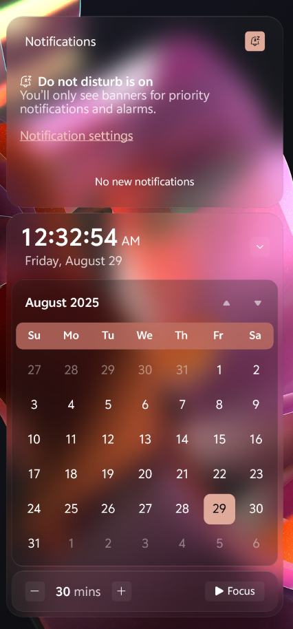

# WindowGlass theme for Windows 11 Notification Center Styler

A theme that adds a modern, glassy aesthetic with a semi-compact layout to Windows 11's Notification and Action Center

**Author**: [Nathaniel4JC](https://github.com/Nathaniel4JC)

## Action Center


## Notification Center
 


## Notes
- Theme is designed on Windows 11 - 24H2
- Not fully Compatible with Light mode yet

## For a complete WindowGlass themed UI, download the following mods and use the 'WindowGlass' theme:
- Windows 11 TaskBar Styler – for styling the Taskbar.
- Windows 11 Start Menu Styler - for styling the Notification Center and Action Center
- Windows 11 File Explorer Styler - for styling Windows Explorer windows

---

## Theme selection

The theme is integrated into the mod, and can be simply selected from the mod's
settings:

* Open the Windows 11 Notification Center Styler mod in Windhawk.
* Go to the "Settings" tab.
* Select the 'WindowGlass' theme and save the settings.

## Manual installation

The theme styles can also be imported manually. To do that, follow these steps:

* Open the Windows 11 Start Menu Styler mod in Windhawk.
* Go to the "Advanced" tab.
* Copy the content below to the text box under "Mod settings" and click "Save".

<details>
<summary>Content to import (click to expand)</summary>

```json

{
  "controlStyles[0].target": "Grid#NotificationCenterGrid",
  "controlStyles[0].styles[0]": "Background:=$Background",
  "controlStyles[0].styles[1]": "BorderThickness=$BorderThickness",
  "controlStyles[0].styles[2]": "CornerRadius=$CornerRadius",
  "controlStyles[0].styles[3]": "BorderBrush:=$BorderBrush",
  "controlStyles[1].target": "Grid#CalendarCenterGrid",
  "controlStyles[1].styles[0]": "Background:=$Background",
  "controlStyles[1].styles[1]": "BorderThickness=$BorderThickness",
  "controlStyles[1].styles[2]": "CornerRadius=$CornerRadius",
  "controlStyles[1].styles[3]": "Margin = 0,6,0,6",
  "controlStyles[1].styles[4]": "MinHeight = 40",
  "controlStyles[1].styles[5]": "BorderBrush:=$BorderBrush",
  "controlStyles[2].target": "ScrollViewer#CalendarControlScrollViewer",
  "controlStyles[2].styles[0]": "Background:=$ElementBG",
  "controlStyles[2].styles[1]": "CornerRadius=$r2",
  "controlStyles[2].styles[2]": "Margin=-10,11,-10,-14",
  "controlStyles[2].styles[3]": "BorderBrush:=$ElementBorderBrush",
  "controlStyles[2].styles[4]": "BorderThickness=$ElementBorderThickness",
  "controlStyles[3].target": "Border#CalendarHeaderMinimizedOverlay",
  "controlStyles[3].styles[0]": "Background:=$ElementBG",
  "controlStyles[3].styles[1]": "CornerRadius=$r2",
  "controlStyles[3].styles[2]": "Margin=-10,-6,-10,-8",
  "controlStyles[3].styles[3]": "Height=45",
  "controlStyles[3].styles[4]": "BorderBrush:=$ElementBorderBrush",
  "controlStyles[3].styles[5]": "BorderThickness=$ElementBorderThickness",
  "controlStyles[4].target": "ActionCenter.FocusSessionControl#FocusSessionControl > Grid#FocusGrid",
  "controlStyles[4].styles[0]": "Background:=$Background",
  "controlStyles[4].styles[1]": "CornerRadius=$r2",
  "controlStyles[4].styles[2]": "Margin=6,7,6,6",
  "controlStyles[4].styles[3]": "BorderThickness=$BorderThickness",
  "controlStyles[4].styles[4]": "BorderBrush:=$BorderBrush",
  "controlStyles[5].target": "MenuFlyoutPresenter",
  "controlStyles[5].styles[0]": "Background:=$Background",
  "controlStyles[5].styles[1]": "BorderThickness=$BorderThickness",
  "controlStyles[5].styles[2]": "CornerRadius=$r3",
  "controlStyles[5].styles[3]": "Padding=1,2,1,2",
  "controlStyles[5].styles[4]": "BorderBrush:=$BorderBrush",
  "controlStyles[6].target": "Border#JumpListRestyledAcrylic",
  "controlStyles[6].styles[0]": "Background:=$Background",
  "controlStyles[6].styles[1]": "BorderThickness=$BorderThickness",
  "controlStyles[6].styles[2]": "CornerRadius=$r3",
  "controlStyles[6].styles[3]": "Margin=-2,-2,-2,-2",
  "controlStyles[6].styles[4]": "BorderBrush:=$BorderBrush",
  "controlStyles[7].target": "Windows.UI.Xaml.Controls.Grid#ControlCenterRegion",
  "controlStyles[7].styles[0]": "Background:=$Background",
  "controlStyles[7].styles[1]": "CornerRadius=$CornerRadius",
  "controlStyles[7].styles[2]": "BorderThickness=$BorderThickness",
  "controlStyles[7].styles[3]": "Margin=0,-5,0,10",
  "controlStyles[7].styles[4]": "BorderBrush:=$BorderBrush",
  "controlStyles[7].styles[5]": "RenderTransform:=<TranslateTransform X=\"0\" Y=\"-120\"/>",
  "controlStyles[7].styles[6]": "Height=Auto",
  "controlStyles[8].target": "ContentPresenter#PageContent",
  "controlStyles[8].styles[0]": "Background:= $transparent",
  "controlStyles[9].target": "ContentPresenter#PageContent > Grid > Border",
  "controlStyles[9].styles[0]": "Background:=$overlay",
  "controlStyles[9].styles[1]": "CornerRadius=$r2",
  "controlStyles[9].styles[2]": "Margin=8,0,8,2",
  "controlStyles[10].target": "QuickActions.ControlCenter.AccessibleWindow#PageWindow > ContentPresenter > Grid#FullScreenPageRoot",
  "controlStyles[10].styles[0]": "Background:= $transparent",
  "controlStyles[11].target": "QuickActions.ControlCenter.AccessibleWindow#PageWindow > ContentPresenter > Grid#FullScreenPageRoot > ContentPresenter#PageHeader",
  "controlStyles[11].styles[0]": "Background:=$overlay",
  "controlStyles[11].styles[1]": "CornerRadius=$r2",
  "controlStyles[11].styles[2]": "Margin=7,7,7,7",
  "controlStyles[12].target": "ScrollViewer#ListContent",
  "controlStyles[12].styles[0]": "Background:=$overlay",
  "controlStyles[12].styles[1]": "CornerRadius=$r2",
  "controlStyles[12].styles[2]": "Margin=8,0,8,0",
  "controlStyles[13].target": "ActionCenter.FlexibleToastView#FlexibleNormalToastView",
  "controlStyles[13].styles[0]": "Background:= $transparent",
  "controlStyles[14].target": "Border#ToastBackgroundBorder2",
  "controlStyles[14].styles[0]": "Background:=$Background",
  "controlStyles[14].styles[1]": "BorderThickness=$BorderThickness",
  "controlStyles[14].styles[2]": "CornerRadius=16",
  "controlStyles[14].styles[3]": "BorderBrush:=$BorderBrush",
  "controlStyles[15].target": "JumpViewUI.SystemItemListViewItem > Grid#LayoutRoot > Border#BackgroundBorder",
  "controlStyles[15].styles[0]": "Background:=Trabsparent",
  "controlStyles[15].styles[1]": "CornerRadius=8",
  "controlStyles[16].target": "JumpViewUI.JumpListListViewItem > Grid#LayoutRoot > Border#BackgroundBorder",
  "controlStyles[16].styles[0]": "CornerRadius=6",
  "controlStyles[17].target": "ActionCenter.FlexibleItemView",
  "controlStyles[17].styles[0]": "CornerRadius=16",
  "controlStyles[18].target": "Grid#NotificationCenterTopBanner",
  "controlStyles[18].styles[0]": "Background:=Transparent",
  "controlStyles[18].styles[1]": "CornerRadius=$r2",
  "controlStyles[18].styles[2]": "Margin=6",
  "controlStyles[19].target": "Windows.UI.Xaml.Controls.Grid#L1Grid > Border",
  "controlStyles[19].styles[0]": "Background:= $transparent",
  "controlStyles[20].target": "Windows.UI.Xaml.Controls.ContentPresenter",
  "controlStyles[20].styles[0]": "BorderThickness=0",
  "controlStyles[21].target": "Windows.UI.Xaml.Controls.Button#FooterButton[AutomationProperties.Name = Edit quick settings]",
  "controlStyles[21].styles[0]": "Margin = 0,0,8,0",
  "controlStyles[21].styles[1]": "CornerRadius=$r3",
  "controlStyles[22].target": "Windows.UI.Xaml.Controls.Button[AutomationProperties.AutomationId = Microsoft.QuickAction.Battery]",
  "controlStyles[22].styles[0]": "Margin = 2,0,0,0",
  "controlStyles[22].styles[1]": "CornerRadius=$r3",
  "controlStyles[23].target": "Windows.UI.Xaml.Controls.Button#FooterButton[AutomationProperties.Name = All settings]",
  "controlStyles[23].styles[0]": "Margin = 0,0,-1,0",
  "controlStyles[23].styles[1]": "CornerRadius = 13",
  "controlStyles[23].styles[2]": "BorderThickness=$BorderThickness",
  "controlStyles[24].target": "Windows.UI.Xaml.Controls.Button[AutomationProperties.AutomationId = Microsoft.QuickAction.Volume]",
  "controlStyles[24].styles[0]": "CornerRadius = 10",
  "controlStyles[25].target": "Windows.UI.Xaml.Controls.Button#VolumeL2Button[AutomationProperties.Name = Select a sound output]",
  "controlStyles[25].styles[0]": "CornerRadius = 10",
  "controlStyles[26].target": "Windows.UI.Xaml.Shapes.Rectangle#HorizontalTrackRect",
  "controlStyles[26].styles[0]": "Height=10",
  "controlStyles[26].styles[1]": "Fill:=$overlay",
  "controlStyles[26].styles[2]": "RadiusY=5",
  "controlStyles[26].styles[3]": "RadiusX=5",
  "controlStyles[26].styles[4]": "Margin=0,-10,10,-10",
  "controlStyles[27].target": "Windows.UI.Xaml.Shapes.Rectangle#HorizontalDecreaseRect",
  "controlStyles[27].styles[0]": "Height=10",
  "controlStyles[27].styles[1]": "RadiusY=5",
  "controlStyles[27].styles[2]": "RadiusX=5",
  "controlStyles[27].styles[3]": "Margin=0,-10,-10,-10",
  "controlStyles[28].target": "Windows.UI.Xaml.Controls.Primitives.Thumb#HorizontalThumb",
  "controlStyles[28].styles[0]": "Visibility=Visible",
  "controlStyles[28].styles[1]": "Height=25",
  "controlStyles[28].styles[2]": "Width=40",
  "controlStyles[28].styles[3]": "Margin=0",
  "controlStyles[29].target": "Windows.UI.Xaml.Controls.Grid#MediaTransportControlsRegion",
  "controlStyles[29].styles[0]": "Height=120",
  "controlStyles[29].styles[1]": "CornerRadius=$CornerRadius",
  "controlStyles[29].styles[2]": "BorderThickness=$BorderThickness",
  "controlStyles[29].styles[3]": "Background:=$Background",
  "controlStyles[29].styles[4]": "Margin=0",
  "controlStyles[29].styles[5]": "BorderBrush:=$BorderBrush",
  "controlStyles[29].styles[6]": "RenderTransform:=<TranslateTransform X=\"0\" Y=\"400\"/>",
  "controlStyles[29].styles[7]": "Visibility=0",
  "controlStyles[30].target": "Windows.UI.Xaml.Controls.Grid#AlbumTextAndArtContainer",
  "controlStyles[30].styles[0]": "Height=55",
  "controlStyles[31].target": "Windows.UI.Xaml.Controls.Grid#ThumbnailImage",
  "controlStyles[31].styles[0]": "Width=50",
  "controlStyles[31].styles[1]": "Height=50",
  "controlStyles[31].styles[2]": "HorizontalAlignment=Left",
  "controlStyles[31].styles[3]": "VerticalAlignment=Top",
  "controlStyles[31].styles[4]": "Grid.Column=1",
  "controlStyles[31].styles[5]": "Margin=0",
  "controlStyles[31].styles[6]": "CornerRadius=$r2",
  "controlStyles[31].styles[7]": "Visibility=1",
  "controlStyles[32].target": "Windows.UI.Xaml.Controls.StackPanel#PrimaryAndSecondaryTextContainer",
  "controlStyles[32].styles[0]": "VerticalAlignment=Center",
  "controlStyles[32].styles[1]": "HorizontalAlignment=Left",
  "controlStyles[32].styles[2]": "Margin=0",
  "controlStyles[33].target": "Windows.UI.Xaml.Controls.StackPanel#PrimaryAndSecondaryTextContainer > Windows.UI.Xaml.Controls.TextBlock#Title",
  "controlStyles[33].styles[0]": "TextAlignment=Center",
  "controlStyles[33].styles[1]": "FontSize=18",
  "controlStyles[34].target": "Windows.UI.Xaml.Controls.StackPanel#PrimaryAndSecondaryTextContainer > Windows.UI.Xaml.Controls.TextBlock#Subtitle",
  "controlStyles[34].styles[0]": "TextAlignment=Center",
  "controlStyles[34].styles[1]": "FontFamily=vivo Sans EN VF",
  "controlStyles[34].styles[2]": "Margin = 0,3,0,0",
  "controlStyles[34].styles[3]": "FontWeight=600",
  "controlStyles[35].target": "Windows.UI.Xaml.Controls.ListView#MediaButtonsListView",
  "controlStyles[35].styles[0]": "VerticalAlignment=Center",
  "controlStyles[35].styles[1]": "Height=20",
  "controlStyles[35].styles[2]": "Margin=130,-60,0,0",
  "controlStyles[35].styles[3]": "Width=Auto",
  "controlStyles[35].styles[4]": "HorizontalAlignment=Right",
  "controlStyles[36].target": "Windows.UI.Xaml.Controls.Primitives.RepeatButton#PreviousButton > Windows.UI.Xaml.Controls.ContentPresenter#ContentPresenter@CommonStates",
  "controlStyles[36].styles[0]": "Background@Normal:=Transparent",
  "controlStyles[36].styles[1]": "Background@PointerOver:=Transparent",
  "controlStyles[36].styles[2]": "Background@Pressed:=Transparent",
  "controlStyles[36].styles[3]": "Width=40",
  "controlStyles[36].styles[4]": "Height=40",
  "controlStyles[36].styles[5]": "CornerRadius = 6",
  "controlStyles[36].styles[6]": "Margin=-10",
  "controlStyles[36].styles[7]": "BorderThickness=0",
  "controlStyles[36].styles[8]": "BorderBrush:=Transparent",
  "controlStyles[36].styles[9]": "RenderTransform:=<TranslateTransform X=\"0\" Y=\"0\"/>",
  "controlStyles[37].target": "Windows.UI.Xaml.Controls.Button#PlayPauseButton > Windows.UI.Xaml.Controls.ContentPresenter#ContentPresenter@CommonStates",
  "controlStyles[37].styles[0]": "Background@Normal:=Transparent",
  "controlStyles[37].styles[1]": "Background@PointerOver:=Transparent",
  "controlStyles[37].styles[2]": "Background@Pressed:=Transparent",
  "controlStyles[37].styles[3]": "Width=40",
  "controlStyles[37].styles[4]": "Height = 40",
  "controlStyles[37].styles[5]": "CornerRadius =40",
  "controlStyles[37].styles[6]": "Margin=-50",
  "controlStyles[37].styles[7]": "BorderBrush:=Transparent",
  "controlStyles[37].styles[8]": "BorderThickness=0",
  "controlStyles[38].target": "Windows.UI.Xaml.Controls.Primitives.RepeatButton#NextButton > Windows.UI.Xaml.Controls.ContentPresenter#ContentPresenter@CommonStates",
  "controlStyles[38].styles[0]": "Background@Normal:=Transparent",
  "controlStyles[38].styles[1]": "Background@PointerOver:=Transparent",
  "controlStyles[38].styles[2]": "Background@Pressed:=Transparent",
  "controlStyles[38].styles[3]": "Width=40",
  "controlStyles[38].styles[4]": "Height = 30",
  "controlStyles[38].styles[5]": "CornerRadius = 6",
  "controlStyles[38].styles[6]": "Margin=-50",
  "controlStyles[38].styles[7]": "BorderThickness=0",
  "controlStyles[38].styles[8]": "BorderBrush:=Transparent",
  "controlStyles[39].target": "Windows.UI.Xaml.Controls.TextBlock#AppNameText",
  "controlStyles[39].styles[0]": "FontFamily=vivo Sans EN VF",
  "controlStyles[39].styles[1]": "FontSize = 16",
  "controlStyles[40].target": "Windows.UI.Xaml.Controls.Image#IconImage",
  "controlStyles[40].styles[0]": "Height = 20",
  "controlStyles[40].styles[1]": "Width = 20",
  "controlStyles[41].target": "Grid#MediaTransportControlsRoot",
  "controlStyles[41].styles[0]": "Background:= $transparent",
  "controlStyles[42].target": "Grid#ToastPeekRegion",
  "controlStyles[42].styles[0]": "Background =",
  "controlStyles[42].styles[1]": "RenderTransform:=<TranslateTransform Y=\"-495\" X=\"395\" />",
  "controlStyles[42].styles[2]": "Grid.Column = 0",
  "controlStyles[42].styles[3]": "Grid.Row = 2",
  "controlStyles[43].target": "Windows.UI.Xaml.Controls.CalendarViewDayItem > Windows.UI.Xaml.Controls.Border",
  "controlStyles[43].styles[0]": "CornerRadius = 8",
  "controlStyles[43].styles[1]": "Margin = 1,2,1,2",
  "controlStyles[44].target": "Windows.UI.Xaml.Controls.CalendarViewDayItem",
  "controlStyles[44].styles[0]": "CornerRadius = 8",
  "controlStyles[45].target": "Windows.UI.Xaml.Controls.Control > Windows.UI.Xaml.Controls.Border",
  "controlStyles[45].styles[0]": "CornerRadius = 8",
  "controlStyles[46].target": "Windows.UI.Xaml.Controls.Primitives.CalendarViewItem",
  "controlStyles[46].styles[0]": "CornerRadius = 8",
  "controlStyles[47].target": "Windows.UI.Xaml.Controls.ListViewHeaderItem",
  "controlStyles[47].styles[0]": "Margin = 50,6,50,2",
  "controlStyles[47].styles[1]": "CornerRadius = 8",
  "controlStyles[47].styles[2]": "Height = 35",
  "controlStyles[48].target": "Windows.UI.Xaml.Controls.Button#SettingsButton",
  "controlStyles[48].styles[0]": "CornerRadius = 4",
  "controlStyles[49].target": "Windows.UI.Xaml.Controls.Button#DismissButton",
  "controlStyles[49].styles[0]": "CornerRadius = 4",
  "controlStyles[50].target": "Windows.UI.Xaml.Controls.StackPanel#CalendarHeader",
  "controlStyles[50].styles[0]": "Margin = 6,0,0,0",
  "controlStyles[51].target": "Windows.UI.Xaml.Controls.ScrollContentPresenter#ScrollContentPresenter",
  "controlStyles[51].styles[0]": "Margin = 1,2,1,2",
  "controlStyles[52].target": "Windows.UI.Xaml.Controls.Grid#WeekDayNames",
  "controlStyles[52].styles[0]": "Background := <SolidColorBrush Color=\"{ThemeResource SystemAccentColorLight1}\" Opacity = \"0.8\" />",
  "controlStyles[52].styles[1]": "CornerRadius = 8",
  "controlStyles[52].styles[2]": "Margin = 4,0,4,0",
  "controlStyles[52].styles[3]": "Padding = 0,-5,0,-3",
  "controlStyles[53].target": "Windows.UI.Xaml.Controls.ListViewItem",
  "controlStyles[53].styles[0]": "CornerRadius=$r3",
  "controlStyles[54].target": "Windows.UI.Xaml.Controls.Grid#RootGrid > Windows.UI.Xaml.Controls.ContentPresenter#ContentPresenter",
  "controlStyles[54].styles[0]": "Background := <SolidColorBrush Color=\"{ThemeResource SystemAccentColorLight1}\" Opacity = \"0.5\" />",
  "controlStyles[54].styles[1]": "BorderThickness = 0",
  "controlStyles[54].styles[2]": "CornerRadius = 8",
  "controlStyles[55].target": "Windows.UI.Xaml.Controls.Grid > Windows.UI.Xaml.Controls.Border#ItemOpaquePlating",
  "controlStyles[55].styles[0]": "Background := $overlay2",
  "controlStyles[55].styles[1]": "BorderThickness = 0",
  "controlStyles[55].styles[2]": "CornerRadius=$r3",
  "controlStyles[56].target": "Windows.UI.Xaml.Controls.Grid#StandardHeroContainer",
  "controlStyles[56].styles[0]": "Margin = 12,0,12,0",
  "controlStyles[56].styles[1]": "CornerRadius = 0",
  "controlStyles[56].styles[2]": "Height = 150",
  "controlStyles[57].target": "Windows.UI.Xaml.Controls.Primitives.ScrollBar#VerticalScrollBar",
  "controlStyles[57].styles[0]": "Visibility = 1",
  "controlStyles[58].target": "Windows.UI.Xaml.Controls.Grid#SliderContainer",
  "controlStyles[58].styles[0]": "Margin = 0-2,0,0",
  "controlStyles[59].target": "Windows.UI.Xaml.Controls.Button#BackButton",
  "controlStyles[59].styles[0]": "CornerRadius=$r3",
  "controlStyles[60].target": "Windows.UI.Xaml.Shapes.Rectangle#OuterBorder",
  "controlStyles[60].styles[0]": "RadiusX = 8",
  "controlStyles[60].styles[1]": "RadiusY = 8",
  "controlStyles[60].styles[2]": "Height = 18",
  "controlStyles[61].target": "Windows.UI.Xaml.Shapes.Rectangle#SwitchKnobOff",
  "controlStyles[61].styles[0]": "RadiusY = 8",
  "controlStyles[61].styles[1]": "RadiusX = 8",
  "controlStyles[62].target": "Windows.UI.Xaml.Controls.Border#SwitchKnobOn",
  "controlStyles[62].styles[0]": "CornerRadius =8",
  "controlStyles[63].target": "Windows.UI.Xaml.Shapes.Rectangle#SwitchKnobBounds",
  "controlStyles[63].styles[0]": "RadiusX =8",
  "controlStyles[63].styles[1]": "RadiusY =8",
  "controlStyles[63].styles[2]": "Height = 18",
  "controlStyles[64].target": "ActionCenter.NotificationListViewItem",
  "controlStyles[64].styles[0]": "Margin = 5,2,5,3",
  "controlStyles[65].target": "Windows.UI.Xaml.Controls.Grid[AutomationProperties.LocalizedLandmarkType = Footer]",
  "controlStyles[65].styles[0]": "BorderThickness = 0",
  "controlStyles[66].target": "NetworkUX.View.SettingsListViewItem > Windows.UI.Xaml.Controls.Primitives.ListViewItemPresenter#Root",
  "controlStyles[66].styles[0]": "CornerRadius = 12",
  "controlStyles[67].target": "Windows.UI.Xaml.Controls.ContentPresenter > Windows.UI.Xaml.Controls.Border",
  "controlStyles[67].styles[0]": "BorderThickness = 0",
  "controlStyles[68].target": "Button#ClearAll",
  "controlStyles[68].styles[0]": "AccessKey=x",
  "controlStyles[69].target": "Button#ExpandCollapseButton",
  "controlStyles[69].styles[0]": "AccessKey=e",
  "controlStyles[70].target": "ControlCenter.PaginatedToggleButton#ToggleButton > Windows.UI.Xaml.Controls.ContentPresenter#ContentPresenter",
  "controlStyles[70].styles[0]": "CornerRadius=$r2",
  "controlStyles[70].styles[1]": "BorderThickness=$ElementBorderThickness",
  "controlStyles[70].styles[2]": "BorderBrush:=$ElementBorderBrush",
  "controlStyles[71].target": "ControlCenter.PaginatedToggleButton#SplitL2Button > Windows.UI.Xaml.Controls.ContentPresenter#ContentPresenter",
  "controlStyles[71].styles[0]": "CornerRadius=30",
  "controlStyles[71].styles[1]": "BorderThickness=$ElementBorderThickness",
  "controlStyles[71].styles[2]": "BorderBrush:=$ElementBorderBrush",
  "controlStyles[72].target": "Windows.UI.Xaml.Controls.Primitives.Thumb#HorizontalThumb > Windows.UI.Xaml.Controls.Border",
  "controlStyles[72].styles[0]": "CornerRadius=12",
  "controlStyles[72].styles[1]": "Background:=$Background",
  "controlStyles[72].styles[2]": "BorderBrush:=$BorderBrush",
  "controlStyles[72].styles[3]": "BorderThickness=$BorderThickness",
  "controlStyles[73].target": "Windows.UI.Xaml.Controls.Primitives.Thumb#HorizontalThumb > Windows.UI.Xaml.Controls.Border > Windows.UI.Xaml.Shapes.Ellipse#SliderInnerThumb",
  "controlStyles[73].styles[0]": "Visibility=Collapsed",
  "controlStyles[74].target": "Windows.UI.Xaml.Controls.ToolTip > Windows.UI.Xaml.Controls.ContentPresenter#LayoutRoot",
  "controlStyles[74].styles[0]": "Background:=$Background",
  "controlStyles[74].styles[1]": "BorderBrush:=$BorderBrush",
  "controlStyles[74].styles[2]": "BorderThickness=$BorderThickness",
  "controlStyles[74].styles[3]": "CornerRadius=10",
  "styleConstants[0]": "transparent =<SolidColorBrush Color=\"Transparent\"/>",
  "styleConstants[1]": "Background=<WindhawkBlur BlurAmount=\"15\" TintColor=\"#10808080\"/>",
  "styleConstants[2]": "overlay =<SolidColorBrush Color=\"{ThemeResource SystemChromeAltHighColor}\" Opacity=\"0.1\" />",
  "styleConstants[3]": "accentColor =<SolidColorBrush Color=\"{ThemeResource SystemAccentColorLight1}\" Opacity = \"1\" />",
  "styleConstants[4]": "overlay2 =<WindhawkBlur BlurAmount=\"20\" TintColor=\"#60353535\"/>",
  "styleConstants[5]": "CornerRadius=20",
  "styleConstants[6]": "r2 = 14",
  "styleConstants[7]": "r3 = 12",
  "styleConstants[8]": "BorderThickness=0.3,1,0.3,0.3",
  "styleConstants[9]": "BorderBrush2=<LinearGradientBrush StartPoint=\"0,0\" EndPoint=\"0,1\"><GradientStop Color=\"{ThemeResource SystemChromeHighColor}\" Offset=\"0.0\" /><GradientStop Color=\"{ThemeResource SystemChromeLowColor}\" Offset=\"0.15\" /><GradientStop Color=\"{ThemeResource SystemChromeHighColor}\" Offset=\"0.95\" /></LinearGradientBrush>",
  "styleConstants[10]": "Background2=<AcrylicBrush TintColor=\"{ThemeResource SystemChromeAltHighColor}\" TintOpacity=\"0.3\" FallbackColor=\"{ThemeResource SystemChromeAltHighColor}\" />",
  "styleConstants[11]": "ElementBG=<SolidColorBrush Color=\"{ThemeResource SystemChromeAltHighColor}\" Opacity=\"0.3\" />",
  "styleConstants[12]": "ElementBorderBrush=<LinearGradientBrush StartPoint=\"0,0\" EndPoint=\"0,1\"><GradientStop Color=\"#50808080\" Offset=\"1\" /><GradientStop Color=\"#50606060\" Offset=\"0.15\" /></LinearGradientBrush>",
  "styleConstants[13]": "ElementCornerRadius=20",
  "styleConstants[14]": "ElementBorderThickness=0.3,0.3,0.3,1",
  "styleConstants[15]": "BorderBrush=<LinearGradientBrush StartPoint=\"0,0\" EndPoint=\"0,1\"><GradientStop Color=\"#50808080\" Offset=\"0.0\" /><GradientStop Color=\"#50404040\" Offset=\"0.25\" /><GradientStop Color=\"#50808080\" Offset=\"1\" /></LinearGradientBrush>"
}

```
</details>
