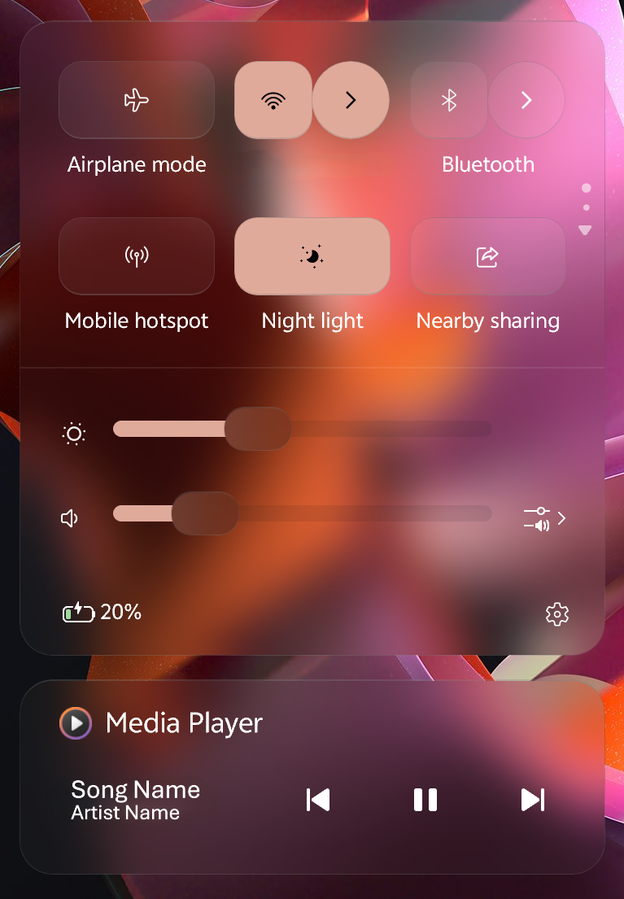
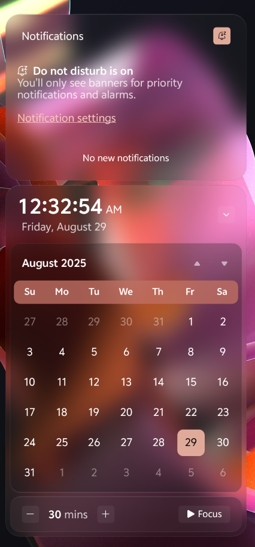
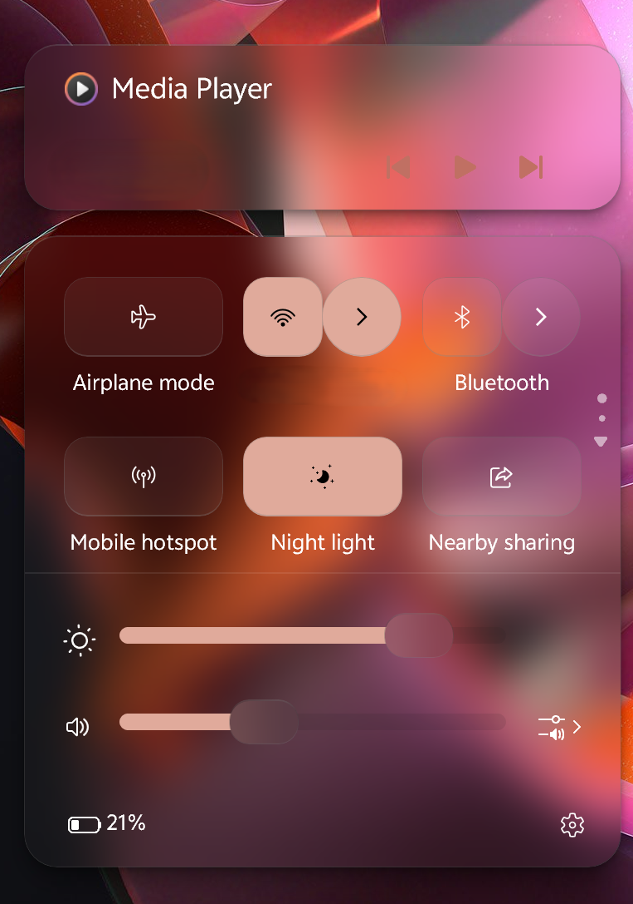

# WindowGlass theme for Windows 11 Notification Center Styler

A theme that adds a modern, glassy aesthetic with a semi-compact layout to Windows 11's Notification and Action Center.

**Author**: [Nathaniel4JC](https://github.com/Nathaniel4JC)

## Action Center


## Notification Center


## Notes
- Works best on devices running windows 11 24H2 and above.
- Works best on devices with a screen resolution of 1930x1200 and above.
- This theme consists of the following backgrounds:
  - Translucent
  - Glass
  - Frosted
  - Acrylic

  In order to switch between these backgrounds, set the value `Background=$Translucent`, `Background=$Glass`, `Background=$Frosted` or `Background=$Acrylic` in the "Style constants" section of the mod's settings.

## For a complete WindowGlass-themed UI, download the following mods and use the 'WindowGlass' theme:
- Windows 11 Taskbar Styler - for styling the taskbar.
- Windows 11 Start Menu Styler - for styling the Windows Start menu.
- Windows 11 File Explorer Styler - for styling Windows Explorer windows.

---

## Theme selection

The theme is integrated into the mod and can be selected directly from the mod's
settings:

* Open the Windows 11 Notification Center Styler mod in Windhawk.
* Go to the "Settings" tab.
* Select the theme and save the settings.

## Manual installation

The theme styles can also be imported manually. To do that, follow these steps:

* Open the Windows 11 Notification Center Styler mod in Windhawk.
* Go to the "Settings" tab and select "Textual mode".
* Copy the content below to the text box and click "Save settings".

<details>
<summary>Content to import (click to expand)</summary>

```yaml
styleConstants:
  - Translucent=<WindhawkBlur BlurAmount="15" TintColor="#10808080"/>
  - Glass=<WindhawkBlur BlurAmount="3" TintColor="{ThemeResource SystemChromeMediumColor}" TintOpacity="0.7" />
  - Frosted=<WindhawkBlur BlurAmount="20" TintColor="{ThemeResource SystemChromeMediumColor}" TintOpacity="0.7" />
  - Acrylic=<AcrylicBrush TintColor="{ThemeResource SystemChromeAltHighColor}" TintOpacity="0.3" FallbackColor="{ThemeResource SystemChromeAltHighColor}" />
  - Background=$Translucent
  - BorderBrush=<LinearGradientBrush StartPoint="0,0" EndPoint="0,1"><GradientStop Color="#50808080" Offset="0.0" /><GradientStop Color="#50404040" Offset="0.25" /><GradientStop Color="#50808080" Offset="1" /></LinearGradientBrush>
  - BorderBrush2=<LinearGradientBrush StartPoint="0,0" EndPoint="0,1"><GradientStop Color="{ThemeResource SystemChromeHighColor}" Offset="0.0" /><GradientStop Color="{ThemeResource SystemChromeLowColor}" Offset="0.15" /><GradientStop Color="{ThemeResource SystemChromeHighColor}" Offset="0.95" /></LinearGradientBrush>
  - overlay=<SolidColorBrush Color="{ThemeResource SystemChromeAltHighColor}" Opacity="0.1" />
  - overlay2=<WindhawkBlur BlurAmount="20" TintColor="#60353535"/>
  - CornerRadius=20
  - CR2=14
  - CR3=12
  - BorderThickness=0.3,1,0.3,0.3
  - ElementBG=<SolidColorBrush Color="{ThemeResource SystemChromeAltHighColor}" Opacity="0.3" />
  - ElementBorderBrush=<LinearGradientBrush StartPoint="0,0" EndPoint="0,1"><GradientStop Color="#50808080" Offset="1" /><GradientStop Color="#50606060" Offset="0.15" /></LinearGradientBrush>
  - ElementCornerRadius=20
  - ElementBorderThickness=0.3,0.3,0.3,1
  - ElementSysColor=<SolidColorBrush Color="{ThemeResource SystemAccentColorLight1}" Opacity="1" />
  - ElementSysColor2=<SolidColorBrush Color="{ThemeResource SystemAccentColorLight2}" Opacity="1" />
  - ElementSysColor3=<SolidColorBrush Color="{ThemeResource SystemAccentColorLight3}" Opacity="1" />
  - ElementSysColor4=<SolidColorBrush Color="{ThemeResource SystemAccentColorDark1}" Opacity="1" />
controlStyles:
  - target: Grid#NotificationCenterGrid
    styles:
      - Background:=$Background
      - BorderThickness=$BorderThickness
      - CornerRadius=$CornerRadius
      - BorderBrush:=$BorderBrush
  - target: Grid#CalendarCenterGrid
    styles:
      - Background:=$Background
      - BorderThickness=$BorderThickness
      - CornerRadius=$CornerRadius
      - Margin=0,6,0,6
      - MinHeight=40
      - BorderBrush:=$BorderBrush
  - target: ScrollViewer#CalendarControlScrollViewer
    styles:
      - Background:=$ElementBG
      - CornerRadius=$CR2
      - Margin=-10,11,-10,-14
      - BorderBrush:=$ElementBorderBrush
      - BorderThickness=$ElementBorderThickness
  - target: Border#CalendarHeaderMinimizedOverlay
    styles:
      - Background:=$ElementBG
      - CornerRadius=$CR2
      - Margin=-10,-6,-10,-8
      - Height=45
      - BorderBrush:=$ElementBorderBrush
      - BorderThickness=$ElementBorderThickness
  - target: ActionCenter.FocusSessionControl#FocusSessionControl > Grid#FocusGrid
    styles:
      - Background:=$Background
      - CornerRadius=$CR2
      - Margin=6,7,6,6
      - BorderThickness=$BorderThickness
      - BorderBrush:=$BorderBrush
  - target: MenuFlyoutPresenter > Border
    styles:
      - Background:=$Background
      - BorderThickness=$BorderThickness
      - CornerRadius=$CR3
      - Padding=1,2,1,2
      - BorderBrush:=$BorderBrush
  - target: MenuFlyoutItem > Grid#LayoutRoot
    styles:
      - CornerRadius=6
  - target: Border#JumpListRestyledAcrylic
    styles:
      - Background:=$Background
      - BorderThickness=$BorderThickness
      - CornerRadius=$CR3
      - Margin=-2,-2,-2,-2
      - BorderBrush:=$BorderBrush
  - target: Windows.UI.Xaml.Controls.Grid#ControlCenterRegion
    styles:
      - Background:=$Background
      - CornerRadius=$CornerRadius
      - BorderThickness=$BorderThickness
      - BorderBrush:=$BorderBrush
  - target: ContentPresenter#PageContent
    styles:
      - Background=Transparent
  - target: ContentPresenter#PageContent > Grid > Border
    styles:
      - Background:=$overlay
      - CornerRadius=$CR2
      - Margin=8,0,8,2
  - target: QuickActions.ControlCenter.AccessibleWindow#PageWindow > ContentPresenter > Grid#FullScreenPageRoot
    styles:
      - Background=Transparent
  - target: QuickActions.ControlCenter.AccessibleWindow#PageWindow > ContentPresenter > Grid#FullScreenPageRoot > ContentPresenter#PageHeader
    styles:
      - Background:=$overlay
      - CornerRadius=$CR2
      - Margin=7,7,7,7
  - target: ScrollViewer#ListContent
    styles:
      - Background:=$overlay
      - CornerRadius=$CR2
      - Margin=8,0,8,0
  - target: ActionCenter.FlexibleToastView#FlexibleNormalToastView
    styles:
      - Background=Transparent
  - target: Border#ToastBackgroundBorder2
    styles:
      - Background:=$Background
      - BorderThickness=$BorderThickness
      - CornerRadius=16
      - BorderBrush:=$BorderBrush
  - target: JumpViewUI.SystemItemListViewItem > Grid#LayoutRoot > Border#BackgroundBorder
    styles:
      - CornerRadius=8
  - target: JumpViewUI.JumpListListViewItem > Grid#LayoutRoot > Border#BackgroundBorder
    styles:
      - CornerRadius=6
  - target: ActionCenter.FlexibleItemView
    styles:
      - CornerRadius=16
  - target: Grid#NotificationCenterTopBanner
    styles:
      - Background=Transparent
      - CornerRadius=$CR2
      - Margin=6
  - target: Windows.UI.Xaml.Controls.Grid#L1Grid > Border
    styles:
      - Background=Transparent
  - target: Windows.UI.Xaml.Controls.ContentPresenter
    styles:
      - BorderThickness=0
  - target: Windows.UI.Xaml.Controls.Button#FooterButton[AutomationProperties.Name=Edit quick settings]
    styles:
      - Margin=0,0,8,0
      - CornerRadius=$CR3
  - target: Windows.UI.Xaml.Controls.Button[AutomationProperties.AutomationId=Microsoft.QuickAction.Battery]
    styles:
      - Margin=2,0,0,0
      - CornerRadius=$CR3
  - target: Windows.UI.Xaml.Controls.Button#FooterButton[AutomationProperties.Name=All settings]
    styles:
      - Margin=0,0,-1,0
      - CornerRadius=13
      - BorderThickness=$BorderThickness
  - target: Windows.UI.Xaml.Controls.Button[AutomationProperties.AutomationId=Microsoft.QuickAction.Volume]
    styles:
      - CornerRadius=10
  - target: Windows.UI.Xaml.Controls.Button#VolumeL2Button[AutomationProperties.Name=Select a sound output]
    styles:
      - CornerRadius=10
  - target: Windows.UI.Xaml.Shapes.Rectangle#HorizontalTrackRect
    styles:
      - Height=10
      - Fill:=$overlay
      - RadiusY=5
      - RadiusX=5
      - Margin=0,-10,10,-10
  - target: Windows.UI.Xaml.Shapes.Rectangle#HorizontalDecreaseRect
    styles:
      - Height=10
      - RadiusY=5
      - RadiusX=5
      - Margin=0,-10,-10,-10
  - target: Windows.UI.Xaml.Controls.Primitives.Thumb#HorizontalThumb
    styles:
      - Visibility=Visible
      - Height=25
      - Width=40
      - Margin=0
  - target: Windows.UI.Xaml.Controls.Grid#MediaTransportControlsRegion
    styles:
      - Height=100
      - CornerRadius=$CornerRadius
      - BorderThickness=$BorderThickness
      - Background:=$Background
      - Margin=0,10,0,0
      - BorderBrush:=$BorderBrush
      - Grid.Row=1
  - target: Windows.UI.Xaml.Controls.Grid#AlbumTextAndArtContainer
    styles:
      - Height=55
      - MaxWidth=150
      - HorizontalAlignment=Left
  - target: Windows.UI.Xaml.Controls.Grid#ThumbnailImage
    styles:
      - Visibility=1
  - target: Windows.UI.Xaml.Controls.StackPanel#PrimaryAndSecondaryTextContainer
    styles:
      - VerticalAlignment=Center
      - HorizontalAlignment=Left
      - Margin=0,0,10,0
  - target: Windows.UI.Xaml.Controls.StackPanel#PrimaryAndSecondaryTextContainer > Windows.UI.Xaml.Controls.TextBlock#Title
    styles:
      - TextAlignment=Center
      - FontSize=18
  - target: Windows.UI.Xaml.Controls.StackPanel#PrimaryAndSecondaryTextContainer > Windows.UI.Xaml.Controls.TextBlock#Subtitle
    styles:
      - TextAlignment=Center
      - FontFamily=vivo Sans EN VF
      - Margin=0,3,0,0
      - FontWeight=600
  - target: Windows.UI.Xaml.Controls.ListView#MediaButtonsListView
    styles:
      - VerticalAlignment=Center
      - Height=20
      - Margin=130,-60,0,0
      - Width=Auto
      - HorizontalAlignment=Right
      - Visibility=2
  - target: Windows.UI.Xaml.Controls.Primitives.RepeatButton#PreviousButton
    styles:
      - Width=40
      - Height=40
      - Margin=10,0,0,0
  - target: Windows.UI.Xaml.Controls.Button#PlayPauseButton
    styles:
      - Width=40
      - Height=40
      - Margin=0
  - target: Windows.UI.Xaml.Controls.Primitives.RepeatButton#NextButton
    styles:
      - Width=40
      - Height=30
      - Margin=0,0,10,0
  - target: Windows.UI.Xaml.Controls.TextBlock#AppNameText
    styles:
      - FontFamily=vivo Sans EN VF
      - FontSize=16
  - target: Windows.UI.Xaml.Controls.Image#IconImage
    styles:
      - Height=20
      - Width=20
  - target: Grid#MediaTransportControlsRoot
    styles:
      - Background=Transparent
  - target: Grid#ToastPeekRegion
    styles:
      - Background=
      - RenderTransform:=<TranslateTransform Y="-495" X="395" />
      - Grid.Column=0
      - Grid.Row=2
  - target: Windows.UI.Xaml.Controls.CalendarViewDayItem > Windows.UI.Xaml.Controls.Border
    styles:
      - CornerRadius=8
      - Margin=1,2,1,2
  - target: Windows.UI.Xaml.Controls.CalendarViewDayItem
    styles:
      - CornerRadius=8
  - target: Windows.UI.Xaml.Controls.Control > Windows.UI.Xaml.Controls.Border
    styles:
      - CornerRadius=8
  - target: Windows.UI.Xaml.Controls.Primitives.CalendarViewItem
    styles:
      - CornerRadius=8
  - target: Windows.UI.Xaml.Controls.ListViewHeaderItem
    styles:
      - Margin=50,6,50,2
      - CornerRadius=8
      - Height=35
  - target: Windows.UI.Xaml.Controls.Button#SettingsButton
    styles:
      - CornerRadius=4
  - target: Windows.UI.Xaml.Controls.Button#DismissButton
    styles:
      - CornerRadius=4
  - target: Windows.UI.Xaml.Controls.StackPanel#CalendarHeader
    styles:
      - Margin=6,0,0,0
  - target: Windows.UI.Xaml.Controls.ScrollContentPresenter#ScrollContentPresenter
    styles:
      - Margin=1,2,1,2
  - target: Windows.UI.Xaml.Controls.Grid#WeekDayNames
    styles:
      - Background:=$ElementSysColor
      - CornerRadius=8
      - Margin=4,0,4,0
      - Padding=0,-5,0,-3
  - target: Windows.UI.Xaml.Controls.ListViewItem
    styles:
      - CornerRadius=$CR3
  - target: Windows.UI.Xaml.Controls.Grid#RootGrid > Windows.UI.Xaml.Controls.ContentPresenter#ContentPresenter
    styles:
      - Background:=<SolidColorBrush Color="{ThemeResource SystemAccentColorLight1}" Opacity="0.5"/>
      - BorderThickness=0
      - CornerRadius=8
  - target: Windows.UI.Xaml.Controls.Grid > Windows.UI.Xaml.Controls.Border#ItemOpaquePlating
    styles:
      - Background:=$overlay2
      - BorderThickness=0
      - CornerRadius=$CR3
  - target: Windows.UI.Xaml.Controls.Grid#StandardHeroContainer
    styles:
      - Margin=12,0,12,0
      - CornerRadius=0
      - Height=150
  - target: Windows.UI.Xaml.Controls.Primitives.ScrollBar#VerticalScrollBar
    styles:
      - Visibility=1
  - target: Windows.UI.Xaml.Controls.Grid#SliderContainer
    styles:
      - Margin=0-2,0,0
  - target: Windows.UI.Xaml.Controls.Button#BackButton
    styles:
      - CornerRadius=$CR3
  - target: Windows.UI.Xaml.Shapes.Rectangle#OuterBorder
    styles:
      - RadiusX=8
      - RadiusY=8
      - Height=18
  - target: Windows.UI.Xaml.Shapes.Rectangle#SwitchKnobOff
    styles:
      - RadiusY=8
      - RadiusX=8
  - target: Windows.UI.Xaml.Controls.Border#SwitchKnobOn
    styles:
      - CornerRadius=8
  - target: Windows.UI.Xaml.Shapes.Rectangle#SwitchKnobBounds
    styles:
      - RadiusX=8
      - RadiusY=8
      - Height=18
  - target: ActionCenter.NotificationListViewItem
    styles:
      - Margin=5,2,5,3
  - target: Windows.UI.Xaml.Controls.Grid[AutomationProperties.LocalizedLandmarkType=Footer]
    styles:
      - BorderThickness=0
  - target: NetworkUX.View.SettingsListViewItem > Windows.UI.Xaml.Controls.Primitives.ListViewItemPresenter#Root
    styles:
      - CornerRadius=12
  - target: Windows.UI.Xaml.Controls.ContentPresenter > Windows.UI.Xaml.Controls.Border
    styles:
      - BorderThickness=0
  - target: Button#ClearAll
    styles:
      - AccessKey=x
  - target: Button#ExpandCollapseButton
    styles:
      - AccessKey=e
  - target: ControlCenter.PaginatedToggleButton#ToggleButton > Windows.UI.Xaml.Controls.ContentPresenter#ContentPresenter
    styles:
      - CornerRadius=$CR2
      - BorderThickness=$ElementBorderThickness
      - BorderBrush:=$ElementBorderBrush
  - target: ControlCenter.PaginatedToggleButton#SplitL2Button > Windows.UI.Xaml.Controls.ContentPresenter#ContentPresenter
    styles:
      - CornerRadius=30
      - BorderThickness=$ElementBorderThickness
      - BorderBrush:=$ElementBorderBrush
  - target: Windows.UI.Xaml.Controls.Primitives.Thumb#HorizontalThumb > Windows.UI.Xaml.Controls.Border
    styles:
      - CornerRadius=12
      - Background:=$Background
      - BorderBrush:=$BorderBrush
      - BorderThickness=$BorderThickness
  - target: Windows.UI.Xaml.Controls.Primitives.Thumb#HorizontalThumb > Windows.UI.Xaml.Controls.Border > Windows.UI.Xaml.Shapes.Ellipse#SliderInnerThumb
    styles:
      - Visibility=Collapsed
  - target: Windows.UI.Xaml.Controls.ToolTip > Windows.UI.Xaml.Controls.ContentPresenter#LayoutRoot
    styles:
      - Background:=$Background
      - BorderBrush:=$BorderBrush
      - BorderThickness=$BorderThickness
      - CornerRadius=10
  - target: Windows.UI.Xaml.Controls.Primitives.RepeatButton#PreviousButton > Windows.UI.Xaml.Controls.ContentPresenter#ContentPresenter@CommonStates
    styles:
      - Foreground@Normal:=$ElementSysColor
      - Foreground@PointerOver:=$ElementSysColor2
      - Foreground@Pressed:=$ElementSysColor3
      - Foreground@Disabled:=$ElementSysColor4
      - Background=Transparent
  - target: Windows.UI.Xaml.Controls.Button#PlayPauseButton > Windows.UI.Xaml.Controls.ContentPresenter#ContentPresenter@CommonStates
    styles:
      - Foreground@Normal:=$ElementSysColor
      - Foreground@PointerOver:=$ElementSysColor2
      - Foreground@Pressed:=$ElementSysColor3
      - Foreground@Disabled:=$ElementSysColor4
      - Background=Transparent
  - target: Windows.UI.Xaml.Controls.Primitives.RepeatButton#NextButton > Windows.UI.Xaml.Controls.ContentPresenter#ContentPresenter@CommonStates
    styles:
      - Foreground@Normal:=$ElementSysColor
      - Foreground@PointerOver:=$ElementSysColor2
      - Foreground@Pressed:=$ElementSysColor3
      - Foreground@Disabled:=$ElementSysColor4
      - Background=Transparent
  - target: Grid#ControlCenterRegion
    styles:
      - Grid.Row=0
  - target: ControlCenter.MediaTransportControls
    styles:
      - VerticalAlignment=2
      - Grid.Row=1
      - Canvas.ZIndex=1
  - target: Grid#RootGrid
    styles:
      - VerticalAlignment=3
      - MinHeight=0
```
</details>

## Alternate Version

This theme is also available with an alternate version that places the media controls on the top of the Action Center, instead of the bottom.

## Action Center


<details>
<summary>Content to import (click to expand)</summary>

```yaml
styleConstants:
  - Translucent=<WindhawkBlur BlurAmount="15" TintColor="#10808080"/>
  - Glass=<WindhawkBlur BlurAmount="5" TintColor="{ThemeResource SystemChromeMediumColor}" TintOpacity="0.7" />
  - Frosted=<WindhawkBlur BlurAmount="20" TintColor="{ThemeResource SystemChromeMediumColor}" TintOpacity="0.7" />
  - Acrylic=<WindhawkBlur BlurAmount="30" TintColor="{ThemeResource SystemChromeMediumColor}" TintOpacity="0.8" />
  - Background=$Glass
  - BorderBrush=<LinearGradientBrush StartPoint="0,0" EndPoint="0,1"><GradientStop Color="#50808080" Offset="0.0" /><GradientStop Color="#50404040" Offset="0.25" /><GradientStop Color="#50808080" Offset="1" /></LinearGradientBrush>
  - BorderBrush2=<LinearGradientBrush StartPoint="0,0" EndPoint="0,1"><GradientStop Color="{ThemeResource SystemChromeHighColor}" Offset="0.0" /><GradientStop Color="{ThemeResource SystemChromeLowColor}" Offset="0.15" /><GradientStop Color="{ThemeResource SystemChromeHighColor}" Offset="0.95" /></LinearGradientBrush>
  - overlay=<SolidColorBrush Color="{ThemeResource SystemChromeAltHighColor}" Opacity="0.1" />
  - overlay2=<WindhawkBlur BlurAmount="20" TintColor="#60353535"/>
  - CornerRadius=20
  - CR2=14
  - CR3=12
  - BorderThickness=0.3,1,0.3,0.3
  - ElementBG=<SolidColorBrush Color="{ThemeResource SystemChromeAltHighColor}" Opacity="0.3" />
  - ElementBorderBrush=<LinearGradientBrush StartPoint="0,0" EndPoint="0,1"><GradientStop Color="#50808080" Offset="1" /><GradientStop Color="#50606060" Offset="0.15" /></LinearGradientBrush>
  - ElementCornerRadius=20
  - ElementBorderThickness=0.3,0.3,0.3,1
  - ElementSysColor=<SolidColorBrush Color="{ThemeResource SystemAccentColorLight1}" Opacity="1" />
  - ElementSysColor2=<SolidColorBrush Color="{ThemeResource SystemAccentColorLight2}" Opacity="1" />
  - ElementSysColor3=<SolidColorBrush Color="{ThemeResource SystemAccentColorLight3}" Opacity="1" />
  - ElementSysColor4=<SolidColorBrush Color="{ThemeResource SystemAccentColorDark1}" Opacity="1" />
controlStyles:
  - target: Grid#NotificationCenterGrid
    styles:
      - Background:=$Background
      - BorderThickness=$BorderThickness
      - CornerRadius=$CornerRadius
      - BorderBrush:=$BorderBrush
  - target: Grid#CalendarCenterGrid
    styles:
      - Background:=$Background
      - BorderThickness=$BorderThickness
      - CornerRadius=$CornerRadius
      - Margin=0,6,0,6
      - MinHeight=40
      - BorderBrush:=$BorderBrush
  - target: ScrollViewer#CalendarControlScrollViewer
    styles:
      - Background:=$ElementBG
      - CornerRadius=$CR2
      - Margin=-10,11,-10,-14
      - BorderBrush:=$ElementBorderBrush
      - BorderThickness=$ElementBorderThickness
  - target: Border#CalendarHeaderMinimizedOverlay
    styles:
      - Background:=$ElementBG
      - CornerRadius=$CR2
      - Margin=-10,-6,-10,-8
      - Height=45
      - BorderBrush:=$ElementBorderBrush
      - BorderThickness=$ElementBorderThickness
  - target: ActionCenter.FocusSessionControl#FocusSessionControl > Grid#FocusGrid
    styles:
      - Background:=$Background
      - CornerRadius=$CR2
      - Margin=6,7,6,6
      - BorderThickness=$BorderThickness
      - BorderBrush:=$BorderBrush
  - target: MenuFlyoutPresenter > Border
    styles:
      - Background:=$Background
      - BorderThickness=$BorderThickness
      - CornerRadius=$CR3
      - Padding=1,2,1,2
      - BorderBrush:=$BorderBrush
  - target: MenuFlyoutItem > Grid#LayoutRoot
    styles:
      - CornerRadius=6
  - target: Border#JumpListRestyledAcrylic
    styles:
      - Background:=$Background
      - BorderThickness=$BorderThickness
      - CornerRadius=$CR3
      - Margin=-2,-2,-2,-2
      - BorderBrush:=$BorderBrush
  - target: Windows.UI.Xaml.Controls.Grid#ControlCenterRegion
    styles:
      - Background:=$Background
      - CornerRadius=$CornerRadius
      - BorderThickness=$BorderThickness
      - Margin=0,5,0,0
      - BorderBrush:=$BorderBrush
  - target: ContentPresenter#PageContent
    styles:
      - Background=Transparent
  - target: ContentPresenter#PageContent > Grid > Border
    styles:
      - Background:=$overlay
      - CornerRadius=$CR2
      - Margin=8,0,8,2
  - target: QuickActions.ControlCenter.AccessibleWindow#PageWindow > ContentPresenter > Grid#FullScreenPageRoot
    styles:
      - Background=Transparent
  - target: QuickActions.ControlCenter.AccessibleWindow#PageWindow > ContentPresenter > Grid#FullScreenPageRoot > ContentPresenter#PageHeader
    styles:
      - Background:=$overlay
      - CornerRadius=$CR2
      - Margin=7,7,7,7
  - target: ScrollViewer#ListContent
    styles:
      - Background:=$overlay
      - CornerRadius=$CR2
      - Margin=8,0,8,0
  - target: ActionCenter.FlexibleToastView#FlexibleNormalToastView
    styles:
      - Background=Transparent
  - target: Border#ToastBackgroundBorder2
    styles:
      - Background:=$Background
      - BorderThickness=$BorderThickness
      - CornerRadius=16
      - BorderBrush:=$BorderBrush
  - target: JumpViewUI.SystemItemListViewItem > Grid#LayoutRoot > Border#BackgroundBorder
    styles:
      - CornerRadius=8
  - target: JumpViewUI.JumpListListViewItem > Grid#LayoutRoot > Border#BackgroundBorder
    styles:
      - CornerRadius=6
  - target: ActionCenter.FlexibleItemView
    styles:
      - CornerRadius=16
  - target: Grid#NotificationCenterTopBanner
    styles:
      - Background=Transparent
      - CornerRadius=$CR2
      - Margin=6
  - target: Windows.UI.Xaml.Controls.Grid#L1Grid > Border
    styles:
      - Background=Transparent
  - target: Windows.UI.Xaml.Controls.ContentPresenter
    styles:
      - BorderThickness=0
  - target: Windows.UI.Xaml.Controls.Button#FooterButton[AutomationProperties.Name=Edit quick settings]
    styles:
      - Margin=0,0,8,0
      - CornerRadius=$CR3
  - target: Windows.UI.Xaml.Controls.Button[AutomationProperties.AutomationId=Microsoft.QuickAction.Battery]
    styles:
      - Margin=2,0,0,0
      - CornerRadius=$CR3
  - target: Windows.UI.Xaml.Controls.Button#FooterButton[AutomationProperties.Name=All settings]
    styles:
      - Margin=0,0,-1,0
      - CornerRadius=13
      - BorderThickness=$BorderThickness
  - target: Windows.UI.Xaml.Controls.Button[AutomationProperties.AutomationId=Microsoft.QuickAction.Volume]
    styles:
      - CornerRadius=10
  - target: Windows.UI.Xaml.Controls.Button#VolumeL2Button[AutomationProperties.Name=Select a sound output]
    styles:
      - CornerRadius=10
  - target: Windows.UI.Xaml.Shapes.Rectangle#HorizontalTrackRect
    styles:
      - Height=10
      - Fill:=$overlay
      - RadiusY=5
      - RadiusX=5
      - Margin=0,-10,10,-10
  - target: Windows.UI.Xaml.Shapes.Rectangle#HorizontalDecreaseRect
    styles:
      - Height=10
      - RadiusY=5
      - RadiusX=5
      - Margin=0,-10,-10,-10
  - target: Windows.UI.Xaml.Controls.Primitives.Thumb#HorizontalThumb
    styles:
      - Visibility=Visible
      - Height=25
      - Width=40
      - Margin=0
  - target: Windows.UI.Xaml.Controls.Grid#MediaTransportControlsRegion
    styles:
      - Height=100
      - CornerRadius=$CornerRadius
      - BorderThickness=$BorderThickness
      - Background:=$Background
      - Margin=0,20,0,5
      - BorderBrush:=$BorderBrush
  - target: Windows.UI.Xaml.Controls.Grid#AlbumTextAndArtContainer
    styles:
      - Height=55
      - MaxWidth=150
      - HorizontalAlignment=Left
  - target: Windows.UI.Xaml.Controls.Grid#ThumbnailImage
    styles:
      - Visibility=1
  - target: Windows.UI.Xaml.Controls.StackPanel#PrimaryAndSecondaryTextContainer
    styles:
      - VerticalAlignment=Center
      - HorizontalAlignment=Left
      - Margin=0,0,10,0
  - target: Windows.UI.Xaml.Controls.StackPanel#PrimaryAndSecondaryTextContainer > Windows.UI.Xaml.Controls.TextBlock#Title
    styles:
      - TextAlignment=Center
      - FontSize=18
  - target: Windows.UI.Xaml.Controls.StackPanel#PrimaryAndSecondaryTextContainer > Windows.UI.Xaml.Controls.TextBlock#Subtitle
    styles:
      - TextAlignment=Center
      - FontFamily=vivo Sans EN VF
      - Margin=0,3,0,0
      - FontWeight=600
  - target: Windows.UI.Xaml.Controls.ListView#MediaButtonsListView
    styles:
      - VerticalAlignment=Center
      - Height=20
      - Margin=130,-60,0,0
      - Width=Auto
      - HorizontalAlignment=Right
      - Visibility=2
  - target: Windows.UI.Xaml.Controls.Primitives.RepeatButton#PreviousButton
    styles:
      - Width=40
      - Height=40
      - Margin=10,0,0,0
  - target: Windows.UI.Xaml.Controls.Button#PlayPauseButton
    styles:
      - Width=40
      - Height=40
      - Margin=0
  - target: Windows.UI.Xaml.Controls.Primitives.RepeatButton#NextButton
    styles:
      - Width=40
      - Height=30
      - Margin=0,0,10,0
  - target: Windows.UI.Xaml.Controls.TextBlock#AppNameText
    styles:
      - FontFamily=vivo Sans EN VF
      - FontSize=16
  - target: Windows.UI.Xaml.Controls.Image#IconImage
    styles:
      - Height=20
      - Width=20
  - target: Grid#MediaTransportControlsRoot
    styles:
      - Background=Transparent
  - target: Grid#ToastPeekRegion
    styles:
      - Background=
      - RenderTransform:=<TranslateTransform Y="-495" X="395" />
      - Grid.Column=0
      - Grid.Row=2
  - target: Windows.UI.Xaml.Controls.CalendarViewDayItem > Windows.UI.Xaml.Controls.Border
    styles:
      - CornerRadius=8
      - Margin=1,2,1,2
  - target: Windows.UI.Xaml.Controls.CalendarViewDayItem
    styles:
      - CornerRadius=8
  - target: Windows.UI.Xaml.Controls.Control > Windows.UI.Xaml.Controls.Border
    styles:
      - CornerRadius=8
  - target: Windows.UI.Xaml.Controls.Primitives.CalendarViewItem
    styles:
      - CornerRadius=8
  - target: Windows.UI.Xaml.Controls.ListViewHeaderItem
    styles:
      - Margin=50,6,50,2
      - CornerRadius=8
      - Height=35
  - target: Windows.UI.Xaml.Controls.Button#SettingsButton
    styles:
      - CornerRadius=4
  - target: Windows.UI.Xaml.Controls.Button#DismissButton
    styles:
      - CornerRadius=4
  - target: Windows.UI.Xaml.Controls.StackPanel#CalendarHeader
    styles:
      - Margin=6,0,0,0
  - target: Windows.UI.Xaml.Controls.ScrollContentPresenter#ScrollContentPresenter
    styles:
      - Margin=1,2,1,2
  - target: Windows.UI.Xaml.Controls.Grid#WeekDayNames
    styles:
      - Background:=$ElementSysColor
      - CornerRadius=8
      - Margin=4,0,4,0
      - Padding=0,-5,0,-3
  - target: Windows.UI.Xaml.Controls.ListViewItem
    styles:
      - CornerRadius=$CR3
  - target: Windows.UI.Xaml.Controls.Grid#RootGrid > Windows.UI.Xaml.Controls.ContentPresenter#ContentPresenter
    styles:
      - Background:=<SolidColorBrush Color="{ThemeResource SystemAccentColorLight1}" Opacity="0.5"/>
      - BorderThickness=0
      - CornerRadius=8
  - target: Windows.UI.Xaml.Controls.Grid > Windows.UI.Xaml.Controls.Border#ItemOpaquePlating
    styles:
      - Background:=$overlay2
      - BorderThickness=0
      - CornerRadius=$CR3
  - target: Windows.UI.Xaml.Controls.Grid#StandardHeroContainer
    styles:
      - Margin=12,0,12,0
      - CornerRadius=0
      - Height=150
  - target: Windows.UI.Xaml.Controls.Primitives.ScrollBar#VerticalScrollBar
    styles:
      - Visibility=1
  - target: Windows.UI.Xaml.Controls.Grid#SliderContainer
    styles:
      - Margin=0-2,0,0
  - target: Windows.UI.Xaml.Controls.Button#BackButton
    styles:
      - CornerRadius=$CR3
  - target: Windows.UI.Xaml.Shapes.Rectangle#OuterBorder
    styles:
      - RadiusX=8
      - RadiusY=8
      - Height=18
  - target: Windows.UI.Xaml.Shapes.Rectangle#SwitchKnobOff
    styles:
      - RadiusY=8
      - RadiusX=8
  - target: Windows.UI.Xaml.Controls.Border#SwitchKnobOn
    styles:
      - CornerRadius=8
  - target: Windows.UI.Xaml.Shapes.Rectangle#SwitchKnobBounds
    styles:
      - RadiusX=8
      - RadiusY=8
      - Height=18
  - target: ActionCenter.NotificationListViewItem
    styles:
      - Margin=5,2,5,3
  - target: Windows.UI.Xaml.Controls.Grid[AutomationProperties.LocalizedLandmarkType=Footer]
    styles:
      - BorderThickness=0
  - target: NetworkUX.View.SettingsListViewItem > Windows.UI.Xaml.Controls.Primitives.ListViewItemPresenter#Root
    styles:
      - CornerRadius=12
  - target: Windows.UI.Xaml.Controls.ContentPresenter > Windows.UI.Xaml.Controls.Border
    styles:
      - BorderThickness=0
  - target: Button#ClearAll
    styles:
      - AccessKey=x
  - target: Button#ExpandCollapseButton
    styles:
      - AccessKey=e
  - target: ControlCenter.PaginatedToggleButton#ToggleButton > Windows.UI.Xaml.Controls.ContentPresenter#ContentPresenter
    styles:
      - CornerRadius=$CR2
      - BorderThickness=$ElementBorderThickness
      - BorderBrush:=$ElementBorderBrush
  - target: ControlCenter.PaginatedToggleButton#SplitL2Button > Windows.UI.Xaml.Controls.ContentPresenter#ContentPresenter
    styles:
      - CornerRadius=30
      - BorderThickness=$ElementBorderThickness
      - BorderBrush:=$ElementBorderBrush
  - target: Windows.UI.Xaml.Controls.Primitives.Thumb#HorizontalThumb > Windows.UI.Xaml.Controls.Border
    styles:
      - CornerRadius=12
      - Background:=$Background
      - BorderBrush:=$BorderBrush
      - BorderThickness=$BorderThickness
  - target: Windows.UI.Xaml.Controls.Primitives.Thumb#HorizontalThumb > Windows.UI.Xaml.Controls.Border > Windows.UI.Xaml.Shapes.Ellipse#SliderInnerThumb
    styles:
      - Visibility=Collapsed
  - target: Windows.UI.Xaml.Controls.ToolTip > Windows.UI.Xaml.Controls.ContentPresenter#LayoutRoot
    styles:
      - Background:=$Background
      - BorderBrush:=$BorderBrush
      - BorderThickness=$BorderThickness
      - CornerRadius=10
  - target: Windows.UI.Xaml.Controls.Primitives.RepeatButton#PreviousButton > Windows.UI.Xaml.Controls.ContentPresenter#ContentPresenter@CommonStates
    styles:
      - Foreground@Normal:=$ElementSysColor
      - Foreground@PointerOver:=$ElementSysColor2
      - Foreground@Pressed:=$ElementSysColor3
      - Foreground@Disabled:=$ElementSysColor4
      - Background=Transparent
  - target: Windows.UI.Xaml.Controls.Button#PlayPauseButton > Windows.UI.Xaml.Controls.ContentPresenter#ContentPresenter@CommonStates
    styles:
      - Foreground@Normal:=$ElementSysColor
      - Foreground@PointerOver:=$ElementSysColor2
      - Foreground@Pressed:=$ElementSysColor3
      - Foreground@Disabled:=$ElementSysColor4
      - Background=Transparent
  - target: Windows.UI.Xaml.Controls.Primitives.RepeatButton#NextButton > Windows.UI.Xaml.Controls.ContentPresenter#ContentPresenter@CommonStates
    styles:
      - Foreground@Normal:=$ElementSysColor
      - Foreground@PointerOver:=$ElementSysColor2
      - Foreground@Pressed:=$ElementSysColor3
      - Foreground@Disabled:=$ElementSysColor4
      - Background=Transparent
```
</details>
